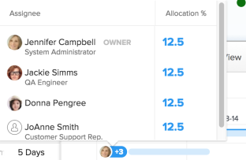

# Configurez l’affichage des informations sur le [!UICONTROL Graphique Gantt]

Vous pouvez configurer les informations qui s’affichent dans la liste des tâches. [!UICONTROL Graphique Gantt] et la liste des projets [!UICONTROL Graphique Gantt].

## Exigences d’accès

Pour suivre les étapes de cet article, vous devez disposer des éléments suivants :

<table style="table-layout:auto"> 
 <col> 
 <col> 
 <tbody> 
  <tr> 
   <td role="rowheader">[!DNL Adobe Workfront] plan*</td> 
   <td> 
Tous 
 </td> 
  </tr> 
  <tr> 
   <td role="rowheader">[!DNL Adobe Workfront] license*</td> 
   <td> 
[!UICONTROL Review] ou version ultérieure
 </td> 
  </tr> 
  <tr> 
   <td role="rowheader">Paramétrages du niveau d'accès*</td> 
   <td> 
Accès à [!UICONTROL View] ou supérieur à Projects and Tasks
 
Remarque : Si vous n’avez toujours pas accès à , demandez à votre [!DNL Workfront] s’ils définissent des restrictions supplémentaires au niveau de votre accès. Pour plus d’informations sur la manière dont une [!DNL Workfront] l’administrateur peut modifier votre niveau d’accès, voir <a href="../../../administration-and-setup/add-users/configure-and-grant-access/create-modify-access-levels.md" class="MCXref xref">Création ou modification de niveaux d’accès personnalisés</a>.
 </td> 
  </tr> 
  <tr> 
   <td role="rowheader">Autorisations d’objet</td> 
   <td> 
[!UICONTROL Affichage] ou accès supérieur au projet
 
Pour plus d’informations sur la demande d’accès supplémentaire, voir <a href="../../../workfront-basics/grant-and-request-access-to-objects/request-access.md" class="MCXref xref">Demande d’accès aux objets </a>.
 </td> 
  </tr> 
 </tbody> 
</table>

&#42;Pour connaître le plan, le type de licence ou l’accès dont vous disposez, contactez votre [!DNL Workfront] administrateur.

## Présentation des options d’affichage

Le tableau suivant présente les options d’affichage de la variable [!UICONTROL Graphique Gantt]:

<table style="table-layout:auto"> 
 <col> 
 <col> 
 <col> 
 <tbody> 
  <tr> 
   <td role="rowheader">[!UICONTROL Dates réelles]</td> 
   <td>  </td> 
   <td> 
[!UICONTROL Date de début réelle] et [!UICONTROL Date d’achèvement réelle] s’affichent avec une icône en forme de triangle. Si la valeur [!UICONTROL Date d’achèvement réelle] est nulle, seule la valeur [!UICONTROL Date de début réelle] s’affiche.
 
Pour plus d’informations sur les dates de début et de fin, voir <a href="../../../manage-work/projects/planning-a-project/project-actual-completion-date.md" class="MCXref xref">Présentation du projet [!UICONTROL Date d’achèvement réelle] </a> et <a href="../../../manage-work/projects/planning-a-project/project-actual-start-date.md" class="MCXref xref">Présentation du projet [!UICONTROL Date de début réelle] </a>.
 </td> 
  </tr> 
  <tr> 
   <td role="rowheader">[!UICONTROL Affectations]</td> 
   <td>  </td> 
   <td> 
Affiche les personnes désignées pour les tâches. Placez le pointeur de la souris sur la <strong>[!UICONTROL Details]</strong> lien en regard du nom d’une personne désignée pour afficher des informations plus détaillées à son sujet, y compris le pourcentage de son attribution à la tâche.
 
Les personnes désignées ne s’affichent pas sur le [!UICONTROL Gantt chart] lorsque le [!UICONTROL Gantt chart] est exporté vers PDF. Lorsque le [!UICONTROL Gantt] est exporté vers PDF, les personnes désignées ne s’affichent que dans la liste des tâches.
 </td> 
  </tr> 
  <tr> 
   <td role="rowheader">[!UICONTROL Baseline]</td> 
   <td>  </td> 
   <td> 
Un instantané de projet qui représente les éléments clés du projet inclus dans le plan de projet initial. Des lignes de base peuvent être utilisées tout au long de la durée du projet. Lorsque vous activez l’affichage des lignes de base dans le [!UICONTROL Graphique de Gantt], sélectionnez la ligne de base à afficher. Vous ne pouvez afficher qu’une seule ligne de base à la fois sur le [!UICONTROL Graphique de Gantt], et elle s’affichera sous la forme d’une barre grise.
 
Pour plus d’informations sur les lignes de base, voir <a href="../../../manage-work/projects/create-projects/create-baselines.md" class="MCXref xref">Création de lignes de base de projet</a>.
 </td> 
  </tr> 
  <tr> 
   <td role="rowheader">[!UICONTROL Date de validation]</td> 
   <td>  </td> 
   <td> 
La date donnée par une personne désignée comme engagement du moment où la tâche sera terminée est affichée avec un marqueur dans le [!UICONTROL Graphique de Gantt]. 
 
Pour plus d’informations sur les dates de validation, voir <a href="../../../manage-work/projects/updating-work-in-a-project/overview-of-commit-dates.md" class="MCXref xref">Présentation de la date de validation [!UICONTROL]</a>.
 </td> 
  </tr> 
  <tr> 
   <td role="rowheader">[!UICONTROL % terminé]</td> 
   <td>  </td> 
   <td>  Le pourcentage de la tâche qui est terminée s’affiche dans la ligne de la tâche.  </td> 
  </tr> 
  <tr> 
   <td role="rowheader">[!UICONTROL Critical Path]</td> 
   <td>  </td> 
   <td>Les tâches susceptibles d’affecter la chronologie du projet sont considérées comme faisant partie de la trajectoire critique et sont clairement indiquées en rouge. </td> 
  </tr> 
  <tr> 
   <td role="rowheader">Diamants [!UICONTROL Milestone]</td> 
   <td>  </td> 
   <td> 
Une icône représentant un diamant s’affiche après la tâche associée à un jalon. Placez le pointeur de la souris sur un jalon pour afficher le nom et la date du jalon. Le [!DNL Workfront] L’administrateur détermine la couleur de chaque jalon losange.
 
Pour plus d’informations sur les jalons, voir <a href="../../../administration-and-setup/customize-workfront/configure-approval-milestone-processes/create-milestone-path.md" class="MCXref xref">Création d’un chemin de jalon</a>.
 </td> 
  </tr> 
  <tr> 
   <td role="rowheader">Lignes [!UICONTROL Milestone]</td> 
   <td>  </td> 
   <td> 
Une ligne s’affiche après la tâche associée à un jalon. Placez le pointeur de la souris sur un jalon pour afficher le nom et la date du jalon. Le [!DNL Workfront] L’administrateur détermine la couleur de chaque ligne de jalon.
 
 Pour plus d’informations sur les jalons, voir  <a href="../../../administration-and-setup/customize-workfront/configure-approval-milestone-processes/create-milestone-path.md" class="MCXref xref">Création d’un chemin de jalon</a>
 </td> 
  </tr> 
  <tr> 
   <td role="rowheader">[!UICONTROL Predecessors]</td> 
   <td>  </td> 
   <td> 
Ligne d’une tâche à l’autre qui montre la relation de prédécesseur entre les deux tâches. Pour mettre en surbrillance une ligne de prédécesseur, placez-la avec la souris. Cliquez dessus pour le mettre en surbrillance. Vous ne pouvez mettre en surbrillance qu’une seule ligne de prédécesseur à la fois.
 
A <strong>[!UICONTROL Predecessor]</strong> s’affiche en regard d’une tâche dont la relation de prédécesseur s’étend sur plusieurs pages du diagramme de Gantt ou sur une tâche dont le prédécesseur couvre plusieurs projets.
 
Cliquez sur le bouton <strong>[!UICONTROL Predecessor]</strong> pour afficher toutes les tâches de prédécesseur et de successeur, ainsi que des détails sur chaque tâche, tels que le nom de la tâche, le type de relation de prédécesseur et les dates clés.
 
Remarque : Le [!UICONTROL Graphique de Gantt] d’une liste de projets affiche des informations sur les prédécesseurs sur plusieurs projets. Pour plus d’informations sur la création de relations de prédécesseur entre différents projets, voir <a href="../../../manage-work/tasks/use-prdcssrs/cross-project-predecessors.md" class="MCXref xref">Création de prédécesseurs sur plusieurs projets</a>
 
Pour plus d’informations sur les prédécesseurs, voir <a href="../../../manage-work/tasks/use-prdcssrs/enforced-predecessors.md" class="MCXref xref">Application des prédécesseurs</a>.
 </td> 
  </tr> 
  <tr> 
   <td role="rowheader">[!UICONTROL État de progression]</td> 
   <td> 
[!UICONTROL Heure d’activation] 
 
[!UICONTROL Derrière]    
 
[!UICONTROL À Risque]    
 
En retard        
 </td> 
   <td> 
 
 
État de la progression actuelle sur une tâche donnée. 
 
Pour plus d’informations sur chaque type [!UICONTROL Progress Status], voir <a href="../../../manage-work/tasks/task-information/task-progress-status.md" class="MCXref xref">Présentation de l’[!UICONTROL Etat d’avancement de la tâche]</a>.
 </td> 
  </tr> 
  <tr> 
   <td role="rowheader">[!UICONTROL Dates prévues]</td> 
   <td>  </td> 
   <td> 
La chronologie attendue qui marque le [!UICONTROL Début prévu] et les [!UICONTROL Dates d’achèvement] en fonction du travail terminé en cours, plus le travail restant. 
 
Pour plus d’informations sur les dates de fin prévues, voir <a href="../../../manage-work/projects/planning-a-project/project-projected-completion-date.md" class="MCXref xref">Présentation de la [!UICONTROL Date d’achèvement prévue] pour les projets, les tâches et les problèmes</a>.
 </td> 
  </tr> 
 </tbody> 
</table>

## Configuration des options d’affichage

1. Accédez à la liste des tâches [!UICONTROL Graphique Gantt] ou Liste des projets [!UICONTROL Graphique Gantt].\
   Pour plus d’informations sur l’emplacement de la variable [!UICONTROL Graphique Gantt] est situé, voir [Prise en main de la fonction [!UICONTROL Graphique Gantt]](../../../manage-work/gantt-chart/use-the-gantt-chart/get-started-with-gantt.md).

1. (Facultatif) Sélectionnez le **[!UICONTROL Passer aux dates prévues]** pour afficher les tâches en fonction de leur [!UICONTROL Dates prévues]. Par défaut, les tâches sont affichées par leur [!UICONTROL Dates planifiées] dans le [!UICONTROL Graphique Gantt].
1. Cliquez sur l’icône d’options pour afficher la variable **[!UICONTROL Options]** de la boîte de dialogue\
   

1. Sélectionnez les options de configuration à afficher dans le [!UICONTROL Graphique Gantt].

   >[!NOTE]
   > Toutes les options de configuration ne sont pas disponibles dans la liste des projets. [!UICONTROL Graphique Gantt].

1. Cliquez n’importe où dans le [!UICONTROL Graphique Gantt] pour fermer la **[!UICONTROL Options]** de la boîte de dialogue
