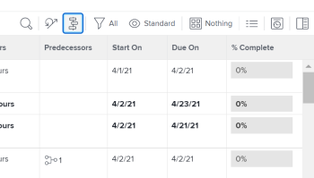

# Prise en main de la fonction [!UICONTROL Graphique Gantt]

Dans [!DNL Adobe Workfront], il y a deux [!UICONTROL Graphiques Gantt] avec des fonctionnalités similaires :

* La liste des tâches [!UICONTROL Graphique Gantt]: affiche des informations sur les tâches au niveau du projet et est modifiable.
* Liste des projets [!UICONTROL Graphique Gantt]: affiche des informations sur les projets et n’est pas modifiable.

Bien qu’elles aient l’air et le sentiment d’être similaires, les fonctionnalités de chacune d’elles sont différentes.

## Accédez au [!UICONTROL Graphique Gantt]

Le [!UICONTROL Gantt] Graphiques dans [!DNL Workfrontprovide] une représentation visuelle d’une liste de tâches ou de projets. Vous pouvez afficher la liste des tâches [!UICONTROL Graphique Gantt] directement depuis la liste des tâches d’un projet ou depuis un rapport de tâches. Vous pouvez afficher la liste des projets. [!UICONTROL Graphique Gantt] dans une liste de projets ou un rapport de projet.

* [Liste des tâches [!UICONTROL Graphique Gantt]](#task-list-gantt-chart)
* [Liste des projets [!UICONTROL Graphique Gantt]](#project-list-gantt-chart)

### Liste des tâches [!UICONTROL Graphique Gantt] {#task-list-gantt-chart}

La liste des tâches [!UICONTROL Graphique Gantt] est accessible dans les zones suivantes :

* Dans un projet

   * [!UICONTROL Tâches] area
   * [!UICONTROL Sous-tâches] area

* Dans un modèle

Pour accéder à la liste des tâches [!UICONTROL Graphique Gantt], accédez à l’une des zones mentionnées ci-dessus et cliquez sur le bouton [!UICONTROL Graphique Gantt] icône .

### Liste des projets [!UICONTROL Graphique Gantt] {#project-list-gantt-chart}

Liste des projets [!UICONTROL Graphique Gantt] est accessible dans les zones suivantes :

* Dans le [!UICONTROL Projets] area
* Dans un Portfolio

   * [!UICONTROL Projets] area

* Dans un rapport de projet

   * Tout rapport de projet ou de tâche

* Dans un programme

   * Dans le [!UICONTROL Projets] area

Pour accéder au [!UICONTROL diagramme de Gantt de liste de projets], accédez à l’une des zones mentionnées ci-dessus et cliquez sur le bouton [!UICONTROL Graphique Gantt] icône .

## Configurez l’affichage des informations sur le [!UICONTROL Graphique Gantt]

Vous pouvez configurer les informations qui s’affichent dans la liste des tâches. [!UICONTROL Graphique Gantt] et la liste des projets [!UICONTROL Graphique Gantt].\
Vous ne pouvez pas configurer les couleurs ni les polices dans lesquelles la fonction [!UICONTROL Graphique Gantt] Les informations s’affichent.

* [Liste des tâches [!UICONTROL Graphique Gantt]](#task-list-gantt-chart)
* [Liste des projets [!UICONTROL Graphique Gantt]](#project-list-gantt-chart)

### Liste des tâches [!UICONTROL Graphique Gantt] {#task-list-gantt-chart-1}

Les options d’affichage suivantes sont disponibles dans la liste des tâches [!UICONTROL Graphique Gantt]:

* [!UICONTROL Dates effectives]
* [!UICONTROL Affectations]
* [!UICONTROL Niveau de référence]
* [!UICONTROL Date d&#39;engagement]
* [!UICONTROL % Terminé]
* [!UICONTROL Chemin critique]
* [!UICONTROL Losanges de jalons]
* [!UICONTROL Lignes de jalons]
* [!UICONTROL Tâches antérieures]
* [!UICONTROL Statut de progression]
* [!UICONTROL Dates prévisionnelles]

Pour plus d’informations sur les options d’affichage répertoriées ci-dessus, voir [Configurez l’affichage des informations sur le [!UICONTROL Graphique Gantt]](../../../manage-work/gantt-chart/use-the-gantt-chart/configure-info-on-gantt-chart.md).

### Liste des projets [!UICONTROL Graphique Gantt] {#project-list-gantt-chart-1}

Les options d’affichage suivantes sont disponibles dans la liste des projets : [!UICONTROL Graphique Gantt]:

* [!UICONTROL Dates effectives]
* [!UICONTROL % Terminé]
* [!UICONTROL Losanges de jalons]
* [!UICONTROL Lignes de jalons]
* [!UICONTROL Tâches antérieures]
* [!UICONTROL Statut de progression]
* [!UICONTROL Dates prévisionnelles]

Pour plus d’informations sur les options d’affichage répertoriées ci-dessus, voir [Configurez l’affichage des informations sur le [!UICONTROL Graphique Gantt]](../../../manage-work/gantt-chart/use-the-gantt-chart/configure-info-on-gantt-chart.md).

## Mettez à jour le [!UICONTROL Graphique Gantt]

Lorsque des informations sont mises à jour à partir de la liste des tâches, elles sont automatiquement répercutées dans la liste des tâches. [!UICONTROL Graphique Gantt] et la liste des projets [!UICONTROL Graphique Gantt].

* [Liste des tâches [!UICONTROL Graphique Gantt]](#task-list-gantt-chart)
* [Liste des projets [!UICONTROL Graphique Gantt]](#project-list-gantt-chart)

### Liste des tâches [!UICONTROL Graphique Gantt] {#task-list-gantt-chart-2}

Dans un projet, vous pouvez mettre à jour la liste des tâches. [!UICONTROL Graphique Gantt] directement à partir de [!UICONTROL Graphique Gantt] ou dans la liste des tâches. Pour plus d’informations, voir [Mise à jour des informations dans la liste des tâches [!UICONTROL Graphique Gantt]](../../../manage-work/gantt-chart/use-the-gantt-chart/update-info-task-list-gantt.md).

Dans un modèle, la liste des tâches [!UICONTROL Graphique Gantt] reflète les mises à jour effectuées dans la liste des tâches du modèle. Ceci [!UICONTROL Graphique Gantt] n’est pas modifiable.

### Liste des projets [!UICONTROL Graphique Gantt] {#project-list-gantt-chart-2}

Le [!UICONTROL diagramme de Gantt de liste de projets] reflète les mises à jour effectuées dans la liste des tâches de chaque projet. Ceci [!UICONTROL Graphique Gantt] n’est pas modifiable.

## Affichez les informations sur la variable [!UICONTROL Graphique Gantt]

La liste des tâches [!UICONTROL Graphique Gantt] et liste des projets [!UICONTROL Graphique Gantt] afficher des informations sur les tâches et les projets. Pour plus d’informations, voir [Afficher les informations dans le [!UICONTROL Graphique Gantt]](../../../manage-work/gantt-chart/use-the-gantt-chart/view-info-in-gantt.md).
