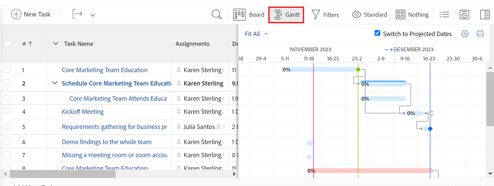

# Commencer avec le [!UICONTROL graphique de Gantt]

<!-- Audited: 08/2025 -->

Les graphiques de Gantt dans Adobe Workfront fournissent une représentation visuelle de la chronologie d’une liste de tâches ou de projets.

[!DNL Adobe Workfront] inclut deux [!UICONTROL graphiques de Gantt] avec des fonctionnalités similaires :

* **[!UICONTROL Graphique de Gantt]** de la liste des tâches : affiche des informations sur les tâches et leur chronologie au niveau du projet. Un [!UICONTROL graphique de Gantt] similaire affiche des informations sur les tâches de modèle au niveau du modèle.
* **[!UICONTROL Graphique de Gantt]** de la liste des projets : affiche des informations sur les projets et leur chronologie.

Bien que leur aspect soit similaire, les fonctionnalités de chacun d’entre eux sont différentes.

## Remarques relatives au graphique de Gantt

* Vous pouvez modifier les informations dans le [!UICONTROL graphique de Gantt] suivant :
   * Liste de tâches
* Vous ne pouvez pas modifier les informations dans les [!UICONTROL graphiques de Gantt] suivants :
   * Liste des tâches de modèles
   * Liste de projets
* Les listes de modèles ne comportent pas d’option de [!UICONTROL graphique de Gantt].
* Vous pouvez configurer les informations qui s’affichent dans le [!UICONTROL graphique de Gantt] de la liste des tâches ainsi que dans le [!UICONTROL graphique de Gantt] de la liste des projets.
* Vous ne pouvez pas configurer les couleurs ni les polices d’affichage des informations d’un [!UICONTROL graphique de Gantt].
* Lorsque des informations sont mises à jour à partir de tâches, elles sont automatiquement reflétées dans le [!UICONTROL graphique de Gantt] de la liste des tâches et dans le [!UICONTROL graphique de Gantt] de la liste des projets.
* Lorsque des informations sont mises à jour à partir de tâches de modèle, elles sont automatiquement reflétées dans le [!UICONTROL graphique de Gantt] de la liste des tâches de modèles.

## Accéder au [!UICONTROL graphique de Gantt]

Les graphiques de [!UICONTROL Gantt] dans [!DNL Workfront] fournissent une représentation visuelle d’une liste de tâches ou de projets.

Vous pouvez afficher le [!UICONTROL graphique de Gantt] de la liste des tâches directement à partir de la liste des tâches d’un projet ou depuis un rapport de tâches.

Vous pouvez afficher le [!UICONTROL graphique de Gantt] de la liste des projets dans une liste de projets ou un rapport sur les projets.

### [!UICONTROL Graphique de Gantt] de la liste des tâches {#task-list-gantt-chart}

<!--The task list [!UICONTROL Gantt Chart] is accessible in the following areas:

* In a Project

   * [!UICONTROL Tasks] section
   * [!UICONTROL Subtasks] section of a task

* In a [!UICONTROL Template]

* In a [!UICONTROL Task] report-->

Pour accéder au [!UICONTROL graphique de Gantt] de la liste des tâches d’un projet ou d’un modèle, procédez comme suit :

1. Accédez à l’une des zones suivantes :

   * Un projet, puis cliquez sur [!UICONTROL **Tâches**] dans le panneau de gauche.
   * Un modèle, puis cliquez sur [!UICONTROL **Tâches de modèles**] dans le panneau de gauche.
   * Une tâche ou une tâche de modèle, puis cliquez sur [!UICONTROL **Sous-tâches**] dans le panneau de gauche.
   * Un rapport de tâche

1. Cliquez sur l’icône [!UICONTROL **Gantt**]  en haut de la liste des tâches.

   

   Le [!UICONTROL graphique de Gantt] de la liste des tâches s’ouvre à droite de la liste des tâches.

1. Pour configurer les informations que vous souhaitez afficher dans le graphique de [!UICONTROL Gantt], cliquez sur l’icône [!UICONTROL **Paramètres**], puis activez l’une des options suivantes :

   * [!UICONTROL Dates effectives]
   * [!UICONTROL Affectations]
   * [!UICONTROL Niveau de référence]
   * [!UICONTROL Date d’engagement]
   * [!UICONTROL Pourcentage d’achèvement]
   * [!UICONTROL Chemin critique]
   * [!UICONTROL Losanges de jalons]
   * [!UICONTROL Lignes de jalons]
   * [!UICONTROL Tâches antérieures]
   * [!UICONTROL Statut de progression]
   * [!UICONTROL Dates prévisionnelles]

1. Commencez à modifier les tâches comme décrit dans les articles suivants :

   * [Configurer l’affichage des informations sur le graphique de Gantt](../use-the-gantt-chart/configure-info-on-gantt-chart.md)
   * [Mettre à jour des informations dans le graphique de Gantt de la liste des tâches](../use-the-gantt-chart/update-info-task-list-gantt.md)

### [!UICONTROL Graphique de Gantt] de la liste des projets {#project-list-gantt-chart}

<!--The project list [!UICONTROL Gantt Chart] is accessible in the following areas:

* In the [!UICONTROL Projects] area
* In the [!UICONTROL Projects] section of a [!UICONTROL Portfolio]
* In the [!UICONTROL Projects] section of a [!UICONTROL Program]
* In a [!UICONTROL Project] report-->

Pour accéder au [!UICONTROL Graphique de Gantt] de la liste des projets, procédez comme suit :

1. Accédez à l’une des zones suivantes :

   * Zone [!UICONTROL **Projets**]
   * Section [!UICONTROL **Projets**] d’un [!UICONTROL portfolio]
   * Section [!UICONTROL **Projets**] d’un [!UICONTROL programme]
   * Rapport de [!UICONTROL **projet**]

1. Cliquez sur l’icône [!UICONTROL **Gantt**] en haut de la liste des projets.

   

   Le [!UICONTROL graphique de Gantt] de la liste des projets s’ouvre.

1. Pour configurer les informations à afficher dans le graphique de [!UICONTROL Gantt] du projet, cliquez sur l’icône [!UICONTROL **Paramètres**], puis activez l’une des options suivantes :

   * [!UICONTROL Dates effectives]
   * [!UICONTROL Pourcentage d’achèvement]
   * [!UICONTROL Losanges de jalons]
   * [!UICONTROL Lignes de jalons]
   * [!UICONTROL Tâches antérieures]
   * [!UICONTROL Statut de progression]
   * [!UICONTROL Dates prévisionnelles]
