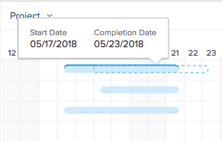

# Mettre à jour des informations dans le [!UICONTROL graphique de Gantt] de la liste des tâches

<!--Audited: 08/2025-->

Le [!UICONTROL graphique Gantt] d’une liste de tâches Adobe Workfront affiche des détails sur les tâches d’un projet ou d’un modèle.

Dans un modèle, la liste des tâches [!UICONTROL graphique Gantt] reflète les mises à jour apportées à la liste des tâches du modèle au niveau de la tâche du modèle. Vous ne pouvez pas modifier le [!UICONTROL graphique de Gantt] associé à un modèle.

Dans un projet, vous pouvez mettre à jour les informations relatives aux tâches directement dans le [!UICONTROL graphique de Gantt] de la liste des tâches.

Cet article décrit les actions suivantes que vous pouvez effectuer directement dans le [!UICONTROL graphique de Gantt] de la liste des tâches :

* Modifier la durée d’une tâche
* Créer ou supprimer des relations d’antériorité
* Modifier les dates de début et de fin des tâches
* Mettre à jour le pourcentage terminé
* Niveler les ressources du projet

## Conditions d’accès

+++ Développez pour afficher les exigences d’accès aux fonctionnalités de cet article. 

<table style="table-layout:auto"> 
 <col> 
 <col> 
 <tbody> 
  <tr> 
   <td role="rowheader">[!DNL Adobe Workfront] paquet</td> 
   <td> 
Tous
 </td> 
  </tr> 
  <tr> 
   <td role="rowheader">[!DNL Adobe Workfront] licence</td> 
   <td> 
[!UICONTROL Standard]

   
[!UICONTROL Plan]
 </td> 
  </tr> 
  <tr> 
   <td role="rowheader">Configurations des niveaux d’accès</td> 
   <td> 
Accès [!UICONTROL Edit] aux projets et aux tâches
 </td> 
  </tr> 
  <tr> 
   <td role="rowheader">Autorisations d’objet</td> 
   <td> 
Accès [!UICONTROL Manage] au projet et aux tâches
 </td> 
  </tr> 
 </tbody> 
</table>

Pour plus de détails sur les informations contenues dans ce tableau, consultez [Conditions d’accès préalables dans la documentation Workfront](/help/quicksilver/administration-and-setup/add-users/access-levels-and-object-permissions/access-level-requirements-in-documentation.md).

+++ 

<!--Old:

<table style="table-layout:auto"> 
 <col> 
 <col> 
 <tbody> 
  <tr> 
   <td role="rowheader">[!DNL Adobe Workfront] plan*</td> 
   <td> 
Any 
 </td> 
  </tr> 
  <tr> 
   <td role="rowheader">[!DNL Adobe Workfront] license*</td> 
   <td> 
[!UICONTROL Plan] 
 </td> 
  </tr> 
  <tr> 
   <td role="rowheader">Access level configurations*</td> 
   <td> 
[!UICONTROL Edit] access to Projects and Tasks
 
Note: If you still don't have access, ask your [!DNL Workfront] administrator if they set additional restrictions in your access level. For information on how a [!DNL Workfront] administrator can modify your access level, see <a href="../../../administration-and-setup/add-users/configure-and-grant-access/create-modify-access-levels.md" class="MCXref xref">Create or modify custom access levels</a>.
 </td> 
  </tr> 
  <tr> 
   <td role="rowheader">Object permissions</td> 
   <td> 
[!UICONTROL Manage] access to the project and tasks 
 
For information on requesting additional access, see <a href="../../../workfront-basics/grant-and-request-access-to-objects/request-access.md" class="MCXref xref">Request access to objects </a>.
 </td> 
  </tr> 
 </tbody> 
</table>-->

## Modifier la durée d’une tâche

1. Accédez au projet que vous souhaitez modifier.
1. Cliquez sur **[!UICONTROL Tâches]** dans le panneau de gauche.

   

1. Cliquez sur l’icône **[!UICONTROL Graphique de Gantt]**.

   

   Toutes les modifications sont sauvegardées automatiquement lorsque l’option **[!UICONTROL Enregistrement automatique]** est activée. Elle est activée par défaut.

1. (Facultatif) Cliquez sur l’icône **[!UICONTROL Mode Plan]** et sélectionnez **[!UICONTROL Enregistrement manuel standard]** ou **[!UICONTROL Planification chronologique]** pour enregistrer vos modifications manuellement.

   

1. Pointez sur la chronologie d’une tâche et faites glisser l’indicateur de chronologie vers une autre date.
1. Déposez l’indicateur lorsque vous avez atteint la nouvelle date d’achèvement correcte pour la tâche.
1. (Facultatif et le cas échéant) Si vous avez choisi d’enregistrer manuellement vos modifications, cliquez sur l’icône **[!UICONTROL Annuler]** ou **[!UICONTROL Rétablir]** si vous souhaitez annuler ou dupliquer l’une des modifications.

   >[!TIP]
   >
   >Vous pouvez utiliser les raccourcis clavier suivants pour annuler ou rétablir les modifications apportées au graphique de Gantt :
   >
   >   
   >   
   >   * [!DNL Mac] : utilisez [!UICONTROL Commande+Z] pour annuler et [!UICONTROL Commande+Maj+Z] pour rétablir.
   >   * [!DNL Windows] : utilisez [!UICONTROL Ctrl+Z] pour annuler et [!UICONTROL Ctrl+Y] pour rétablir.
   >   
   >

1. Cliquez sur **[!UICONTROL Enregistrer]** dans le coin supérieur droit du [!UICONTROL graphique de Gantt].

## Créer ou supprimer des relations d’antériorité

1. Accédez au projet que vous souhaitez modifier.
1. Dans la zone **[!UICONTROL Tâches]**, cliquez sur l’icône **[!UICONTROL Graphique de Gantt]**.

   L’option **[!UICONTROL Enregistrement automatique]** est sélectionnée par défaut, auquel cas toutes les modifications sont sauvegardées automatiquement.

   

1. (Facultatif) Cliquez sur l’icône **[!UICONTROL Mode Plan]** et sélectionnez **[!UICONTROL Enregistrement manuel standard]** ou **[!UICONTROL Planification chronologique]** pour enregistrer vos modifications manuellement.

   

1. Pour créer une relation d’antériorité, cliquez sur le point de départ d’une tâche et faites-le glisser jusqu’au point d’entrée de la tâche.
1. Pour supprimer une relation d’antériorité, cliquez sur une ligne de tâche antérieure qui relie deux tâches pour la sélectionner, puis appuyez sur **[!UICONTROL Supprimer]** sur votre clavier.\
   

1. (Facultatif et le cas échéant) Si vous avez choisi d’enregistrer vos modifications manuellement, cliquez sur l’icône **[!UICONTROL Annuler]** ou **[!UICONTROL Rétablir]** si vous souhaitez annuler ou dupliquer l’une des modifications.

   >[!TIP]
   >
   >Vous pouvez utiliser les raccourcis clavier suivants pour annuler ou rétablir les modifications apportées au graphique de Gantt :
   >
   >   
   >   
   >   * [!DNL Mac] : utilisez [!UICONTROL Commande+Z] pour annuler et [!UICONTROL Commande+Maj+Z] pour rétablir.
   >   * [!DNL Windows] : utilisez [!UICONTROL Ctrl+Z] pour annuler et [!UICONTROL Ctrl+Y] pour rétablir.
   >   
   >

1. Cliquez sur **[!UICONTROL Enregistrer]**.

## Modifier les dates de début et de fin des tâches

1. Accédez au projet que vous souhaitez modifier.
1. Dans la zone **[!UICONTROL Tâches]**, cliquez sur l’icône **[!UICONTROL Graphique de Gantt]**.

   Toutes les modifications sont automatiquement enregistrées lorsque l’option **[!UICONTROL Enregistrement automatique]** est activée. Elle est activée par défaut.

   

1. (Facultatif) Cliquez sur l’icône **[!UICONTROL Mode Plan]** et sélectionnez **[!UICONTROL Enregistrement manuel standard]** ou **[!UICONTROL Planification chronologique]** pour enregistrer vos modifications manuellement.

   

1. Pointez sur le centre de la tâche et localisez la flèche multidirectionnelle.
1. Cliquez sur la tâche et faites-la glisser jusqu’à la date souhaitée.

   

1. Si vous modifiez la date de la tâche d’une manière qui affecte la contrainte de tâche, cliquez sur **[!UICONTROL Accepter]** pour reconnaître la modification de la contrainte de tâche.

   >[!NOTE]
   >
   >Si la tâche est soumise à l’une des contraintes suivantes, le système met à jour la [!UICONTROL Contrainte de tâche] sur [!UICONTROL Commencer Au Plus Tôt] si le projet est planifié à partir de la [!UICONTROL Date de début] ou sur [!UICONTROL Terminer au plus tard] si le projet est planifié à partir de la [!UICONTROL Date d’achèvement] :
   >
   >   
   >   
   >   * [!UICONTROL Aussi Tôt Que Possible]
   >   * [!UICONTROL Aussi Tard Que Possible]
   >   * [!UICONTROL Première Heure Disponible]
   >   * [!UICONTROL Dernière Heure Disponible]
   >   
   >   
   >Dans certains cas, les relations antérieures peuvent empêcher les tâches de commencer plus tôt et le déplacement des tâches n’est pas autorisé.

1. (Facultatif et conditionnel) Si vous avez choisi d’enregistrer vos modifications manuellement, cliquez sur les icônes **[!UICONTROL Annuler]** ou **[!UICONTROL Rétablir]** si vous souhaitez annuler ou dupliquer l’une des modifications.

   >[!TIP]
   >
   >Vous pouvez utiliser les raccourcis clavier suivants pour annuler ou rétablir les modifications apportées au [!UICONTROL Graphique de Gantt] :
   >
   >   
   >   
   >   * [!DNL Mac] : utilisez [!UICONTROL Commande+Z] pour annuler et [!UICONTROL Commande+Maj+Z] pour rétablir.
   >   * [!DNL Windows] : utilisez [!UICONTROL Ctrl+Z] pour annuler et [!UICONTROL Ctrl+Y] pour rétablir.
   >   
   >

1. Cliquer sur **[!UICONTROL Enregistrer]**.

## Mettre à jour le pourcentage terminé

1. Accédez au projet que vous souhaitez modifier.
1. Dans la zone **[!UICONTROL Tâches]**, cliquez sur l’icône **[!UICONTROL Graphique de Gantt]**.

   

   Toutes les modifications sont sauvegardées automatiquement lorsque l’option **[!UICONTROL Enregistrement automatique]** est activée. Elle est activée par défaut.

1. (Facultatif) Cliquez sur l’icône **[!UICONTROL Mode Plan]** et sélectionnez **[!UICONTROL Enregistrement manuel standard]** ou **[!UICONTROL Planification chronologique]** pour enregistrer vos modifications manuellement.
1. Double-cliquez sur le pourcentage à l’intérieur de la tâche et saisissez le nombre.

   >[!IMPORTANT]
   >
   >Vous devez avoir sélectionné [!UICONTROL % terminé] dans la boîte de dialogue [!UICONTROL Options] pour pouvoir mettre à jour le pourcentage d’achèvement. Pour ce faire, cliquez sur l’icône **[!UICONTROL Options]** et sélectionnez **[!UICONTROL % terminé]**.
   >
   >
   > >
   >

1. (Facultatif et le cas échéant) Si vous avez choisi d’enregistrer vos modifications manuellement, cliquez sur l’icône **[!UICONTROL Annuler]** ou **[!UICONTROL Rétablir]** si vous souhaitez annuler ou dupliquer l’une des modifications.

   >[!TIP]
   >
   >Vous pouvez utiliser les raccourcis clavier suivants pour annuler ou rétablir les modifications apportées au [!UICONTROL Graphique de Gantt] :
   >
   >   
   >   
   >   * [!DNL Mac] : utilisez [!UICONTROL Commande+Z] pour annuler et [!UICONTROL Commande+Maj+Z] pour rétablir.
   >   * [!DNL Windows] : utilisez [!UICONTROL Ctrl+Z] pour annuler et [!UICONTROL Ctrl+Y] pour rétablir.
   >   
   >

1. Cliquez sur **[!UICONTROL Enregistret]** dans le coin supérieur droit du [!UICONTROL Graphique de Gantt].

## Niveler les ressources du projet

Vous pouvez utiliser la liste des tâches [!UICONTROL Graphique de Gantt] pour niveler vos ressources.

Pour plus d’informations sur le nivellement des ressources dans le [!UICONTROL Graphique de Gantt], voir [Niveler les ressources dans le [!UICONTROL Graphique de Gantt]](../../../manage-work/gantt-chart/use-the-gantt-chart/level-resources-in-gantt.md).

<!--

(NOTE: this is drafted because I moved the whole content to the article linked above)

<ol>
<li value="1">Go to the project you want to level.</li>
<li value="2"> 
 In the <strong>Tasks</strong> area, click the <strong>Gantt chart</strong> icon.
 
All changes are saved automatically when the <strong>Autosave</strong> option is enabled. It is enabled by default. 
 </li>
<li value="3">

(Optional) Click the <strong>Plan mode</strong> icon and select <strong>Manual save Standard</strong> or <strong>Timeline Planning</strong> to save your changes manually.
 <note type="tip">
You cannot level resources in the Gantt chart when the Autosave option is enabled.
</note>

  

 </li>
<li value="4"> 
Click the <strong>Level Resources</strong> drop-down menu.
 
  
 </li>
<li value="5">Select one of following options:
<ul>
<li><strong>Level Now</strong>: Applies resource leveling to the selected task.</li>
<li>
<strong>Clear Leveling</strong>: Removes all resource leveling from the selected task.
</li>
</ul><note type="note">
Your resources might be overallocated if they are assigned to multiple tasks which occur during the same time frame.
</note></li>
<li value="6"> 
(Optional and conditional) If you have disabled the Autosave option, click the <strong>Undo</strong> or<strong>Redo</strong> icons if you want to cancel or duplicate any of the changes. 
 <note type="tip">

You can use the following keyboard shortcuts to undo or redo changes on the Gantt chart:

<ul>
<li>Mac: Use Command + Z to undo and Command + Shift + Z to redo.</li>
<li>Windows: Use Ctrl + Z to undo and Ctrl + Y to redo.</li>
</ul>
</note> </li>
<li value="7">Click <strong>Save</strong> in the upper-right corner of the Gantt chart.</li>
</ol>

-->

<!--
<h2 data-mc-conditions="QuicksilverOrClassic.Draft mode"> </h2>
-->
