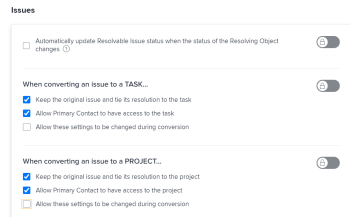

# Vue d’ensemble des objets de résolution et des objets résolvables

<!-- Audited: 08/2025 -->

Un objet résolvable est un problème dont la résolution est liée à un objet de résolution. Un objet de résolution est un projet, une tâche ou un autre problème.

Lorsque vous convertissez un problème en tâche ou en projet, le problème devient l’objet résolvable de la tâche ou du projet.

Vous pouvez également lier manuellement un problème à un objet de résolution, qui peut être une tâche, un projet ou un problème. Pour plus d’informations, consultez [Lier manuellement la résolution d’un problème à d’autres problèmes, tâches ou projets](../../../manage-work/issues/convert-issues/manually-tie-resolution-of-issue-to-ptis.md).

Dans ce scénario, le problème d’origine devient l’objet pouvant être résolu de la tâche, du projet ou du problème.

## Configurer Adobe Workfront pour gérer les objets résolvables {#set-up-adobe-workfront-to-handle-resolvable-objects}

En tant qu’administrateur ou administratrice Workfront, mais aussi administrateur ou administratrice de groupe, vous pouvez décider comment gérer les objets résolvables dans votre système ou pour votre groupe.

Vous pouvez choisir de conserver l&#39;objet résolvable lorsque vous le convertissez en une tâche ou un projet ou de le supprimer une fois la tâche ou le projet créé. Vous pouvez choisir d’autoriser la modification de ces paramètres lors du processus de conversion des problèmes, ce qui permettra à l’utilisateur ou l’utilisatrice de convertir les problèmes afin de décider de conserver ou de supprimer le problème pendant sa conversion.

>[!NOTE]
>
>Les objets résolvables sont toujours des problèmes dont la résolution et le statut dépendent de la résolution et du statut de l’objet de résolution auquel ils sont associés. Les objets de résolution peuvent être des problème, des tâches ou des projets.

Pour plus d’informations sur la configuration des préférences pour la gestion des objets résolvables, consultez [Configurer les préférences de tâche et de problème à l’échelle du système](../../../administration-and-setup/set-up-workfront/configure-system-defaults/set-task-issue-preferences.md).

<!--WRITER

(Note: drafted and just pointed the user to the article linked above) 

To establish the system default for what happens to the issue as it is being converted to a task or a project:

<ol>
<li value="1">Log in to Workfront as a Workfront administrator or group administrator.</li>
<li value="2"> 
  From the main menu, click <strong>Setup</strong>. 
 
  
 </li>
<li value="3">Expand <strong>Project Preferences</strong>.</li>
<li value="4">Click <strong>Tasks & Issues</strong>.</li>
<li value="5">Go to the <strong>Issues</strong> area of the setup.  Consider editing any of the following settings:
<ul>
<li>
<strong>Automatically update Resolvable Issue status when the status of the Resolving Object changes:</strong> Select this option to tie the resolution of the original issue to the resolution of its Resolving Object. In order for this setting to have any effect, the options to <strong>Keep the original issue and tie its resolution to the task</strong> or<strong>project</strong> must be selected.

<ul>
<li>When this setting is enabled, you can create custom statuses with the same key for both issues and projects or tasks. When the project or task (as a resolvable object) turns into the custom status, the change also reflects on the status of the issue. The status key must be the same for the issue and project or task statuses.</li>
<li>
When this setting is disabled, resolving object statuses are automatically set to the default status, instead of the custom ones. For more information about the default statuses, see <a href="#synchronize-the-status-of-the-resolvable-object-with-that-of-the-resolving-object" class="MCXref xref">Synchronize the Status of the Resolvable Object with that of the Resolving Object</a>.
<note type="note">
The default status of the issue is controlled by the status of the project or task, regardless of whether this option is selected or not.
</note></li>
</ul></li>
<li><strong>When converting an issue to a TASK...:</strong> The settings in this section determine what happens during the conversion process from issue to task:
<ul>
<li><strong>Keep the original issue and tie its resolution to the task:</strong> When converting the issue, it remains visible as an issue until the task is complete. The status of the issue automatically changes to Closed when the task completes.</li>
<li><strong>Allow Primary Contact to have access to the task:</strong> Gives the primary contact (issue creator) access to the task to review the task, make updates, and stay informed of its progress.</li>
<li><strong>Allow these settings to be changed during conversion:</strong> Allows the user who is converting the issue to change these options during the conversion of an issue to a task. </li>
</ul></li>
<li><strong>When converting an issue to a PROJECT...:</strong> The settings in this section determine what happens during the conversion process from issue to project:
<ul>
<li><strong>Keep the original issue and tie its resolution to the project:</strong> When converting the issue, it remains visible as an issue until the project is complete. The status of the issue automatically changes to Closed when the project completes.</li>
<li><strong>Allow Primary Contact to have access to the project:</strong> Gives the primary contact (issue creator) access to the project to review the project, make updates, and stay informed of its progress.</li>
<li><strong>Allow these settings to be changed during conversion:</strong> Allows the user who is converting the issue to change these options during the conversion of an issue to a project. </li>
</ul></li>
</ul></li>
<li value="6">Click <strong>Save</strong>.</li>
</ol>

-->

## Gérer l’objet résolvable pendant la conversion vers un projet ou une tâche

Selon la manière dont le Workfront ou l’administrateur de groupes a configuré les préférences de problème au niveau du système ou du groupe, vous pouvez être en mesure de gérer l’objet résolvable lors de la conversion d’un problème en projet ou en tâche.

Les scénarios suivants sont possibles :

* Si l’administrateur du Workfront ou du groupe dispose de l’option Conserver l’événement d’origine et lier sa résolution à la tâche, et de l’option Conserver l’événement d’origine et lier sa résolution au projet sélectionné, et que l’option Autoriser la modification de ces paramètres pendant la conversion est désélectionnée, vous ne pourrez pas modifier ces paramètres lorsque vous convertirez des événements en tâches ou projets.\
  

* Si l’administrateur Workfront ou l’administrateur de groupe dispose de l’option Conserver l’événement d’origine et lier sa résolution à la tâche, et de l’option Conserver l’événement d’origine et lier sa résolution au projet sélectionné ou non sélectionné, et que l’option Autoriser la modification de ces paramètres pendant la conversion est sélectionnée, vous pourrez modifier ces paramètres au fur et à mesure que vous convertirez des événements en tâches ou projets.\
  

Pour plus d’informations sur la conversion de problèmes en tâches et projets, consultez [Vue d’ensemble de la conversion des problèmes dans Adobe Workfront](../../../manage-work/issues/convert-issues/convert-issues.md).

<!--WRITER

<h2>Tie the resolution of an issue to a project, task or </h2> 

(NOTE: created new article for this section; draft when the article is live and see if you need to make a link from this one to the new article) 

You can manually tie the resolution of an issue to the resolution of a project, task, or issue without converting the issue. The issue becomes one of the Resolvable Objects of the project, task, or issue you select. When you do this, a change in the status of the project, task, or issue triggers a change in the status of the original issue, so you cannot manually edit the status of the original issue.  For more information about how the status of the Resolving Object affects the Resolvable Object, see <a href="#synchronize-the-status-of-the-resolvable-object-with-that-of-the-resolving-object" class="MCXref xref">Synchronize the Status of the Resolvable Object with that of the Resolving Object</a>.

You must have Manage permissions on the original issue and View permissions on the project, task, or issue to do this. 

To tie the resolution of an issue to the resolution of a project, task, or issue:

<ol>
<li value="1">Navigate to an issue whose resolution you want to tie to a task or a project.</li>
<li value="2"> 
  Click the <strong>Issue Details</strong> > <strong>Overview</strong> area. 
  </li>
<li value="3"> 
Click the <strong>Edit</strong> icon  in the upper-right corner of the Issue Details section. 
 </li>
<li value="4">At the bottom of the form,  click in the <strong>Resolved By</strong> field,  and select from the following types of resolving objects:
<ul>
<li><strong>Project</strong></li>
<li><strong>Task</strong></li>
<li>
<strong>Issue</strong>
</li>
</ul>
The field for the resolving object displays. 
</li>
<li value="5">After selecting the object, start typing the name of a specific project, task, or issue in the available field and select it when it appears in the drop-down list. </li>
<li value="6">Click <strong>Save</strong> <strong>Changes</strong>. The original issue becomes the Resolvable Object for the project, task, or issue you selected in step 4 and 5. <note type="note">
One project, task, or issue may have multiple issues as Resolvable Objects.
</note></li>
</ol>

-->

## Synchroniser le statut de l’objet résolvable avec celui de l’objet de résolution {#synchronize-the-status-of-the-resolvable-object-with-that-of-the-resolving-object}

* [Synchroniser les statuts lorsque l’objet de résolution est un problème](#synchronize-statuses-when-the-resolving-object-is-an-issue)
* [Synchroniser les status lorsque l’objet de résolution est une tâche ou un projet](#synchronize-statuses-when-the-resolving-object-is-a-task-or-a-project)

### Synchroniser les statuts lorsque l’objet de résolution est un problème {#synchronize-statuses-when-the-resolving-object-is-an-issue}

Lorsqu&#39;un problème est lié manuellement à un autre problème, le statut du second problème (Objet de résolution) déclenche un changement de statut du premier problème (Objet résolvable). Le statut du premier problème correspond à celui du deuxième problème. Cela s’applique aux statuts des problèmes par défaut et personnalisés.

### Synchroniser les status lorsque l’objet de résolution est une tâche ou un projet {#synchronize-statuses-when-the-resolving-object-is-a-task-or-a-project}

Lorsqu’un problème est l’objet résolvable d’une tâche ou d’un projet, les modifications de statut des tâches et des projets déclenchent des modifications de statut du problème. Dans ce cas, les statuts par défaut sont déclenchés différemment des statuts personnalisés.

Lorsque le statut personnalisé d’un projet équivaut à un statut par défaut qui ne déclenche pas de modification du statut de l’événement, la modification du statut du projet ne déclenche pas de changement de statut pour l’événement.

* [Synchroniser le statut par défaut de l’objet de résolution avec le statut par défaut de l’objet résolvable](#synchronize-the-default-status-of-the-resolving-object-with-the-default-status-of-the-resolvable-object)
* [Synchroniser le statut personnalisé de l’objet de résolution avec le statut personnalisé de l’objet résolvable](#synchronize-the-custom-status-of-the-resolving-object-with-the-custom-status-of-the-resolvable-object)

#### Synchroniser le statut par défaut de l’objet de résolution avec le statut par défaut de l’objet résolvable {#synchronize-the-default-status-of-the-resolving-object-with-the-default-status-of-the-resolvable-object}

Que l&#39;option Mettre automatiquement à jour le statut des événements pouvant être résolus lorsque le statut de l&#39;objet de résolution change soit sélectionnée ou non, chaque fois que le statut par défaut change sur les objets de résolution (projets ou tâches), le statut de l&#39;objet pouvant être résolu (événements) change en conséquence. Seuls les statuts par défaut sont déjà mappés pour déclencher une telle modification.

Les statuts de tâche par défaut suivants déclenchent les modifications suivantes dans les statuts d&#39;événement par défaut lorsque l&#39;événement est défini comme objet de résolution de la tâche :

| **STATUT DE LA TÂCHE** | **STATUT DU PROBLÈME** |
|---|---|
| Nouveau | Nouveau |
| En cours | En cours |
| Terminé | Fermé |

Les statuts de projet par défaut suivants déclenchent les modifications suivantes dans les statuts d&#39;événement par défaut lorsque le problème est défini comme un objet pouvant être résolu d&#39;un projet. Certains statuts de projet ne déclenchent pas de modifications des statuts des événements. Les problèmes conservent leur statut jusqu’à ce que le projet adopte l’un des statuts suivants :

| **STATUT DU PROJET** | **STATUT DU PROBLÈME** |
|---|---|
| Planification | Nouveau |
| Actuel | En cours |
| Suspendu | Suspendu |
| Demandé | Ne déclenche pas de modification du statut du problème |
| Approuvé | Ne déclenche pas de modification du statut du problème |
| Rejeté | Ne déclenche pas de modification du statut du problème |
| Idée | Ne déclenche pas de modification du statut du problème |
| Immobilisé | Fermé |
| Terminé | Fermé |

>[!NOTE]
>
>Une fois que le statut du problème est défini sur Fermé (du fait de la fermeture de la tâche ou du projet), quel que soit le statut de la tâche ou du projet modifié après leur fermeture, le problème reste défini sur Fermé.

#### Synchroniser le statut personnalisé de l’objet de résolution avec le statut personnalisé de l’objet résolvable {#synchronize-the-custom-status-of-the-resolving-object-with-the-custom-status-of-the-resolvable-object}

Lorsque vous modifiez le statut de la tâche ou du projet en un statut personnalisé, le statut de l’événement devient un statut d’événement personnalisé uniquement si les 2 conditions suivantes sont remplies :

* Mettre automatiquement à jour le statut des événements pouvant être résolus lorsque le statut de l&#39;option Objet de résolution change est sélectionné. Pour plus d’informations, voir [Configurer Adobe Workfront pour gérer les objets résolvables](#set-up-adobe-workfront-to-handle-resolvable-objects).

* Le statut personnalisé du projet ou de la tâche comporte le même code à trois lettres que le statut personnalisé du problème.

Vous pouvez créer des statuts personnalisés avec la même clé pour les problèmes et les projets ou tâches. Lorsque le projet ou la tâche (en tant qu&#39;objet de résolution) sont modifiés en statut personnalisé, la modification se répercute également sur le statut du problème. La clé de statut doit être la même pour les statuts du problème et du projet ou de la tâche.

Imaginez, par exemple, que vous créiez un statut personnalisé de projet nommé Lancement avec l’écran LCD de code à trois lettres, qui correspond à Actuel. Ensuite, vous créez un statut personnalisé d’événement appelé Projet lancé, également avec le code de lettre LCD, qui correspond à En cours. Lorsque vous marquez le projet comme Lancé, le problème passe automatiquement au statut Lancé. Si le statut Mettre automatiquement à jour le problème pouvant être résolu lorsque le statut du paramètre Modifications de l&#39;objet de résolution n&#39;est pas activé, le statut du problème devient En cours à la place.

Pour plus d’informations sur la création d’un statut personnalisé, voir [Créer ou modifier un statut](../../../administration-and-setup/customize-workfront/creating-custom-status-and-priority-labels/create-or-edit-a-status.md).

## Synchroniser le pourcentage terminé d’un objet de résolution avec celui de l’objet résolvable

Si un problème est résolu par une tâche ou un projet, le pourcentage d’avancement du problème est mis à jour sur le problème pouvant être résolu lorsque l’une des situations suivantes se produit :

* Lorsqu’une personne enregistre une modification sur la tâche ou le projet.
* Lorsque la chronologie du projet est recalculée.

Si un problème est résolu par un autre problème, le pourcentage d’achèvement est mis à jour lors de la mise à jour de l’un des problèmes.

## Localiser l’objet résolvable sur une tâche ou un projet

>[!NOTE]
>
>Pour effectuer les étapes de cette section, vous devez au moins disposer d&#39;un accès en affichage aux tâches et aux projets et d&#39;autorisations en affichage pour la tâche ou le projet contenant l&#39;objet résolvable que vous souhaitez afficher.

La localisation de l’objet de résolution est identique pour les tâches et les projets.

1. Accédez à un projet ou à une tâche que vous avez créé en convertissant un événement.
1. Sur le côté gauche de la page, sélectionnez l’onglet **Détails de la tâche** ou **Détails du projet**.
1. Au bas de la section **Aperçu**, recherchez le champ **Ceci résout** où l’Objet résolvable de la tâche ou du projet s’affiche.

   

   >[!NOTE]
   >
   >Les événements ne peuvent pas être convertis en autres événements, mais ils peuvent être associés manuellement à un événement de résolution. Un projet, une tâche ou un problème peut présenter plusieurs problèmes comme des objets résolvables. Lorsque le projet, la tâche ou le problème est résolu, il en va de même pour l’objet résolvable (problème). Le problème résolvable reste fermé même si le projet, la tâche ou le problème qui l’a résolu s’ouvre à nouveau.

## Identifier un problème avec un objet de résolution dans une liste

Dans une liste de problèmes, vous pouvez identifier les problèmes intitulés objets de résolution à l’aide des icônes de statut en localisant cette icône dans les colonnes **Icônes de statut** ou **Drapeauxs** :

## Afficher les informations d’un objet résolvable ou de résolution dans un rapport

Vous pouvez afficher des informations d’un objet résolvable ou de résolution dans la vue ou le rapport pour les projets, les tâches ou les problèmes.

Le tableau suivant indique les champs que vous pouvez afficher et dans quelles vues vous pouvez les afficher :

<table style="table-layout:auto"> 
 <col> 
 <col> 
 <col> 
 <col> 
 <thead> 
  <tr> 
   <th><strong>Vue Champ dans</strong> </th> 
   <th><strong>Vue Problème</strong> </th> 
   <th><strong>Vue Tâche</strong> </th> 
   <th><strong>Vue Projet</strong> </th> 
  </tr> 
 </thead> 
 <tbody> 
  <tr> 
   <td><strong>Peut être résolu</strong> : affiche la valeur True si des problèmes pouvant être résolus sont associés au projet ou à la tâche, et la valeur False dans le cas contraire.</td> 
   <td>✓</td> 
   <td>✓</td> 
   <td>✓</td> 
  </tr> 
  <tr> 
   <td><strong>Nom du problème d’origine, Date de saisie du problème d’origine, Nom de l’auteur ou de l’autrice</strong> : affiche le nom et la date de saisie du problème d’origine, ainsi que le nom de l’utilisateur ou l’utilisatrice qui a créé le problème dans une vue personnalisée en mode texte. Pour plus d'informations, voir <a href="../../../reports-and-dashboards/reports/custom-view-filter-grouping-samples/view-display-original-issue-info-task-project-list.md" class="MCXref xref">Afficher : afficher les informations sur l'événement d'origine dans les listes de tâches ou de projets</a>. </td> 
   <td> </td> 
   <td> ✓</td> 
   <td> ✓</td> 
  </tr> 
  <tr> 
   <td> 
<strong>Résolvables :</strong> affiche une liste de tous les objets résolvables dans une vue personnalisée en mode texte pour un projet, un rapport de tâche ou une liste.
 
Pour plus d'informations, voir <a href="../../../reports-and-dashboards/reports/custom-view-filter-grouping-samples/view-resolvable-objects-task-project-report.md" class="MCXref xref">Affichage : objets résolvables dans un rapport de tâche ou de projet</a>
 </td> 
   <td> </td> 
   <td>✓</td> 
   <td> ✓</td> 
  </tr> 
  <tr> 
   <td><strong>Émetteur de l’événement converti</strong> : affiche des informations sur l’utilisateur qui a initialement consigné l’événement qui a été converti ultérieurement dans la tâche. </td> 
   <td> </td> 
   <td>✓</td> 
   <td> </td> 
  </tr> 
  <tr> 
   <td><strong>Résoudre le projet</strong> : affiche des informations sur le projet de résolution qui a été converti à partir du problème d’origine ou désigné manuellement comme objet de résolution d’un problème.</td> 
   <td>✓</td> 
   <td> </td> 
   <td> </td> 
  </tr> 
  <tr> 
   <td><strong>Résoudre la tâche</strong> : affiche des informations sur la tâche de résolution qui a été convertie à partir du problème d’origine ou manuellement désignée comme objet de résolution d’un problème.</td> 
   <td>✓ </td> 
   <td> </td> 
   <td> </td> 
  </tr> 
  <tr> 
   <td><strong>Résoudre le problème</strong> : affiche des informations sur la résolution du problème qui a été manuellement désignée comme objet de résolution d’un problème.</td> 
   <td> ✓</td> 
   <td> </td> 
   <td> </td> 
  </tr> 
 </tbody> 
</table>
