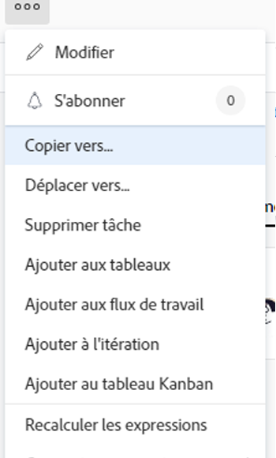

# Copier les problèmes

<!--Audited: 08/2025-->

Vous pouvez copier un problème ou une demande et les enregistrer dans le même projet ou dans un autre. Vous pouvez également copier un problème d’une tâche vers un autre projet.

Vous pouvez copier des problèmes à partir des objets suivants :

* D’un projet vers le même projet (duplication sur le même projet)
* D’une tâche vers la même tâche (duplication si sur la même tâche)
* D’un projet à un autre.
* D’une tâche vers un projet

>[!TIP]
>
>« Problèmes » et « demandes » sont interchangeables dans Workfront. Vous pouvez enregistrer des problèmes sur les projets et les tâches afin d’indiquer les travaux imprévus qui doivent être traités. Vous pouvez également soumettre des demandes qui sont enregistrées en tant que problèmes dans un projet désigné comme file d’attente des demandes.

## Conditions d’accès

+++ Développez pour afficher les exigences d’accès aux fonctionnalités de cet article.

<table style="table-layout:auto"> 
 <col> 
 <col> 
 <tbody> 
  <tr> 
   <td role="rowheader">Package Adobe Workfront</td> 
   <td> 
Tous
 </td> 
  </tr> 
  <tr> 
   <td role="rowheader">Licence Adobe Workfront</td> 
   <td> 
   <ul><li>
Contributeur ou version ultérieure
 </li>
   <li>
Licence légère ou supérieure pour copier un événement dans la section Événements d'un projet
</li></ul>
   Ou
   <ul><li>
Demandeur ou supérieur
 </li>
   <li>
Licence de réviseur ou d'une licence supérieure permettant de copier un événement dans la section Événements d'un projet
</li></ul> </td> 
  </tr> 
  <tr> 
   <td role="rowheader">Configuration du niveau d’accès</td> 
   <td> 
Modifier l’accès aux problèmes
 
Affichage ou accès supérieur aux Projets et aux Tâches
 </td> 
  </tr> 
  <tr> 
   <td role="rowheader">Autorisations d’objet</td> 
   <td> 
Gérer les autorisations liées aux problèmes
 
Autorisations de contribution à l’élément dans lequel vous copiez le problème avec la possibilité d’ajouter des problèmes.
</td> 
  </tr> 
 </tbody> 
</table>

Pour plus de détails sur les informations contenues dans ce tableau, consultez [Conditions d’accès préalables dans la documentation Workfront](/help/quicksilver/administration-and-setup/add-users/access-levels-and-object-permissions/access-level-requirements-in-documentation.md).

+++

<!--Old:

<table style="table-layout:auto"> 
 <col> 
 <col> 
 <tbody> 
  <tr> 
   <td role="rowheader">Adobe Workfront plan*</td> 
   <td> 
Any
 </td> 
  </tr> 
  <tr> 
   <td role="rowheader">Adobe Workfront license*</td> 
   <td> 
Request or higher
 
Review or higher license to copy an issue in the Issues section of a project.
 </td> 
  </tr> 
  <tr> 
   <td role="rowheader">Access level*</td> 
   <td> 
Edit access to Issues
 
View or higher access to Projects and Tasks
 
Note: If you still don't have access, ask your Workfront administrator if they set additional restrictions in your access level. For information about access to issues in your Access Level, see <a href="../../../administration-and-setup/add-users/configure-and-grant-access/grant-access-issues.md" class="MCXref xref">Grant access to issues</a>. For information on how a Workfront administrator can change your access level, see <a href="../../../administration-and-setup/add-users/configure-and-grant-access/create-modify-access-levels.md" class="MCXref xref">Create or modify custom access levels</a>. 
 </td> 
  </tr> 
  <tr> 
   <td role="rowheader">Object permissions</td> 
   <td> 
Manage permissions to the issue
 
Contribute permissions to the item where you are copying the issue to with the ability to Add Issues.
 
 For information about granting permissions to issues, see <a href="../../../workfront-basics/grant-and-request-access-to-objects/share-an-issue.md" class="MCXref xref">Share an issue </a>
 
For information on requesting additional permissions, see <a href="../../../workfront-basics/grant-and-request-access-to-objects/request-access.md" class="MCXref xref">Request access to objects </a>.
 </td> 
  </tr> 
 </tbody> 
</table>-->

## Considérations relatives à la copie de problèmes

### Considérations générales relatives à la copie de problèmes

Vous avez la possibilité de choisir de copier certains éléments associés au problème dans le problème copié pendant le processus de copie. Toutefois, certains éléments sont transférés par défaut vers le nouveau problème, tandis que d’autres ne le sont pas, comme décrit dans les listes ci-dessous.

Les éléments suivants sont copiés par défaut dans le nouveau problème :

* Contact principal
* Formulaires personnalisés. Les informations contenues dans les champs personnalisés ne sont copiées dans le nouveau problème que si vous sélectionnez Données personnalisées dans le processus de copie.
* Approbations
* Dates de début et d’achèvement prévues

Par défaut, les objets suivants ne sont pas copiés dans le nouveau problème :

* Heures consignées

### Considérations relatives aux problèmes liés aux documents ou aux files d’attente de demandes

Tenez compte des points suivants lorsque vous copiez des problèmes contenant des documents ou associés à une file d’attente des demandes :

* **Lorsqu’un problème est associé à une file d’attente des demandes :** lorsque vous copiez un problème dans un autre objet et que le problème est associé à une file d’attente des demandes, le problème copié n’est plus associé à la file d’attente d’origine du premier problème.
* **Lorsqu’un document est attaché au problème :** lorsque vous copiez un problème dans un autre objet et que le problème est accompagné d’un document, le document et ses versions sont également transférés dans le nouveau problème. Les épreuves ou approbations associées au document ne sont pas déplacées.
* **Lorsqu’un problème est lié à un document ou à un dossier :** lorsque vous copiez un problème qui contient des documents ou des dossiers liés à un service tiers tel que Google Drive, les liens vers les documents sont transférés vers le problème copié.

## Copier des problèmes dans une liste

Vous pouvez copier un ou plusieurs problèmes à partir d’une liste de problèmes ou d’un rapport de problème.

1. Accédez au projet qui contient le ou les problèmes que vous souhaitez copier.

   Ou

   Accédez à un rapport de problèmes.

1. Si vous avez choisi d’accéder à un projet, cliquez sur **Problèmes** dans le panneau de gauche.
1. Sélectionnez le ou les problèmes que vous souhaitez copier et cliquez sur le **menu Plus** en haut de la liste des problèmes, puis cliquez sur **Copier sur**.

   

1. Continuez à copier le problème, comme décrit dans la section [Copier un seul problème](#copy-a-single-issue) en commençant par l’étape 2.

   <!--
   <MadCap:conditionalText data-mc-conditions="QuicksilverOrClassic.Draft mode">
   (NOTE: ensure step number stays accurate)
   </MadCap:conditionalText>
   -->

## Copier un seul problème {#copy-a-single-issue}

Vous pouvez copier un problème lorsque vous le consultez.

1. Accédez à un événement à copier, puis cliquez sur le menu **Plus**  à droite du nom de l’événement, puis sur **Copier dans**.

   

   La zone **Copier le problème** s’affiche.

   

1. Dans la section **Sélectionner le projet de destination**, indiquez le nom du projet dans lequel vous souhaitez copier les problèmes. Le nom du projet actuel s’affiche par défaut.

   >[!TIP]
   >
   >Seuls 100 projets s’affichent dans la liste.

1. (Le cas échéant) Cliquez sur **Demander l’accès** si vous n’avez pas le droit de copier des problèmes dans le projet.
1. (Le cas échéant) Continuer à copier le problème dans le projet de destination sélectionné sans demander d’accès si vous avez le droit d’ajouter des problèmes à l’une des tâches du projet de destination.

   

   >[!TIP]
   >
   >Des messages similaires s’affichent si le projet sélectionné est en attente d’approbation, terminé ou immobilisé, lorsque l’administration de Workfront empêche l’ajout de problèmes à ces projets. Pour plus d’informations, voir [Configurer les préférences du projet à l’échelle du système](../../../administration-and-setup/set-up-workfront/configure-system-defaults/set-project-preferences.md).

1. (Facultatif) Dans la section **Options**, désélectionnez l’un des éléments répertoriés dans le tableau ci-dessous pour le supprimer du nouveau problème. Toutes les options sont sélectionnées par défaut.

   >[!NOTE]
   >
   >Cela n’a d’incidence que sur les problèmes copiés et non sur les problèmes d’origine.

   <table style="table-layout:auto"> 
    <col> 
    <col> 
    <tbody> 
     <tr> 
      <td role="rowheader">Affectations</td> 
      <td>Supprime les personnes, les fonctions ou les équipes affectées au problème.</td> 
     </tr> 
     <tr> 
      <td role="rowheader">Progression</td> 
      <td>Supprime le pourcentage terminé, le cas échéant, du problème.</td> 
     </tr> 
     <tr> 
      <td role="rowheader">Documents</td> 
      <td>Supprime tout ce qui se trouve dans l’onglet des documents, y compris les versions des documents, les documents liés et les dossiers.  Par défaut, les épreuves et les approbations de documents ne peuvent pas être copiées dans un autre dossier.</td> 
     </tr> 
     <tr> 
      <td role="rowheader">Autorisations</td> 
      <td>Supprime les entités avec lesquelles le problème est partagé. </td> 
     </tr> 
     <tr> 
      <td role="rowheader">Mises à jour</td> 
      <td>Supprime les commentaires de la section Mises à jour du problème.</td> 
     </tr> 
     <tr> 
      <td role="rowheader">Données personnalisées</td> 
      <td>Supprime les informations du formulaire personnalisé relatif au problème, ainsi que les informations des formulaires personnalisés associés aux documents joints à la question, si celles-ci sont également copiées avec le problème. Les formulaires personnalisés resteront joints aux problèmes et aux documents, mais les informations qu’ils contiennent ne seront pas transférées au nouveau problème. </td> 
     </tr> 
    </tbody> 
   </table>

1. (Facultatif) Dans la section **Sélectionner la tâche**, sélectionnez la tâche dans laquelle vous souhaitez déplacer le problème.
1. Cliquez sur **Copier le problème** ou **Copier les problèmes** si vous avez sélectionné plusieurs problèmes dans une liste.

   Les problèmes copiés sont ajoutés au projet spécifié.

