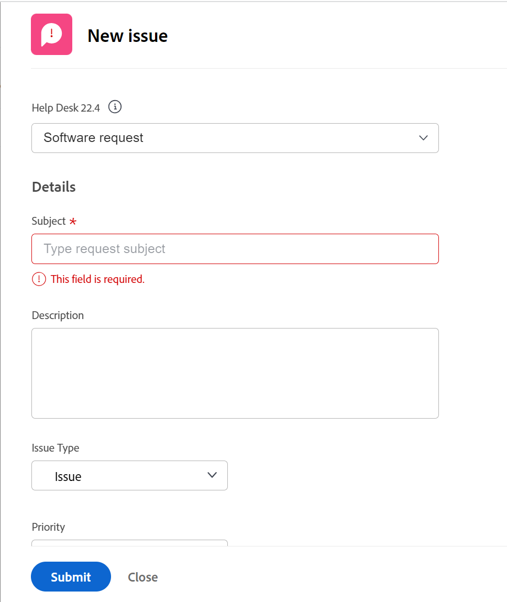

# Créer des problèmes

<!--Audited: 08/2025-->

<!--

The highlighted information on this page refers to functionality not yet generally available. It is available only in the Preview environment for all customers. After the monthly releases to Production, the same features are also available in the Production environment for customers who enabled fast releases. 

For information about fast releases, see [Enable or disable fast releases for your organization](../../../administration-and-setup/set-up-workfront/configure-system-defaults/enable-fast-release-process.md).  

For information about the current release, see [Fourth Quarter 2023 release overview](../../../product-announcements/product-releases/23-q4-release-activity/23-q4-release-overview.md).  

-->

Lorsque vous travaillez sur un projet, des événements inattendus peuvent survenir. Vous pouvez consigner ces événements inattendus en tant que problèmes pour un projet particulier ou une tâche. Les utilisateurs et utilisatrices disposant de l’accès approprié peuvent consulter et suivre le statut des problèmes au fur et à mesure de la progression du projet ou de la tâche, ce qui élimine la nécessité de longues chaînes d’e-mails ou de réunions d’avancement. Contrairement aux tâches, qui sont des événements prévus, les problèmes représentent des éléments de travail non prévus dans Adobe Workfront.

Vous pouvez également ajouter des problèmes à des projets en tant que demandes. Pour plus d’informations, voir [Créer et soumettre des demandes Adobe Workfront](../../../manage-work/requests/create-requests/create-submit-requests.md).

>[!TIP]
>
>Les problèmes et les demandes sont utilisés de manière interchangeable dans Workfront. Vous pouvez enregistrer des problèmes sur les projets et les tâches afin d’indiquer les travaux imprévus qui doivent être traités. Vous pouvez également soumettre des demandes qui sont enregistrées en tant que problèmes dans un projet désigné comme file d’attente des demandes.

## Conditions d’accès

+++ Développez pour afficher les exigences d’accès aux fonctionnalités de cet article.

<table style="table-layout:auto"> 
 <col> 
 <col> 
 <tbody> 
  <tr> 
   <td role="rowheader">Package Adobe Workfront</td> 
   <td> 
Tous
 </td> 
  </tr> 
  <tr> 
   <td role="rowheader">Licence Adobe Workfront</td> 
   <td>
   <ul><li>Contributeur ou version ultérieure</li>
   <li>Léger ou supérieur pour modifier les événements dans la section Événements d’une tâche ou d’un projet</li></ul>
   Ou
   <ul><li>Requête ou supérieure</li> <li>Consultez ou une version ultérieure pour modifier les événements dans la section Événements d’une tâche ou d’un projet</li></ul> </td> 
  </tr> 
  <tr> 
   <td role="rowheader">Configurations des niveaux d’accès</td> 
   <td> 
Modifier l’accès aux problèmes
 
Affichage ou accès supérieur aux Projets et aux Tâches
 </td> 
  </tr> 
  <tr> 
   <td role="rowheader">Autorisations d’objet</td> 
   <td> 
Autorisations Contribuer ou supérieures comprenant la possibilité d’ajouter des problèmes à la tâche ou au projet dans lequel vous créez le problème.
 </td> 
  </tr> 
 </tbody> 
</table>

*Pour plus d’informations, voir [Conditions d’accès dans la documentation de Workfront](/help/quicksilver/administration-and-setup/add-users/access-levels-and-object-permissions/access-level-requirements-in-documentation.md).

+++

<!--Old:

<table style="table-layout:auto"> 
 <col> 
 <col> 
 <tbody> 
  <tr> 
   <td role="rowheader">Adobe Workfront plan</td> 
   <td> 
Any
 </td> 
  </tr> 
  <tr> 
   <td role="rowheader">Adobe Workfront license*</td> 
   <td> 
New license:

   <ul><li>Contributor or higher</li>
   <li>Light or higher to edit issues in the Issues section of a task or project</li></ul>
   
Current license:

  <ul><li>Request or higher</li> <li>Review or higher to edit issues in the Issues section of a task or a project</li></ul> </td> 
  </tr> 
  <tr> 
   <td role="rowheader">Access level configurations</td> 
   <td> 
Edit access to Issues
 
View or higher access to Projects and Tasks
 </td> 
  </tr> 
  <tr> 
   <td role="rowheader">Object permissions</td> 
   <td> 
Contribute or higher permissions with ability to Add Issues to the task or project where you create the issue
 </td> 
  </tr> 
 </tbody> 
</table>

*For information, see [Access requirements in Workfront documentation](/help/quicksilver/administration-and-setup/add-users/access-levels-and-object-permissions/access-level-requirements-in-documentation.md). -->

<!--
(NOTE: in NWE Requestors CAN see the Issues tab on a project but in classic they cannot! However, even when they DO see it, they cannot enter the issues - logged this issue for it but they might decide not to fix it: https://hub.workfront.com/issue/60181e28000058980cce29597185b2d6/updates?email-source=comm)

-->

## Limites de la création de problèmes

Lorsque vous disposez des accès et des autorisations nécessaires, vous pouvez créer des problèmes sur un projet ou une tâche. Toutefois, il se peut que vous ne puissiez pas créer de problèmes dans les cas suivants :

* Votre administration de Workfront ou de groupes doit activer l’ajout de problèmes à un projet dont le statut est Terminé ou Immobilisé dans la zone Préférences du projet. Pour plus d’informations sur la définition des préférences de projet, voir [Configurer les préférences de projet à l’échelle du système](../../../administration-and-setup/set-up-workfront/configure-system-defaults/set-project-preferences.md).
* Vous ne pouvez pas ajouter de problèmes à un projet qui est en attente d’approbation.

## Préparer le formulaire Nouveau problème

Votre organisation doit disposer d’un processus bien défini pour déterminer quand et comment enregistrer un problème. Lorsque vous configurez ce processus, la première étape consiste à créer le formulaire nécessaire à l’envoi d’un problème.

Les utilisateurs peuvent ajouter des problèmes à un projet des manières suivantes :

* Les ajouter directement aux tâches et projets.
* Envoyez-les à une file d’attente des demandes.

Le formulaire Nouveau problème peut contenir des informations importantes qui permettront de résoudre rapidement le problème.

Vous pouvez configurer le formulaire Nouvel événement pour inclure les informations suivantes lorsque les utilisateurs ajoutent des événements au projet ou à ses tâches :

* Champs personnalisés
* Approbations
* Affectations (règles de transmission)

Les champs relatifs aux nouveaux problèmes ou demandes sont définis dans la section Détails de la file d’attente du projet où les problèmes seront consignés.

Pour plus d’informations sur la configuration de la section Détails de la file d’attente du projet, voir [Créer une file d’attente des demandes](../../../manage-work/requests/create-and-manage-request-queues/create-request-queue.md).

Pour plus d’informations sur la création de problèmes par le biais d’une soumission à une file d’attente des demandes, voir la section [Créer des problèmes en saisissant une nouvelle demande](#create-issues-by-entering-a-new-request) de cet article.

## Créer des problèmes sur une tâche ou un projet à l’aide du bouton Nouveau problème

Après avoir défini les champs d’un nouveau formulaire de problème sur votre projet, vous pouvez commencer à créer des problèmes.

Pour créer un problème sur une tâche ou un projet :

1. Accédez au projet dans lequel vous souhaitez créer le problème.
1. (Facultatif) Si vous souhaitez enregistrer le problème d’une tâche, accédez à la zone **Tâches**, puis cliquez sur le nom d’une tâche.
1. Cliquez sur la section **Problèmes**.

   La liste des problèmes associés au projet s’affiche.

1. Cliquez sur **Nouveau problème** en haut de la liste des problèmes.
La boîte de dialogue Nouveau problème s’affiche.

   

1. (Le cas échéant) Si la personne à l’origine du projet a créé des rubriques de file d’attente ou des groupes de rubriques sur le projet, ils sont ajoutés au formulaire du nouveau problème. Indiquez le **groupe de rubriques** ou la **rubrique de file d’attente** de votre nouveau problème. Les groupes de rubriques et les rubriques de file d’attente ont des noms adaptés à votre environnement.\
   Pour plus d’informations sur la création de groupes de rubriques, voir [Créer des groupes de rubriques](../../../manage-work/requests/create-and-manage-request-queues/create-topic-groups.md). Pour plus d’informations sur la création de rubriques de file d’attente, voir [Créer des rubriques de file d’attente](../../../manage-work/requests/create-and-manage-request-queues/create-queue-topics.md).

   * S’il n’y a qu’une seule rubrique de file d’attente définie pour le projet, elle s’affiche automatiquement.
   * Si le groupe de rubriques n’a pas de rubriques de file d’attente ou de groupes de rubriques sous lui, rien n’est disponible dans le menu déroulant du groupe de rubriques.

1. Ajoutez le nom du problème dans le champ **Objet**, puis ajoutez une **description**.

1. (Le cas échéant) Si la personne qui a créé le projet a autorisé l’affichage du champ **Type de demande** dans le formulaire Nouveau problème, sélectionnez le type de votre problème parmi les options suivantes :

   * Rapport sur les bogues
   * Modifier l&#39;ordre
   * Problème
   * Demande\
     Selon la façon dont votre administrateur ou administratrice Workfront a configuré les préférences de votre projet, les noms des types de problèmes peuvent être différents pour vous.

   >[!TIP]
   >
   >Les types de demande doivent être activés dans les détails de la file d’attente et lors de la création de la rubrique de file d’attente afin d’être affichés comme sélection dans le formulaire Nouveau problème. Pour plus d’informations, voir les articles suivants :
   >
   >* [Créer une file d’attente des demandes](../../requests/create-and-manage-request-queues/create-request-queue.md)
   >* [Créer des rubriques de file d’attente](../../requests/create-and-manage-request-queues/create-queue-topics.md)

1. Continuez à spécifier les champs disponibles dans le formulaire **Nouveau problème**. Pour plus d’informations sur les champs disponibles lors de la saisie d’un nouveau problème, voir [Modifier les problèmes](../../../manage-work/issues/manage-issues/edit-issues.md).

   >[!IMPORTANT]
   >
   >Tous les champs relatifs au problème ne sont pas disponibles dans le formulaire Nouveau problème. La personne qui a créé le projet active les champs disponibles lors de la création d’un problème lorsqu’elle définit la zone Détails de la file d’attente du projet. Pour plus d’informations, voir [Créer une file d’attente des demandes](../../requests/create-and-manage-request-queues/create-request-queue.md).

1. (Le cas échéant) Si les rubriques de file d’attente sont associés à un formulaire personnalisé, celui-ci s’affichera dans le formulaire **Nouveau problème**.\
   Ou\
   Si le projet est associé à un formulaire personnalisé de problème par le biais de la zone Détails de la file d’attente, le formulaire s’affiche dans le formulaire **Nouveau problème**, après les champs par défaut de Workfront.

   Pour plus d’informations, voir [Créer une file d’attente des demandes](../../../manage-work/requests/create-and-manage-request-queues/create-request-queue.md).

1. Cliquez sur **Soumettre**.

   Les problèmes peuvent être affectés à plusieurs utilisateurs ou utilisatrices, à des fonctions ou à une équipe. Pour plus d’informations sur l’affectation et la gestion des demandes, voir [Gérer les demandes de travail et d’équipe](../../../people-teams-and-groups/work-with-team-requests/manage-work-and-team-requests.md).

## Créer des problèmes en ligne sur une tâche ou un projet

>[!IMPORTANT]
>
>Le ou la propriétaire du projet doit activer **Autoriser les utilisateurs et utilisatrices à ajouter des questions en ligne** lors de la définition des paramètres des problèmes pour le projet avant que vous puissiez ajouter des problèmes en ligne au projet ou aux tâches. Pour plus d’informations sur la configuration des paramètres des problèmes sur un projet, voir [Modifier les projets](../../../manage-work/projects/manage-projects/edit-projects.md).
>

Lorsque vous souhaitez ajouter plusieurs problèmes rapidement, vous pouvez créer des problèmes pour une tâche ou un projet en ligne, en les ajoutant à une liste de problèmes.

>[!NOTE]
>
>Lorsque vous ajoutez des problèmes en ligne, Workfront n’applique pas le formulaire Nouveau problème aux nouveaux problèmes. Nous ne recommandons pas d’ajouter des problèmes en ligne si vous souhaitez que les utilisateurs et utilisatrices fournissent certaines informations lors de la saisie des problèmes. Cela peut avoir un impact négatif sur le signalement des problèmes et, par la suite, sur la capacité de la personne affectée au problème à disposer de toutes les informations nécessaires pour résoudre le problème.

Pour créer des problèmes en ligne :

1. Accédez au projet dans lequel vous souhaitez créer le problème.
1. (Facultatif) Si vous souhaitez enregistrer le problème d’une tâche, accédez à la section **Tâches**, puis cliquez sur le nom d’une tâche.
1. Cliquez sur l’onglet **Problèmes** dans le panneau de gauche.
1. Cliquez sur **Ajouter d’autres problèmes** en bas de la liste des problèmes.

   Une nouvelle ligne est créée dans la liste des problèmes de la section Problèmes.

   >[!TIP]
   >
   >Cette option est grisée si le paramètre Autoriser les utilisateurs et utilisatrices à ajouter des problèmes en ligne est désélectionné dans la boîte Modifier le projet. Pour plus d’informations, voir [Modifier les projets](../../../manage-work/projects/manage-projects/edit-projects.md).

   

1. Commencez à saisir le nom du problème dans le champ Nom, puis continuez à ajouter des informations sur le problème en ligne.

   >[!TIP]
   >
   >Les champs qui peuvent être modifiés en ligne sont rendus disponibles par la vue que vous appliquez à votre liste de problèmes. Il se peut que vous ne puissiez pas modifier en ligne les types de champs suivants :
   >   
   >* Champs appartenant à un autre objet
   >* Champs que vous n’avez pas le droit de modifier
   >* Champs qui sont des calculs et qui sont automatiquement mis à jour par Workfront

1. Cliquez sur Entrée pour terminer la modification en ligne et ajoutez le problème au projet ou à la tâche.

## Créer des problèmes en introduisant une nouvelle demande {#create-issues-by-entering-a-new-request}

Vous pouvez désigner des projets qui serviront de réceptacles pour la réception des problèmes. Ces types de projets sont appelés files d’attente des demandes dans Workfront. Vous pouvez accéder à Files d’attente des demandes à partir de la zone Demandes du menu principal.

>[!TIP]
>
>Les termes « problème » et « demande » sont interchangeables dans Workfront.

Pour plus d’informations sur la manière de configurer des projets en tant que files d’attente des demandes pour recevoir des problèmes, voir [Créer une file d’attente des demandes](../../../manage-work/requests/create-and-manage-request-queues/create-request-queue.md). Pour plus d’informations sur la soumission des demandes, voir [Créer et soumettre des demandes Adobe Workfront](../../../manage-work/requests/create-requests/create-submit-requests.md).
