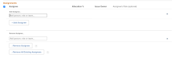

# Modifier les affectations d’utilisateurs et utilisatrices pour plusieurs problèmes dans une liste

<!--Audited: 07/2024-->
<!--

(NOTE: similar article exists for tasks)

-->

<!--
 

The highlighted information on this page refers to functionality not yet generally available. It is available only in the Preview environment for all customers. The same features will also be available in the Production environment for all customers starting with a week from the Preview release.      

For more information, see [Interface modernization](/help/quicksilver/product-announcements/product-releases/interface-modernization/interface-modernization.md).  

 -->

Vous pouvez modifier simultanément les affectations d’utilisateurs à plusieurs événements. Pour plus d’informations sur la modification des événements ou leur affectation un par un, consultez également les articles suivants :

* [Modifier les problèmes](../../../manage-work/issues/manage-issues/edit-issues.md)
* [Attribuer des problèmes](../../../manage-work/issues/manage-issues/assign-issues.md)

Pour obtenir des informations générales sur l’affectation de problèmes, voir [Vue d’ensemble de la modification des affectations de problèmes](../../../manage-work/issues/manage-issues/modify-issue-assignments-overview.md).

>[!NOTE]
>
>Vous devez disposer au moins des autorisations de contribution à un problème pour pouvoir effectuer des affectations au problème.

## Conditions d’accès

+++ Développez pour afficher les exigences d’accès aux fonctionnalités de cet article. 

<table style="table-layout:auto"> 
 <col> 
 <col> 
 <tbody> 
  <tr> 
   <td>Package Adobe Workfront</td> 
   <td> 
Tous
 </td> 
  </tr> 
  <tr> 
   <td>Licence Adobe Workfront</td> 
   <td> 
Contributeur ou version ultérieure

   
Requête ou supérieure
 </td> 
  </tr> 
  <tr> 
   <td>Configurations des niveaux d’accès</td> 
   <td> 
Modifier l’accès aux problèmes
 
Accédez en lecture seule ou à un niveau supérieur aux Projets et Tâches pour affecter un événement.
 </td> 
  </tr> 
  <tr> 
   <td>Autorisations d’objet</td> 
   <td> 
Gérer les autorisations liées aux problèmes
 
Accordez des autorisations ou supérieures au projet ou à la tâche où se trouve le problème lors de l’affectation de plusieurs problèmes.
  </td> 
  </tr> 
 </tbody> 
</table>

Pour plus d’informations, voir [Conditions d’accès requises dans la documentation Workfront](/help/quicksilver/administration-and-setup/add-users/access-levels-and-object-permissions/access-level-requirements-in-documentation.md).

+++

<!--

<h2>When to modify user assignments on issues</h2>

(NOTE:  drafted and moved to the overview article: Modify issue assignments overview)

You might want to modify the user assignments for multiple issues for a variety of  reasons, including the following:

<ul>
<li>Users join or leave  your team</li>
<li>A user takes a vacation that extends beyond the issue  due dates</li>
<li>A specific role or user is set as the assignee for multiple issues and you want to quickly modify all items to be assigned to a different user or role</li>
</ul>

-->

## Modifier des affectations pour plusieurs problèmes

1. Accédez à la liste des événements qui contient les événements dont vous souhaitez modifier les affectations.
1. (Facultatif) Créez un filtre pour afficher uniquement les problèmes affectés à la personne cessionnaire que vous souhaitez modifier.

   Par exemple, vous pouvez créer un filtre pour afficher uniquement les événements disposant d’un rôle spécifique en tant que personne désignée.  Vous pouvez ensuite remplacer le rôle par un utilisateur ou une utilisatrice spécifique. Procédez comme suit :

   1. Cliquez sur la liste déroulante **Filtres**, puis sur **Nouveau filtre**.

   1. Dans le premier champ, commencez à saisir **Rôles pour l’affectation** et choisissez **Rôles pour l’affectation : Nom** dans la liste.
   1. Sélectionnez **Est l’un des** dans le menu déroulant des modificateurs, puis commencez à saisir le nom d’un rôle et sélectionnez-le lorsqu’il s’affiche dans la liste. Vous pouvez saisir plusieurs rôles.

      >[!TIP]
      >
      >N’utilisez pas l’option **Affecté à** car ce champ fait référence uniquement au propriétaire de l’événement et non à tous les cessionnaires.

      La liste des événements filtre automatiquement vos critères de filtrage.
   1. (Facultatif) Cliquez sur **Enregistrer en tant que nouveau** puis **Enregistrer**.

1. Sélectionnez les événements pour lesquels vous souhaitez modifier les affectations, puis cliquez sur l&#39;icône **Modifier** .

   La boîte **Modifier des problèmes** s’affiche. Le nombre d’éléments sélectionnés s’affiche dans le coin supérieur gauche de la page.

1. Cliquez sur **Affectations** dans le panneau de gauche, puis sur l’icône **x** en regard de la personne désignée à supprimer.

   >[!TIP]
   >
   >Seuls les cessionnaires affectés à tous les événements sélectionnés s&#39;affichent dans la zone **Affectations**.

   

1. Commencez à saisir le nom d’un utilisateur, d’un rôle ou d’une équipe pour ajouter des délégataires à tous les événements sélectionnés.

   >[!TIP]
   >
   >Vous pouvez affecter plusieurs utilisateurs et utilisatrices, fonctions ou équipes. Vous pouvez affecter uniquement les utilisateurs et utilisatrices, fonctions et équipes actifs.
   >
   >Si une personne, une fonction ou une équipe a été affectée avant d’être désactivée, elle reste affectée à l’élément de travail. Dans ce cas, nous vous recommandons ce qui suit :
   >
   >* Réaffectez la tâche aux ressources actives.
   >* Associez les utilisateurs et utilisatrices d’une équipe désactivée à une équipe active et réaffectez l’élément de travail à l’équipe active.

   Les délégataires ajoutés sont ajoutés aux délégataires existants. Ils ne remplacent pas les problèmes existants pour chaque événement sélectionné.

1. (Facultatif) Cliquez sur **M’affecter** pour vous affecter tous les problèmes.
1. Cliquer sur **Enregistrer**.

   <!--Old functionality for assignments for issues - before November 2025:
   1. (Conditional) In the Production environment, do the following: 
   1. Go to the **Assignments** section, then select **Assignee**.
      
   1. Do one of the following:
      1. To add a new assignee:
         1. Start typing the name of a user, role, or team, then select it when it displays in the list. The assignment is added and does not replace the current assignments on the selected issues.
         >[!TIP]
         >
         >You can assign multiple users, job roles, or teams. You can assign only active users, job roles, and teams.
         >
         >If a user, job role, or a team was assigned before they were deactivated, they remain assigned to the work item. In this case, we recommend the following:
         >
         >* Reassign the work item to active resources.
         >* Associate the users in a deactivated team with an active team and reassign the work item to the active team.
          Information that is common across all issues selected displays. For example, if the same user is assigned to all issues, that user displays in the **Assignee**  column. If information is not common across the issues selected, no information displays.
      1. To remove individual assignees:
         1. Click the **X icon** next to the name of the assignee that you want to remove if the assignee displays in the Assignments list.
            Or
            If the assignee that you want to remove does not display in the Assignments section because the assignee is assigned to only some of the issues that you have selected, click **Remove Assignee** and start typing the name of the assignee that you want to remove, then click the name when it appears in the drop-down list.
         1. Click  **Remove Assignee** again to add another assignee to remove.
      1. To remove all existing assignees:
         1. Click **Remove All Existing Assignees**, then click **Yes, Delete All Assignees**.
            This removes not only common assignees (assignees that are displayed in the edit  dialog box), but also all assignees on all the selected issues.
         1. (Optional) Modify any of the following options for the assignees you selected to associate with the issues:
          * **Issue Owner:**  Select the radio button to indicate which assignee is designated as the Issues Owner. If left unselected, Adobe Workfront designates the first assignee as the Issue Owner. This is not available for team assignments. 
            * **Assignee's Role**: Select a role from the drop-down list. If left unselected, Workfront automatically selects the Primary Role of the user.
      1. Click **Save Changes**.-->

