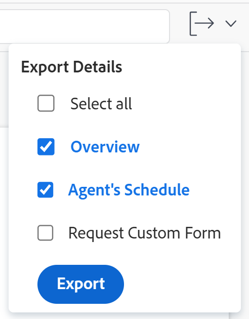

# Modifier des problèmes

<!--Audited: 10/2025-->

<!--
 

The highlighted information on this page refers to functionality not yet generally available. It is available only in the Preview environment for all customers. The same features will also be available in the Production environment for all customers starting with  a week from the Preview release.      

For more information, see [Interface modernization](/help/quicksilver/product-announcements/product-releases/interface-modernization/interface-modernization.md).  

-->

Vous pouvez modifier les informations sur les problèmes que vous avez créés ou que d’autres personnes ont créés si elles ont partagé les problèmes avec vous.

Vous pouvez modifier un seul problème ou modifier des problèmes dans une liste. Pour plus d’informations sur la modification des problèmes dans une liste, voir [Modifier les problèmes dans une liste](../../../manage-work/issues/manage-issues/edit-issues-in-a-list.md).

## Conditions d’accès

+++ Développez pour afficher les exigences d’accès aux fonctionnalités de cet article. 

<table style="table-layout:auto"> 
 <col> 
 <col> 
 <tbody> 
  <tr> 
   <td role="rowheader">Package Adobe Workfront</td> 
   <td> 
Tous
 </td> 
  </tr> 
  <tr> 
   <td role="rowheader">Licence Adobe Workfront</td> 
   <td> <ul><li>Contributeur ou version ultérieure</li>
   <li>Léger ou supérieur pour modifier les événements dans la section Événements d’une tâche ou d’un projet</li></ul>
   Ou :
   <ul><li>Requête ou supérieure</li> <li>Consultez ou une version ultérieure pour modifier les événements dans la section Événements d’une tâche ou d’un projet</li></ul> </td> 
  </tr> 
  <tr> 
   <td role="rowheader">Niveau d’accès</td> 
   <td> 
Modifier l’accès aux problèmes
  </td> 
  </tr> 
  <tr> 
   <td role="rowheader">Autorisations d’objet</td> 
   <td> 
Autorisations de contribution pour un problème afin de modifier les champs suivants dans la zone Détails : 

   <ul>
   <li>Description</li>
   <li>Statut</li>
   <li>Gravité</li>
   </ul>
   
Autorisations de gestion pour un problème afin de modifier tous les champs dans la zone Détails et dans la zone Modifier le problème.
 
 Pour plus d’informations sur l’octroi d’autorisations aux problèmes, voir <a href="../../../workfront-basics/grant-and-request-access-to-objects/share-an-issue.md" class="MCXref xref">Partager un problème</a>
 
Pour plus d’informations sur la demande d’autorisations supplémentaires, voir <a href="../../../workfront-basics/grant-and-request-access-to-objects/request-access.md" class="MCXref xref">Demander l’accès à des objets</a>.
 </td> 
  </tr> 
 </tbody> 
</table>

*Pour plus d’informations, voir [Conditions d’accès dans la documentation de Workfront](/help/quicksilver/administration-and-setup/add-users/access-levels-and-object-permissions/access-level-requirements-in-documentation.md).

+++

<!--Old:

<table style="table-layout:auto"> 
 <col> 
 <col> 
 <tbody> 
  <tr> 
   <td role="rowheader">Adobe Workfront plan</td> 
   <td> 
Any 
 </td> 
  </tr> 
  <tr> 
   <td role="rowheader">Adobe Workfront license*</td> 
   <td> 
New license:

   <ul><li>Contributor or higher</li>
   <li>Light or higher to edit issues in the Issues section of a task or project</li></ul>
   
Current license:

  <ul><li>Request or higher</li> <li>Review or higher to edit issues in the Issues section of a task or a project</li></ul> </td> 
  </tr> 
  <tr> 
   <td role="rowheader">Access level</td> 
   <td> 
Edit access to Issues
  </td> 
  </tr> 
  <tr> 
   <td role="rowheader">Object permissions</td> 
   <td> 
Contribute permissions to an issue to edit the following fields in the Details area: 

   <ul>
   <li>Description</li>
   <li>Status</li>
   <li>Severity</li>
   </ul>
   
Manage permissions to an issue to edit all the fields in the Details area or in the Edit Issue box
 
 For information about granting permissions to issues, see <a href="../../../workfront-basics/grant-and-request-access-to-objects/share-an-issue.md" class="MCXref xref">Share an issue </a>
 
For information on requesting additional permissions, see <a href="../../../workfront-basics/grant-and-request-access-to-objects/request-access.md" class="MCXref xref">Request access to objects </a>.
 </td> 
  </tr> 
 </tbody> 
</table>-->

## Limites lors de la modification de problèmes

Certaines restrictions peuvent vous empêcher de modifier des problèmes.

* Vous ne pouvez pas modifier les problèmes qui se trouvent dans un processus d’approbation. Vous pouvez uniquement consigner le temps ou mettre à jour le statut sur un problème en attente d’approbation.
* Vous pouvez modifier et ajouter des documents aux problèmes des projets qui sont terminés, immobilisés ou en attente d’approbation seulement si l’administration de Workfront ou de groupes a activé cette option dans les préférences du projet. Pour plus d’informations sur la définition des préférences de projet, voir [Configurer les préférences de projet à l’échelle du système](../../../administration-and-setup/set-up-workfront/configure-system-defaults/set-project-preferences.md).

## Modifier un seul problème

Vous pouvez modifier un problème à l’aide des zones Modifier le problème ou Détails du problème. Les étapes suivantes décrivent la modification d’un problème dans la zone Modifier le problème.

1. Accédez au **Menu principal**.
1. Cliquez sur **Projets**, puis cliquez sur le nom d’un projet pour l’ouvrir.
1. (Facultatif) Cliquez sur **Tâches** , puis cliquez sur le nom d’une tâche pour ouvrir la tâche.
1. Cliquez sur **Problèmes** dans le panneau de gauche.

   

1. (Facultatif) Pour modifier des informations limitées sur un problème, cliquez sur **Détails du problème** dans le panneau de gauche.

   >[!NOTE]
   >
   >Les champs de la zone des détails du problème peuvent être réorganisés ou pas, selon les modifications apportées par l’administration de Workfront ou de groupes à votre modèle de mise en page. Pour plus d’informations, voir [Personnaliser la vue Détails à l’aide d’un modèle de mise en page](../../../administration-and-setup/customize-workfront/use-layout-templates/customize-details-view-layout-template.md).

   Pour modifier les informations de la section Détails, procédez comme suit :

   1. (Facultatif) Cliquez sur l’icône **Réduire tout** dans le coin supérieur droit pour réduire toutes les zones.
   1. (Facultatif et conditionnel) Lorsqu’une zone est réduite, cliquez sur la **flèche pointant vers la droite**  en regard de chaque zone pour développer la zone à modifier.
   1. (Facultatif) Pour joindre un formulaire personnalisé, commencez à saisir le nom d’un formulaire dans le champ **Ajouter un formulaire personnalisé**, sélectionnez-le lorsqu’il s’affiche dans la liste, puis cliquez sur **Enregistrer les modifications**.
   1. (Facultatif) Cliquez sur l’icône **Exporter**  pour exporter les informations de la Présentation et des formulaires personnalisés dans un fichier PDF, puis cliquez sur **Exporter**. Sélectionnez l’une des options suivantes :

      * Sélectionner tout (ne s’affiche que lorsqu’au moins un formulaire personnalisé est joint)
      * Vue d’ensemble
      * Nom d’un ou de plusieurs formulaires personnalisés

      Le fichier PDF est téléchargé sur votre ordinateur.

      

      Pour plus d’informations, voir [Exporter des formulaires personnalisés et des détails d’objet](../../../workfront-basics/work-with-custom-forms/export-custom-forms-details.md).

   Pour plus d’informations sur les champs visibles dans la section Détails du problème, continuez à modifier le problème dans la zone Modifier le problème comme décrit ci-dessous.

1. Pour modifier toutes les informations relatives à un événement, sélectionnez un événement dans une liste, puis cliquez sur **Modifier** en haut de la liste

   Ou

   Cliquez sur le nom d’un problème dans une liste, cliquez sur le menu **Plus** en regard du nom du problème, puis sur **Modifier**.

   La boîte de dialogue **Modifier le problème** s’affiche.

   >[!IMPORTANT]
   >
   >Vous devez disposer des autorisations en gestion sur le problème pour afficher le lien Modifier.

   Tous les champs de problème sont disponibles dans la zone Modifier le problème et sont regroupés par zones répertoriées dans le panneau de gauche.

1. Pensez à spécifier des informations dans l’une des sections suivantes :

   * [Nom de l’événement](#issue-name)
   * [Vue d’ensemble](#overview)
   * [Affectations](#assignments)
   * [Formulaires personnalisés](#Custom%C2%A0F)
   * [Paramètres](#settings)

   >[!NOTE]
   >
   >Selon la manière dont votre administrateur ou administratrice Workfront configure le modèle de mise en page, les champs de la zone Modifier le problème peuvent être différents dans votre environnement. Pour plus d’informations, voir [Personnaliser la vue Détails à l’aide d’un modèle de mise en page](../../../administration-and-setup/customize-workfront/use-layout-templates/customize-details-view-layout-template.md).
   >
   >La plupart des champs répertoriés dans les sections ci-dessous sont également accessibles à partir de la zone Nouveau problème lorsque vous créez un problème. Les sections sous lesquelles se trouvent les champs ne correspondent pas à la zone Nouveau problème. Pour plus d’informations sur la création de problèmes, voir [Créer des problèmes](../../issues/manage-issues/create-issues.md).

### Nom de l’événement {#issue-name}

1. Commencez à modifier un problème comme décrit ci-dessus.
1. Cliquez sur **Nom du problème**.

   

1. Mettez à jour le champ **Nom du problème**.
1. Cliquez sur **Enregistrer** ou continuez à modifier les sections suivantes.

### Vue d’ensemble {#overview}

1. Commencez à modifier un problème comme décrit ci-dessus.
1. Cliquez sur **Vue d’ensemble**.

   

1. Mettez à jour ou vérifiez l’un des champs du tableau suivant :

   <table style="table-layout:auto"> 
    <col> 
    <col> 
    <tbody> 
     <tr> 
      <td role="rowheader">Description</td> 
      <td> 
Ajoutez des informations supplémentaires sur le problème.
 </td> 
     </tr>

   <tr> 
      <td role="rowheader">Statut</td> 
      <td> 
Sélectionnez le statut du problème. Pour plus d’informations sur les statuts des problèmes, voir <a href="../../../administration-and-setup/customize-workfront/creating-custom-status-and-priority-labels/issue-statuses.md" class="MCXref xref">Accéder à la liste des statuts des problèmes du système</a>. 
 </td> 
     </tr> 
     <tr> 
      <td role="rowheader">Priorité</td> 
      <td> 
Il s’agit d’un indicateur visuel qui vous permet de hiérarchiser les problèmes.
 
Sélectionnez l’une des options suivantes :
 
       <ul> 
        <li> 
<strong>Aucune</strong> 
 </li> 
        <li> 
<strong>Faible</strong> 
 </li> 
        <li> 
<strong>Normale</strong> 
 </li> 
        <li> 
<strong>Élevée</strong> 
 </li> 
        <li> 
<strong>Urgente</strong> 
 </li> 
       </ul> 
Selon les préférences du projet sélectionnées par votre administrateur ou administratrice Workfront, les noms des priorités peuvent être différents pour vous. Pour plus d’informations sur la modification des priorités, voir <a href="../../../administration-and-setup/customize-workfront/creating-custom-status-and-priority-labels/create-customize-priorities.md" class="MCXref xref">Créer et personnaliser des priorités</a>.
 </td> 
     </tr> 
     <tr> 
      <td role="rowheader">Gravité</td> 
      <td> 
Il s’agit d’un indicateur visuel qui indique la gravité du problème. Les gravités sont spécifiques aux problèmes. Sélectionnez l’une des options suivantes :
 
       <ul> 
        <li> 
Décoratif
 </li> 
        <li> 
Cause de la confusion
 </li> 
        <li> 
Bogue qui a une solution
 </li> 
        <li> 
Bogue sans solution
 </li> 
        <li> 
Erreur fatale
 </li> 
       </ul> 
Selon les préférences de projet sélectionnées par votre administrateur ou administratrice Workfront, les noms des gravités peuvent être différents pour vous. Pour plus d’informations sur la modification des gravités, voir <a href="../../../administration-and-setup/customize-workfront/creating-custom-status-and-priority-labels/create-customize-issue-severities.md" class="MCXref xref">Créer ou personnaliser des gravités pour les problèmes</a>.
 </td> 
     </tr>

   <tr> 
   <td role="rowheader">Condition de l’événement</td> 
   <td> 
La condition d'un problème est un indicateur placé sur celui-ci pour indiquer comment il se passe.
 
   
Vous pouvez définir la condition d’une tâche ou d’un problème automatiquement ou manuellement.

   
Vous devez être affecté à l'événement pour modifier son statut.

   
Sélectionnez l’une des options suivantes :
 
      <ul> 
   <li> 
Tout est en ordre
 </li> 
   <li> 
Certaines inquiétudes
 </li> 
   <li> 
Obstacles majeurs
 </li> 
   </ul> </td> 
     </tr>

   <tr> 
      <td role="rowheader">URL</td> 
      <td> 
Saisissez un lien web qui se rapporte aux informations sur le problème.
 </td> 
     </tr> 
     <tr> 
      <td role="rowheader">Type</td> 
      <td> 
Selon les propriétés de file d’attente sélectionnées par votre gestionnaire de projet dans la zone Détails de la file d’attente du projet, vous pouvez peut-être spécifier le type de problème. Sélectionnez l’une des options suivantes dans le menu déroulant <b>Type</b> : 
 
       <ul> 
        <li> 
<strong>Rapport sur les bogues</strong> 
 </li> 
        <li> 
<strong>Modifier l'ordre</strong> 
 </li> 
        <li> 
<strong>Problème</strong> 
 </li> 
        <li> 
<strong>Demande</strong> 
 </li> 
       </ul> 
Selon les préférences de projet sélectionnées par votre administrateur ou administratrice Workfront, les noms des types de problèmes peuvent être différents pour vous.
 </td> 
     </tr> 
     <tr> 
      <td role="rowheader">Contact principal</td> 
      <td>Par défaut, le contact principal est le créateur ou la créatrice du problème. Pour modifier ce paramètre, commencez à saisir le nom de toute personne active dans Workfront, puis sélectionnez-la dans la liste qui apparaît. Un problème ne peut avoir qu’un créateur ou qu’une créatrice.  Si vous modifiez le contact principal, le contact principal d’origine dispose toujours d’un accès en gestion au problème. Lorsque vous partagez un problème, vous devez supprimer manuellement cet accès de la zone Accès au problème.

   <b>CONSEIL</b>

   
Lorsque vous ajoutez un utilisateur ou une utilisatrice comme contact principal, vérifiez son avatar, son rôle principal et son adresse e-mail pour distinguer les doublons. Les utilisateurs et utilisatrices doivent être associés à au moins une fonction pour l’afficher à mesure que vous les ajoutez.

      
 Pour que les utilisateurs et utilisatrices puissent afficher les e-mails de leurs utilisateurs et utilisatrices, le paramètre Afficher les coordonnées doit être activé dans votre niveau d’accès. Pour plus d’informations, voir <a href="../../../administration-and-setup/add-users/configure-and-grant-access/grant-access-other-users.md">Accorder l’accès aux utilisateurs et aux utilisatrices</a>.

   </td> 
     </tr> 
     <tr> 
      <td role="rowheader">Date et heure d’engagement</td> 
      <td> 
Il s’agit de la date à laquelle la personne cessionnaire du problème estime que le problème sera terminé. Seuls les cessionnaires peuvent modifier ce champ.
 </td> 
     </tr> 
     <tr> 
      <td role="rowheader">Date de début prévue</td> 
      <td>Par défaut, la date de début prévue correspond à la date et à l’heure de création du problème. Vous pouvez mettre à jour la <strong>date de début prévue</strong> du problème. </td> 
     </tr> 
     <tr> 
      <td role="rowheader">Date et heure d’achèvement prévues</td> 
      <td> Par défaut, la date d’achèvement prévue est de 24 heures à partir de la date de début prévue par défaut. Par défaut, les problèmes ont une durée de 1 jour. Vous pouvez mettre à jour la <strong>Date d’achèvement prévue</strong> du problème.</td> 
     </tr> 
     <tr> 
      <td role="rowheader">Date et heure de début effectives</td> 
      <td>La date de début effective est automatiquement renseignée lorsque vous modifiez le statut du problème pour le mettre sur <strong>En cours</strong>. Vous pouvez mettre à jour la <strong>Date de début effective</strong> du problème. Vous pouvez mettre à jour manuellement la date, si nécessaire. </td> 
     </tr> 
     <tr> 
      <td role="rowheader">Date et heure d’achèvement effectives</td> 
      <td>La date d’achèvement effective est automatiquement renseignée lorsque vous modifiez le statut du problème pour le mettre sur <strong>Fermé</strong> ou<strong>Résolu</strong>. Vous pouvez mettre à jour la <strong>Date d’achèvement effective</strong> du problème. Vous pouvez mettre à jour manuellement la date, si nécessaire.</td> 
     </tr> 
     <tr> 
      <td role="rowheader">Résolu par</td> 
      <td> 
Cela indique si le problème est résolu par un autre objet. Vous pouvez choisir si ce problème est résolu par une tâche, un projet ou un autre problème dans le menu déroulant, puis commencer à saisir le nom de la tâche, du projet ou du problème qui résoudra le problème. Sélectionnez le nom qui apparaît dans la liste.

   <b>NOTES</b>

   <ul><li>Lorsque vous sélectionnez un objet pour résoudre un problème, le statut du problème est lié au statut de l’objet de résolution et ne peut pas être modifié sur le problème. Pour plus d’informations sur la résolution d’objets, consultez la section <a href="../../../manage-work/issues/convert-issues/resolving-and-resolvable-objects.md" class="MCXref xref">Vue d’ensemble des objets de résolution et résolvables</a>.</li>

   <li>Lorsque vous connectez un problème à résoudre par une autre tâche, un autre problème ou un autre projet, aucune information relative au problème n'est transférée vers l'objet de résolution (la tâche, le problème ou le projet répertorié dans le champ Résolu par ). </li>

   <li>Lorsque l’administrateur ou l’administratrice de votre système ou de votre groupe ajoute le champ « Résolu par » à un en-tête personnalisé de problème, le champ devient « Résolution du problème », « Résolution de la tâche » ou « Résolution du projet » lorsqu’un objet de résolution est associé au problème.

   Vous ne pouvez pas modifier ce champ lorsqu’il s’affiche dans l’en-tête du problème. Pour plus d’informations sur la personnalisation des en-têtes de problème, voir la section <a href="../../../administration-and-setup/customize-workfront/use-layout-templates/customize-object-headers.md">Personnaliser les en-têtes d’objet à l’aide d’un modèle de mise en page</a></li></ul>
   </td> 
     </tr>

   <tr> 
      <td role="rowheader">Résolution du problème, résolution de la tâche ou résolution du projet</td> 
      <td>Nom associé du problème, de la tâche ou problème qui résout le problème.  </td> 
     </tr> 
      <tr> 
      <td role="rowheader">Ceci résout</td> 
      <td>Nom associé du problème qui se termine lorsque le problème auquel vous accédez est résolu.  </td> 
     </tr> 
    </tbody> 
   </table>

1. Cliquez sur **Enregistrer** ou continuez à modifier les sections suivantes.

#### Affectations {#assignments}

1. Commencez à modifier le problème comme décrit ci-dessus.
1. Cliquez sur **Affectations** dans le panneau de gauche.

   

1. Cliquez sur **Rechercher des personnes, des rôles et des équipes** et commencez à saisir le nom d&#39;un utilisateur, d&#39;un rôle ou d&#39;une équipe que vous souhaitez affecter à l&#39;événement, puis cliquez dessus ou appuyez sur Entrée lorsqu&#39;il s&#39;affiche dans la liste.

   <!--
   (NOTE: ensure this is still called this; asked Anna to change it to "roles" and add a comma)
   -->

   >[!NOTE]
   >
   >Si le nom de l’utilisateur ou utilisatrice contient un caractère spécial, vous devez l’inclure dans le champ de recherche.

   Vous pouvez affecter plusieurs utilisateurs et utilisatrices, fonctions ou équipes. Vous pouvez affecter uniquement les utilisateurs et utilisatrices, fonctions et équipes actifs.

   >[!TIP]
   >
   >
   >Si une personne, une fonction ou une équipe a été affectée avant d’être désactivée, elle reste affectée à l’élément de travail. Dans ce cas, nous vous recommandons ce qui suit :
   >
   >* Réaffectez la tâche aux ressources actives.
   >* Associez les utilisateurs et utilisatrices d’une équipe désactivée à une équipe active et réaffectez l’élément de travail à l’équipe active.

   <!--1. In the Production environment:
         1. Indicate whether an assignee is the primary assignee on the issue, by hovering over the name of the assignee and clicking **Make Primary**. A team cannot be the primary assignee of an issue.
         1. Update the following fields: 
         <table style="table-layout:auto"> 
         <col> 
         </col> 
         <col> 
         </col> 
         <tbody> 
         <tr> 
            <td role="rowheader">Planned Hours</td> 
            <td> 
This is the amount of actual time it would take the assignees of the issue to complete it. Type the number of Planned Hours for the issue. 
 
<b>NOTE</b>
  
Changing the Planned Hours of the issue will not change the issue Planned Completion Date. 
 </td> 
         </tr> 
         <tr data-mc-conditions=""> 
            <td role="rowheader">Assignee's Role</td> 
            <td> 
Select a role from the <strong>Assignee's Role</strong> drop-down menu when you selected a person as an assignee. This is the role that the assignee can fulfill on this issue. 
 
<b>TIP</b>
            
            Only the job roles associated with each assignee in their profile appear in the drop-down menu.
 </td> 
         </tr> 
         </tbody> 
         </table>-->

1. (Facultatif) Cliquez sur **M’affecter** pour vous affecter le problème.
1. (Facultatif) Mettez à jour le champ **Heures prévues**.

   Le **Nombre d&#39;heures prévues** correspond au nombre d&#39;heures nécessaires aux personnes désignées pour résoudre le problème.

   >[!NOTE]
   >
   >La modification des heures prévues de l&#39;événement ne modifie pas la date d&#39;achèvement prévue de l&#39;événement.

1. Pour supprimer des affectations de tous les événements, voir [Affecter des événements](/help/quicksilver/manage-work/issues/manage-issues/assign-issues.md).

1. Cliquez sur **Enregistrer** ou continuez à modifier les sections suivantes.

### Formulaires personnalisés

1. Commencez à modifier un problème comme décrit ci-dessus.
1. Cliquez sur **Formulaires personnalisés**.

   

1. Dans le champ **Ajouter un formulaire personnalisé**, sélectionnez le ou les formulaires personnalisés à associer au problème. Vous devez créer les formulaires personnalisés avant de pouvoir les sélectionner dans ce champ. Seuls les formulaires personnalisés actifs sont affichés dans la liste. Pour plus d’informations sur la création de formulaires personnalisés, voir [Créer un formulaire personnalisé](/help/quicksilver/administration-and-setup/customize-workfront/create-manage-custom-forms/form-designer/design-a-form/design-a-form.md). Vous pouvez ajouter jusqu’à dix formulaires personnalisés à un problème.

1. (Le cas échéant) Si vous avez joint un formulaire personnalisé au problème, modifiez les champs du formulaire. Vous devez spécifier tous les champs obligatoires avant de pouvoir enregistrer le problème.

   >[!NOTE]
   >
   >Selon la manière dont votre équipe d’administration Workfront définit les autorisations pour les sections de votre formulaire personnalisé, tout le monde ne peut pas afficher ou modifier les mêmes champs sur un formulaire personnalisé donné. Les autorisations de modification des champs d’une section d’un formulaire personnalisé dépendent des autorisations dont vous disposez sur le problème lui-même. Pour plus d’informations sur la définition des autorisations pour les sections d’un formulaire personnalisé, voir [Création d’un formulaire personnalisé](/help/quicksilver/administration-and-setup/customize-workfront/create-manage-custom-forms/form-designer/design-a-form/design-a-form.md). Pour plus d’informations sur la définition des autorisations de problème, voir [Partager un problème](../../../workfront-basics/grant-and-request-access-to-objects/share-an-issue.md).

1. Cliquez sur **Enregistrer** ou continuez à modifier la section suivante.

### Paramètres {#settings}

1. Commencez à modifier un problème comme décrit ci-dessus.
1. Cliquez sur **Paramètres**.

   

   Mettez à jour les informations suivantes :

   <table style="table-layout:auto"> 
    <col> 
    </col> 
    <col> 
    </col> 
    <tbody> 
     <tr> 
      <td role="rowheader">Processus d’approbation</td> 
      <td> 
       
 
       
Sélectionnez un processus d’approbation à associer au problème. Votre administrateur ou administratrice Workfront doit définir des processus d’approbation au niveau du système avant que vous ne puissiez les associer à des problèmes. Les personnes disposant d’un accès administratif aux processus d’approbation  peuvent également créer des processus d’approbation spécifiques à un groupe.Pour plus d’informations sur la création de processus d’approbation, voir <a href="../../../administration-and-setup/customize-workfront/configure-approval-milestone-processes/create-approval-processes.md" class="MCXref xref">Créer un processus d’approbation pour les tâches</a>. 
 
       
Tenez compte des éléments suivants lorsque vous ajoutez des processus d’approbation : 
 
       <ul> 
       <li>Seuls les processus d’approbation actifs sont affichés dans la liste. </li> 
       <li> 
Les processus d’approbation à l’échelle du système et spécifiques au groupe s’affichent dans la liste. Un processus d’approbation associé à un groupe autre que celui du projet ne s’affiche pas dans la liste.
 
Important : si le groupe du projet change, le processus d’approbation spécifique au groupe devient un processus d’approbation à usage unique. Pour plus d’informations sur la façon dont les modifications apportées au groupe du projet ou au processus d’approbation affectent les paramètres d’approbation, voir <a href="../../../administration-and-setup/customize-workfront/configure-approval-milestone-processes/how-changes-affect-group-approvals.md" class="MCXref xref">Comment les modifications apportées aux groupes et au processus d’approbation affectent les processus d’approbation attribués</a>. 
 </li> 
       <li> 
Vous pouvez définir des processus d’approbation par défaut qui seront automatiquement associés aux problèmes lors de la création de files d’attente des demandes ou de rubriques de files d’attente. Pour plus d’informations sur la mise à jour des détails de la file d’attente, voir <a href="../../../manage-work/requests/create-and-manage-request-queues/create-request-queue.md" class="MCXref xref">Créer une file d’attente des demandes</a>. Pour plus d’informations sur la création de rubriques de file d’attente, voir <a href="../../../manage-work/requests/create-and-manage-request-queues/create-queue-topics.md" class="MCXref xref">Créer des rubriques de file d’attente</a>. 
 </li> 
       <li>Lors de la modification en masse des problèmes, les scénarios suivants se présentent : 
       <ul> 
       <li>
Lorsque vous sélectionnez plusieurs problèmes dans le même groupe, les processus d’approbation au niveau du système et spécifiques au groupe s’affichent dans ce champ.
</li> 
       <li>
Lorsque vous sélectionnez plusieurs problèmes de différents groupes, seuls les processus d’approbation au niveau du système s’affichent dans ce champ.
</li> 
       <li>
Lorsque l’un des problèmes est associé à un processus d’approbation à usage unique, celui-ci est remplacé par le processus d’approbation au niveau du système ou du groupe que vous sélectionnez. 
</li> 
       </ul></li> 
       </ul> 
       
 </td> 
     </tr> 
     <tr> 
      <td role="rowheader">Notifications de rappel</td> 
      <td> 
Cochez la case correspondant aux notifications de rappel que vous souhaitez joindre à ce problème. Toutes les notifications de rappel pour les problèmes s’affichent. Votre administrateur ou administratrice Workfront doit configurer les notifications de rappel avant que vous ne puissiez les sélectionner sur un problème. Pour plus d’informations sur la configuration des notifications de rappel, voir <a href="../../../administration-and-setup/manage-workfront/emails/set-up-reminder-notifications.md" class="MCXref xref">Configurer des notifications de rappel</a>.
 </td> 
     </tr> 
    </tbody> 
   </table>

1. Cliquer sur **Enregistrer**.

## Modifier un problème dans l’en-tête du problème (limité)

Vous pouvez modifier un nombre limité d’informations dans l’en-tête du problème.

L’administrateur ou l’administratrice du système ou de groupes peut personnaliser les champs affichés dans l’en-tête du problème. Pour plus d’informations, voir [Personnaliser les en-têtes d’objets à l’aide d’un modèle de mise en page](../../../administration-and-setup/customize-workfront/use-layout-templates/customize-object-headers.md).

Par défaut, les champs suivants sont inclus dans l’en-tête du problème :

* Nom de l’événement
* Pourcentage d’achèvement

  Pour plus d&#39;informations, voir [Afficher et mettre à jour le pourcentage d&#39;achèvement des tâches](/help/quicksilver/manage-work/projects/updating-work-in-a-project/view-update-percent-complete-for-tasks.md).
* Affectations
* Date et heure d’achèvement prévues
* Statut
* Prendre des décisions d’approbation si vous occupez le rôle d’approbateur ou d’approbatrice dans un processus d’approbation en cours
