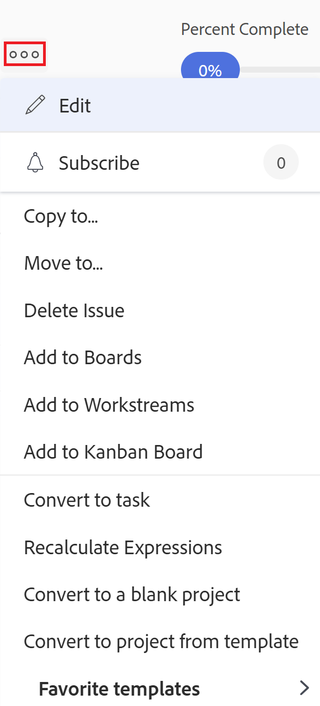

# Déplacer les problèmes

<!--Audited: 12/2024-->

<!--
The highlighted information on this page refers to functionality not yet generally available. It is available only in the Preview environment for all customers. After the release to Preview, the same features are also available monthly in the Production environment for customers who enabled fast releases.    

For information about fast releases, see [Enable or disable fast releases for your organization](/help/quicksilver/administration-and-setup/set-up-workfront/configure-system-defaults/enable-fast-release-process.md). 
-->

Vous pouvez déplacer des problèmes entre les objets suivants :

* D’un projet à un autre.
* D’une tâche à une autre dans le même projet ou dans un autre projet.
* D’une tâche au projet ou à un autre projet.
* D’un projet à une tâche dans le même projet ou à une tâche dans un autre projet.

## Conditions d’accès

+++ Développez pour afficher les exigences d’accès aux fonctionnalités de cet article. 

<table style="table-layout:auto"> 
 <col> 
 <col> 
 <tbody> 
  <tr> 
   <td role="rowheader">Package Adobe Workfront</td> 
   <td> 
Tous
 </td> 
  </tr> 
  <tr> 
   <td role="rowheader">Licence Adobe Workfront</td> 
   <td> 
   <ul><li>Contributeur ou supérieur</li>
   <li>Léger ou supérieur pour déplacer les problèmes dans la section Problèmes d’un projet</li></ul>
   Ou :
   <ul>   <li>
Requête ou supérieure
</li>
   <li>
Licence de révision ou une licence supérieure pour déplacer les problèmes dans la section Problèmes d’un projet.
</li></ul>   
     </td> 
  </tr> 
  <tr> 
   <td role="rowheader">Configurations des niveaux d’accès</td> 
   <td> 
Modifier l’accès aux problèmes
 
Affichage ou accès supérieur aux Projets et aux Tâches
 </td> 
  </tr> 
  <tr> 
   <td role="rowheader">Autorisations d’objet</td> 
   <td> 
Gérer les autorisations liées aux problèmes
 
Autorisations Contribuer à l’élément vers lequel vous déplacez le problème avec la possibilité d’ajouter des problèmes.</td> 
  </tr> 
 </tbody> 
</table>

*Pour plus d’informations, voir [Conditions d’accès dans la documentation de Workfront](/help/quicksilver/administration-and-setup/add-users/access-levels-and-object-permissions/access-level-requirements-in-documentation.md).

+++

<!--
Old:

<table style="table-layout:auto"> 
 <col> 
 <col> 
 <tbody> 
  <tr> 
   <td role="rowheader">Adobe Workfront plan</td> 
   <td> 
Any
 </td> 
  </tr> 
  <tr> 
   <td role="rowheader">Adobe Workfront license*</td> 
   <td> 
New:
 
   <ul><li>Contributor or higher</li>
   <li>Light or higher to move issues in the Issues section of a project</li></ul>
   
Current:

   <ul>
   <li>
Request or higher
</li>
   <li>
Review or higher license to move issues in the Issues section of a project.
</li></ul>   
     </td> 
  </tr> 
  <tr> 
   <td role="rowheader">Access level configurations</td> 
   <td> 
Edit access to Issues
 
View or higher access to Projects and Tasks
 </td> 
  </tr> 
  <tr> 
   <td role="rowheader">Object permissions</td> 
   <td> 
Manage permissions to the issue
 
Contribute permissions to the item where you are moving the issue with the ability to Add Issues.</td> 
  </tr> 
 </tbody> 
</table>
-->

## Remarques relatives au déplacement de problèmes

Tenez compte des points suivants lors du déplacement de problèmes qui contiennent des documents ou qui sont associés à une file d’attente des demandes :

* L’administrateur de votre système ou de votre groupe peut vous empêcher de déplacer des événements pour lesquels des heures ont été consignées, selon la manière dont il configure la préférence Autoriser les utilisateurs à déplacer les tâches et les événements pour lesquels des heures ont été consignées dans la zone Configuration. Pour plus d’informations, voir [Configurer les préférences de tâche et de problème à l’échelle du système](/help/quicksilver/administration-and-setup/set-up-workfront/configure-system-defaults/set-task-issue-preferences.md).

* **Lorsqu’un problème est associé à une file d’attente des demandes :** lorsque vous déplacez un problème vers un autre objet et qu’il est associé à une file d’attente des demandes, le problème déplacé n’est plus associé à la file d’attente d’origine de laquelle provenait le premier problème.
* **Lorsqu’un document est joint au problème :** lorsque vous déplacez un problème vers un autre objet et qu’un document lui est joint, le document, ses versions et ses épreuves sont également déplacés vers le nouveau problème. Les approbations associées au document ne sont pas déplacées.
* **Lorsqu’un problème est lié à un document ou à un dossier :** lorsque vous déplacez un problème dont les documents ou dossiers sont liés à un service tiers tel que Google Drive, les liens vers les documents sont déplacés avec le problème.
* **Lorsque vous déplacez des problèmes entre des projets avec différents types de stockage** : vous ne pouvez pas copier un problème d’un projet de stockage Workfront hérité vers un projet de stockage dans le cloud Adobe. Le contraire est également vrai. Votre instance Workfront peut ne pas avoir les deux types de stockage de documents.

  Pour plus d’informations, voir [Présentation de la gestion des documents pour les projets et les objets associés](/help/quicksilver/manage-work/projects/manage-projects/manage-documents-on-projects.md).

## Déplacer les problèmes dans une liste

Vous pouvez déplacer un ou plusieurs problèmes à partir d’une liste de problèmes ou d’un rapport de problèmes.

1. Accédez au projet contenant le ou les problèmes que vous souhaitez déplacer.

   Ou

   Accédez à un rapport de problèmes.

1. Si vous avez choisi d’accéder à un projet, cliquez sur **Problèmes** dans le panneau de gauche.
1. Sélectionnez le ou les problèmes que vous souhaitez déplacer, cliquez sur le **menu Plus** en haut de la liste des problèmes, puis sur **Déplacer vers**.

   

1. Continuez à déplacer les problèmes comme décrit dans la section [Déplacer un seul problème](#move-a-single-issue) en commençant par l’étape 2.

## Déplacer un seul problème {#move-a-single-issue}

Vous pouvez déplacer un problème lorsqu’il est affiché.

### Déplacer un seul problème

1. Accédez à un événement à déplacer, cliquez sur le menu **Plus**  à droite du nom de l’événement, puis cliquez sur **Déplacer vers**.

   

   La zone **Déplacer le problème** s’affiche.

   

1. Dans la section **Sélectionner le projet de destination**, indiquez le nom du projet dans lequel vous souhaitez déplacer les problèmes. Le nom du projet actuel s’affiche par défaut.

   >[!TIP]
   >
   >Seuls 100 projets s’affichent dans la liste.

1. (Le cas échéant) Cliquez sur **Demander l’accès** si vous n’avez pas accès au déplacement des problèmes vers le projet.
1. (Le cas échéant) Continuez à déplacer le problème sur le projet de destination sélectionné sans demander l’accès si vous disposez de l’accès à l’une de ses tâches.

   

   >[!TIP]
   >
   >Des messages similaires s’affichent si le projet sélectionné est en attente d’approbation, terminé ou immobilisé, lorsque l’administration de Workfront empêche l’ajout de problèmes à ces projets. Pour plus d’informations, voir [Configurer les préférences de projet à l’échelle du système](../../../administration-and-setup/set-up-workfront/configure-system-defaults/set-project-preferences.md).

1. (Facultatif) Dans la section **Options**, désélectionnez les éléments voulus répertoriés dans le tableau ci-dessous pour les supprimer du problème déplacé. Toutes les options sont sélectionnées par défaut.

   >[!IMPORTANT]
   >
   >La désélection d’éléments dans la liste des options entraîne une perte de données. Les informations du problème existant seront supprimées et ne pourront pas être récupérées.

   <table style="table-layout:auto"> 
    <col> 
    <col> 
    <tbody> 
     <tr> 
      <td role="rowheader">Sélectionner tout</td> 
      <td>Désélectionnez cette option pour supprimer toutes les informations du problème lorsque vous le déplacez vers son nouvel emplacement. </td> 
     </tr> 
     <tr> 
      <td role="rowheader">Affectations</td> 
      <td>Supprime les personnes, les fonctions ou les équipes affectées au problème.</td> 
     </tr> 
     <tr> 
      <td role="rowheader">Progression</td> 
      <td>Supprime le pourcentage terminé, le cas échéant, du problème. </td> 
     </tr> 
     <tr> 
      <td role="rowheader">
Documents
</td> 
      <td> 
Supprime tous les éléments de l’onglet Documents, y compris les versions de documents, les documents liés et les dossiers.

   <b>NOTE</b>

   Si vous choisissez de ne pas déplacer les documents avec le problème, ceux-ci seront supprimés et placés dans la corbeille pendant 30 jours. Un administrateur ou une administratrice peut les restaurer et ils réapparaîtront sur le problème déplacé.

   Si le problème est supprimé après son déplacement, les documents restaurés sont placés dans la zone Documents de la page de l’utilisateur ou de l’utilisatrice de l’administrateur ou l’administratrice qui les restaure.
     
 </td>
   </tr> 
     <tr> 
      <td role="rowheader">Autorisations</td> 
      <td>Supprime les entités avec lesquelles le problème est partagé. </td> 
     </tr> 
     <tr> 
      <td role="rowheader">Mises à jour</td> 
      <td>Supprime les commentaires de la section Mises à jour du problème.</td> 
     </tr> 
    </tbody> 
   </table>

1. (Facultatif) Dans la section **Sélectionner une tâche**, sélectionnez la tâche dans laquelle vous souhaitez déplacer le problème.
1. Cliquez sur **Déplacer le problème** ou **Déplacer les problèmes**, si vous avez sélectionné plusieurs problèmes dans une liste.

   Les problèmes déplacés sont ajoutés au projet spécifié.

