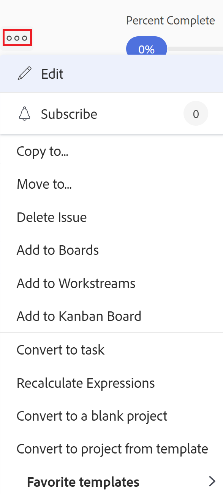

# Déplacer les problèmes

Vous pouvez déplacer des problèmes entre les objets suivants :

* D’un projet à un autre
* d’une tâche à une autre tâche dans le même projet ou dans un autre projet ;
* d’une tâche au projet ou à un autre projet ;
* d’un projet à une tâche dans le même projet ou à une tâche dans un autre projet ;

## Exigences d’accès

Vous devez disposer des accès suivants pour effectuer les étapes de cet article :

<table style="table-layout:auto"> 
 <col> 
 <col> 
 <tbody> 
  <tr> 
   <td role="rowheader">Formule Adobe Workfront*</td> 
   <td> 
Tous
 </td> 
  </tr> 
  <tr> 
   <td role="rowheader">Licence Adobe Workfront*</td> 
   <td> 
Requête ou supérieure
 
Passez en revue la licence ou une licence supérieure pour déplacer les problèmes dans la section Problèmes d’un projet.
 </td> 
  </tr> 
  <tr> 
   <td role="rowheader">Paramétrages du niveau d'accès*</td> 
   <td> 
Modifier l’accès aux problèmes
 
Affichage ou accès supérieur à Projets et tâches
 
Remarque : Si vous n’avez toujours pas accès à , demandez à votre administrateur Workfront s’il définit des restrictions supplémentaires à votre niveau d’accès. Pour plus d’informations sur l’accès aux problèmes de votre niveau d’accès, voir <a href="../../../administration-and-setup/add-users/configure-and-grant-access/grant-access-issues.md" class="MCXref xref">Accorder l’accès aux problèmes</a>. Pour plus d’informations sur la façon dont un administrateur Workfront peut modifier votre niveau d’accès, voir <a href="../../../administration-and-setup/add-users/configure-and-grant-access/create-modify-access-levels.md" class="MCXref xref">Création ou modification de niveaux d’accès personnalisés</a>. 
 </td> 
  </tr> 
  <tr> 
   <td role="rowheader">Autorisations d’objet</td> 
   <td> 
Gestion des autorisations liées au problème
 
Attribuez des autorisations à l’élément sur lequel vous déplacez le problème en lui permettant d’ajouter des problèmes.
 
 Pour plus d’informations sur l’octroi d’autorisations aux problèmes, voir <a href="../../../workfront-basics/grant-and-request-access-to-objects/share-an-issue.md" class="MCXref xref">Partage d’un problème </a>
 
Pour plus d’informations sur la demande d’autorisations supplémentaires, voir <a href="../../../workfront-basics/grant-and-request-access-to-objects/request-access.md" class="MCXref xref">Demande d’accès aux objets </a>.
 </td> 
  </tr> 
 </tbody> 
</table>

*Pour connaître le plan, le type de licence ou l’accès dont vous disposez, contactez votre administrateur Workfront.

## Considérations sur les problèmes de déplacement

Tenez compte des points suivants lors du déplacement des problèmes qui contiennent des documents ou qui sont associés à une file d’attente de demandes :

* **Lorsqu’un problème est associé à une file d’attente de demandes :** Lorsque vous déplacez un problème vers un autre objet et qu’il est associé à une file d’attente de demandes, le problème déplacé n’est plus associé à la file d’attente d’origine du premier problème.
* **Lorsqu’un document est joint au problème :** Lorsque vous déplacez un problème vers un autre objet et qu’un document lui est associé, le document, ses versions et ses bons à tirer passent également au nouveau problème. Les validations associées au document ne sont pas déplacées.
* **Lorsqu’un problème est lié à un document ou à un dossier :** Lorsque vous déplacez un problème dont les documents ou dossiers sont liés à un service tiers comme Google Drive, les liens vers les documents se déplacent avec le problème.

## Déplacer des problèmes dans une liste

Vous pouvez déplacer un ou plusieurs problèmes d’une liste de problèmes ou d’un rapport de problèmes.

1. Accédez au projet contenant le ou les problèmes que vous souhaitez déplacer.

   Ou

   Accédez à un rapport de problèmes.

1. Si vous avez choisi d’accéder à un projet, cliquez sur **Problèmes** dans le panneau de gauche.
1. Sélectionnez le ou les problèmes que vous souhaitez déplacer, puis cliquez sur le bouton **Plus de menu** en haut de la liste des problèmes, puis cliquez sur **Déplacer vers**.

   

1. Passez au problème, comme décrit dans la section . [Déplacer un seul problème](#move-a-single-issue) commençant par l’étape 2.

   <!--
   <MadCap:conditionalText data-mc-conditions="QuicksilverOrClassic.Draft mode">
   (NOTE: ensure step stays accurate)
   </MadCap:conditionalText>
   -->

## Déplacer un seul problème {#move-a-single-issue}

Vous pouvez déplacer un problème lors de son affichage.

### Déplacer un seul problème dans l’environnement Aperçu

1. Accédez à un problème que vous souhaitez copier, puis cliquez sur le bouton **Plus** menu à droite du nom du problème, puis sélectionnez **Déplacer** à .

   

   Le **Problème de déplacement** s’affiche.

   

1. Dans le **Sélectionner le projet de destination** , indiquez le nom du projet dans lequel vous souhaitez déplacer les problèmes. Le nom du projet actif s’affiche par défaut.

   >[!TIP]
   >
   >Seuls 100 projets s’affichent dans la liste.

1. (Conditionnel) Cliquez sur **accès aux demandes** si vous n’avez pas accès au déplacement des problèmes vers le projet.
1. (Conditionnel) Continuez à déplacer le problème sur le projet de destination sélectionné sans demander l’accès si vous avez accès à l’une des tâches du projet de destination.

   

   >[!TIP]
   >
   >Des messages similaires s’affichent si le projet sélectionné est en attente d’approbation, terminé ou mort, lorsque l’administrateur de Workfront empêche l’ajout de problèmes à ces projets. Pour plus d’informations, voir [Configuration des préférences de projet à l’échelle du système](../../../administration-and-setup/set-up-workfront/configure-system-defaults/set-project-preferences.md).

1. (Facultatif) Dans le **Options** désélectionnez l’un des éléments répertoriés dans le tableau ci-dessous pour les supprimer du problème déplacé. Toutes les options sont sélectionnées par défaut.

   >[!IMPORTANT]
   >
   >La désélection d’éléments dans la liste Options entraîne une perte de données. Les informations du problème existant seront supprimées et ne pourront pas être récupérées.

   <table style="table-layout:auto"> 
    <col> 
    <col> 
    <tbody> 
     <tr> 
      <td role="rowheader">Sélectionner tout</td> 
      <td>Désélectionnez cette option pour supprimer toutes les informations du problème lorsque vous les déplacez vers leur nouvel emplacement. </td> 
     </tr> 
     <tr> 
      <td role="rowheader">Affectations</td> 
      <td>Supprime les utilisateurs, les rôles de tâche ou les équipes affectés au problème.</td> 
     </tr> 
     <tr> 
      <td role="rowheader">Progression</td> 
      <td>Supprime le pourcentage de réussite, le cas échéant, du problème. </td> 
     </tr> 
     <tr> 
      <td role="rowheader">
Documents
</td> 
      <td> 
supprime tous les éléments de l’onglet documents, y compris les versions de documents, les documents liés et les dossiers.

   <b>NOTE</b>

   Si vous choisissez de ne pas déplacer les documents avec le problème, ceux-ci seront supprimés et placés dans la Corbeille pendant 30 jours. Un administrateur peut les restaurer et ils seront restaurés sur le problème déplacé.

   Si le problème est supprimé après son déplacement, les documents restaurés sont placés dans la zone Documents de la page utilisateur de l’administrateur qui les restaure.
     
 </td>
   </tr> 
     <tr> 
      <td role="rowheader">Autorisations</td> 
      <td>Supprime les entités avec lesquelles le problème est partagé. </td> 
     </tr> 
     <tr> 
      <td role="rowheader">Mises à jour</td> 
      <td>Supprime les commentaires de la section Mises à jour du problème.</td> 
     </tr> 
    </tbody> 
   </table>

1. (Facultatif) Dans le **Sélectionner une tâche** , sélectionnez la tâche dans laquelle vous souhaitez déplacer le problème.
1. Cliquez sur **Problème de déplacement** ou **Problèmes de déplacement**, si vous avez sélectionné plusieurs problèmes dans une liste.

   Les problèmes déplacés sont ajoutés au projet spécifié.

