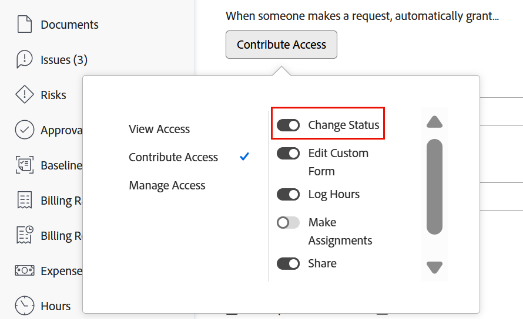

# Mettre à jour automatiquement les statuts des problèmes de Commentaires en attente à En cours.

<!--Audited: 109/2025-->

Lorsque le contact principal d’un problème effectue une mise à jour du problème en mettant à jour un champ (y compris un champ personnalisé) ou en ajoutant un commentaire, le statut du problème est automatiquement mis à jour vers En cours.

Pour que ce changement d’état automatique se produise, les éléments suivants sont requis :

* Le problème doit être ajouté à l’aide d’une file d’attente de demandes.

  Pour plus d’informations sur la création de files d’attente des demandes, consultez la section [Créer et gérer des files d’attente des demandes](../../../manage-work/requests/create-and-manage-request-queues/create-manage-request-queues.md).

  Pour plus d’informations sur l’envoi de demandes à une file d’attente des demandes, voir [Création et envoi de demandes Adobe Workfront](../../../manage-work/requests/create-requests/create-submit-requests.md).

* Les détails de la file d’attente des demandes doivent avoir les paramètres suivants :
   * **Lorsqu’une personne émet une demande, il lui est automatiquement accordé** un **Accès en contribution**
   * **Modifier le statut** est sélectionné

  

  >[!IMPORTANT]
  >
  >  Lors de la configuration d’une file d’attente de demandes, vous pouvez définir l’accès des contacts principaux aux problèmes qu’ils envoient.
  >
  >Lorsque vous désélectionnez le paramètre Modifier le statut lorsque vous configurez la file d’attente des demandes, gardez à l’esprit que les administrateurs et les administratrices système disposent toujours de l’accès leur permettant de modifier le statut des problèmes, même si l’option Modifier le statut est désélectionnée dans les paramètres de la file d’attente des demandes.

  Pour plus d’informations sur les détails de la file d’attente, consultez [Créer une file d’attente des demandes](../../../manage-work/requests/create-and-manage-request-queues/create-request-queue.md).

* Le problème doit avoir le statut En attente de feedback.
* Un statut En attente de feedback doit être disponible pour les problèmes au niveau du système.

  Pour plus d’informations sur les statuts au niveau du système, voir [Créer ou modifier un statut](../../../administration-and-setup/customize-workfront/creating-custom-status-and-priority-labels/create-or-edit-a-status.md).
