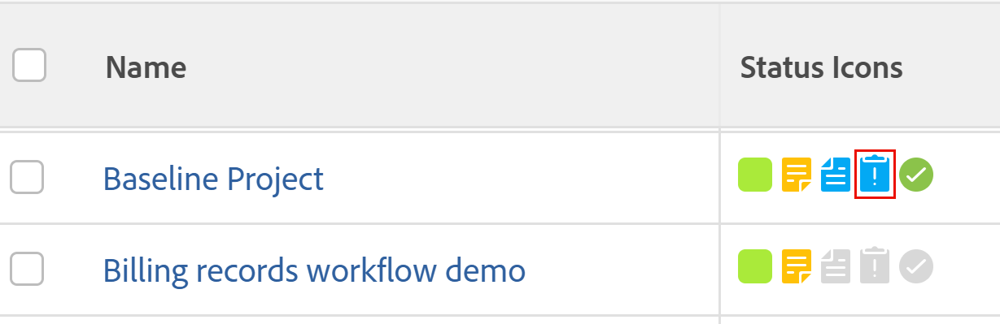

# Afficher les problèmes

Vous pouvez afficher les problèmes associés à un projet, une tâche ou une itération.

## Conditions d’accès

Vous devez disposer des accès suivants pour effectuer les étapes de cet article :

<table style="table-layout:auto"> 
 <col> 
 <col> 
 <tbody> 
  <tr> 
   <td role="rowheader">Forfait Adobe Workfront*</td> 
   <td> 
N’importe quelle
 </td> 
  </tr> 
  <tr> 
   <td role="rowheader">Licence Adobe Workfront*</td> 
   <td> 
Requête ou supérieure
 
Passez en revue la licence ou une licence supérieure pour afficher les problèmes dans la section Problèmes d’un projet.
 </td> 
  </tr> 
  <tr> 
   <td role="rowheader">Configurations des niveau d’accès*</td> 
   <td> 
Afficher l’accès aux problèmes
 
Affichage ou accès supérieur à Projets et tâches
 
Remarque : si vous n’avez toujours pas d’accès, demandez à votre équipe d’administration Workfront s’il existe des restrictions supplémentaires à votre niveau d’accès. Pour plus d’informations sur l’accès aux problèmes de votre niveau d’accès, voir <a href="../../../administration-and-setup/add-users/configure-and-grant-access/grant-access-issues.md" class="MCXref xref">Accorder l’accès aux problèmes</a>. Pour plus d’informations sur la façon dont un administrateur ou une administratrice de Workfront peut modifier votre niveau d’accès, voir <a href="../../../administration-and-setup/add-users/configure-and-grant-access/create-modify-access-levels.md" class="MCXref xref">Créer ou modifier les niveaux d’accès personnalisés</a>. 
 </td> 
  </tr> 
  <tr> 
   <td role="rowheader">Autorisations d’objet</td> 
   <td> 
Afficher les autorisations pour le problème
 
 Pour plus d’informations sur l’octroi d’autorisations pour les problèmes, voir <a href="../../../workfront-basics/grant-and-request-access-to-objects/share-an-issue.md" class="MCXref xref">Partage d’un problème </a>
 
Pour plus d'informations sur la demande d'autorisations supplémentaires, voir <a href="../../../workfront-basics/grant-and-request-access-to-objects/request-access.md" class="MCXref xref">Demande d'accès aux objets </a>.
 </td> 
  </tr> 
 </tbody> 
</table>

&#42;Pour connaître le forfait, le type de licence ou l’accès dont vous disposez, contactez votre administrateur ou administratrice Workfront.

## Afficher les problèmes en fonction de l’état

Pour afficher les problèmes sur un projet, une tâche ou une itération :

1. Ouvrez un projet, une tâche ou une itération contenant des problèmes, puis cliquez sur **Problèmes** dans le panneau de gauche.

1. Pour afficher tous les problèmes, ouverts ou fermés, cliquez sur l’un des filtres répertoriés ci-dessous dans le menu déroulant **Filtre** .

>[!TIP]
>
>La liste des filtres varie en fonction de ce que votre administrateur système ou groupe a choisi d’afficher dans celui-ci.

* **Ouvrir :** affiche les problèmes qui sont ouverts.

  Cela inclut les personnes associées à un objet de résolution et celles dont l’état Fermé - En attente d’approbation est .

  Pour plus d’informations sur la résolution d’objets, voir [Présentation de la résolution et de la résolution d’objets résolvables](../../../manage-work/issues/convert-issues/resolving-and-resolvable-objects.md).

* **Terminé :** affiche tous les problèmes qui présentent une date d’achèvement réelle.
* **Tous** affiche tous les problèmes.

## Comprendre les informations relatives aux problèmes

Vous pouvez afficher des informations sur un problème lorsque vous y accédez.

Pour accéder à un problème et afficher les informations le concernant :

1. Ouvrez un projet, une tâche ou une itération contenant des problèmes, puis cliquez sur **Problèmes** dans le panneau de gauche.
1. Dans le menu déroulant **Filtre** , sélectionnez le filtre pour afficher les problèmes que vous essayez d’afficher.

   Sélectionnez l’une des options suivantes :

   * Ouvertes
   * Terminé
   * Tout

1. Cliquez sur le nom d’un problème.

   Lorsque vous disposez des autorisations de gestion pour le problème, vous pouvez modifier n’importe quel champ modifiable dans le problème et ajouter des approbations, heures ou documents au problème.

1. Dans le panneau de gauche, cliquez sur l’un des éléments suivants pour afficher plus d’informations sur le problème :

* **Mises à jour** : vous pouvez effectuer les actions suivantes :

   * Commenter sur le problème ou répondre à un commentaire existant.
   * Temps de journalisation.
   * Modifiez l’état du problème.

     Pour plus d’informations sur la mise à jour du travail dans Workfront, voir [Mise à jour du travail](/help/quicksilver/workfront-basics/updating-work-items-and-viewing-updates/update-work.md).

* **Documents** : joindre des documents au problème. Pour plus d’informations sur l’ajout de documents à Workfront, voir [Ajout de documents à Adobe Workfront à partir de votre système de fichiers](../../../documents/adding-documents-to-workfront/add-documents-from-file-system.md).

* **Détails du problème** : développez ce lien pour afficher les zones **Aperçu** et **Forms personnalisée**.

  Si vous disposez des autorisations de gestion pour le problème et que vous modifiez les droits sur le formulaire personnalisé, vous pouvez modifier certaines des informations ici.

  Affichez ou modifiez les champs suivants dans la zone **Overview** :

   * **Nom**
   * **Chemin** : chemin par lequel le problème a été consigné dans le projet.

     Si un problème a été envoyé en tant que requête dans une file d’attente de requêtes, les noms du projet, du groupe de rubriques et de la rubrique de la file d’attente sont répertoriés ici. Ce champ ne peut pas être modifié.

     Pour plus d’informations sur l’envoi de demandes, consultez la section [Créer et envoyer des demandes Adobe Workfront](../../../manage-work/requests/create-requests/create-submit-requests.md).

   * **Description**
   * **URL** : toute adresse Web relative au problème.
   * **Priorité** : indicateur visuel qui vous permet de hiérarchiser les problèmes.
   * **Severity** : indicateur visuel indiquant la gravité du problème décrit dans le problème.
   * **Contact de Principal** : le contact de Principal par défaut est l’utilisateur qui a créé le problème. Ce champ peut être édité.
   * **Heures planifiées** : affiche le temps nécessaire à quelqu’un pour terminer le problème. La valeur par défaut est de 8 heures. Ce champ peut être édité.
   * **Heures réelles** : affiche le temps nécessaire pour terminer le problème. Il s’agit du temps réel pendant lequel quelqu’un consigne le problème.
   * **Date de début planifiée** : date de début prévue du problème. La valeur par défaut est la date et l’heure auxquelles le problème a été créé.
   * **Date de début réelle** : date et heure auxquelles l’état du problème a été remplacé par En cours.
   * **Date d’achèvement prévue** : date à laquelle le problème doit être terminé.
   * **Date d’achèvement réelle** : date à laquelle le problème est réellement terminé. Ce champ est renseigné automatiquement lorsque l’état du problème passe à Fermé ou Résolu, ou peut être modifié manuellement.
   * **Coût réel** : coût basé sur les heures réelles connectées sur le problème. Ce champ n’est pas modifiable. Le coût réel d’une publication est calculé à partir de la formule suivante, où le taux de coût utilisateur est le taux de coût associé à l’utilisateur qui enregistre le temps jusqu’au problème :

     Problème Coût réel = Heures consignées * Taux de coût utilisateur

   * **Entré par** : il s’agit de l’utilisateur qui a créé le problème. Ce champ n’est pas modifiable.
   * **Dernière mise à jour par** : il s’agit de l’utilisateur qui a mis à jour en dernier un champ sur le problème. Ce champ n’est pas modifiable.

     Dans la zone **Forms personnalisée** , la vue de sélectionner un ou plusieurs formulaires personnalisés à associer au problème.

* **Hours** : affiche une liste d’entrées d’heure sur le problème.
* **Validations :** affiche les chemins d’approbation associés au problème.

  Pour plus d&#39;informations sur l&#39;association des approbations à un problème, consultez la section [Associer un processus d&#39;approbation à un élément de travail](../../../administration-and-setup/customize-workfront/configure-approval-milestone-processes/create-approval-processes.md#associating-the-approval-process-with-an-object) dans [Créer un processus d&#39;approbation pour les éléments de travail](../../../administration-and-setup/customize-workfront/configure-approval-milestone-processes/create-approval-processes.md).

## Afficher les projets et les tâches ayant des problèmes

Vous pouvez ajouter des icônes dans la vue d’un projet, d’un rapport de tâche ou d’une liste pour indiquer si des problèmes sont associés. L’ajout d’icônes à l’affichage d’un rapport ou d’une liste est similaire pour les projets et les tâches.

Pour ajouter des icônes qui indiquent si un projet présente des problèmes dans un rapport de projet :

1. Cliquez sur l’icône **Menu principal**  dans le coin supérieur droit d’Adobe Workfront.
1. Cliquez sur **Reporting** > **Nouveau rapport** > **Rapport de projet**.
1. Dans le champ **Afficher dans cette colonne** , commencez à saisir **Icônes d’état**, puis sélectionnez-le lorsqu’il apparaît dans la liste.

1. Cliquez sur **Enregistrer + Fermer** .

   Les icônes de problème s’affichent sur les projets présentant des problèmes dans la colonne **Icônes d’état**.

   
