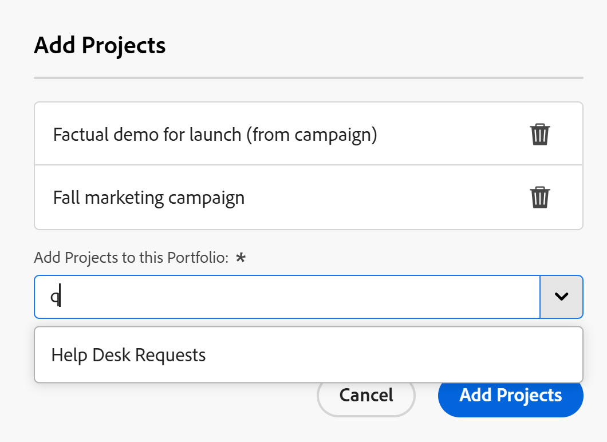

# Ajouter des projets à un portfolio

<!--Audited: 5/2025-->

<!--The highlighted information on this page refers to functionality not yet generally available. It is available only in the Preview environment for all customers. The same features will also be available in the Production environment for all customers after a week from the Preview release.    

For more information, see [Interface modernization](/help/quicksilver/product-announcements/product-releases/interface-modernization/interface-modernization.md). -->

Nous vous recommandons d’ajouter des projets aux portfolios lorsque vous les lancez. Cependant, vous pouvez les ajouter à un portfolio à tout moment de leur durée de vie.

Tenez compte des éléments suivants lorsque vous ajoutez des projets aux portfolios :

* Bien qu’un portfolio puisse contenir un nombre illimité de projets, vous ne pouvez associer qu’un seul portfolio à un projet.
* Un projet reste dans un portfolio jusqu’à ce qu’il soit supprimé ou associé à un autre portfolio.

## Conditions d’accès

+++ Développez pour afficher les exigences d’accès aux fonctionnalités de cet article.

<table style="table-layout:auto"> 
 <col> 
 <col> 
 <tbody> 
  <tr> 
   <td role="rowheader">[!DNL Adobe Workfront] plan</td> 
   <td> 
Tous

   </td> 
  </tr> 
  <tr> 
   <td role="rowheader">[!DNL Adobe Workfront] licence*</td> 
   <td>
Nouveau : Standard
 
   
Actuelle : [!UICONTROL Plan] 
 </td> 
  </tr> 
  <tr> 
   <td role="rowheader">Niveau d’accès</td> 
   <td> 
Portefeuilles d'accès [!UICONTROL Edit]
 
[!UICONTROL Edit] l’accès aux Projets
 </td> 
  </tr> 
  <tr> 
   <td role="rowheader">Autorisations d’objet</td> 
   <td> 
Autorisations [!UICONTROL Manage] pour le portfolio
 
[!UICONTROL Manage] les permissions des projets
  </td> 
  </tr> 
 </tbody> 
</table>

*Pour plus d’informations, voir [Conditions d’accès dans la documentation de Workfront](/help/quicksilver/administration-and-setup/add-users/access-levels-and-object-permissions/access-level-requirements-in-documentation.md).

+++

## Ajouter un projet à un portfolio

1. Accédez à un portfolio, puis cliquez sur **[!UICONTROL Projets]** dans le panneau de gauche.

   

1. Cliquez sur **[!UICONTROL Nouveau projet]** et sélectionnez une méthode pour ajouter un projet.

   >[!TIP]
   >
   >Vous ne pouvez pas ajouter de projet lorsque vous affichez la liste des projets dans la vue [!UICONTROL Jalon].

   Sélectionnez l’une des options suivantes :

   <table style="table-layout:auto"> 
    <col> 
    <col> 
    <tbody> 
     <tr> 
      <td role="rowheader">[!UICONTROL Existing Project]</td> 
      <td> 
Ajoutez un projet déjà créé.
 </td> 
     </tr> 
     <tr> 
      <td role="rowheader">[!UICONTROL New Project]</td> 
      <td> 
Ajoutez un nouveau projet. 
 
Pour plus d’informations sur la création d’un nouveau projet, consultez la section <a href="../../../manage-work/projects/create-projects/create-project.md" class="MCXref xref">Créer un projet</a>.
 </td> 
     </tr> 
     <tr> 
      <td role="rowheader">[!UICONTROL Import a Project from [!DNL MS Project]] </td> 
      <td> 
Ajoutez un projet que vous avez précédemment exporté depuis [!DNL MS Project] et que vous avez enregistré sur votre ordinateur. 
 
Pour plus d’informations sur la création d’un nouveau projet en l’important à partir de [!DNL Microsoft Project], consultez la section <a href="../../../manage-work/projects/create-projects/import-project-from-ms-project.md" class="MCXref xref">Importer un projet à partir de [!DNL Microsoft Project]</a>.
 </td> 
     </tr> 
     <tr> 
      <td role="rowheader">[!UICONTROL Request Project]</td> 
      <td> 
Demander l’approbation d’un projet.
 
Pour plus d’informations sur les demandes de projets, consultez la section <a href="../../../manage-work/projects/create-projects/request-project.md">Demander un projet</a>. 
 </td> 
     </tr> 
     <tr> 
      <td role="rowheader">[!UICONTROL New from Template]</td> 
      <td> 
Ajouter un nouveau projet en utilisant un modèle existant. 
 
Pour plus d’informations sur la création d’un projet à partir d’un modèle, consultez la section <a href="../../../manage-work/projects/create-projects/create-project-from-template.md" class="MCXref xref">Créer un projet à l’aide d’un modèle</a>.
 </td> 
     </tr> 
    </tbody> 
   </table>

   

1. (Conditionnel) Si vous avez choisi d’ajouter un projet existant, la boîte de dialogue **Ajouter des projets** s’ouvre. <!--check this after UI changes-->

    <!--check this after UI changes-->

1. Commencez à saisir le nom d’un projet dans le champ **[!UICONTROL Ajouter des projets à ce Portfolio]**, puis cliquez dessus lorsqu’ils apparaissent dans la liste.  <!--check this after UI changes-->

   Vous pouvez ajouter plusieurs projets.

1. (Facultatif) Cliquez sur l’icône **X** à droite du nom du projet pour le supprimer de la liste, si vous décidez de ne pas l’ajouter au portfolio.

   <!--replace last step with this, for unshim: 1. (Optional) Click the **Delete** icon  next to the name of a project if you decide not to add it to the portfolio.-->

1. Cliquez sur **[!UICONTROL Ajouter des projets]**. <!--check this after UI changes-->

   Le ou les projets sélectionnés sont désormais associés au portfolio.
