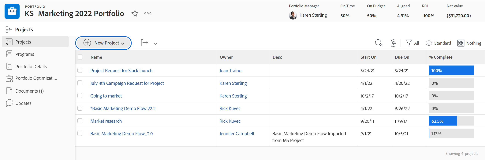
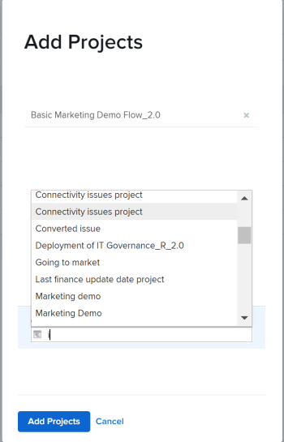

# Ajouter des projets à un portfolio

<!--Audited: 7/2024-->

Nous vous recommandons d’ajouter des projets aux portfolios lorsque vous les lancez. Cependant, vous pouvez les ajouter à un portfolio à tout moment de leur durée de vie.

Tenez compte des éléments suivants lorsque vous ajoutez des projets aux portfolios :

* Bien qu’un portfolio puisse contenir un nombre illimité de projets, vous ne pouvez associer qu’un seul portfolio à un projet.
* Un projet reste dans un portfolio jusqu’à ce qu’il soit supprimé ou associé à un autre portfolio.

## Conditions d’accès

+++ Développez pour afficher les exigences d’accès aux fonctionnalités de cet article.

<table style="table-layout:auto"> 
 <col> 
 <col> 
 <tbody> 
  <tr> 
   <td role="rowheader">[!DNL Adobe Workfront] plan</td> 
   <td> 
Tous

   </td> 
  </tr> 
  <tr> 
   <td role="rowheader">[!DNL Adobe Workfront] licence*</td> 
   <td>
Nouveau : Standard
 
   
Actuelle : [!UICONTROL Plan] 
 </td> 
  </tr> 
  <tr> 
   <td role="rowheader">Niveau d’accès</td> 
   <td> 
Portefeuilles d'accès [!UICONTROL Edit]
 
[!UICONTROL Edit] l’accès aux Projets
 </td> 
  </tr> 
  <tr> 
   <td role="rowheader">Autorisations d’objet</td> 
   <td> 
Autorisations [!UICONTROL Manage] pour le portfolio
 
[!UICONTROL Manage] les permissions des projets
  </td> 
  </tr> 
 </tbody> 
</table>

*Pour plus d’informations, voir [Conditions d’accès dans la documentation de Workfront](/help/quicksilver/administration-and-setup/add-users/access-levels-and-object-permissions/access-level-requirements-in-documentation.md).

+++

## Ajouter un projet à un portfolio

1. Accédez à un portfolio, puis cliquez sur **[!UICONTROL Projets]** dans le panneau de gauche.

   

1. Cliquez sur **[!UICONTROL Nouveau projet]** et sélectionnez une méthode pour ajouter un projet.

   >[!TIP]
   >
   >Vous ne pouvez pas ajouter de projet lorsque vous consultez la liste des projets dans la vue [!UICONTROL Jalon].

   Sélectionnez l’une des options suivantes :

   <table style="table-layout:auto"> 
    <col> 
    <col> 
    <tbody> 
     <tr> 
      <td role="rowheader">[!UICONTROL Existing Project]</td> 
      <td> 
Ajoutez un projet déjà créé.
 </td> 
     </tr> 
     <tr> 
      <td role="rowheader">[!UICONTROL New Project]</td> 
      <td> 
Ajoutez un nouveau projet. 
 
Pour plus d’informations sur la création d’un nouveau projet, consultez la section <a href="../../../manage-work/projects/create-projects/create-project.md" class="MCXref xref">Créer un projet</a>.
 </td> 
     </tr> 
     <tr> 
      <td role="rowheader">[!UICONTROL Import a Project from [!DNL MS Project]] </td> 
      <td> 
Ajoutez un projet que vous avez précédemment exporté depuis [!DNL MS Project] et que vous avez enregistré sur votre ordinateur. 
 
Pour plus d’informations sur la création d’un nouveau projet en l’important à partir de [!DNL Microsoft Project], consultez la section <a href="../../../manage-work/projects/create-projects/import-project-from-ms-project.md" class="MCXref xref">Importer un projet à partir de [!DNL Microsoft Project]</a>.
 </td> 
     </tr> 
     <tr> 
      <td role="rowheader">[!UICONTROL Request Project]</td> 
      <td> 
Demander l’approbation d’un projet.
 
Pour plus d’informations sur les demandes de projets, consultez la section <a href="../../../manage-work/projects/create-projects/request-project.md">Demander un projet</a>. 
 </td> 
     </tr> 
     <tr> 
      <td role="rowheader">[!UICONTROL New from Template]</td> 
      <td> 
Ajouter un nouveau projet en utilisant un modèle existant. 
 
Pour plus d’informations sur la création d’un projet à partir d’un modèle, consultez la section <a href="../../../manage-work/projects/create-projects/create-project-from-template.md" class="MCXref xref">Créer un projet à l’aide d’un modèle</a>.
 </td> 
     </tr> 
    </tbody> 
   </table>

   

1. (Le cas échéant) Si vous avez choisi d’ajouter un projet existant, commencez à taper son nom dans la zone **[!UICONTROL Ajouter des projets]**, puis cliquez sur les projets lorsqu’ils apparaissent dans la liste. Vous pouvez ajouter plusieurs projets à la fois.

   

1. Cliquez sur **[!UICONTROL Ajouter des projets]**.

   Le ou les projets sélectionnés sont désormais associés au portfolio.
