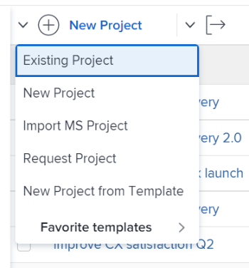

# Ajouter des projets à un portfolio

<!--Audited: 7/2024-->

Nous vous recommandons d’ajouter des projets aux portefeuilles lorsque vous les lancez. Vous pouvez toutefois les ajouter à un portfolio à tout moment de leur vie.

Tenez compte des points suivants lors de l’ajout de projets à des portefeuilles :

* Bien qu’un portfolio puisse contenir un nombre illimité de projets, vous ne pouvez associer qu’un seul portfolio à un projet.
* Un projet reste dans un portfolio jusqu’à ce qu’il soit supprimé ou associé à un autre portfolio.

## Conditions d’accès

+++ Développez pour afficher les exigences d’accès aux fonctionnalités de cet article.

<table style="table-layout:auto"> 
 <col> 
 <col> 
 <tbody> 
  <tr> 
   <td role="rowheader">[!DNL Adobe Workfront] plan</td> 
   <td> 
N’importe quelle
 </td> 
  </tr> 
  <tr> 
   <td role="rowheader">[!DNL Adobe Workfront] licence*</td> 
   <td>
Nouvelle : standard
 
   
Actuel :[!UICONTROL Plan] 
 </td> 
  </tr> 
  <tr> 
   <td role="rowheader">Configurations du niveau d’accès</td> 
   <td> 
Accès à [!UICONTROL Affichage] à Portfolio ou à une version ultérieure
 
Accès à [!UICONTROL Modifier] dans Projets
 </td> 
  </tr> 
  <tr> 
   <td role="rowheader">Autorisations d’objet</td> 
   <td> 
Autorisations [!UICONTROL Afficher] pour le portfolio
 
Autorisations [!UICONTROL Gérer] pour les projets
  </td> 
  </tr> 
 </tbody> 
</table>

*Pour plus d’informations, voir [Exigences d’accès dans la documentation Workfront](/help/quicksilver/administration-and-setup/add-users/access-levels-and-object-permissions/access-level-requirements-in-documentation.md).

+++

## Ajout d’un projet à un portfolio

1. Accédez à un portfolio, puis cliquez sur **[!UICONTROL Projets]** dans le panneau de gauche.

   

1. Cliquez sur **[!UICONTROL Nouveau projet]** et sélectionnez une méthode pour ajouter un projet.

   >[!TIP]
   >
   >Vous ne pouvez pas ajouter de projet lorsque vous affichez la liste des projets dans la vue [!UICONTROL Milestone].

   Sélectionnez l’une des options suivantes :

   <table style="table-layout:auto"> 
    <col> 
    <col> 
    <tbody> 
     <tr> 
      <td role="rowheader">[!UICONTROL Projet existant]</td> 
      <td> 
Ajoutez un projet qui a déjà été créé.
 </td> 
     </tr> 
     <tr> 
      <td role="rowheader">[!UICONTROL Nouveau projet]</td> 
      <td> 
Ajoutez un nouveau projet. 
 
Pour plus d’informations sur la création d’un projet, voir <a href="../../../manage-work/projects/create-projects/create-project.md" class="MCXref xref">Création d’un projet</a>. 
 </td> 
     </tr> 
     <tr> 
      <td role="rowheader">[!UICONTROL Importer un projet depuis [!DNL MS Project]] </td> 
      <td> 
Ajoutez un projet précédemment exporté depuis [!DNL MS Project] et enregistré sur votre ordinateur. 
 
Pour plus d'informations sur la création d'un projet en l'important à partir de [!DNL Microsoft Project], voir <a href="../../../manage-work/projects/create-projects/import-project-from-ms-project.md" class="MCXref xref">Importer un projet à partir de [!DNL Microsoft Project]</a>.
 </td> 
     </tr> 
     <tr> 
      <td role="rowheader">[!UICONTROL Request Project]</td> 
      <td> 
Demandez qu’un projet soit approuvé.
 
Pour plus d’informations sur la demande de projets, voir <a href="../../../manage-work/projects/create-projects/request-project.md">Demande d’un projet</a>. 
 </td> 
     </tr> 
     <tr> 
      <td role="rowheader">[!UICONTROL Nouveau à partir d’un modèle]</td> 
      <td> 
Ajoutez un nouveau projet en utilisant un modèle existant. 
 
Pour plus d’informations sur la création d’un projet à partir d’un modèle, voir <a href="../../../manage-work/projects/create-projects/create-project-from-template.md" class="MCXref xref">Création d’un projet à l’aide d’un modèle</a>.
 </td> 
     </tr> 
    </tbody> 
   </table>

   

1. (Conditionnel) Si vous avez choisi d’ajouter un projet existant, commencez à saisir le nom d’un projet dans la zone **[!UICONTROL Ajouter des projets]**, puis cliquez dessus lorsqu’il apparaît dans la liste. Vous pouvez ajouter plusieurs projets à la fois.

   

1. Cliquez sur **[!UICONTROL Ajouter des projets]**.

   Le ou les projets que vous avez sélectionnés sont maintenant associés au portfolio.
