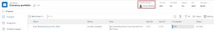

# Création d’un portfolio

Un Portfolio est un ensemble de projets en concurrence pour les mêmes ressources, budget et planning. Les projets d’un Portfolio sont suffisamment similaires pour utiliser le même pool de ressources et être mesurés par rapport à la même fiche d’évaluation.

Vous pouvez utiliser des Portfolios pour regrouper des projets qui appartiennent aux mêmes lignes de produits, divisions, départements, entreprises ou autres unités opérationnelles.

## Exigences d’accès

Vous devez disposer des accès suivants pour effectuer les étapes de cet article :

<table style="table-layout:auto"> 
 <col> 
 <col> 
 <tbody> 
  <tr> 
   <td role="rowheader">[!DNL Adobe Workfront] plan*</td> 
   <td> 
[!UICONTROL Business] ou version ultérieure
 </td> 
  </tr> 
  <tr> 
   <td role="rowheader">[!DNL Adobe Workfront] license*</td> 
   <td> 
[!UICONTROL Plan] 
 </td> 
  </tr> 
  <tr> 
   <td role="rowheader">Paramétrages du niveau d'accès*</td> 
   <td> 
Accès à [!UICONTROL Modifier] à Portfolio
 
Remarque : Si vous n’avez toujours pas accès à , demandez à votre [!DNL Workfront] s’ils définissent des restrictions supplémentaires au niveau de votre accès. Pour plus d’informations sur la manière dont une [!DNL Workfront] l’administrateur peut modifier votre niveau d’accès, voir <a href="../../../administration-and-setup/add-users/configure-and-grant-access/create-modify-access-levels.md" class="MCXref xref">Création ou modification de niveaux d’accès personnalisés</a>.
 </td> 
  </tr> 
  <tr> 
   <td role="rowheader">Autorisations d’objet</td> 
   <td> 
Une fois que vous avez créé un portfolio, vous disposez par défaut des autorisations Manage (Gérer les autorisations) qui lui sont associées.
 
Pour plus d’informations sur la demande d’accès supplémentaire, voir <a href="../../../workfront-basics/grant-and-request-access-to-objects/request-access.md" class="MCXref xref">Demande d’accès aux objets </a>.
 </td> 
  </tr> 
 </tbody> 
</table>

&#42;Pour connaître le plan, le type de licence ou l’accès dont vous disposez, contactez votre [!DNL Workfront] administrateur.

## Création d’un portfolio

1. Cliquez sur le bouton **[!UICONTROL Menu Principal]** icon  dans le coin supérieur droit d’Adobe Workfront.

1. Cliquez sur **[!UICONTROL Portfolios]**.
1. Cliquez sur **[!UICONTROL Nouveau Portfolio]**.
1. Remplacer **[!UICONTROL Portfolio sans titre]** avec le nom souhaité pour le portfolio.

   Le nom peut contenir jusqu’à 255 caractères.

1. (Facultatif) Cliquez sur le nom sous **[!UICONTROL Gestionnaire de Portfolios]** dans l’en-tête situé en haut de la page afin d’affecter un autre responsable au portfolio.

   

   En tant que créateur du portfolio, vous êtes affecté par défaut en tant que gestionnaire de portefeuille.

1. Cliquez sur **[!UICONTROL Détails du Portfolio]** dans le panneau de gauche.
1. Dans le **[!UICONTROL Présentation]** , modifiez l’une des informations suivantes :

   <table style="table-layout:auto"> 
    <col> 
    <col> 
    <tbody> 
     <tr> 
      <td role="rowheader">[!UICONTROL Description]</td> 
      <td> 
Saisissez une description pour le Portfolio afin d’indiquer ce qui est unique. 
 </td> 
     </tr> 
     <tr> 
      <td role="rowheader">[!UICONTROL Portfolio Manager]</td> 
      <td> 
Commencez à saisir le nom d’un utilisateur que vous souhaitez indiquer en tant que gestionnaire de portefeuille, puis sélectionnez-le lorsqu’il apparaît dans la liste. Il s’agit du même nom que le [!UICONTROL propriétaire du Portfolio]. Il s’agit de la personne qui peut superviser le travail défini dans les projets du portfolio et approuver l’Analyse de cas.
 
Important : Lorsque vous désignez une personne comme [!UICONTROL Portfolio Manager], elle obtient automatiquement les autorisations [!UICONTROL Gérer] pour le portefeuille, les programmes et les projets du portefeuille. 
 
Conseil : Vous pouvez également mettre à jour le [!UICONTROL Gestionnaire de Portfolios] dans l’en-tête en haut de la page.
 </td> 
     </tr> 
     <tr data-mc-conditions=""> 
      <td role="rowheader">Groupe </td> 
      <td> 
Ajoutez le nom d’un groupe unique si le groupe détient le portefeuille ou a la responsabilité de l’exécuter. 
 
Vous pouvez vous assurer que vous sélectionnez le groupe approprié en pointant dessus et en cliquant sur l’icône [!UICONTROL Information]  qui s’affiche en regard de celle-ci. Une info-bulle s’affiche, répertoriant les informations relatives au groupe, telles que la hiérarchie des groupes au-dessus de celui-ci et ses administrateurs.
 
  
 </td> 
     </tr> 
    </tbody> 
   </table>

1. (Facultatif) Cliquez dans le **[!UICONTROL Ajouter un formulaire personnalisé]** dans le coin supérieur droit de la [!UICONTROL Détails du Portfolio] pour sélectionner un formulaire personnalisé pour le portfolio et mettre à jour les champs personnalisés.

   >[!TIP]
   >
   >Vous devez avoir déjà créé des formulaires personnalisés de portefeuille avant de pouvoir les joindre à des portefeuilles.

1. Cliquez sur **[!UICONTROL Enregistrer les modifications]**.
1. (Facultatif) Cliquez sur **[!UICONTROL Programmes]** dans le panneau de gauche, puis **[!UICONTROL Ajout de programmes]** pour ajouter des programmes au portefeuille.

   Pour plus d’informations sur la création de programmes, voir [Créer un programme](../../../manage-work/portfolios/create-and-manage-programs/create-program.md).

1. (Facultatif) Cliquez sur **[!UICONTROL Projets]** dans le panneau de gauche, puis **[!UICONTROL Ajouter des projets]** pour ajouter des projets au portfolio.

   Pour plus d’informations sur l’ajout de projets à un Portfolio, voir [Ajout de projets à un portfolio](../../../manage-work/portfolios/create-and-manage-portfolios/add-projects-to-portfolios.md).

<!--

<h2>Deactivate a portfolio</h2>

(NOTE: drafted this and moved it to their own article: delete-deactivate-portfolios)

When you deactivate a portfolio, you can still access it from the Portfolios area, but it no longer displays in the list of portfolios when users try to add it to a project.

<ol>
<li value="1">Click the <strong>Main Menu</strong> icon  in the upper-right corner of Adobe Workfront.</li>
<li value="2">Click <strong>Portfolios</strong> .</li>
<li value="3"> 
Click the name of the portfolio.
 </li>
<li value="4" data-mc-conditions="QuicksilverOrClassic.Quicksilver">Click the More menu  to the right of the portfolio name, then click <strong>Deactivate Portfolio</strong>.</li>
</ol>
<h2>Delete a portfolio</h2>
<ol>
<li value="1">Click the <strong>Main Menu</strong> icon  in the upper-right corner of Adobe Workfront.</li>
<li value="2"> 
Click <strong>Portfolios</strong> .
 </li>
<li value="3"> 
Select the portfolio, then click the Delete icon .
 </li>
<li value="4"> 
In the box that appears, click <strong>Yes, Delete It</strong> to confirm.
 </li>
</ol>

-->
