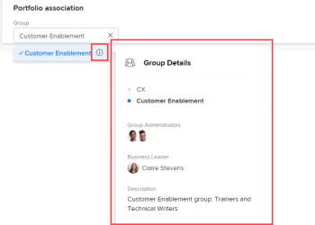

# Modification de portfolios

Vous pouvez modifier des informations sur les portefeuilles que vous avez créés ou que d’autres utilisateurs ont créés s’ils les ont partagés avec vous.

Vous pouvez modifier une [!UICONTROL portfolio] dans la page du portfolio ou vous pouvez modifier des portfolios dans une liste.

## Exigences d’accès

Vous devez disposer des accès suivants pour effectuer les étapes de cet article :

<table style="table-layout:auto"> 
 <col> 
 <col> 
 <tbody> 
  <tr> 
   <td role="rowheader">[!DNL Adobe Workfront] plan*</td> 
   <td> 
Quelconque
 </td> 
  </tr> 
  <tr> 
   <td role="rowheader">Adobe [!DNL Workfront] Présentation des licences*</td> 
   <td> 
[!UICONTROL Plan] 
 </td> 
  </tr> 
  <tr> 
   <td role="rowheader">Niveau d’accès*</td> 
   <td> 
Accès à [!UICONTROL Modifier] à Portfolio
 
Remarque : Si vous n’avez toujours pas accès à , demandez à votre [!DNL Workfront] s’ils définissent des restrictions supplémentaires au niveau de votre accès. Pour plus d’informations sur l’accès aux portefeuilles dans votre niveau d’accès, voir <a href="../../../administration-and-setup/add-users/configure-and-grant-access/grant-access-portfolios.md" class="MCXref xref">Accorder l’accès aux portefeuilles</a>. Pour plus d’informations sur la manière dont une [!DNL Workfront] l’administrateur peut modifier votre niveau d’accès, voir <a href="../../../administration-and-setup/add-users/configure-and-grant-access/create-modify-access-levels.md" class="MCXref xref">Création ou modification de niveaux d’accès personnalisés</a>. 
 </td> 
  </tr> 
  <tr> 
   <td role="rowheader">Autorisations d’objet</td> 
   <td> 
Autorisations [!UICONTROL Gérer] pour un portfolio
 
 Pour plus d’informations sur l’octroi d’autorisations à des portefeuilles, voir <a href="../../../workfront-basics/grant-and-request-access-to-objects/share-a-portfolio.md" class="MCXref xref">Partage d’un portfolio </a>. 
 
Pour plus d’informations sur la demande d’autorisations supplémentaires, voir <a href="../../../workfront-basics/grant-and-request-access-to-objects/request-access.md" class="MCXref xref">Demande d’accès aux objets </a>.
 </td> 
  </tr> 
 </tbody> 
</table>

Pour connaître le plan, le type de licence ou l’accès dont vous disposez, contactez votre [!DNL Workfront] administrateur.

## Modification de portfolios

1. Accédez au **[!UICONTROL Menu Principal]**.
1. Cliquez sur **[!UICONTROL Portfolios]**, puis cliquez sur le nom d’un portfolio pour l’ouvrir.
1. (Facultatif) Pour modifier des informations limitées sur le portfolio, cliquez sur **[!UICONTROL Détails du Portfolio]** dans le panneau de gauche.

   

   <!--
   
(NOTE: the note below will also be true for Edit Portfolio box)

   -->

   >[!NOTE]
   >
   >Selon la manière dont votre [!DNL Workfront] L’administrateur ou l’administrateur de groupe a modifié votre modèle de mise en page, les champs du [!UICONTROL Détails du Portfolio] peut être réorganisée ou non. Pour plus d’informations, voir [Personnalisez le [!UICONTROL Détails] affichage à l’aide d’un modèle de mise en page](../../../administration-and-setup/customize-workfront/use-layout-templates/customize-details-view-layout-template.md).

   Pour modifier les informations dans le [!UICONTROL Détails] , procédez comme suit :

   1. (Facultatif) Cliquez sur le **[!UICONTROL Réduire tout]** dans le coin supérieur droit pour réduire toutes les zones.
   1. (Facultatif et conditionnel) Lorsqu’une zone est réduite, cliquez sur le bouton **flèche pointant vers la droite**  en regard de chaque zone pour développer la zone à modifier.
   1. Pour plus d’informations sur les champs visibles dans la variable [!UICONTROL Détails du Portfolio] , continuez à modifier le portfolio dans la section [!UICONTROL Modifier le Portfolio] comme décrit ci-dessous.
   1. (Facultatif) Si aucun formulaire personnalisé n’est associé au portfolio, commencez à saisir le nom d’un formulaire dans la variable **[!UICONTROL Ajouter un formulaire personnalisé]** , sélectionnez-le lorsqu’il s’affiche dans la liste, puis cliquez sur **[!UICONTROL Enregistrer les modifications]**.
   1. (Facultatif) Cliquez sur le **[!UICONTROL Exporter]** icon  pour exporter le [!UICONTROL Présentation] et des informations sur les formulaires personnalisés dans un fichier de PDF, puis cliquez sur **[!UICONTROL Exporter]**. Sélectionnez l’une des options suivantes :

      * Sélectionner tout (s’affiche uniquement lorsqu’au moins un formulaire personnalisé est joint)
      * Vue d’ensemble
      * Nom d’un ou de plusieurs formulaires personnalisés

      Le fichier du PDF est téléchargé sur votre ordinateur.

      

      Pour plus d’informations, voir [Exportation de formulaires personnalisés et de détails d’objet](../../../workfront-basics/work-with-custom-forms/export-custom-forms-details.md).

1. Pour modifier toutes les informations sur un ou plusieurs portefeuilles, effectuez l’une des opérations suivantes :

   <!--
   
(NOTE: this might have to be split in two sections if the single edit and the bulk edit won't come at the same time for portfolios)

   -->

   * Cliquez sur le bouton **[!UICONTROL Plus]** en regard du nom du portfolio, puis **[!UICONTROL Modifier].**

     <!--   
     
(NOTE: this will change in NWE with a new Edit Portfolio UI)
   
     -->

   * Dans la liste des portefeuilles, sélectionnez un ou plusieurs portefeuilles à modifier, puis cliquez sur le bouton **[!UICONTROL Modifier]** icon  en haut de la liste.

     <!--   
     
(NOTE: this will need to split into another section when they release the new [!UICONTROL Edit Portfolio] UI)
   
     -->
   La variable **[!UICONTROL Modifier le Portfolio]** s’affiche.

   

   Tous les champs de portefeuille sont disponibles dans la variable [!UICONTROL Modifier le Portfolio] et sont regroupées par zones répertoriées dans le panneau de gauche.

1. Pensez à spécifier des informations dans l’une des sections suivantes :

   * [[!UICONTROL Présentation]](#overview)
   * [Formulaires personnalisés](#Custom%C2%A0F)
   * [Commentaire](#comment)

### [!UICONTROL Présentation] {#overview}

1. Commencez à modifier un portfolio comme décrit ci-dessus.
1. Cliquez sur **[!UICONTROL Présentation]** et indiquez les champs suivants :

   <!--
   
(NOTE: note below is drafted: drafted till they release new Edit Portfolio boxes)

   -->

   <!--
   <note type="note">
   Depending on how your Workfront administrator or Group administrator sets up our Layout Template, the fields in the Edit Portfolio box might be rearranged or not display. For information, see
   <a href="../../../administration-and-setup/customize-workfront/use-layout-templates/customize-details-view-layout-template.md" class="MCXref xref">Customize the Details view using a layout template</a>.
   </note>
   -->

   <table style="table-layout:auto"> 
    <col> 
    <col> 
    <tbody> 
     <tr> 
      <td role="rowheader">[!UICONTROL Name]</td> 
      <td> 
Mettez à jour le nom du portfolio. 
 
Conseil : Cette option n’est pas disponible lorsque vous avez sélectionné plusieurs portefeuilles. 
 </td> 
     </tr> 
     <tr> 
      <td role="rowheader">[!UICONTROL Description]</td> 
      <td> 
Saisissez une description pour le Portfolio afin d’indiquer ce qui est unique. 
 </td> 
     </tr> 
     <tr> 
      <td role="rowheader">[!UICONTROL Portfolio Manager]</td> 
      <td> 
Commencez à saisir le nom d’un utilisateur que vous souhaitez indiquer en tant que gestionnaire de portefeuille, puis sélectionnez-le lorsqu’il apparaît dans la liste. Il s’agit du même nom que le [!UICONTROL propriétaire du Portfolio]. Il s’agit de la personne qui peut superviser le travail défini dans les projets du portfolio et approuver l’Analyse de cas.
 
Important : Lorsque vous désigner une personne comme gestionnaire de Portfolios, elle obtient automatiquement les autorisations [!UICONTROL Gérer] pour le portefeuille, les programmes et les projets du portefeuille. 
 
Conseil : Vous pouvez rapidement mettre à jour le gestionnaire de portefeuille dans l’en-tête de portefeuille. 
 </td> 
     </tr> 
     <tr> 
      <td role="rowheader">[!UICONTROL Group]</td> 
      <td> 
Ajoutez le nom d’un seul groupe si celui-ci est associé au portefeuille ou s’il est responsable de l’exécuter. 
 
Conseil :  
Lors de l’accès au champ [!UICONTROL Groupe] à partir de la page [!UICONTROL Détails du Portfolio] , procédez comme suit : 
 
Vous pouvez vous assurer que vous sélectionnez le groupe approprié en pointant dessus et en cliquant sur l’icône [!UICONTROL Information]  qui s’affiche en regard de celle-ci. Une info-bulle s’affiche, répertoriant les informations relatives au groupe, telles que la hiérarchie des groupes au-dessus de celui-ci et ses administrateurs.
 
  
 
Cette option n’est pas disponible dans la zone [!UICONTROL Modifier le Portfolio]. 
 
 </td> 
     </tr> 
     <tr> 
      <td role="rowheader"> 
[!UICONTROL Alignement de la Fiche d’évaluation]
 </td> 
      <td> 
Sélectionnez la fiche d’évaluation de l’alignement que vous souhaitez utiliser dans la liste déroulante. Une fiche d'évaluation permet de mesurer dans quelle mesure un projet s'aligne sur les critères établis d'un Portfolio et reflète souvent la mission, les valeurs et les objectifs stratégiques d'une organisation. Pour plus d’informations, voir <a href="../../../manage-work/projects/define-a-business-case/apply-scorecard-to-project-to-generate-alignment-score.md" class="MCXref xref">Application d’une fiche d’évaluation à un projet et génération d’une note d’alignement</a> et <a href="../../../administration-and-setup/set-up-workfront/configure-system-defaults/create-scorecard.md" class="MCXref xref">Création d’une Fiche d’évaluation</a>.
 </td> 
     </tr> 
     <tr> 
      <td role="rowheader">[!UICONTROL Est Actif]</td> 
      <td> 
 Cochez cette case si vous souhaitez que le portfolio soit actif. D’autres utilisateurs peuvent trouver des portefeuilles actifs et les joindre à des projets lors de la création ou de la modification de projets. Les portefeuilles inactifs ne peuvent pas être joints aux projets. Cette option est activée par défaut.
 </td> 
     </tr> 
    </tbody> 
   </table>

1. Cliquez sur **[!UICONTROL Enregistrer les modifications]** ou continuez à modifier les sections suivantes.

### Formulaires personnalisés

1. Commencez à modifier le portfolio comme décrit ci-dessus.
1. Cliquez sur le bouton **[!UICONTROL Ajouter Forms]** menu déroulant pour sélectionner un formulaire personnalisé et l’ajouter au portfolio.

   Vous devez créer des formulaires personnalisés de portefeuille avant qu’ils ne soient disponibles pour ajout.

   >[!NOTE]
   >
   >Selon la manière dont votre [!DNL Workfront] l’administrateur définit les autorisations pour les sections de votre formulaire personnalisé. tout le monde ne peut pas afficher ou modifier les mêmes champs sur un formulaire personnalisé donné. Les autorisations de modification des champs d’une section d’un formulaire personnalisé dépendent des autorisations dont vous disposez sur le portfolio lui-même. Pour plus d’informations sur la définition des autorisations sur les sections d’un formulaire personnalisé, voir [Création ou modification d’un formulaire personnalisé](../../../administration-and-setup/customize-workfront/create-manage-custom-forms/create-or-edit-a-custom-form.md).

1. Mettez à jour les champs des formulaires personnalisés, puis cliquez sur **[!UICONTROL Enregistrer les modifications]** ou passez à la section suivante.

### Commentaire {#comment}

1. Commencez à modifier un portfolio comme décrit ci-dessus.
1. Cliquez sur **[!UICONTROL Commentaire]**.

   

1. Ajoutez un commentaire dans le **[!UICONTROL Publier une mise à jour du portfolio]** champ .
1. (Facultatif) Cliquez sur le **[!UICONTROL Personnes]** pour ajouter un utilisateur ou une équipe au commentaire.
1. (Facultatif) Cliquez sur le **[!UICONTROL Verrouiller]** pour verrouiller le commentaire et le rendre privé uniquement pour les utilisateurs de votre entreprise.
1. Cliquez sur **[!UICONTROL Enregistrer les modifications]**.
