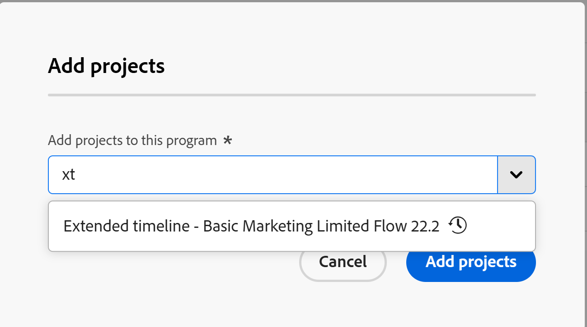

# Ajouter un projet à un programme

<!--Audited: 05/2026-->

<!--
The highlighted information on this page refers to functionality not yet generally available. It is available only in the Preview environment for all customers. The same features will also be available in the Production environment for all customers after a week from the Preview release.    

For more information, see [Interface modernization](/help/quicksilver/product-announcements/product-releases/interface-modernization/interface-modernization.md). 
-->

Vous pouvez organiser vos projets en les ajoutant aux programmes au sein des portfolios. Vous pouvez intégrer plusieurs projets dans un même programme, mais vous ne pouvez associer qu’un seul programme à un projet.

Vous devez créer un portfolio et un programme au sein de ce portfolio avant de pouvoir ajouter un projet à un programme.

L’ajout d’un projet à un programme l’ajoute automatiquement au portefeuille du programme en même temps.

Pour plus d’informations sur la création de portfolios, consultez la section [Créer un portfolio](../../../manage-work/portfolios/create-and-manage-portfolios/create-portfolios.md).

Pour plus d’informations sur la création de programmes, consultez la section [Créer un programme](../../../manage-work/portfolios/create-and-manage-programs/create-program.md).

## Conditions d’accès

+++ Développez pour afficher les exigences d’accès aux fonctionnalités de cet article. 

<table style="table-layout:auto"> 
 <col> 
 <col> 
 <tbody> 
  <tr> 
   <td role="rowheader">[!DNL Adobe Workfront] paquet</td> 
   <td> 
Tous
 </td> 
  </tr> 
  <tr> 
   <td role="rowheader">[!DNL Adobe Workfront] licence</td> 
   <td>
[!UICONTROL Standard]
 
   
[!UICONTROL Plan] 
 </td> 
  </tr> 
  <tr> 
   <td role="rowheader">Niveau d’accès</td> 
   <td> 
[!UICONTROL Edit] Accès aux programmes ou versions ultérieures
 
[!UICONTROL Edit] l’accès aux Projets
 </td> 
  </tr> 
  <tr> 
   <td role="rowheader">Autorisations d’objet</td> 
   <td> 
Autorisations [!UICONTROL Manage] au programme
 
[!UICONTROL Manage] les permissions des projets
 </td> 
  </tr> 
 </tbody> 
</table>

*Pour plus d’informations, voir [Conditions d’accès dans la documentation de Workfront](/help/quicksilver/administration-and-setup/add-users/access-levels-and-object-permissions/access-level-requirements-in-documentation.md).

+++

<!--
old:

<table style="table-layout:auto"> 
 <col> 
 <col> 
 <tbody> 
  <tr> 
   <td role="rowheader">[!DNL Adobe Workfront] plan</td> 
   <td> 
Any
 </td> 
  </tr> 
  <tr> 
   <td role="rowheader">[!DNL Adobe Workfront] license*</td> 
   <td>
New: Standard
 
   
Current: [!UICONTROL Plan] 
 </td> 
  </tr> 
  <tr> 
   <td role="rowheader">Access level</td> 
   <td> 
[!UICONTROL Edit] access to Programs or higher
 
[!UICONTROL Edit] access to Projects
 </td> 
  </tr> 
  <tr> 
   <td role="rowheader">Object permissions</td> 
   <td> 
[!UICONTROL Manage] permissions to the program
 
[!UICONTROL Manage] permissions to the projects
 </td> 
  </tr> 
 </tbody> 
</table>

*For information, see [Access requirements in Workfront documentation](/help/quicksilver/administration-and-setup/add-users/access-levels-and-object-permissions/access-level-requirements-in-documentation.md).
-->

## Ajouter un projet à un programme existant

1. Accédez à un programme.

   Cliquez sur **[!UICONTROL Projets]** dans le panneau de gauche.

1. Cliquez sur **[!UICONTROL Nouveau projet]** et sélectionnez une méthode pour ajouter le projet.

   >[!TIP]
   >
   >Vous ne pouvez pas ajouter de projet lorsque vous affichez la liste des projets dans la vue [!UICONTROL Jalon].

   Sélectionnez l’une des options suivantes :

   <table style="table-layout:auto"> 
    <col> 
    <col> 
    <tbody>

   <tr> 
      <td role="rowheader">[!UICONTROL New Project]</td> 
      <td> 
Ajoutez un nouveau projet à partir de zéro. 
 
Pour plus d’informations sur la création d’un projet à partir de zéro, consultez la section <a href="../../../manage-work/projects/create-projects/create-project.md" class="MCXref xref">Créer un projet</a>. 
 </td> 
     </tr> 
     <tr> 
      <td role="rowheader">[!UICONTROL Nouveau projet (stockage hérité)]</td> 
      <td> 
Ajoutez un nouveau projet de stockage Workfront. 

      
Cette option s’affiche uniquement lorsque votre entreprise utilise à la fois l’espace de stockage de documents cloud Workfront et Adobe. Votre instance Workfront peut ne pas avoir les deux types de stockage.

      
Pour en savoir plus sur la création d’un projet, voir <a href="../../../manage-work/projects/create-projects/create-project.md" class="MCXref xref">Créer un projet</a>. 
 </td> 
      </tr> 
      <tr> 
      <td role="rowheader">[!UICONTROL Nouveau projet à partir d'un modèle]</td> 
      <td> 
Ajouter un nouveau projet en utilisant un modèle existant. 
 
Pour plus d’informations sur la création d’un projet à partir d’un modèle, consultez la section <a href="../../../manage-work/projects/create-projects/create-project-from-template.md" class="MCXref xref">Créer un projet à l’aide d’un modèle</a>.
 </td> 
     </tr> 
     <tr> 
      <td role="rowheader">[!UICONTROL Import [!DNL MS Project]] </td> 
      <td> 
Ajoutez un projet que vous avez précédemment exporté depuis [!DNL MS Project] et que vous avez enregistré sur votre ordinateur. 
 
Pour plus d’informations sur la création d’un nouveau projet en l’important à partir de [!DNL Microsoft Project], consultez la section <a href="../../../manage-work/projects/create-projects/import-project-from-ms-project.md" class="MCXref xref">Importer un projet à partir de [!DNL Microsoft Project]</a>.
 </td> 
     </tr> 
     <tr> 
      <td role="rowheader">[!UICONTROL Request Project]</td> 
      <td> 
Demandez que le nouveau projet soit approuvé avant de pouvoir commencer à travailler dessus.
 
Pour plus d’informations sur la requête de projets, consultez la section <a href="../../../manage-work/projects/create-projects/request-project.md">Demander un projet</a>. 
 </td> 
     </tr>

   <tr> 
      <td role="rowheader">[!UICONTROL Existing Project]</td> 
      <td> 
Ajoutez un projet déjà créé.
 </td> 
     </tr> 
    </tbody> 
   </table>

1. (Conditionnel) Si vous avez sélectionné **[!UICONTROL Projet existant]**, la boîte de dialogue **Ajouter des projets** s’ouvre. <!--check at unshimming-->

   <!--check at unshimming-->

1. Procédez comme suit :

   1. Dans la zone **[!UICONTROL Ajouter des projets]**, saisissez le nom d’un projet dans le champ **Ajouter des projets à ce programme** puis sélectionnez-le lorsqu’il s’affiche dans la liste. <!--check casing on links and buttons-->

      Vous pouvez ajouter plusieurs projets.

      >[!NOTE]
      >
      >Lorsque votre entreprise utilise à la fois l’espace de stockage cloud Workfront et Adobe hérité pour les documents, les scénarios suivants existent :
      >
      >
      >* Vous ne pouvez pas ajouter un projet de stockage hérité à un programme de stockage cloud Adobe, ni un projet de stockage cloud Adobe à un programme de stockage hérité.
      >* Vous ne pouvez pas créer de projet à partir d’un modèle de stockage dans le cloud Adobe dans un programme de stockage hérité.
      >* Vous pouvez créer un projet à partir d’un modèle de stockage hérité dans un programme de stockage dans le cloud Adobe, mais les documents et dossiers du modèle ne sont pas ajoutés au nouveau projet. Le projet reçoit l’espace de stockage cloud Adobe.
      >
      >Pour plus d’informations, voir [Présentation de la gestion des documents pour les projets et les objets associés](/help/quicksilver/manage-work/projects/manage-projects/manage-documents-on-projects.md).
      >
      >Toutes les instances Workfront ne possèdent pas les deux types de stockage de documents.

   1. (Facultatif) Cliquez sur l’icône **Supprimer**  en regard du nom d’un projet si vous décidez de ne pas l’ajouter au programme.

   1. Cliquez sur **[!UICONTROL Ajouter des projets]**. <!--check at unshimming-->

      Le projet s’affiche dans l’onglet **[!UICONTROL Projets]** du programme et est désormais associé au programme et au portfolio correspondant du programme.
