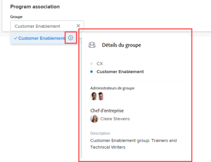

# Créer un programme

<!-- Audited: 1/2024 -->

<!--The highlighted information on this page refers to functionality not yet generally available. It is available only in the Preview environment for all customers. The same features will also be available in the Production environment for all customers after a week from the Preview release.    

For more information, see [Interface modernization](/help/quicksilver/product-announcements/product-releases/interface-modernization/interface-modernization.md). -->

Un programme représente un ensemble de projets qui partagent une stratégie, un objectif ou un objectif commun qui transcende les limites du projet.
Les programmes sont une subdivision des portefeuilles et ils ne peuvent pas exister en dehors d&#39;un portefeuille. Les programmes partagent généralement les mêmes ressources que les autres programmes du même portefeuille.

Vous pouvez créer des programmes pour organiser vos portefeuilles lorsqu’ils deviennent trop volumineux.

Par exemple, vous pouvez avoir un Portfolio Exercice marketing 2024 qui contient tous les projets de votre division Marketing. Vous pouvez envisager d’organiser davantage vos projets en trimestres fiscaux et d’ajouter les programmes des trimestres fiscaux marketing 1 à 4 2024 dans le Portfolio Exercice fiscal marketing 2024.

## Conditions d’accès

+++ Développez pour afficher les exigences d’accès aux fonctionnalités de cet article.

<table style="table-layout:auto"> 
 <col> 
 <col> 
 <tbody> 
  <tr> 
   <td role="rowheader">[!DNL Adobe Workfront] paquet</td>

<td> 
Tous
 </td> 
  </tr> 
  <tr> 
   <td role="rowheader">[!DNL Adobe Workfront] licence</td> 
   <td> 
[!UICONTROL Standard]

   
[!UICONTROL Plan]
 </td> 
  </tr> 
  <tr> 
   <td role="rowheader">Configurations des niveaux d’accès</td> 
   <td> 
Accès [!UICONTROL Edit] aux portfolios et aux programmes 
  </td> 
  </tr> 
  <tr> 
   <td role="rowheader">Autorisations d’objet</td> 
   <td> 
Autorisations [!UICONTROL Manage] pour le portfolio
 
Une fois que vous avez créé un programme, vous disposez par défaut des autorisations de [!UICONTROL Manage].
  </td> 
  </tr> 
 </tbody> 
</table>

Pour plus de détails sur les informations contenues dans ce tableau, consultez l’article [Conditions d’accès dans la documentation Workfront](/help/quicksilver/administration-and-setup/add-users/access-levels-and-object-permissions/access-level-requirements-in-documentation.md).

+++

<!--Old:

<table style="table-layout:auto"> 
 <col> 
 <col> 
 <tbody> 
  <tr> 
   <td role="rowheader">[!DNL Adobe Workfront] plan</td> 

   <td> 
Any
 </td> 
  </tr> 
  <tr> 
   <td role="rowheader">[!DNL Adobe Workfront] license</td> 
   <td> 
New: [!UICONTROL Standard] 

Or 

Current: [!UICONTROL Plan] 
 </td> 
  </tr> 
  <tr> 
   <td role="rowheader">Access level configurations</td> 
   <td> 
[!UICONTROL Edit] access to Portfolios and Programs 
  </td> 
  </tr> 
  <tr> 
   <td role="rowheader">Object permissions</td> 
   <td> 
[!UICONTROL Manage] permissions to the portfolio
 
After you create a program, you have [!UICONTROL Manage] permissions to it, by default.
  </td> 
  </tr> 
 </tbody> 
</table>-->

## Création de programmes

Vous pouvez créer un programme dans Workfront à l’aide de l’une des méthodes suivantes :

* Créez un programme à partir de zéro dans la zone Programmes du menu principal ou dans la section Programmes d&#39;un portefeuille. Cet article décrit comment créer un programme à partir de zéro.

* Importez un programme à l’aide de Kickstarts.

  En tant qu’administrateur Workfront, vous pouvez importer des programmes à l’aide d’un Kickstart.

  Pour plus d’informations sur l’import de données à l’aide de Kickstarts dans Workfront, consulter la section [Importer des données dans Adobe Workfront à l’aide d’un modèle de Kickstart](/help/quicksilver/administration-and-setup/manage-workfront/using-kick-starts/import-data-via-kickstarts.md).

* Ajoutez des programmes au fur et à mesure que vous les connectez à partir d&#39;un type d&#39;enregistrement dans Workfront Planning.

  Vous devez disposer d’un package Workfront Planning supplémentaire.

  Pour plus d’informations sur l’accès à Workfront Planning, consultez [Présentation de l’accès à Adobe Workfront Planning](/help/quicksilver/planning/access/access-overview.md).

  Pour plus d&#39;informations sur la création de portefeuilles en les ajoutant à des enregistrements, reportez-vous à la section « Créer des enregistrements au fur et à mesure que vous les connectez » de l&#39;article [Créer des enregistrements](/help/quicksilver/planning/records/create-records.md).

## Créer un programme

{{step1-click-main-menu}}

1. Utilisez l’une des méthodes suivantes :

   * Créez un programme à partir de la zone [!UICONTROL Programmes] :

      1. Cliquez sur **[!UICONTROL Programmes]** dans le menu principal.
      1. Cliquez sur **[!UICONTROL Nouveau programme]**.
      1. Dans la zone qui s’affiche, saisissez le nom d’un portfolio existant dans le champ **[!UICONTROL Sélectionner un portfolio]**.
      1. Saisissez le nom du nouveau programme dans le champ **[!UICONTROL Nom]**.
      1. Cliquer sur **[!UICONTROL Enregistrer]**.
   * Créez un programme à partir de la zone [!UICONTROL Portfolios] :

      1. Cliquez sur **[!UICONTROL Portfolios]** dans le [!UICONTROL Menu principal], puis ouvrez un portfolio.
      1. Dans le panneau de gauche, cliquez sur **[!UICONTROL Programmes]**.
      1. Cliquez sur le menu déroulant **[!UICONTROL Nouveau programme]**, puis sur **[!UICONTROL Nouveau programme]**.

1. (Le cas échéant) Si vous avez créé le programme à partir d’un portfolio, indiquez le nom du programme dans le champ **[!UICONTROL Programme sans titre]**.

   Le nom peut contenir jusqu’à 255 caractères.

1. (Facultatif) Cliquez sur **[!UICONTROL Responsable du programme]** dans l’en-tête du programme pour le mettre à jour.

   >[!TIP]
   >
   >En tant que créateur ou créatrice du programme, vous êtes défini comme responsable du programme par défaut.

1. Cliquez sur **[!UICONTROL Détails du programme]** dans le panneau de gauche.
1. Double-cliquez sur un champ pour mettre à jour les informations dans la zone **[!UICONTROL Vue d’ensemble]**.

Vous pouvez indiquer les informations suivantes :

<table style="table-layout:auto"> 
    <col> 
    <col> 
    <thead> 
     <tr> 
      <th>champ</th> 
      <th>Description</th> 
     </tr> 
    </thead> 
    <tbody> 
     <tr> 
      <td role="rowheader">[!UICONTROL Description]</td> 
      <td> 
Indiquez une description pour le programme.
 
La description s’affiche sur la page de destination du programme.
 </td> 
     </tr> 
     <tr> 
      <td role="rowheader">[!UICONTROL Program Manager]</td> 
      <td> 
Commencez à saisir le nom de l’utilisateur ou utilisatrice que vous souhaitez utiliser comme responsable de programme, puis cliquez sur son nom lorsqu’il apparaît dans la liste déroulante. Il s’agit du même nom que le ou la [!UICONTROL Program Owner]. 
 
Conseil : vous pouvez également mettre à jour le ou la responsable du programme dans l’en-tête du programme. 
 </td> 
     </tr> 
     <tr data-mc-conditions=""> 
      <td role="rowheader">[!UICONTROL Group] </td> 
      <td> 
Ajoutez le nom d’un seul groupe si le groupe est responsable du programme ou s’il est responsable de l’exécuter. 
 
Vous pouvez vous assurer que vous sélectionnez le groupe approprié en pointant dessus et en cliquant sur l’icône [!UICONTROL information]  qui s’affiche en regard de celle-ci. Une info-bulle s’affiche, répertoriant les informations relatives au groupe, telles que la hiérarchie des groupes au-dessus et son équipe d’administration.
 
       
 
         
       
 </td> 
     </tr> 
    </tbody> 
   </table>

1. (Facultatif et le cas échéant) Cliquez dans la zone **[!UICONTROL Ajouter un formulaire personnalisé]** pour sélectionner un formulaire personnalisé pour le portfolio et mettre à jour les champs personnalisés.

   >[!TIP]
   >
   >Vous devez avoir des formulaires personnalisés de programme déjà créés avant de pouvoir les joindre à des programmes.

1. (Facultatif et le cas échéant) Si vous ajoutez un formulaire personnalisé, cliquez sur un champ du formulaire personnalisé pour mettre à jour ses informations.
1. Cliquez sur **[!UICONTROL Enregistrer les modifications]**.
1. Cliquez sur **[!UICONTROL Projets]** dans le panneau de gauche, puis sur **[!UICONTROL Ajouter des projets]** pour ajouter des projets au programme.

   Pour plus d’informations sur l’ajout de projets à des programmes, voir [Ajouter un projet à un programme](../../../manage-work/portfolios/create-and-manage-programs/add-project-to-program.md).

1. Cliquez sur **[!UICONTROL Enregistrer les modifications]**.
1. (Facultatif) Cliquez sur le **[!UICONTROL menu Plus]**  en regard du nom du programme et cliquez sur **[!UICONTROL Désactiver le programme]**.

   Lorsque vous désactivez un programme, celui-ci ne s’affiche plus dans la liste des programmes lorsque les utilisateurs et utilisatrices tentent de l’ajouter à un projet. Vous pouvez toujours accéder au programme à partir de la zone [!UICONTROL Programmes].

## Vue d’ensemble de l’en-tête du programme

Vous trouverez des informations sur le programme dans son en-tête.

Les informations suivantes s’affichent dans l’en-tête d’un programme :

<table style="table-layout:auto"> 
 <col> 
 <col> 
 <tbody> 
  <tr> 
   <td role="rowheader">Informations sur l’en-tête</td> 
   <td> <strong>Notes</strong> </td> 
  </tr> 
  <tr> 
   <td role="rowheader">Chemin de navigation avec le nom du portfolio</td> 
   <td>Vous pouvez accéder au portfolio auquel le programme appartient à partir de l’en-tête du programme. </td> 
  </tr> 
  <tr> 
   <td role="rowheader">Nom du programme</td> 
   <td>Vous pouvez modifier le nom du programme dans l’en-tête.</td> 
  </tr> 
  <tr> 
   <td role="rowheader">Nom du type d’objet et statut d’activation</td> 
   <td>Le mot « Programme » s’affiche avec une icône orange lorsque vous affichez un programme. Le mot « [!UICONTROL Deactivated] » s’affiche en regard de celui-ci et le contour est gris si le programme n’est pas marqué comme [!UICONTROL Active]. </td> 
  </tr> 
  <tr> 
   <td role="rowheader">Zone d’actions du programme </td> 
   <td> 
Cliquez sur l’une des options suivantes pour accéder à d’autres informations ou options de modification du programme :
 
    <ul> 
     <li>Icône en forme d’étoile pour ajouter le programme à votre liste de Favoris</li> 
     <li> 
Menu [!UICONTROL More]  pour effectuer l’une des opérations suivantes : 
 
      <ul> 
       <li>Modifier le programme</li> 
       <li>Désactivez-le. Lorsqu’un programme est désactivé, vous ne pouvez plus l’associer aux projets au niveau du projet. </li> 
       <li> 
Supprimez-le. La suppression du programme ne supprime pas les projets qu’il contient. Il supprime l’association des projets au programme. 
 </li> 
       <li>Partager avec d’autres personnes</li> 
      </ul> </li> 
    </ul> </td> 
  </tr> 
  <tr> 
   <td role="rowheader">[!UICONTROL Percent Complete]</td> 
   <td> 
Vous ne pouvez pas modifier le [!UICONTROL Percent Complete] du programme dans l’en-tête. Ces informations sont mises à jour à partir des projets du programme. Par défaut, le pourcentage terminé du programme correspond à la moyenne des valeurs de pourcentage terminé des projets avec un statut [!UICONTROL Current] ou [!UICONTROL Approved] appartenant au programme.
 </td> 
  </tr> 
  <tr> 
   <td role="rowheader">[!UICONTROL Program Manager]</td> 
   <td> 
Vous pouvez modifier la personne gestionnaire de programmes dans l’en-tête. Il s’agit du même nom que le ou la [!UICONTROL Program Owner]. 
 </td> 
  </tr> 
  <tr> 
   <td role="rowheader">[!UICONTROL Planned Completion Date]</td> 
   <td>Vous ne pouvez pas modifier la date d’achèvement prévue du programme dans l’en-tête. Ces informations sont mises à jour à partir des projets du programme. La date d’achèvement prévue du dernier projet du programme devient la date d’achèvement prévue du programme.  </td> 
  </tr> 
  <tr> 
   <td role="rowheader">[!UICONTROL Active Projects Condition]</td> 
   <td>Il s’agit d’un calcul du pourcentage de projets du programme pour lesquels le [!UICONTROL Condition] est définie sur [!UICONTROL On Target], [!UICONTROL At Risk] ou [!UICONTROL In Trouble]. Les projets représentés ici sont des projets dont le statut est [!UICONTROL Current] et [!UICONTROL Approved]. </td> 
  </tr> 
 </tbody> 
</table>

## Déplacer un programme

Vous pouvez ajouter des programmes existants à un portfolio. Les programmes ne pouvant exister dans deux portfolios différents, l’ajout d’un programme existant le fait passer définitivement d’un portfolio à l’autre.

Pour plus d’informations, voir la section [Ajouter un programme existant à un portfolio](../../../manage-work/portfolios/create-and-manage-programs/move-program.md).
