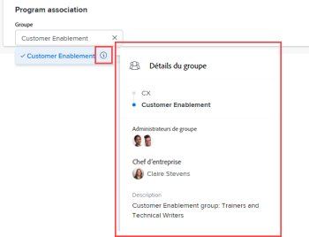

# Modifier des programmes

Vous pouvez modifier les informations sur les programmes que vous avez créés ou que d’autres utilisateurs et utilisatrices ont créés et partagés avec vous.

Vous pouvez modifier un programme dans la page du programme ou vous pouvez modifier un ou plusieurs programmes en bloc dans une liste.

## Conditions d’accès

+++ Développez pour afficher les exigences d’accès aux fonctionnalités de cet article.

<table style="table-layout:auto"> 
 <col> 
 <col> 
 <tbody> 
  <tr> 
   <td role="rowheader">[!DNL Adobe Workfront] paquet</td> 
   <td> 
Tous
 </td> 
  </tr> 
  <tr> 
   <td role="rowheader">[!DNL Adobe Workfront] licence</td> 
   <td> 
[!UICONTROL Standard]

   
[!UICONTROL Plan]
 </td> 
  </tr> 
  <tr> 
   <td role="rowheader">Configurations des niveaux d’accès</td> 
   <td> 
Accès [!UICONTROL Edit] aux programmes
  </td> 
  </tr> 
  <tr> 
   <td role="rowheader">Autorisations d’objet</td> 
   <td> 
Autorisations [!UICONTROL Manage] d’un programme
  </td> 
  </tr> 
 </tbody> 
</table>

Pour plus d’informations, voir [Conditions d’accès requises dans la documentation Workfront](/help/quicksilver/administration-and-setup/add-users/access-levels-and-object-permissions/access-level-requirements-in-documentation.md).

+++

## Modifier des programmes

1. Accédez au **[!UICONTROL Menu principal]**.
1. Cliquez sur **[!UICONTROL Programmes]**, puis cliquez sur le nom d’un programme pour l’ouvrir.

   >[!TIP]
   >
   >Vous pouvez accéder à un programme à partir du portfolio auquel il est associé en accédant d’abord au portfolio, puis en cliquant sur **[!UICONTROL Programmes]** dans le panneau de gauche. Pour plus d’informations, consultez la section [Créer un programme](../../../manage-work/portfolios/create-and-manage-programs/create-program.md).

1. (Facultatif) Pour modifier des informations limitées sur le programme, cliquez sur **[!UICONTROL Détails du programme]** dans le panneau de gauche.

   >[!TIP]
   >
   >Si vous souhaitez modifier toutes les informations relatives au programme, passez à l’étape 4.

   

   >[!NOTE]
   >
   >Selon la manière dont votre administrateur ou administratrice [!DNL Workfront] ou votre administrateur ou administratrice de groupes a modifié votre modèle de mise en page, les champs de la zone [!UICONTROL Détails du programme] peuvent être réorganisés ou ne pas s’afficher. Pour plus d’informations, consultez la section [Personnaliser l’affichage des [!UICONTROL Détails] à l’aide d’un modèle de mise en page](../../../administration-and-setup/customize-workfront/use-layout-templates/customize-details-view-layout-template.md).

   <!--
   
(NOTE: the above note will also come to the Edit Program box)

   -->

   Pour modifier les informations de la section [!UICONTROL Détails], procédez comme suit :

   1. (Facultatif) Cliquez sur l’icône **[!UICONTROL Tout réduire]** en haut à droite pour réduire toutes les zones.
   1. (Facultatif et conditionnel) Lorsqu’une zone est réduite, cliquez sur la **flèche pointant vers la droite**  en regard de chaque zone pour développer la zone à modifier.
   1. Pour plus d’informations sur les champs visibles dans la section [!UICONTROL Détails du programme], continuez à modifier le programme dans la section [!UICONTROL Modifier le programme] comme décrit ci-dessous.
   1. (Facultatif) Si aucun formulaire personnalisé n’est joint au programme, commencez à saisir le nom d’un formulaire dans le champ **[!UICONTROL Ajouter un formulaire personnalisé]**, sélectionnez-le lorsqu’il s’affiche dans la liste, puis cliquez sur **[!UICONTROL Enregistrer les modifications]**.
   1. (Facultatif) Cliquez sur l’icône **[!UICONTROL Exporter]**  pour exporter les informations [!UICONTROL Présentation] et de formulaires personnalisés dans un fichier PDF, puis cliquez sur **[!UICONTROL Exporter]**. Sélectionnez l’une des options suivantes :

      * Sélectionner tout (ne s’affiche que lorsqu’au moins un formulaire personnalisé est joint)
      * [!UICONTROL Vue d’ensemble]
      * Nom d’un ou de plusieurs formulaires personnalisés

      Le fichier PDF est téléchargé sur votre ordinateur.

      

      Pour plus d’informations, consultez la section [Exporter les formulaires personnalisés et les détails de l’objet](../../../workfront-basics/work-with-custom-forms/export-custom-forms-details.md).

1. Pour modifier toutes les informations sur un ou plusieurs programmes, effectuez l’une des opérations suivantes :

   * Cliquez sur le menu **[!UICONTROL Plus]**  en regard du nom du programme, puis sur **[!UICONTROL Modifier].**
   * Accédez à une liste de programmes et sélectionnez un ou plusieurs programmes à modifier, puis cliquez sur l’icône **[!UICONTROL Modifier]**  en haut de la liste.

     La zone **[!UICONTROL Modifier le programme]** s’affiche.

     

     Tous les champs de programme sont disponibles dans la zone [!UICONTROL Modifier le programme] et sont regroupés par zones répertoriées dans le panneau de gauche.

1. Pensez à spécifier des informations dans l’une des sections suivantes :

   * [[!UICONTROL Vue d’ensemble]](#overview)
   * [[!UICONTROL Formulaires personnalisés]](#Custom%C2%A0F)
   * [[!UICONTROL Commentaire]](#comment)

   >[!TIP]
   >
   >Pour recalculer des champs personnalisés pour plusieurs programmes à la fois, sélectionnez plusieurs programmes dans une liste, puis cliquez sur le menu **Plus**  en haut de la liste, puis **Recalculer les expressions**.

### [!UICONTROL Vue d’ensemble] {#overview}

1. Commencez à modifier un programme comme décrit ci-dessus.
1. Cliquez sur **[!UICONTROL Vue d’ensemble]** et renseignez les champs suivants :

   <!--
   
(NOTE: note below drafted for now)

   -->

   <!--
   <note type="note">
   Depending on how your Workfront administrator or Group administrator sets up our Layout Template, the fields in the Edit Program box might be rearranged or not display. For information, see
   <a href="../../../administration-and-setup/customize-workfront/use-layout-templates/customize-details-view-layout-template.md" class="MCXref xref">Customize the Details view using a layout template</a>.
   </note>
   -->

   <table style="table-layout:auto"> 
    <col> 
    <col> 
    <tbody> 
     <tr> 
      <td role="rowheader">[!UICONTROL Name]</td> 
      <td> 
Mettez à jour le nom du programme. 
 
<b>CONSEIL</b>

Cette option n’est pas disponible lorsque vous avez sélectionné plusieurs programmes.
 </td> 
     </tr> 
     <tr> 
      <td role="rowheader">[!UICONTROL Description]</td> 
      <td> 
Tapez une description du portefeuille pour indiquer ce qui est unique à son sujet. 
 </td> 
     </tr> 
     <tr> 
      <td role="rowheader">[!UICONTROL Program Manager]</td> 
      <td> 
Commencez à saisir le nom d’un utilisateur ou d’une utilisatrice que vous souhaitez indiquer en tant que gestionnaire de programmes, puis sélectionnez-le lorsqu’il apparaît dans la liste. Il s’agit de la personne qui peut superviser le travail défini dans les projets du programme. 
 
<b>
IMPORTANT</b>
 
Lorsque vous désignez une personne comme responsable de programme, elle obtient automatiquement les autorisations [!UICONTROL Manager] pour le programme et les projets du programme. 
 
<b>CONSEIL</b>
 
Vous pouvez rapidement mettre à jour le gestionnaire de programme dans l’en-tête du programme. 
 </td> 
     </tr> 
     <tr> 
      <td role="rowheader">[!UICONTROL Group]</td> 
      <td> 
Ajoutez le nom d’un seul groupe si celui-ci est associé au programme ou s’il est responsable de son exécution. 
 
<b>CONSEIL</b>
  
Lorsque vous accédez au champ [!UICONTROL Group] à partir de la page [!UICONTROL Program Details], procédez comme suit pour vous assurer que vous sélectionnez le groupe approprié : 
 
Pointez sur le nom du groupe et cliquez sur l’icône [!UICONTROL information]  regard. Une info-bulle s’affiche, répertoriant les informations relatives au groupe, telles que la hiérarchie des groupes au-dessus et son équipe d’administration.
 
  
 
Cette option n’est pas disponible dans la zone [!UICONTROL Edit Program]. 
 
 </td> 
     </tr> 
    </tbody> 
   </table>

   <!--this was removed from the unshimmed version - asking on the epic:
   <tr> 
      <td role="rowheader">[!UICONTROL Is Active]</td> 
      <td> 
 Select this checkbox if you want the program to be active. Other users can find active programs and attach them to projects or add them to portfolios. Inactive programs cannot be attached to projects or portfolios. This is enabled by default.
 </td> 
     </tr> -->

1. Cliquez sur **[!UICONTROL Enregistrer]** ou continuez à modifier les sections suivantes.

### [!UICONTROL Formulaires personnalisés]

1. Commencez à modifier le programme comme décrit ci-dessus.
1. Cliquez sur le menu déroulant **[!UICONTROL Ajouter des formulaires]** pour sélectionner un formulaire personnalisé et l’ajouter au programme.

   Vous devez créer des formulaires personnalisés de programme avant de pouvoir les ajouter.

   >[!NOTE]
   >
   >Selon la manière dont votre équipe d’administration [!DNL Workfront] définit les autorisations pour les sections de votre formulaire personnalisé. tout le monde ne peut pas afficher ou modifier les mêmes champs sur un formulaire personnalisé donné. Les autorisations de modification des champs d’une section d’un formulaire personnalisé dépendent des autorisations dont vous disposez sur le programme lui-même. Pour plus d’informations sur la définition des autorisations pour les sections d’un formulaire personnalisé, voir [Création d’un formulaire personnalisé](/help/quicksilver/administration-and-setup/customize-workfront/create-manage-custom-forms/form-designer/design-a-form/design-a-form.md).

1. Mettez à jour les champs des formulaires personnalisés, puis cliquez sur **[!UICONTROL Enregistrer]** ou continuez avec la section suivante.

### [!UICONTROL Commentaire] {#comment}

1. Commencez à modifier un programme comme décrit ci-dessus.
1. Cliquez sur **[!UICONTROL Commentaire]**.

   

1. Ajoutez un commentaire dans le champ **[!UICONTROL Ajouter une mise à jour à chaque programme]**.
1. (Facultatif) Cliquez sur l’icône **[!UICONTROL Personnes]** pour ajouter un utilisateur ou une utilisatrice ou une équipe au commentaire.
1. (Facultatif) Sélectionnez [!UICONTROL **Privé à mon entreprise**] pour verrouiller le commentaire et le rendre privé pour les utilisateurs de votre entreprise uniquement.

   >[!TIP]
   >
   >Le paramètre **Privé à ma société** n’est disponible que lorsque votre profil Workfront est associé à une société.

   Une fois les modifications enregistrées, le commentaire que vous ajoutez s’affiche dans l’onglet [!UICONTROL Mises à jour] et envoie un e-mail aux utilisateurs et utilisatrices qui y sont inclus.
1. Cliquer sur **[!UICONTROL Enregistrer]**.

## Modifier les programmes en bloc

Lorsque vous modifiez des programmes en bloc, toutes les informations que vous mettez à jour s’appliquent à tous les programmes sélectionnés, en remplaçant les informations d’origine de chaque programme.

1. Accédez à une liste de programmes et sélectionnez plusieurs programmes.
1. Cliquez sur l’icône **Modifier**  en haut de la liste.

   La boîte de dialogue **Modifier les programmes** s’ouvre.
1. Mettez à jour les informations dans les sections suivantes :

   * Vue d’ensemble
   * Formulaires personnalisés
   * Commentaire

   Pour plus d’informations, reportez-vous à la section [Modifier des programmes](#edit-programs-1) de cet article, en commençant par l’étape 4. <!--ensure this stays accurate-->

