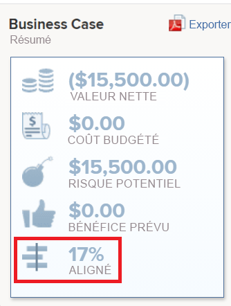
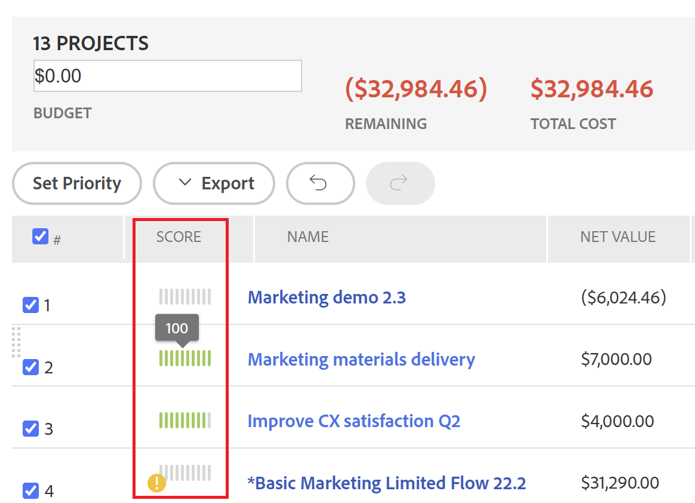

# Présentation du score [!UICONTROL Portfolio Optimizer]

<!--Audited: 01/2025-->

Vous trouverez le score de l’[!UICONTROL optimisateur de portfolio] dans l’[!UICONTROL optimisateur de portfolio]. Il apparaît dans la colonne **[!UICONTROL Score]** pour chaque projet. Cela représente un score pour chaque projet du portfolio.

Pour plus d’informations sur la localisation de l’[!UICONTROL optimisateur de portfolio], voir l’article [[!UICONTROL Vue d’ensemble de l’optimisateur de portfolio]](../../../manage-work/portfolios/portfolio-optimizer/portfolio-optimizer-overview.md).

Pour plus d’informations sur la manière dont [!DNL Adobe Workfront] utilise le score du projet et d’autres informations relatives au projet pour optimiser les projets dans l’[!UICONTROL optimisateur de portfolio], voir [Optimiser les projets dans l’optimisateur de portfolios](../../../manage-work/portfolios/portfolio-optimizer/optimize-projects-in-portfolio-optimizer.md).

## Différence entre le [!UICONTROL score d’alignement] et le [!UICONTROL score de l’optimisateur de portfolio]

Il existe une différence entre le score d’alignement et le score de l’optimisateur de portfolio d’un projet.

Le score d’alignement d’un projet est calculé sur la base des points obtenus après avoir rempli la carte de performance. Ce score est ensuite utilisé pour déterminer le score d’alignement du portfolio. Le score d’alignement est exprimé en pourcentage.

Le score d’alignement d’un projet s’affiche dans la colonne **[!UICONTROL Alignement]** de l’[!UICONTROL optimisateur de portfolio] ou dans le champ [!UICONTROL Alignement] du [!UICONTROL Récapitulatif du business case].




Pour plus d’informations sur la génération du score d’alignement d’un projet, voir l’article [Appliquer une carte de performance à un projet et générer un score d’alignement](../../../manage-work/projects/define-a-business-case/apply-scorecard-to-project-to-generate-alignment-score.md).

Le score de l’[!UICONTROL optimisateur de portfolio] est un classement automatiquement calculé dans l’[!UICONTROL optimisateur de portfolio], qui permet de classer les projets par ordre de priorité. Le score de l’optimisateur de portfolio est affiché sous la forme d’une icône d’indicateur accompagnée d’un nombre et s’affiche dans la colonne **[!UICONTROL Score]** de l’[!UICONTROL optimisateur de portfolio].

>[!NOTE]
>
>Un projet ne peut être évalué dans l’[!UICONTROL optimisateur de portfolio] que si son business case a été réalisé. Pour plus d’informations sur la réalisation d’un business case, voir l’article [[!UICONTROL Créer un business case] pour un projet](../../../manage-work/projects/define-a-business-case/create-business-case.md).



Le score attribué à chaque projet est calculé en fonction de l’importance des catégories suivantes :

* [!UICONTROL Coûts]
* [!UICONTROL Alignement]
* [!UICONTROL Valeur nette]
* [!UICONTROL Ratio risque/bénéfice]
* [!UICONTROL Retour sur investissement]

## Calculer le score de l’[!UICONTROL optimisateur de portfolio]

<!--
<p data-mc-conditions="QuicksilverOrClassic.Draft mode">(NOTE: This was edited based on this issue, per Anna: https://hub.workfront.com/issue/603d0c58000095ea0bc00ce5e2110693/overview)</p>
-->

[!DNL Workfront] produit un score à l’aide de l’[!UICONTROL optimisateur de portfolio], qui est un classement permettant de prioriser les projets. Les valeurs du portfolio sont basées sur les valeurs entrées dans les business cases des projets et sont utilisées pour calculer un score pour le projet. Les projets ayant obtenu un score plus élevé pourraient être considérés comme plus importants et être réalisés en priorité.

Pour connaître le classement d’un projet, procédez comme suit :

1. Accédez à l’[!UICONTROL optimisateur de portfolio].
1. Pointez sur l’icône de classement pour voir le score de l’optimisateur de portfolio pour un projet.


L’algorithme de calcul des scores prend en considération les valeurs décrites dans les business cases des projets et les pondérations qu’ils comportent. Il attribue un score à chaque projet dans l’optimisateur et normalise ce score de manière à ce qu’il y ait toujours un projet avec un score de 100. Cela permet d’attribuer un score élevé au meilleur projet.

>[!BEGINSHADEBOX]

**EXEMPLE**

Par exemple, si vous définissez [!UICONTROL alignement supérieur] le seul facteur à prendre en compte, le projet présentant l’alignement le plus élevé obtient le score de 100.

>[!ENDSHADEBOX]

Les critères suivants permettent de noter un projet :

* [!UICONTROL Coûts]
* [!UICONTROL Alignement]
* [!UICONTROL Valeur]
* [!UICONTROL Ratio risque/bénéfice]
* [!UICONTROL Retour sur investissement]


Pour plus d’informations sur l’optimisation des projets dans le portfolio, voir [Optimiser les projets dans l’[!UICONTROL optimisateur de portfolio]](../../../manage-work/portfolios/portfolio-optimizer/optimize-projects-in-portfolio-optimizer.md).

Chaque critère du panneau de configuration ([!UICONTROL Coût], [!UICONTROL Alignement], [!UICONTROL Retour sur investissement], [!UICONTROL Valeur nette], [!UICONTROL Ratio risque/bénéfice]) se voit attribuer une pondération de 0 à 100 en fonction de ce que vous avez sélectionné.

Pour chaque projet dont le business case a été effectué, un score par critère est généré à l’aide de la formule suivante :

```
Score Per Criteria = (Project Value For The Criteria - AVG(all the project values for this criteria)) / Standard Deviation of that value for that project
```

**Exemple :** pour le [!UICONTROL score d’alignement] pour le projet A, vous aurez les données suivantes :

```
Alignment Score = (Project A Alignment Score - AVG (of all the project Alignments)) / Standard Deviation of alignment score for that project
```

Une fois que vous avez calculé tous les [!UICONTROL scores par critère], vous pouvez les additionner en tenant compte de leur pondération pour obtenir le score total par projet. Le score du projet est calculé à l’aide de la formule suivante :

```
Score = Cost Score * Cost Weight + Alignment Score * Alignment Weight + ROI Score * ROI Weight + Net Value Score * Net Value Weight + Risk Score * Risk Weight
```

Pour le coût et le [!UICONTROL risque] du projet, la logique fonctionne à l’inverse des autres critères : si vous souhaitez que le critère [!UICONTROL Faible coût] soit important pour vous, il n’augmentera pas le score global du projet, mais le diminuera de `Cost Score * Cost Weight`.

Une fois les scores calculés pour chaque projet, le [!UICONTROL Score d’optimisation] est défini pour les projets de la manière suivante :

1. Les scores [!UICONTROL minimum] et [!UICONTROL maximum] sont définis.
1. La fourchette entre ces valeurs est calculée.
1. Pour chaque projet, le [!UICONTROL Score d’optimisation] est calculé à l’aide de la formule suivante :

   ```
   Optimization Score = Rounded ((Score - Minimum / Range)*100)
   ```
