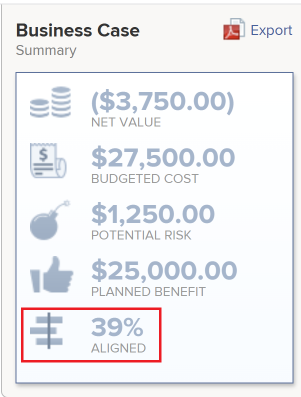

# Présentation de la variable [!UICONTROL Portfolio Optimizer] Score

Vous trouverez la variable [!UICONTROL Portfolio Optimizer] dans la variable [!UICONTROL Portfolio Optimizer]. Il s’affiche dans la variable **[!UICONTROL Score]** pour chaque projet. Ceci représente un score pour chaque projet du portfolio.

Pour plus d’informations sur la localisation de la variable [!UICONTROL Portfolio Optimizer], voir l’article [[!UICONTROL Portfolio Optimizer] aperçu](../../../manage-work/portfolios/portfolio-optimizer/portfolio-optimizer-overview.md).

Pour plus d’informations sur la manière dont [!DNL Adobe Workfront] utilise la note du projet et d’autres informations sur le projet pour optimiser les projets dans la variable [!UICONTROL Portfolio Optimizer], voir [Optimisation des projets dans Portfolio Optimizer](../../../manage-work/portfolios/portfolio-optimizer/optimize-projects-in-portfolio-optimizer.md).

## Différence entre les [!UICONTROL Score d’alignement] et le [!UICONTROL Score Portfolio Optimizer]

Il existe une différence entre le score d’alignement et le score d’optimisation de portefeuille d’un projet.

Le score d’alignement d’un projet est calculé en fonction des points obtenus après avoir rempli la fiche d’évaluation. Ce score est ensuite utilisé pour déterminer le score d’alignement du portfolio. Le score d&#39;alignement est affiché en pourcentage.\
Le score d’alignement d’un projet s’affiche dans la variable **[!UICONTROL Alignement]** de la colonne [!UICONTROL Portfolio Optimizer] ou dans la variable [!UICONTROL Alignement] du champ [!UICONTROL Résumé des cas d’affaires].




Pour plus d’informations sur la génération du score d’alignement d’un projet, consultez l’article . [Application d’une fiche d’évaluation à un projet et génération d’une note d’alignement](../../../manage-work/projects/define-a-business-case/apply-scorecard-to-project-to-generate-alignment-score.md).

Le [!UICONTROL optimiseur de portefeuille] score est un classement calculé automatiquement dans la variable [!UICONTROL Portfolio Optimizer] par laquelle les projets peuvent être prioritaires. Le score d’optimisation de portefeuille s’affiche sous la forme d’une icône d’indicateur accompagnée d’un nombre et s’affiche dans la variable **[!UICONTROL Score]** de la colonne [!UICONTROL Portfolio Optimizer].

>[!NOTE]
>
>Un projet peut être noté dans la variable [!UICONTROL Portfolio Optimizer] uniquement si son analyse de cas a été terminée. Pour plus d’informations sur l’exécution d’une analyse de cas, reportez-vous à l’article [[!UICONTROL Création d’un cas d’entreprise] pour un projet](../../../manage-work/projects/define-a-business-case/create-business-case.md).


Le score de chaque projet est calculé en fonction de l&#39;importance des catégories suivantes :

* [!UICONTROL Coûts]
* [!UICONTROL Alignement]
* [!UICONTROL Valeur nette]
* [!UICONTROL Risque bénéfique]
* [!UICONTROL Retour sur investissement]

## Calculez la variable [!UICONTROL Portfolio Optimizer] Score

<!--
<p data-mc-conditions="QuicksilverOrClassic.Draft mode">(NOTE: This was edited based on this issue, per Anna: https://hub.workfront.com/issue/603d0c58000095ea0bc00ce5e2110693/overview)</p>
-->

[!DNL Workfront] génère un score à l’aide de la variable [!UICONTROL Portfolio Optimizer] qui permet de classer les projets par ordre de priorité. Les valeurs du portfolio sont basées sur les valeurs renseignées dans les affaires des projets et sont utilisées pour calculer un score pour le projet. Les projets dont le score est plus élevé peuvent être considérés comme ayant une plus grande importance et ils peuvent être prioritairement terminés en premier.

Pour connaître le classement d’un projet, procédez comme suit :

1. Accédez au [!UICONTROL Portfolio Optimizer].
1. Passez la souris sur l’icône de classement pour afficher le score d’optimisation de portefeuille d’un projet.


L’algorithme de calcul des scores prend en compte les valeurs définies dans les Analyses de cas des projets et les poids qu’ils portent. Il attribue un score à chaque projet de l’optimiseur et normalise ce score afin qu’il y ait toujours un projet avec un score de 100. Cela donne un score élevé au meilleur projet.

**Exemple :** Par exemple, si vous effectuez les opérations suivantes : [!UICONTROL alignement supérieur] seul facteur à prendre en compte, le projet dont l’alignement est le plus élevé obtient un score de 100.

Vous trouverez ci-dessous des critères pour lesquels vous pouvez noter un projet en :

* [!UICONTROL Coûts]
* [!UICONTROL Alignement]
* [!UICONTROL Valeur]
* [!UICONTROL Risque bénéfique]
* [!UICONTROL Retour sur investissement]


Pour plus d’informations sur l’optimisation des projets dans le portefeuille, voir [Optimisation des projets dans le [!UICONTROL Portfolio Optimizer]](../../../manage-work/portfolios/portfolio-optimizer/optimize-projects-in-portfolio-optimizer.md).

Chaque critère dans le panneau de configuration ([!UICONTROL Coût], [!UICONTROL Alignement], [!UICONTROL ROI], [!UICONTROL Valeur nette], [!UICONTROL Risque bénéfique]) ont leur poids dans la plage 0-100 en fonction de ce que vous avez sélectionné.

Pour chaque projet avec une analyse de cas complète, un score par critère est généré à l’aide de la formule suivante :

```
Score Per Criteria = (Project Value For The Criteria - AVG(all the project values for this criteria)) / Standard Deviation of that value for that project
```

**Exemple :** Pour le [!UICONTROL Score d’alignement] Pour le projet A, vous aurez les éléments suivants :

```
Alignment Score = (Project A Alignment Score - AVG (of all the project Alignments)) / Standard Deviation of alignment score for that project
```

Une fois que vous avez tous les [!UICONTROL Score par critère] calculé, vous pouvez les ajouter en prenant en compte leur poids pour obtenir le score complet par projet. Le score du projet est calculé à partir de la formule suivante :

```
Score = Cost Score * Cost Weight + Alignment Score * Alignment Weight + ROI Score * ROI Weight + Net Value Score * Net Value Weight + Risk Score * Risk Weight
```

Pour le coût du projet et [!UICONTROL risque] la logique fonctionne en sens inverse de la manière dont les autres critères fonctionnent : si vous souhaitez que la variable [!UICONTROL Coût faible] pour être important pour vous, cela ne va pas augmenter mais diminuer le score global du projet par `Cost Score * Cost Weight`.

Une fois les scores calculés pour chaque projet, la variable [!UICONTROL Score d’optimisation] est définie pour les projets de la manière suivante :

1. [!UICONTROL Minimum] et [!UICONTROL Maximum] les scores sont définis.
1. La plage entre ces valeurs est calculée.
1. Pour chaque projet, la variable [!UICONTROL Score d’optimisation] est calculé à l’aide de la formule suivante :

   ```
   Optimization Score = Rounded ((Score - Minimum / Range)*100)
   ```
