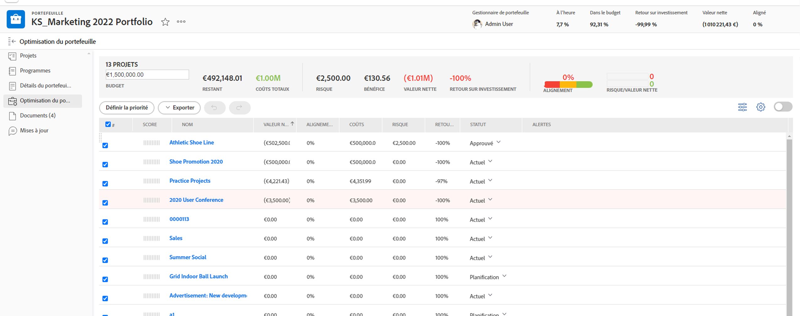

# Navigation dans un portfolio

<!--

(NOTE: This article will need to be further revised and maybe merged into Understanding Portfolios?! (other?!).)

-->

Dans [!DNL Adobe Workfront], un portefeuille représente un ensemble de projets qui se font concurrence pour les mêmes ressources, budget, planification et priorité. Le principal objectif de ce portefeuille est d’aider les cadres et les gestionnaires de projet à choisir de travailler sur des projets qui offrent le plus d’avantages à une organisation.

Pour plus d’informations sur les portefeuilles, voir [Présentation des Portfolios dans [!DNL Adobe Workfront]](../../../manage-work/portfolios/portfolios-overview/portfolio-overview.md).

## Exigences d’accès

Vous devez disposer des accès suivants pour effectuer les étapes de cet article :

<table style="table-layout:auto"> 
 <col> 
 <col> 
 <tbody> 
  <tr> 
   <td role="rowheader">[!DNL Adobe Workfront] plan*</td> 
   <td> 
Tous 
 </td> 
  </tr> 
  <tr> 
   <td role="rowheader">[!DNL Adobe Workfront] license*</td> 
   <td> 
[!UICONTROL Plan] 
 </td> 
  </tr> 
  <tr> 
   <td role="rowheader">Paramétrages du niveau d'accès*</td> 
   <td> 
Accès à [!UICONTROL Modifier] aux projets et aux Portfolios
 
Remarque : Si vous n’avez toujours pas accès à , demandez à votre [!DNL Workfront] s’ils définissent des restrictions supplémentaires au niveau de votre accès. Pour plus d’informations sur la manière dont une [!DNL Workfront] l’administrateur peut modifier votre niveau d’accès, voir <a href="../../../administration-and-setup/add-users/configure-and-grant-access/create-modify-access-levels.md" class="MCXref xref">Création ou modification de niveaux d’accès personnalisés</a>.
 </td> 
  </tr> 
  <tr> 
   <td role="rowheader">Autorisations d’objet</td> 
   <td> 
Autorisations [!UICONTROL Gérer] pour le portfolio
 
Affichage ou autorisations supérieures des projets
 
Pour plus d’informations sur la demande d’accès supplémentaire, voir <a href="../../../workfront-basics/grant-and-request-access-to-objects/request-access.md" class="MCXref xref">Demande d’accès aux objets </a>.
 </td> 
  </tr> 
 </tbody> 
</table>

&#42;Pour connaître le plan, le type de licence ou l’accès dont vous disposez, contactez votre [!DNL Workfront] administrateur.

## Navigation dans un portfolio

1. Cliquez sur le bouton **[!UICONTROL Menu Principal]** icon  dans le coin supérieur droit de [!DNL Adobe Workfront].

1. Cliquez sur [!UICONTROL Portfolios].
1. Dans la **[!UICONTROL Filtrer]** dans le menu déroulant, sélectionnez les options suivantes :

   * **[!UICONTROL Portfolios que je possède]**: inclut une liste de portefeuilles pour lesquels vous êtes désigné comme [!UICONTROL Gestionnaire de Portfolios].
   * **[!UICONTROL Tous]**: inclut tous les portefeuilles pour lesquels vous avez au moins accès à la vue.\

     Pour plus d’informations sur l’accès aux Portfolios, voir [Présentation des niveaux d’accès](../../../administration-and-setup/add-users/access-levels-and-object-permissions/access-levels-overview.md).\
      Pour plus d’informations sur les autorisations d’accès à Portfolio, voir  [Partage d’un portfolio](../../../workfront-basics/grant-and-request-access-to-objects/share-a-portfolio..md).

     Pour ajouter de nouveaux portefeuilles, voir [Création d’un portfolio](../../../manage-work/portfolios/create-and-manage-portfolios/create-portfolios.md).

1. Cliquez sur le nom d’un portefeuille pour y accéder.\
   Les mesures de performances du portfolio suivantes s’affichent dans la variable [!UICONTROL Détails du Portfolio] zone à l’intérieur d’un portfolio :

   * Si le portfolio est [!UICONTROL Heure d’activation]
   * Si le portfolio est [!UICONTROL Sur le budget]
   * La variable [!UICONTROL Retour sur investissement] (ROI)
   * Le portefeuille [!UICONTROL Alignement]
   * Le portefeuille [!UICONTROL Valeur nette]

1. (Facultatif) Cliquez sur **[!UICONTROL Projets]** dans le panneau de gauche pour afficher les projets associés au portfolio sélectionné, puis sélectionnez l’un des filtres suivants dans le **[!UICONTROL Filtrer]** menu déroulant :

   * **[!UICONTROL Actif]**: comprend tous les projets associés au portefeuille sélectionné dont les états sont les suivants :

      * [!UICONTROL Planification]
      * [!UICONTROL Approuvé]
      * [!UICONTROL Actuel]
   * **[!UICONTROL Demandé]**: inclut des projets associés au portfolio sélectionné avec le statut de **[!UICONTROL Demandé]**.

     Pour plus d’informations sur la révision des projets demandés, voir [Révision des projets demandés](../../../manage-work/portfolios/create-and-manage-portfolios/review-requested-projects.md).

   * **[!UICONTROL Tous]**: comprend tous les projets associés au portefeuille sélectionné.

     >[!NOTE]
     >
     >Pour afficher uniquement des projets spécifiques, envisagez de créer un filtre de projet dans le **[!UICONTROL Filtrer]** menu déroulant en haut de la liste des projets pour diminuer le nombre de projets affichés.

     Pour plus d’informations sur la création de filtres, voir [Présentation des filtres dans [!DNL Adobe Workfront]](../../../reports-and-dashboards/reports/reporting-elements/filters-overview.md).

1. Cliquez sur **[!UICONTROL Programmes]** dans le panneau de gauche pour créer des programmes dans le portfolio ou gérer les programmes existants.\
   Pour plus d’informations sur les programmes, voir [Création et gestion des programmes](../../../manage-work/portfolios/create-and-manage-programs/create-and-manage-programs.md) .

1. (Facultatif) Développez la variable **[!UICONTROL Détails du Portfolio]** dans le panneau de gauche, puis cliquez sur **[!UICONTROL Présentation]** ou **[!UICONTROL Forms personnalisée]** pour modifier des informations sur le portfolio.

1. (Facultatif) Cliquez sur **[!UICONTROL Optimisation des Portfolios]** dans le panneau de gauche pour optimiser les performances du portfolio.

   

   >[!IMPORTANT]
   >
   >Votre entreprise doit disposer d’un [!UICONTROL Entreprises] ou supérieur [!DNL Workfront] prévoyez d’accéder à la variable [!UICONTROL Portfolio Optimizer].

   Pour plus d’informations sur l’utilisation de Portfolio Optimizer, voir la section [Gestion des projets dans Portfolio Optimizer](../../../manage-work/portfolios/portfolio-optimizer/manage-projects-in-portfolio-optimizer.md) .

1. (Facultatif) Cliquez sur **Documents** dans le panneau de gauche pour joindre des documents au portfolio.
1. (Facultatif) Cliquez sur **[!UICONTROL Mises à jour]** dans le panneau de gauche pour ajouter des commentaires au flux de mise à jour du portfolio. Pour plus d’informations, voir [Mise à jour du travail](../../../workfront-basics/updating-work-items-and-viewing-updates/update-work.md).
1. (Facultatif) Cliquez sur le **[!UICONTROL Plus] menu**  pour effectuer l’une des opérations suivantes :

   * Désactivez le portfolio. Lorsqu’un portfolio est désactivé, vous ne pouvez plus l’associer aux projets au niveau du projet.
   * Supprimez le portfolio.

     >[!IMPORTANT]
     >
     >Cela ne supprime pas les projets associés au portfolio. Le nom du portfolio est ainsi supprimé des projets qui lui sont actuellement associés.

   * Partagez le portfolio avec d’autres utilisateurs.

1. (Facultatif) Cliquez sur le **Étoile** icon  à droite du nom du portfolio pour ajouter le portfolio à votre liste de favoris.
