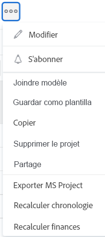

# Joindre un modèle à un projet

Vous pouvez joindre un modèle à un projet pendant la phase de création initiale du projet ou après sa création.

Pour plus d’informations sur la création d’un projet à partir d’un modèle, consultez [Créer un projet à l’aide d’un modèle](../../../manage-work/projects/create-projects/create-project-from-template.md).

## Conditions d’accès

Vous devez disposer des éléments suivants pour effectuer les étapes décrites dans cet article :

<table style="table-layout:auto"> 
 <col> 
 <col> 
 <tbody> 
  <tr> 
   <td role="rowheader">Formule Adobe Workfront*</td> 
   <td> 
Tous 
 </td> 
  </tr> 
  <tr> 
   <td role="rowheader">Licence Adobe Workfront*</td> 
   <td> 
Plan 
 </td> 
  </tr> 
  <tr> 
   <td role="rowheader">Configurations du niveau d’accès*</td> 
   <td> 
Accès en modification aux projets 
 
Pour plus d’informations sur l’accès au projet, consultez la section <a href="../../../administration-and-setup/add-users/configure-and-grant-access/grant-access-projects.md" class="MCXref xref">Accorder l’accès aux projets</a>.
 
Accès Afficher aux modèles
 
Pour plus d’informations sur les autorisations relatives aux modèles, consultez <a href="../../../workfront-basics/grant-and-request-access-to-objects/share-a-template.md" class="MCXref xref">Partager un modèle</a>. 
 
Pour plus d’informations sur l’accès aux modèles, consultez <a href="../../../administration-and-setup/add-users/configure-and-grant-access/grant-access-templates.md" class="MCXref xref">Accorder l’accès aux modèles</a>.
 
Remarque : si vous n’avez toujours pas d’accès, demandez à votre équipe d’administration Workfront s’il existe des restrictions supplémentaires à votre niveau d’accès. Pour plus d’informations sur la façon dont un administrateur ou une administratrice Workfront peut modifier votre niveau d’accès, voir <a href="../../../administration-and-setup/add-users/configure-and-grant-access/create-modify-access-levels.md" class="MCXref xref">Créer ou modifier des niveaux d’accès personnalisés</a>.
 </td> 
  </tr> 
  <tr> 
   <td role="rowheader">Autorisations d’objet</td> 
   <td> 
Autorisations de gestion pour le projet
 
Pour plus d’informations sur les autorisations de projet, consultez <a href="../../../workfront-basics/grant-and-request-access-to-objects/share-a-project.md" class="MCXref xref">Partager un projet dans Adobe Workfront</a>. 
 
Autorisations Afficher ou supérieures pour le modèle
 
Pour plus d’informations sur la demande d’accès supplémentaire, voir <a href="../../../workfront-basics/grant-and-request-access-to-objects/request-access.md" class="MCXref xref">Demander un accès aux objets</a>.
 </td> 
  </tr> 
 </tbody> 
</table>

&#42;Pour connaître le forfait, le type de licence ou l’accès dont vous disposez, contactez votre administrateur ou administratrice Workfront.

<!--

<h2>Considerations when adding templates to projects</h2>

(NOTE: moved this to an Overview article of its own) 

Consider the following when adding templates to projects:

<ul>
<li> 
You can attach only active templates to projects. 
 </li>
<li> 
You can attach a template to a project when the project is in a status of Complete, Dead, or in Pending Approval, only when your Adobe Workfront administrator or a group administrator has enabled this functionality in the Project&nbsp;Preferences area. For information about setting project preferences, see <a href="../../../administration-and-setup/set-up-workfront/configure-system-defaults/set-project-preferences.md" class="MCXref xref">Configure system-wide project preferences</a>. 
 </li>
<li> 
Unless you exclude specific template tasks from being added in the attachment process, all template tasks are added to the existing project. 
 </li>
<li> 
Most template settings are added to the project. 
 </li>
<li> 
Some settings from the template automatically transfer to the project, unless you specifically mark them to be excluded. 

Example: </b>">
<b>Example: </b>

For example, these settings are added to the project:

<ul>
<li>Start&nbsp;From field</li>
<li>Custom forms and the information on them</li>
<li>Queue Details </li>
<li>Financial settings </li>
</ul>

 </li>
</ul>

-->

## Joindre un modèle à un projet existant {#attach-a-template-to-an-existing-project}

Vous pouvez joindre un modèle à un projet dans Workfront à partir de la page du projet ou d’une liste de projets ou d’un rapport.

1. Accédez au projet auquel vous souhaitez joindre un modèle, puis cliquez sur l’icône **Plus**  à droite du nom du projet

   

   Ou

   Accédez à une liste ou à un rapport de projet et sélectionnez un projet, puis cliquez sur l’icône **Plus**  en haut de la liste.

   

1. Cliquez sur **Joindre modèle**.

   La zone Joindre un modèle s’affiche.

1. Commencez à saisir le nom du modèle que vous souhaitez joindre dans le champ **Rechercher modèles** puis cliquez dessus lorsqu’il s’affiche dans la liste.

   Ou

   Cliquez sur le nom d’un modèle dans la zone **Autres modèles**.

   Une prévisualisation du modèle s’affiche à droite et contient les informations suivantes sur le modèle :

   * Durée
   * Propriétaire
   * Nombre de tâches de niveau supérieur (y compris une liste des trois premières tâches de niveau supérieur)
   * Nombre total de tâches
   * Noms des formulaires personnalisés joints

   

1. (Facultatif) Cliquez sur l’icône **Favoris**  à gauche du nom du modèle pour le marquer comme favori. Le modèle est ainsi déplacé dans la liste Favoris.

   

1. (Facultatif) Cliquez de nouveau sur l’icône **Favoris**  pour la supprimer de la liste des favoris.
1. Cliquez sur **Personnaliser et joindre**.

   

1. Mettez à jour les informations dans les sections suivantes avant de joindre le modèle (ou cliquez sur **Joindre modèle** à tout moment) :

   <table style="table-layout:auto"> 
    <col> 
    <col> 
    <tbody> 
     <tr> 
      <td role="rowheader" colspan="2"> 
Section Tâches
 
  
 </td> 
     </tr> 
     <tr> 
      <td role="rowheader">Les tâches de modèle sélectionnées ci-dessous sont importées dans le projet.Désélectionnez celles que vous souhaitez exclure. </td> 
      <td>Désélectionnez les tâches à exclure du modèle avant de l’associer au projet.</td> 
     </tr> 
     <tr> 
      <td role="rowheader">Sélectionnez la tâche de projet que vous souhaitez désigner comme tâche antérieure pour ce modèle.</td> 
      <td> 
Cliquez sur le champ pour afficher la liste des tâches du projet. Sélectionnez la tâche de projet qui doit être terminée avant que les tâches du modèle puissent commencer. Vous pouvez également ignorer cette étape et configurer des relations au sein du projet une fois le modèle joint. 
 
 Sélectionnez le <strong>Type de dépendance</strong>, les informations de <strong>Décalage</strong> et si vous souhaitez que la tâche antérieure ait l’option <strong>Forcé</strong> ou non. 
 </td> 
     </tr> 
     <tr> 
      <td role="rowheader">Sélectionnez la tâche du projet que vous souhaitez comme parent dans ce modèle.</td> 
      <td> Sélectionnez la tâche de projet que vous souhaitez désigner comme tâche parent pour toutes les tâches du modèle. Si vous n’effectuez pas de sélection, toutes les tâches du modèle s’affichent à la fin des tâches du projet en cours. Vous pouvez ignorer cette étape et déplacer les tâches dans le projet une fois le modèle joint.</td> 
     </tr> 
     <tr> 
      <td role="rowheader" colspan="2"> 
Section Options
 
  
 </td> 
     </tr> 
     <tr> 
      <td role="rowheader">Les éléments sélectionnés ci-dessous sont transférés vers le projet. Désélectionnez ceux que vous souhaitez exclure.</td> 
      <td> 
Décochez les cases en regard des informations que vous souhaitez effacer du modèle avant de l’associer au projet. Ces informations ne sont pas transférées du modèle au projet. Pour plus d’informations sur chaque champ, consultez <a href="../../../manage-work/projects/create-and-manage-templates/attach-template-to-project-overview.md" class="MCXref xref">Vue d’ensemble de l’ajout d’un modèle à un projet</a>. 
 
Important : si vous cochez la case <strong>Configuration des propriétés et des problèmes de file d’attente</strong>, les détails de la file d’attente du modèle remplacent ceux du projet. Dans ce cas, les règles de routage, les rubriques de file d’attente et les groupes de rubriques de file d’attente du modèle sont ajoutés à ceux du projet.  Si le projet est configuré en tant que file d’attente des demandes et que le modèle que vous joignez au projet n’est pas configuré en tant que file d’attente des demandes, les informations de la file d’attente du projet sont supprimées si vous laissez la case <strong>Propriétés de file d’attente et la configuration des problèmes</strong> cochée.  Si vous décochez la case <strong>Propriétés de file d’attente et configuration des problèmes</strong>, tous les paramètres de configuration de la file d’attente du projet sont conservés et aucun paramètre de configuration de la file d’attente du modèle n’est joint. 
 </td> 
     </tr> 
     <tr> 
      <td role="rowheader" colspan="2"> 
Section de formulaires personnalisés
 
  
 </td> 
     </tr> 
     <tr> 
      <td role="rowheader">Formulaires personnalisés</td> 
      <td> 
Lorsque des formulaires personnalisés sont joints au modèle, leurs noms s’affichent dans le panneau de gauche. 
 </td> 
     </tr> 
    </tbody> 
   </table>

1. (Facultatif) Mettez à jour les informations dans les formulaires personnalisés. Ces informations sont transférées au projet.

   >[!TIP]
   >
   >* Cette étape est obligatoire lorsque les formulaires personnalisés du modèle contiennent des champs obligatoires vides.
   >* Si les champs du modèle de formulaires personnalisés existent déjà sur le projet et contiennent des informations, ils conservent les informations déjà présentes sur le projet. Vous ne pouvez pas les modifier lors de l’ajout du modèle.

1. Cliquez sur **Joindre un modèle.**
1. Cliquez sur **Annuler la pièce jointe** pour arrêter l’ajout du modèle.

   Ou

   Autorisez l’ajout de la pièce jointe pour joindre le modèle au projet.

   Après avoir joint le modèle, vous pouvez modifier le projet et ajuster les tâches, informations ou paramètres, le cas échéant.

1. (Facultatif) Cliquez sur **Détails du projet**, puis sur **Vue d’ensemble** pour afficher le nom du modèle que vous avez joint dans la zone **Relations du projet**.

   >[!TIP]
   >
   >Si vous joignez plusieurs modèles au projet, seul le modèle que vous avez joint s’affiche en premier dans ce champ. Pour plus d’informations, consultez la section [Joindre plusieurs modèles à un projet existant et afficher les informations relatives aux modèles](#attach-multiple-templates-to-an-existing-project-and-view-template-information) dans cet article.

1. (Facultatif) Supprimez les informations de modèle du projet auquel vous avez joint le modèle. Pour plus d’informations, consultez [Supprimer les informations sur les modèles d’un projet](../../../manage-work/projects/create-and-manage-templates/remove-template-from-project.md).

## Joindre plusieurs modèles à un projet existant et afficher les informations relatives aux modèles {#attach-multiple-templates-to-an-existing-project-and-view-template-information}

Vous pouvez joindre plusieurs modèles (un par un) au même projet, en suivant les étapes décrites dans la section [Joindre un modèle à un projet existant](#attach-a-template-to-an-existing-project) dans cet article. Les tâches et autres informations de chaque modèle sont ainsi ajoutées au projet.

>[!TIP]
>
>Lorsque vous joignez plusieurs modèles à un projet, seul celui que vous avez joint en premier s’affiche dans la zone Détails du projet.

Pour comprendre quel modèle est appliqué à un projet, procédez comme suit :

1. Accédez à un projet auquel est associé un modèle.
1. Cliquez sur **Détails du projet** dans le panneau de gauche.
1. Recherchez le nom du modèle associé au projet dans la section **Modèle** au bas de la section **Vue d’ensemble** sous **Relations du projet**.

   

