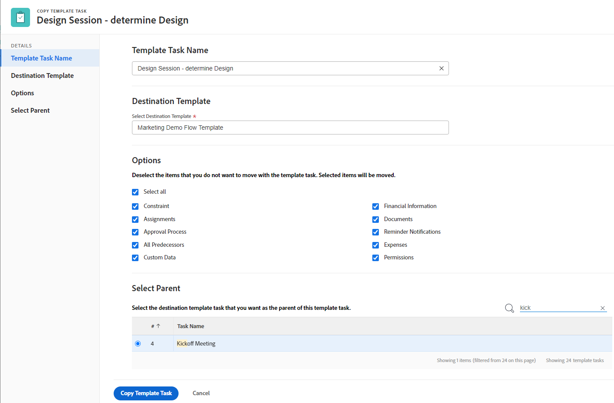
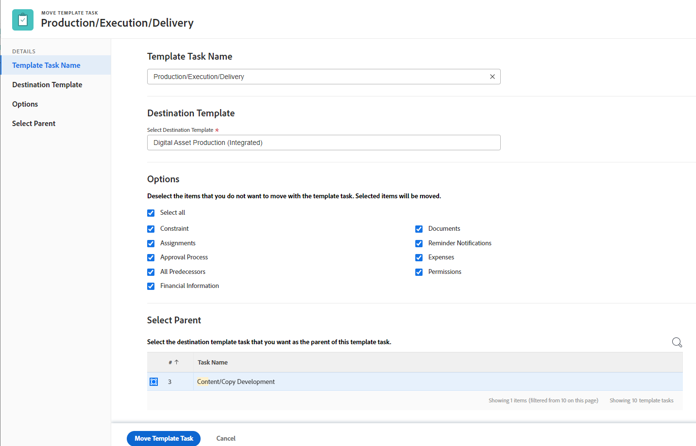

# Copier et déplacer des tâches de modèle

Vous pouvez copier une tâche de modèle d’un modèle vers un autre modèle ou la déplacer vers un autre modèle ou vers un autre emplacement du même modèle.

## Exigences d’accès

Vous devez disposer des accès suivants pour effectuer les étapes de cet article :

<table style="table-layout:auto"> 
 <col> 
 <col> 
 <tbody> 
  <tr> 
   <td role="rowheader">Formule Adobe Workfront*</td> 
   <td> 
Tous
 </td> 
  </tr> 
  <tr> 
   <td role="rowheader">Licence Adobe Workfront*</td> 
   <td> 
Plan 
 </td> 
  </tr> 
  <tr> 
   <td role="rowheader">Paramétrages du niveau d'accès*</td> 
   <td> 
Modifier l’accès aux modèles
 
<b>NOTE</b>

Si vous n’avez toujours pas accès à , demandez à votre administrateur Workfront s’il définit des restrictions supplémentaires à votre niveau d’accès. Pour plus d’informations sur la façon dont un administrateur Workfront peut modifier votre niveau d’accès, voir <a href="../../../administration-and-setup/add-users/configure-and-grant-access/create-modify-access-levels.md" class="MCXref xref">Création ou modification de niveaux d’accès personnalisés</a>.
 </td>
</tr> 
  <tr> 
   <td role="rowheader">Autorisations d’objet</td> 
   <td> 
Gérer les autorisations d’un modèle et de la tâche de modèle 
 
Pour plus d’informations sur la demande d’accès supplémentaire, voir <a href="../../../workfront-basics/grant-and-request-access-to-objects/request-access.md" class="MCXref xref">Demande d’accès aux objets </a>.
 </td> 
  </tr> 
 </tbody> 
</table>

*Pour connaître le plan, le type de licence ou l’accès dont vous disposez, contactez votre administrateur Workfront.

## Observations relatives à la copie ou au déplacement de tâches de modèle

Tenez compte des points suivants lors de la copie de tâches de modèle :

* Les informations suivantes ne sont pas transférées vers la tâche copiée :

   * Jalons

* Vous avez la possibilité de choisir de copier certains éléments associés à la tâche de modèle dans la tâche copiée au cours du processus de copie. Cependant, par défaut, les objets suivants ne sont pas transférés vers la tâche copiée :

   * Commentaires des utilisateurs

* Les formulaires personnalisés sont copiés avec la tâche de modèle lorsque vous copiez une tâche de modèle. Les informations contenues dans les champs personnalisés ne sont transférées à la nouvelle tâche de modèle que lorsque vous choisissez de copier des données personnalisées.

* Par défaut, les éléments suivants sont transférés vers la tâche de modèle copiée :

   * Sous-tâches

Tenez compte des points suivants lors du déplacement des tâches de modèle :

* Par défaut, les informations suivantes sont transférées vers la tâche déplacée :

   * Formulaires personnalisés et informations sur les champs personnalisés
   * Sous-tâches
   * Commentaires des utilisateurs

* Les informations suivantes ne sont pas transférées vers la tâche déplacée :

   * Jalons.

## Copie de tâches de modèle

Vous pouvez copier une seule tâche de modèle ou copier plusieurs tâches de modèle en bloc.

1. Accédez au modèle contenant la tâche de modèle ou les tâches de modèle à copier.
1. Cliquez sur **Tâches de modèle** dans le panneau de gauche.
1. Utilisez l’une des méthodes suivantes :
   * Cliquez sur le nom d’une tâche de modèle pour l’ouvrir.
   * Sélectionnez une ou plusieurs tâches de modèle dans la liste.
1. (Conditionnel) Cliquez sur le bouton **Plus** menu  en haut de la liste des tâches de modèle ou à droite du nom de la tâche de modèle si vous avez ouvert la tâche, cliquez sur **Copier vers** ou **Copier**, selon l’emplacement d’accès à l’option Copier .
La zone Copier la tâche de modèle s’ouvre.
   
1. (Facultatif) Renommez la tâche de modèle dans le **Nom de la tâche de modèle** champ .

   >[!TIP]
   >
   >Ce champ est grisé et ne peut pas être modifié lorsque vous sélectionnez de copier plusieurs tâches de modèle dans une liste. Vous pouvez placer le pointeur de la souris sur le champ Nom de la tâche du modèle pour afficher la liste de toutes les tâches de modèle sélectionnées.

1. Commencez à saisir le nom de la variable **Modèle de destination** où vous souhaitez copier la tâche de modèle dans le **Sélectionner le modèle de destination** puis sélectionnez-la lorsqu’elle s’affiche dans la liste.

   Le nom actuel du modèle s’affiche par défaut. Si vous souhaitez copier la tâche de modèle dans le même modèle, laissez ce champ inchangé.

   >[!TIP]
   >
   >Vous pouvez également commencer à saisir le numéro de référence ou saisir l’identifiant du modèle. Cela peut vous aider à distinguer les modèles portant des noms identiques.

1. (Conditionnel) Cliquez sur **accès aux demandes** pour demander l&#39;accès au modèle de destination, si vous n&#39;avez pas accès au modèle sélectionné.
1. (Conditionnel) Continuez à copier la tâche de modèle vers le modèle de destination sélectionné sans demander l’accès si vous avez accès à l’une des tâches de modèle dans le modèle de destination.

1. Cliquez sur **Options** dans le panneau de gauche, désélectionnez les attributs de tâche de modèle que vous ne souhaitez pas copier avec la tâche de modèle. Toutes les options sont sélectionnées par défaut.

   >[!TIP]
   >
   >Désélection **Tout sélectionner** désélectionne toutes les options.

   Désélectionnez les options suivantes pour ne pas les transférer vers la tâche de modèle copiée. Le tableau suivant décrit ce qui se produit lorsque les options sont désélectionnées :

   <table style="table-layout:auto"> 
    <col> 
    <col> 
    <tbody> 
    <tr> 
      <td role="rowheader">Sélectionner tout</td> 
      <td>Désélectionnez cette option pour supprimer toutes les informations de la tâche de modèle lors de sa copie à son nouvel emplacement. </td> 
     </tr>
     <tr> 
      <td role="rowheader">Contrainte</td> 
      <td> 
La contrainte de tâche du modèle est définie sur Dès que possible ou Aussi tard que possible en fonction du paramètre Mode de planification du modèle.
 
 Lorsque cette option est sélectionnée, la contrainte actuelle de la tâche de modèle est transférée à la tâche de modèle copiée. 
 
      
<b>NOTE</b>

   Lors de la copie d’une tâche de modèle avec des contraintes spécifiques à la date dans un autre modèle et que les dates de contrainte de la tâche de modèle ne sont pas conformes aux dates du nouveau modèle, la contrainte de la tâche de modèle passe à Dès que possible ou Aussi Tard que possible ou les dates de début planifié ou de fin planifiée des modèles sont ajustées.

   Vous trouverez ci-dessous des exemples de contraintes spécifiques aux dates :
   <ul>
      <li> Il Faut Commencer Le</li>
      <li> Il Faut Finir Le</li>
      <li> Commencer Au Plus Tôt</li>
      <li> Commencer Au Plus Tard</li>
      </ul>
     </td> 
     </tr> 
     <tr> 
      <td role="rowheader">Affectations</td> 
      <td> 
Toutes les affectations sont supprimées de la tâche de modèle. 
 </td> 
     </tr> 
     <tr> 
      <td role="rowheader">Processus d'approbation</td> 
      <td>Tous les processus de validation sont supprimés de la tâche de modèle.</td> 
     </tr>

   <tr> 
      <td role="rowheader">Tous les prédécesseurs</td> 
      <td> 
Cela signifie que les dépendances ne seront pas transférées aux tâches de modèle copiées. 
 
Lorsque cette option est sélectionnée, les prédécesseurs du groupe de tâches de modèle copiées sont conservés, d’autres sont supprimés.
 </td> 
     </tr>
     <tr> 
      <td role="rowheader">Données personnalisées</td> 
      <td> 
Les valeurs des champs personnalisés sont effacées et les formulaires personnalisés sont transférés vers la tâche de modèle copiée. 
 
Lorsque cette option est sélectionnée, les formulaires et les valeurs des champs personnalisés sont transférés vers la tâche de modèle copiée. 
 </td> 
     </tr> 
     <tr> 
      <td role="rowheader">Informations financières</td> 
      <td>Les informations financières de la tâche de modèle copiée sont supprimées et Workfront met à jour le Type de coût de la tâche de modèle sur Aucun coût et le Type de revenu de la tâche de modèle sur Non facturable.
      </td> 
     </tr> 
     <tr> 
      <td role="rowheader">Documents</td> 
      <td> 
Les documents joints à la tâche de modèle ne sont pas transférés vers la tâche de modèle copiée. Cela inclut les versions, les bons à tirer et les documents liés.
 
<b>NOTE</b>

   
Cela ne comprend pas les approbations de documents. Les validations de document ne peuvent jamais être copiées lorsqu’une tâche de modèle est copiée.
 </td> 
     </tr> 
     <tr> 
      <td role="rowheader">Notifications de rappel</td> 
      <td>Les rappels de tâche de modèle ne sont pas transférés vers la tâche de modèle copiée. </td> 
     </tr> 
     <tr> 
      <td role="rowheader">Frais</td> 
      <td>Les dépenses enregistrées dans la tâche de modèle ne sont pas transférées vers la tâche de modèle copiée. </td> 
     </tr>  
    </tbody> 
   </table>

1. (Facultatif) Cliquez sur **Sélectionner le parent** dans le panneau de gauche, sélectionnez la tâche de modèle dans le modèle de destination que vous souhaitez devenir le parent de la tâche de modèle copiée.

   >[!TIP]
   >
   >Lorsque vous choisissez de copier plusieurs tâches de modèle dans une liste, toutes les tâches de modèle sélectionnées deviennent les enfants du parent sélectionné et sont ajoutées après les tâches enfants existantes.

   Sélectionnez un parent en effectuant l’une des opérations suivantes :

   * Dans la liste des tâches du modèle, sélectionnez l’un des parents du plan de modèle.
   * Cliquez sur l’icône de recherche  et recherchez une tâche de modèle parent par nom.

   La tâche de modèle doit apparaître dans la liste.

1. Sélectionnez le bouton radio du parent une fois que vous l’avez trouvé.

   Si vous ne sélectionnez pas de tâche de modèle parent, les tâches de modèle sont copiées en tant que tâches de modèle principales plutôt que sous-tâches et sont placées à la fin de la liste des tâches de modèle sur le modèle de destination.

1. Cliquez sur **Copier la tâche de modèle**.

   Les tâches de modèle copiées se trouvent désormais sur le modèle spécifié et sont soit des sous-tâches à la tâche de modèle parent sélectionnée, soit les dernières tâches de modèle sur le modèle.

## Déplacer les tâches de modèle

Vous pouvez déplacer une tâche de modèle vers une autre tâche de modèle dans le même modèle ou vers un autre modèle. Vous pouvez déplacer une ou plusieurs tâches de modèle en bloc.

1. Accédez au modèle contenant la tâche de modèle ou les tâches de modèle à déplacer.
1. Cliquez sur **Tâches de modèle** dans le panneau de gauche.
1. Utilisez l’une des méthodes suivantes :
   * Cliquez sur le nom d’une tâche de modèle pour l’ouvrir.
   * Sélectionnez une ou plusieurs tâches de modèle dans la liste.
1. (Conditionnel) Cliquez sur le bouton **Plus** menu  en haut de la liste des tâches de modèle ou à droite du nom de la tâche de modèle si vous avez ouvert la tâche, cliquez sur **Déplacer vers** ou **Déplacer**, selon l’emplacement d’accès à l’option Déplacer .
La zone Déplacer la tâche de modèle s’affiche.
   

1. (Facultatif) Renommez la tâche de modèle dans le **Nom de la tâche de modèle** champ .

   >[!TIP]
   >
   >Ce champ est grisé et ne peut pas être modifié lorsque vous sélectionnez de déplacer plusieurs tâches de modèle dans une liste. Vous pouvez placer le pointeur de la souris sur le champ Nom de la tâche de modèle pour afficher une liste de toutes les tâches de modèle sélectionnées.

1. Commencez à saisir le nom de la variable **Modèle de destination** où vous souhaitez déplacer la tâche de modèle dans le **Sélectionner le modèle de destination** puis sélectionnez-la lorsqu’elle s’affiche dans la liste.

   >[!TIP]
   >
   >Vous pouvez également commencer à saisir le numéro de référence ou saisir l’identifiant du modèle. Cela peut vous aider à distinguer les modèles portant des noms identiques.

1. (Conditionnel) Cliquez sur **accès aux demandes** pour demander l’accès au modèle, si vous n’avez pas accès au modèle de destination.
1. (Conditionnel) Continuez à déplacer la tâche de modèle vers le modèle de destination sélectionné sans demander l’accès si vous avez accès à l’une des tâches de modèle sur le modèle de destination.

1. Cliquez sur **Options** dans le panneau de gauche, désélectionnez les attributs de tâche de modèle que vous ne souhaitez pas copier avec la tâche de modèle. Toutes les options sont sélectionnées par défaut.

   >[!TIP]
   >
   >* La section Options n’est disponible qu’après avoir sélectionné un modèle de destination.
   >* Désélection **Tout sélectionner** désélectionne toutes les options.

   Désélectionnez les options suivantes pour ne pas transférer les informations vers la tâche de modèle déplacée. Le tableau suivant décrit ce qui se produit lorsque les options sont désélectionnées :

   <table style="table-layout:auto"> 
    <col> 
    <col> 
    <tbody> 
    <tr> 
      <td role="rowheader">Sélectionner tout</td> 
      <td>Désélectionnez cette option pour supprimer toutes les informations de la tâche de modèle lorsque vous la déplacez vers son nouvel emplacement. </td> 
     </tr>
     <tr> 
      <td role="rowheader">Contrainte</td> 
      <td> 
La contrainte de tâche du modèle est définie sur Dès que possible ou Aussi tard que possible en fonction du paramètre Mode de planification du modèle.
 
 Lorsque cette option est sélectionnée, la contrainte actuelle de la tâche de modèle est transférée à la tâche de modèle déplacée. 

   
<b>NOTE</b>

   Lorsque vous déplacez une tâche de modèle avec des contraintes spécifiques à la date vers un autre modèle et que les dates de contrainte de la tâche de modèle ne sont pas conformes aux dates du nouveau modèle, la contrainte de la tâche de modèle passe à Dès que possible ou Aussi Tard que possible ou les dates de début planifié ou de fin planifiée des modèles sont ajustées.

   Vous trouverez ci-dessous des exemples de contraintes spécifiques aux dates :
   <ul>
      <li> Démarré le</li>
      <li> Il Faut Finir Le</li>
      <li> Commencer Au Plus Tôt</li>
      <li> Commencer Au Plus Tard</li>
      </ul>

   </td> 
     </tr> 
     <tr> 
      <td role="rowheader">Affectations</td> 
      <td> 
Toutes les affectations sont supprimées de la tâche de modèle. 
 </td> 
     </tr> 
     <tr> 
      <td role="rowheader">Processus d'approbation</td> 
      <td>Tous les processus de validation sont supprimés de la tâche de modèle.</td> 
     </tr>

   <tr> 
      <td role="rowheader">Tous les prédécesseurs</td> 
      <td> 
Cela signifie que les dépendances ne seront pas transférées avec les tâches de modèle déplacées. 
 
Lorsque cette option est sélectionnée, les prédécesseurs du groupe de tâches de modèle déplacées sont conservés, d’autres sont supprimés.
 </td> 
     </tr>
     <tr> 
      <td role="rowheader">Données personnalisées</td> 
      <td> 
Les valeurs des champs personnalisés sont effacées et les formulaires personnalisés sont transférés avec la tâche de modèle déplacée. 
 
Lorsque cette option est sélectionnée, les formulaires et les valeurs des champs personnalisés sont transférés avec la tâche de modèle déplacée. 
 </td> 
     </tr> 
     <tr> 
      <td role="rowheader">Informations financières</td> 
      <td>Les informations financières de la tâche de modèle déplacée sont supprimées et Workfront met à jour le Type de coût de la tâche de modèle sur Aucun coût et le Type de revenu de la tâche de modèle sur Non facturable.</td> 
     </tr> 
     <tr> 
      <td role="rowheader">Documents</td> 
      <td> 
Les documents joints à la tâche de modèle ne sont pas transférés avec la tâche de modèle déplacée. Cela inclut les versions, les bons à tirer et les documents liés.

   
<b>NOTE</b>

   <ul><li>
      
Cela ne comprend pas les approbations de documents. Les validations de document ne peuvent jamais être déplacées lorsqu’une tâche de modèle est déplacée.
 </li>
      <li>Si vous choisissez de ne pas déplacer les documents avec la tâche de modèle, les documents sont supprimés et placés dans la Corbeille pendant 30 jours. Un administrateur peut les restaurer et ils seront restaurés dans la tâche de modèle déplacée.

   Si la tâche de modèle est supprimée après son déplacement, les documents restaurés sont placés dans la zone Documents de la page utilisateur de l’administrateur qui les restaure. </li> </ul>

   </td> 
     </tr> 
     <tr> 
      <td role="rowheader">Notifications de rappel</td> 
      <td>Les rappels de tâche de modèle ne sont pas transférés vers la tâche de modèle déplacée. </td> 
     </tr> 
     <tr> 
      <td role="rowheader">Frais</td> 
      <td>Les dépenses enregistrées dans la tâche de modèle ne sont pas transférées avec la tâche de modèle déplacée. </td> 
     </tr>  
    </tbody> 
   </table>

1. (Facultatif) Cliquez sur **Sélectionner le parent** dans le panneau de gauche, sélectionnez la tâche de modèle dans le modèle de destination que vous souhaitez devenir le parent de la tâche de modèle déplacée.

   >[!TIP]
   >
   >Lorsque vous choisissez de déplacer plusieurs tâches de modèle dans une liste, toutes les tâches de modèle sélectionnées deviennent les enfants du parent sélectionné et sont ajoutées après les tâches enfants existantes.

   Sélectionnez un parent en effectuant l’une des opérations suivantes :

   * Dans la liste des tâches du modèle, sélectionnez l’un des parents du plan de modèle.
   * Cliquez sur l’icône de recherche  et recherchez une tâche de modèle parent par nom.

   La tâche de modèle doit apparaître dans la liste.

1. Sélectionnez le bouton radio du parent une fois que vous l’avez trouvé.

   Si vous ne sélectionnez pas de tâche de modèle parent, les tâches de modèle sont déplacées en tant que tâches de modèle principales plutôt que sous-tâches et elles sont placées à la fin de la liste des tâches de modèle sur le modèle de destination.

1. Cliquez sur **Déplacer la tâche de modèle**.

   Les tâches de modèle déplacées se trouvent désormais sur le modèle spécifié et sont soit des sous-tâches à la tâche de modèle parent sélectionnée, soit les dernières tâches de modèle sur le modèle.
