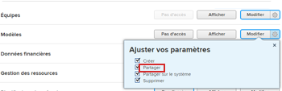

# Supprimer des modèles de projet

Nous vous recommandons de désactiver les modèles que vous n’utilisez plus au lieu de les supprimer, afin de conserver des informations historiques sur vos projets au fil du temps. Pour plus d’informations sur la désactivation d’un modèle, voir [Modifier des modèles de projet](../../../manage-work/projects/create-and-manage-templates/edit-templates.md).

>[!IMPORTANT]
>
>Lorsque vous supprimez un modèle, les projets qui l’utilisent ne sont en aucune manière modifiés. Cependant, vous ne pouvez plus voir le nom du modèle d’origine dans le champ Modèle du projet. De plus, vous ne pouvez plus afficher les noms des tâches de modèle pour les tâches du projet dans une vue de tâche. Les champs Modèle sur le projet et Tâche de modèle sur les tâches restent vides une fois le modèle initialement associé au projet supprimé.

## Conditions d’accès

+++ Développez pour afficher les exigences d’accès aux fonctionnalités de cet article.

<table style="table-layout:auto"> 
 <col> 
 <col> 
 <tbody> 
  <tr> 
   <td role="rowheader">Package Adobe Workfront</td> 
   <td> 
Tous
 </td> 
  </tr> 
  <tr> 
   <td role="rowheader">Licence Adobe Workfront</td> 
   <td>
Standard
 
   
Plan
 </td> 
  </tr> 
  <tr> 
   <td role="rowheader">Configurations des niveaux d’accès</td> 
   <td> 
Modifier l’accès aux modèles qui inclut l’accès à la suppression
 <td> 
  </tr> 
  <tr> 
   <td role="rowheader">Autorisations d’objet</td> 
   <td> 
Autorisations de gestion de l’accès au modèle incluant les autorisations de suppression
</td> 
  </tr> 
 </tbody> 
</table>

Pour plus d’informations, voir [Conditions d’accès dans la documentation Workfront](/help/quicksilver/administration-and-setup/add-users/access-levels-and-object-permissions/access-level-requirements-in-documentation.md).

+++

<!--Old:

<table style="table-layout:auto"> 
 <col> 
 <col> 
 <tbody> 
  <tr> 
   <td role="rowheader">Adobe Workfront plan*</td> 
   <td> 
Any
 </td> 
  </tr> 
  <tr> 
   <td role="rowheader">Adobe Workfront license*</td> 
   <td> 
Plan 
 </td> 
  </tr> 
  <tr> 
   <td role="rowheader">Access level configurations*</td> 
   <td> 
Edit access to Templates that includes access to Delete
 
  
 
Note: If you still don't have access, ask your Workfront administrator if they set additional restrictions in your access level. For information on how a Workfront administrator can modify your access level, see <a href="../../../administration-and-setup/add-users/configure-and-grant-access/create-modify-access-levels.md" class="MCXref xref">Create or modify custom access levels</a>.
 </td> 
  </tr> 
  <tr> 
   <td role="rowheader">Object permissions</td> 
   <td> 
Manage permissions to the template that includes permissions to Delete it
 
  
 
For information on requesting additional access, see <a href="../../../workfront-basics/grant-and-request-access-to-objects/request-access.md" class="MCXref xref">Request access to objects </a>.
 </td> 
  </tr> 
 </tbody> 
</table>-->

## Considérations relatives à la suppression de modèles

* Les tâches qui ont été ajoutées aux projets lorsque le modèle a été joint restent sur les projets. Toutefois, les informations sur la tâche de modèle associées aux tâches sont supprimées.
* Le nom du modèle n’est plus répertorié dans le champ **Modèle** du sous-onglet **Vue d’ensemble** du projet.

* Vous pouvez récupérer un modèle récemment supprimé dans la Corbeille. Pour plus d’informations sur la récupération d’éléments à partir de la Corbeille, voir [Restaurer les éléments supprimés](../../../administration-and-setup/manage-workfront/manage-deleted-items/restore-deleted-items.md).

## Supprimer un modèle

{{step1-to-templates}}

La liste des modèles s’ouvre.

1. Sélectionnez le modèle à supprimer en cochant la case située à gauche du nom du modèle, puis cliquez sur **Supprimer > Oui, supprimer** pour confirmer la suppression.

   Ou

   Cliquez sur le nom d’un modèle pour y accéder, puis sur le menu **Plus** , **Supprimer le modèle > Oui, le supprimer**.

   Le modèle ne peut plus être associé à aucun projet.
