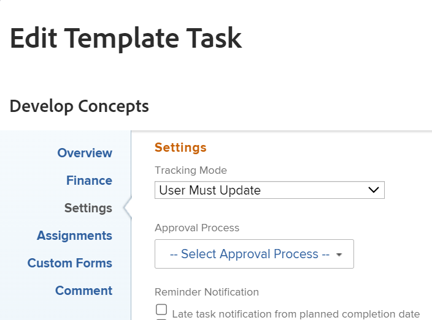

# Modifier les tâches de modèles

<!--Audited: 11/2025-->

<!--take out production and preview references and new/ old experiences at release-->

Les informations surlignées sur cette page font référence à des fonctionnalités qui ne sont pas encore disponibles de manière générale. Elle est disponible uniquement dans l’environnement de Prévisualisation pour tous les clients. Les mêmes fonctionnalités seront également disponibles dans l’environnement de production pour tous les clients et clientes à partir d’une semaine à compter de la version préliminaire.

Pour plus d’informations, voir [Modernisation des interfaces](/help/quicksilver/product-announcements/product-releases/interface-modernization/interface-modernization.md).

Après avoir créé un modèle, vous pouvez modifier les informations des tâches de modèle. Les informations que vous mettez à jour sur une tâche de modèle sont associées à des tâches de projet une fois que vous avez utilisé le modèle pour créer un projet ou que vous avez joint le modèle à un projet.

Pour plus d’informations sur la création d’un modèle, voir [Créer un modèle de projet](../../../manage-work/projects/create-and-manage-templates/create-template.md).

Vous pouvez modifier une tâche de modèle à la fois ou modifier des tâches de modèle en bloc.

>[!NOTE]
>
>Vous ne pouvez pas modifier en masse des tâches de modèle qui appartiennent à différents modèles. Vous ne pouvez modifier en masse que les tâches de modèle appartenant au même modèle.

## Conditions d’accès

+++ Développez pour afficher les exigences d’accès aux fonctionnalités de cet article.

<table style="table-layout:auto"> 
 <col> 
 <col> 
 <tbody> 
  <tr> 
   <td role="rowheader">Package Adobe Workfront</td> 
   <td> 
Tous
 </td> 
  </tr> 
  <tr> 
   <td role="rowheader">Licence Adobe Workfront</td> 
   <td> 
Standard

   
Plan 
</td> 
  </tr> 
  <tr> 
   <td role="rowheader">Configuration du niveau d’accès</td> 
   <td> 
Modifier l’accès aux modèles
  </td> 
  </tr> 
  <tr> 
   <td role="rowheader">Autorisations d’objet </td> 
   <td> 
Autorisations de gestion pour un modèle. 
 
Vous ne pouvez pas partager une tâche de modèle. 
 </td> 
  </tr> 
 </tbody> 
</table>

Pour plus d’informations, consultez la section [Conditions d’accès dans la documentation Workfront](/help/quicksilver/administration-and-setup/add-users/access-levels-and-object-permissions/access-level-requirements-in-documentation.md).

+++

<!--Old:

<table style="table-layout:auto"> 
 <col> 
 <col> 
 <tbody> 
  <tr> 
   <td role="rowheader">Adobe Workfront plan</td> 
   <td> 
Any
 </td> 
  </tr> 
  <tr> 
   <td role="rowheader">Adobe Workfront license*</td> 
   <td> 
Standard 

   
Plan 
 </td> 
  </tr> 
  <tr> 
   <td role="rowheader">Access level</td> 
   <td> 
Edit access to Templates
  </td> 
  </tr> 
  <tr> 
   <td role="rowheader">Object permissions </td> 
   <td> 
Manage permissions for a template. 
 
You cannot share a template task. 
 </td> 
  </tr> 
 </tbody> 
</table>-->

## Conditions préalables

Avant de commencer, vous devez

* Créez un modèle.

  Pour plus d’informations sur la création d’un modèle, voir [Créer un modèle de projet](../../../manage-work/projects/create-and-manage-templates/create-template.md).

## Modifier les tâches de modèles

La modification des tâches de modèle diffère selon l’environnement que vous choisissez pour modifier les tâches.

### Modification des tâches de modèle dans l’environnement de production

>[!NOTE]
>
>Certains clients peuvent modifier les tâches de modèle dans leurs environnements de production de la même manière qu’ils les modifient dans leur environnement de prévisualisation.
>
>Pour plus d’informations sur la modification des tâches dans l’environnement de prévisualisation, consultez la section [Modifier les tâches de modèle dans l’environnement de prévisualisation](#edit-template-tasks-in-the-preview-environment) dans cet article. 

Vous pouvez modifier une tâche de modèle à l&#39;aide des zones Modifier la tâche de modèle ou Détails de la tâche de modèle.

{{step1-to-templates}}

1. Cliquez sur le nom d’un modèle pour l’ouvrir.
1. Cliquez sur **Tâches de modèle** dans le panneau de gauche.
1. Cliquez sur le nom d’une tâche de modèle dans la liste pour ouvrir la tâche de modèle.
1. Pour modifier des informations limitées sur la tâche de modèle, procédez comme suit :
   1. (Facultatif) Cliquez sur **Mises à jour** dans le panneau de gauche pour ajouter des mises à jour à la tâche de modèle. Les mises à jour des tâches de modèle ne sont pas transférées aux tâches de projet lorsque le modèle est utilisé pour créer un projet.
   1. (Facultatif) Cliquez sur **Documents** dans le panneau de gauche pour ajouter des documents à la tâche de modèle. Les documents seront transférés aux tâches du projet lorsque vous utiliserez le modèle pour créer le projet.
   1. (Le cas échéant) Pour modifier des informations limitées sur une tâche de modèle, cliquez sur **Détails sur la tâche de modèle** dans le panneau de gauche, puis accédez aux zones de la section Détails pour modifier les informations de chaque zone.
   1. (Facultatif) Effectuez l’une des opérations suivantes :
      * Cliquez sur l’icône **Tout réduire**  pour réduire toutes les zones.
      * Cliquez sur l’icône **Modifier** , puis sélectionnez l’une des zones ci-dessous, ou cliquez sur **Modifier tout** pour modifier les informations de toutes les zones :

         * Vue d’ensemble
         * Forms personnalisé
Les noms des formulaires de douane s’affichent uniquement si des formulaires personnalisés sont joints à la tâche de modèle.
         * Finances

        >[!TIP]
        >
        >Pour plus d’informations sur tous les champs qui s’affichent dans la zone Détails , continuez à modifier tous les champs à l’aide de la zone Modifier la tâche de modèle , comme décrit ci-dessous.

   1. (Facultatif) Cliquez sur la section **Sous-tâches** dans le panneau de gauche pour ajouter des enfants à la tâche de modèle. L’ajout de sous-tâches pour les tâches de modèle est similaire à l’ajout de sous-tâches de projet. Pour plus d’informations, reportez-vous à la section « Création de sous-tâches à partir de la section Sous-tâches de la tâche » de l’article [Création de sous-tâches](/help/quicksilver/manage-work/tasks/create-tasks/create-subtasks.md).
   1. (Facultatif) Cliquez sur **Dépenses** dans le panneau de gauche et ajoutez des dépenses aux tâches de modèle. Les dépenses liées aux tâches de modèle sont transférées vers les tâches de projets futurs lorsque le modèle est utilisé pour créer un projet.
   1. (Facultatif) Cliquez sur **Approbations** dans le panneau de gauche pour créer des approbations ou joindre des approbations globales ou au niveau du groupe aux tâches de modèle. Les approbations sont transférées vers des tâches de projets futurs.
   1. (Facultatif) Cliquez sur la section **Prédécesseurs** dans le panneau de gauche pour ajouter des prédécesseurs pour les tâches de modèle. L’ajout de prédécesseurs de tâche de modèle est similaire à l’ajout de prédécesseurs de tâche de projet. Pour plus d’informations, voir [Créer une relation de prédécesseur à l’aide de la zone Prédécesseurs](/help/quicksilver/manage-work/tasks/use-prdcssrs/create-predecessors-in-predecessors-area.md).

1. (Facultatif) Pour modifier plusieurs tâches de modèle en masse, sélectionnez plusieurs tâches de modèle, puis cliquez sur **Modifier** en haut de la liste des modèles.
1. (Conditionnel) Pour modifier toutes les informations relatives à la tâche du modèle ou à plusieurs tâches en même temps, cliquez sur les tâches pour les sélectionner dans une liste, puis cliquez sur l&#39;icône **Modifier**  en haut de la liste.

   La zone **Modifier la tâche de modèle** s’affiche dans la nouvelle expérience.

   

   >[!TIP]
   >
   >Vous pouvez également sélectionner une tâche de modèle dans une liste, puis cliquer sur **Modifier** à droite du nom de la tâche de modèle dans l’en-tête, pour ouvrir la zone **Modifier la tâche de modèle**.

   Continuez à modifier la tâche de modèle comme décrit dans la section [&#x200B; Modifier une tâche de modèle à l’aide de la nouvelle expérience &#x200B;](#edit-a-template-task-using-the-new-experience) de cet article.

1. (Facultatif) Cliquez sur **Revenir à l’ancienne expérience** au bas de la zone **Modifier la tâche de modèle** pour ouvrir la zone **Modifier la tâche de modèle** dans l’ancienne expérience.

   

1. Pensez à spécifier des informations dans l’une des sections suivantes :

   * [Vue d’ensemble](#overview)
   * [Finances](#finance)
   * [Paramètres](#settings)
   * [Affectations](#assignments)
   * [Formulaires personnalisés](#custom-forms)
   * [Commentaire](#comment)

1. Continuez à modifier la tâche de modèle comme décrit dans la section [&#x200B; Modifier une tâche de modèle à l’aide de l’ancienne expérience &#x200B;](#edit-a-template-task-using-the-old-experience) de cet article.

#### Modifier une tâche de modèle à l’aide de l’ancienne expérience

##### Vue d’ensemble {#overview}

1. Commencez à modifier une tâche de modèle comme décrit ci-dessus.
1. Cliquez sur **Vue d’ensemble**.

   

1. Mettez à jour l’un des éléments suivants :

   <table style="table-layout:auto"> 
    <col> 
    <col> 
    <tbody> 
     <tr> 
      <td role="rowheader"><strong>Nom</strong> </td> 
      <td>Attribuez un nom à la tâche de modèle. Ce champ ne s’affiche pas lors de la modification de tâches de modèle en masse.</td> 
     </tr> 
     <tr> 
      <td role="rowheader"><strong>Description</strong> </td> 
      <td>Ajoutez des informations supplémentaires sur la tâche de modèle.</td> 
     </tr> 
     <tr> 
      <td role="rowheader"><strong>URL</strong> </td> 
      <td>Spécifiez un lien web qui se rapporte aux informations sur la tâche de modèle.</td> 
     </tr> 
     <tr> 
      <td role="rowheader"><strong>Priorité</strong> </td> 
      <td> 
Il s’agit d’un indicateur visuel qui vous permet de hiérarchiser vos tâches de modèle. 
 
Sélectionnez l’une des options suivantes :
 
       <ul> 
        <li> 
<strong>Aucune</strong> 
 </li> 
        <li> 
<strong>Faible</strong> 
 </li> 
        <li> 
 <b>Normale</b>
 </li> 
        <li> 
<b>Élevée</b> 
 </li> 
        <li> 
<b>Urgente</b> 
 </li> 
       </ul> 
Selon les préférences du projet sélectionnées par votre administrateur ou administratrice Workfront, les noms des priorités peuvent être différents pour vous. Pour plus d’informations sur la modification des priorités, voir <a href="../../../administration-and-setup/customize-workfront/creating-custom-status-and-priority-labels/create-customize-priorities.md" class="MCXref xref">Créer et personnaliser des priorités</a>.
 </td> 
     </tr> 
     <tr> 
      <td role="rowheader"><strong>Type de durée</strong> </td> 
      <td> 
La future tâche créée à partir de ce modèle aura ce type de durée.  Le type de durée identifie la relation entre les éléments suivants :
 
- nombre de ressources affectées à une tâche
 
- effort total requis pour terminer la tâche
 
- durée totale de la tâche. 
 
Les types de durée vous permettent de définir des affectations de ressources cohérentes en fonction des besoins de la tâche. Pour plus d’informations sur le type de durée d’une tâche, voir <a href="../../../manage-work/tasks/taskdurtn/task-duration-and-duration-type.md" class="MCXref xref">Vue d’ensemble de la durée de la tâche et du type de durée</a>.
 
Sélectionnez l’une des options suivantes :
 
       <ul> 
        <li> 
Calcul d’affectation 
 </li> 
        <li> 
Calcul de travail 
 </li> 
        <li> 
Piloté par l’effort 
 </li> 
        <li> 
Simple   
 </li> 
       </ul> </td> 
     </tr> 
     <tr> 
      <td role="rowheader"><strong>Durée</strong> </td> 
      <td> 
Indiquez la durée des tâches futures, en minutes, heures, jours, semaines ou mois. La durée de la tâche créée à partir de ce modèle sera spécifiée ici.
 
Par défaut, Workfront mesure la durée en jours. Il s’agit de la durée pendant laquelle vous laissez la tâche incomplète avant qu’elle soit terminée. Vous ne pouvez pas spécifier la durée d’une tâche lorsque le <strong>Type de durée</strong> de la tâche est <strong>Simple</strong>, ou lorsque la <strong>Contrainte de tâche</strong> est <strong>Dates fixes</strong>.
 
<b>IMPORTANT</b>
 
La durée correspond généralement au temps écoulé entre les dates de début et d’achèvement prévues d’une tâche de modèle. Elle affecte donc la chronologie du modèle. Cela détermine la chronologie du futur projet créé à partir du modèle. 
 </td> 
     </tr> 
     <tr> 
      <td role="rowheader"><strong>Nombre d’heures prévues</strong> </td> 
      <td> 
Indiquez le nombre d’heures prévues pour la tâche à venir sur le projet créé avec ce modèle. Il s’agit de la durée réelle nécessaire aux personnes cessionnaires de la tâche pour l’exécuter. Vous pouvez uniquement spécifier le nombre d’heures prévues d’une tâche lorsque le <strong>type de durée</strong> est défini sur <strong>Calcul d’affectation</strong>. 
 </td> 
     </tr>

   <tr> 
      <td role="rowheader"><strong>Contrainte de tâche</strong> </td> 
      <td> 
La tâche sur le projet créé à partir de ce modèle aura cette contrainte. Les contraintes de tâche déterminent à quel moment une tâche doit être terminée. 
 
Sélectionnez l’une des options suivantes :
 
       <ul> 
        <li><strong>Dates fixes</strong>. Spécifiez une <strong>Date de début prévue</strong> et une <strong>Date d’achèvement prévue</strong>.</li> 
        <li><strong>Il faut commencer le</strong>. Spécifiez une <strong>Date de début prévue</strong>.</li> 
        <li><strong>Il faut finir le</strong>. Spécifiez une <strong>Date d’achèvement prévue</strong>.</li> 
        <li><strong>Aussi tôt que possible</strong> </li> 
        <li><strong>Aussi tard que possible</strong> </li> 
        <li style="font-weight: bold;"><strong>Première heure disponible</strong> </li> 
        <li style="font-weight: bold;"><strong>Dernière heure disponible</strong> </li> 
        <li>Commencer au plus tard. Spécifiez une <strong>Date de début prévue</strong>.</li> 
        <li><strong>Commencer Au Plus Tôt</strong>. Spécifiez une <strong>Date de début prévue</strong>.</li> 
        <li><strong>Finir Au Plus Tard</strong>. Spécifiez une <strong>Date d’achèvement prévue</strong>.</li> 
        <li><strong>Finir Au Plus Tôt</strong>. Spécifiez une <strong>Date d’achèvement prévue</strong>.</li> 
       </ul> 
Pour plus d’informations sur la contrainte de tâche, voir <a href="../../../manage-work/tasks/task-constraints/task-constraint-overview.md" class="MCXref xref">Vue d’ensemble de la contrainte de tâche</a>.
 </td> 
     </tr> 
     <tr> 
      <td role="rowheader">Jour de début (facultatif et le cas échéant) </td> 
      <td> 
 Vous ne pouvez spécifier le Jour de début d'une tâche de modèle que lorsque la Contrainte de tâche est l'une des suivantes :
 
       <ul> 
        <li>Il Faut Commencer Le</li> 
        <li>Commencer Au Plus Tôt</li> 
        <li>Commencer Au Plus Tard</li> 
        <li>Dates fixes</li> 
       </ul> 
Cela correspondra à la date dans la chronologie du futur projet à laquelle la tâche démarrera. Pour toutes les autres contraintes, Workfront calcule le Jour de début en fonction de la dépendance d’antériorité entre les tâches. 
 </td> 
     </tr> 
     <tr> 
      <td role="rowheader"><strong>Jour d’achèvement</strong> (facultatif et le cas échéant) </td> 
      <td> 
 Vous ne pouvez spécifier le jour d’achèvement d’une tâche de modèle que lorsque la contrainte de tâche est l’une des suivantes :
 
       <ul style="list-style-type: circle;"> 
        <li>Il Faut Finir Le</li> 
        <li>Finir Au Plus Tôt</li> 
        <li>Finir Au Plus Tard</li> 
        <li>Dates fixes</li> 
       </ul> 
Cela correspondra à la date dans la chronologie du futur projet à laquelle la tâche sera terminée. Pour toutes les autres contraintes, Workfront calcule le jour d’achèvement en fonction de la durée et de la dépendance des tâches antérieures. 
 </td> 
     </tr> 
    </tbody> 
   </table>

1. (Facultatif) Continuez à modifier les sections suivantes, en fonction des informations que vous souhaitez modifier.

   Ou

   Cliquez sur **Enregistrer les modifications**.

##### Finances {#finance}

1. Commencez à modifier une tâche de modèle comme décrit ci-dessus.
1. Cliquez sur **Finances**.

   

1. Mettez à jour l’un des éléments suivants :

   <table style="table-layout:auto"> 
    <col> 
    <col> 
    <tbody> 
     <tr> 
      <td role="rowheader"><strong>Type de coût</strong> </td> 
      <td> 
Indiquez le type de coût de la tâche à venir. Cette option détermine la manière dont le coût de la tâche est calculé, sur la base du nombre d’heures consacrées à la tâche. 
 
Sélectionnez l’une des options suivantes :
 
       <ul> 
        <li> 
Aucun coût 
 </li> 
        <li> 
Fixe par heure 
 </li> 
        <li> 
Utilisateur ou utilisatrice, par heure 
 </li> 
        <li> 
Rôle par heure 
 </li> 
       </ul> 
Pour plus d’informations sur le suivi des coûts, consultez la section <a href="../../../manage-work/projects/project-finances/track-costs.md" class="MCXref xref">Suivi des coûts</a>.
 </td> 
     </tr> 
     <tr> 
      <td role="rowheader"><strong>Type de revenu</strong> </td> 
      <td> 
Indiquez le type de revenu pour la tâche à venir. Cela détermine comment le revenu de la tâche est calculé en fonction du nombre d’heures passées sur les tâches.
 
Sélectionnez l’une des options suivantes : 
 
       <ul> 
        <li> 
Non facturable
 </li> 
        <li> 
Utilisateur, par heure
 </li> 
        <li> 
Rôle par heure
 </li> 
        <li> 
Fixe par heure
 </li> 
        <li> 
Utilisateur par heure avec limite
 </li> 
        <li> 
Rôle par heure avec limite
 </li> 
        <li> 
Utilisateur, par heure plus fixe
 </li> 
        <li> 
Rôle par heure plus fixe
 </li> 
        <li> 
Revenus fixes
 </li> 
       </ul> 
Pour plus d’informations sur le suivi des revenus, consultez la section <a href="../../../manage-work/projects/project-finances/billing-and-revenue-overview.md" class="MCXref xref">Vue d’ensemble de la facturation et des revenus</a>.
 </td> 
     </tr> 
    </tbody> 
   </table>

1. (Facultatif) Continuez à modifier les sections suivantes, en fonction des informations que vous souhaitez modifier.

   Ou

   Cliquez sur **Enregistrer les modifications**.

##### Paramètres {#settings}

1. Commencez à modifier une tâche de modèle comme décrit ci-dessus.
1. Cliquez sur **Paramètres**.

   

1. Mettez à jour l’un des éléments suivants :

   <table style="table-layout:auto"> 
    <col> 
    <col> 
    <tbody> 
   <tr> 
      <td role="rowheader">
<b>Jalon</b>
</strong> </td> 
      <td> 
Sélectionnez un jalon à associer à la tâche de modèle sélectionnée.

   
<b>IMPORTANT</b>

   
Vous devez associer un chemin jalonné à un modèle pour que ce champ s’affiche. Pour plus d’informations, consultez la section <a href="../create-and-manage-templates/edit-templates.md">Modifier des modèles de projet</a>.
 
   </td> 
     </tr>
     <tr> 
      <td role="rowheader"><strong>Mode de suivi</strong> </td> 
      <td> 
Indiquez le mode de suivi du statut de progression de la tâche à venir. 
 
Sélectionnez l’une des options suivantes :
 
       <ul> 
        <li> 
<strong>Utilisateur ou utilisatrice doit mettre à jour</strong>. 
 </li> 
        <li> 
<strong>Supposer à l’heure</strong> 
 </li> 
        <li> 
<strong>Ignorer avertissements de retard</strong> 
 </li> 
        <li> 
<strong>Conclusion automatique</strong> 
 </li> 
        <li> 
<strong>Tâche antérieure</strong> 
 </li> 
       </ul> 
Pour plus d’informations sur le mode de suivi des tâches, consultez la section <a href="../../../manage-work/tasks/task-information/task-tracking-mode.md" class="MCXref xref">Vue d’ensemble du mode de suivi des tâches</a>.
 </td> 
     </tr> 
     <tr> 
      <td role="rowheader"><strong>Processus d’approbation</strong> </td> 
      <td> 
Sélectionnez le processus d’approbation que vous souhaitez associer à la tâche de modèle. Votre administrateur ou votre administratrice Workfront doit définir des processus d’approbation des tâches au niveau du système avant de pouvoir les associer à des tâches de modèle. Un utilisateur ou une utilisatrice disposant d’un accès administratif aux processus d’approbation peut également créer des processus d’approbation spécifiques à un groupe.Pour plus d’informations sur la création de processus d’approbation, voir <a href="../../../administration-and-setup/customize-workfront/configure-approval-milestone-processes/create-approval-processes.md" class="MCXref xref">Créer un processus d’approbation pour les éléments de travail</a>.
 
Tenez compte des éléments suivants lorsque vous ajoutez des processus d’approbation : 
 
       <ul> 
       <li>Seuls les processus d’approbation actifs sont affichés dans la liste. </li> 
       <li> 
Les processus d’approbation à l’échelle du système et spécifiques au groupe s’affichent dans la liste. Les processus d’approbation associés à un groupe autre que celui du modèle ne s’affichent pas dans la liste.
 
Important : si le groupe associé au modèle change, le processus d’approbation spécifique au groupe devient un processus d’approbation à usage unique. Pour plus d’informations sur la façon dont les modifications apportées au groupe du projet ou au processus d’approbation affectent les paramètres d’approbation, voir la section <a href="../../../administration-and-setup/customize-workfront/configure-approval-milestone-processes/how-changes-affect-group-approvals.md" class="MCXref xref">Effets des modifications du processus d’approbation et de groupe sur les processus d’approbation affectés</a>. 
 </li> 
       <li> 
Si vous avez ajouté un processus d’approbation à usage unique, il s’affiche sous la forme « &lt;Personnalisé&gt; » dans ce champ. Pour plus d’informations, voir <a href="../../../review-and-approve-work/manage-approvals/associate-approval-with-work.md" class="MCXref xref">Associer un processus d’approbation nouveau ou existant au travail</a>. 
 <!--
(NOTE: this will be valid only for Classic when they edit the Edit Template box in NWE)
--> </li> 
       <li> 
Lors de la modification en masse de tâches de modèle, les scénarios suivants existent :
 
       <ul> 
       <li> 
Lorsque vous sélectionnez des tâches de modèle dans le même groupe de modèles, les processus d’approbation au niveau du système et du groupe s’affichent dans ce champ.
 </li> 
       <li> 
Lorsque vous sélectionnez des tâches de modèle dans différents groupes de modèles, seuls les processus d’approbation au niveau du système s’affichent dans ce champ.
 </li> 
       <li> 
Lorsque l’une des tâches de modèle est associée à un processus d’approbation à usage unique, il est remplacé par le processus d’approbation au niveau du système ou au niveau du groupe que vous sélectionnez. 
 </li> 
       </ul> </li> 
       </ul> </td> 
     </tr> 
     <tr> 
      <td role="rowheader"><strong>Notifications de rappel</strong> </td> 
      <td> 
Sélectionnez les notifications de rappel que vous souhaitez joindre à la tâche de modèle. Elles seront jointes aux futures tâches du projet créé à partir de ce modèle. L’administrateur ou administratrice système doit configurer les notifications de rappel avant que vous ne puissiez les sélectionner sur une tâche. Pour plus d’informations sur la configuration des notifications de rappel, voir <a href="../../../administration-and-setup/manage-workfront/emails/set-up-reminder-notifications.md" class="MCXref xref">Configurer des notifications de rappel</a>.
 </td> 
     </tr> 
    </tbody> 
   </table>

1. (Facultatif) Continuez à modifier les sections suivantes, en fonction des informations que vous souhaitez modifier.

   Ou

   Cliquez sur **Enregistrer les modifications**.

##### Affectations {#assignments}

1. Commencez à modifier une tâche de modèle comme décrit ci-dessus.
1. Cliquez sur **Affectations**.

   

1. Cliquez sur **Ajouter une personne cessionnaire** pour ajouter une nouvelle personne cessionnaire à la tâche de modèle. Vous pouvez affecter des personnes, des rôles ou des équipes à une tâche. Vous pouvez avoir plusieurs personnes cessionnaires sur une tâche. Les tâches futures auront les mêmes ressources qui leur seront affectées lorsqu’elles seront créées à partir de cette tâche de modèle.
1. (Facultatif) Si vous avez plusieurs personnes cessionnaires, sélectionnez le bouton radio **Propriétaire** pour indiquer quel personne ou rôle est considéré comme propriétaire de la tâche ou cessionnaire principal. Workfront marque la première personne ou fonction que vous affectez à une tâche de modèle comme propriétaire ou cessionnaire principal.
1. (Conditionnel et facultatif) Si votre **Type de durée** est **Calcul de travail** ou **Piloté par l&#39;effort**, spécifiez le **Pourcentage d&#39;affectation** (pourcentage d&#39;affectation) pour chaque personne désignée. Il s’agit de la durée dans le planning de la personne cessionnaire qui peut être consacrée à cette tâche. La modification du pourcentage d’affectation d’une personne cessionnaire modifie le nombre d’heures prévues d’une tâche.
1. (Conditionnel et facultatif) Si votre **Type de durée** est **Simple**, spécifiez les **Heures** de chaque personne désignée

   Ou

   Indiquez le nombre total d’**heures prévues** pour la tâche de modèle. Cela répartit le nombre total d’heures de manière égale entre toutes les personnes cessionnaires.

1. (Conditionnel et facultatif) Si votre **Type de durée** est Simple, spécifiez le **Durée** de la tâche de modèle en jours. Cela deviendra la durée de la tâche créée à partir de ce modèle.
1. (Facultatif) Sélectionnez un rôle dans le menu déroulant des **rôles de la personne cessionnaire**. Il s’agit du rôle que la personne cessionnaire peut remplir pour cette tâche future. Seules les fonctions associées à chaque personne cessionnaire dans son profil s’affichent dans le menu déroulant.
1. (Facultatif) Continuez à modifier les sections suivantes, en fonction des informations que vous souhaitez modifier.

   Ou

   Cliquez sur **Enregistrer les modifications**.

##### Formulaires personnalisés {#custom-forms}

Vous pouvez définir des formulaires personnalisés à joindre automatiquement par défaut aux tâches lorsque les tâches sont ajoutées à un projet. Pour plus d’informations sur la configuration du projet afin d’inclure les formulaires personnalisés de tâche par défaut, consultez la section « Tâches » de l’article [Modifier des projets](../../../manage-work/projects/manage-projects/edit-projects.md).

Vous pouvez également ajouter des formulaires personnalisés aux tâches futures d’un projet lorsque celui-ci sera créé à partir d’un modèle, en ajoutant les formulaires personnalisés aux tâches de modèle.

1. Commencez à modifier une tâche de modèle comme décrit ci-dessus.
1. Cliquez sur **Formulaires personnalisés**.

   

1. Sélectionnez le ou les formulaires personnalisés à associer à la tâche de modèle.

   Vous devez créer les formulaires personnalisés avant qu’ils ne puissent être sélectionnés dans ce champ.
Seuls les formulaires personnalisés actifs s’affichent dans la liste.
Pour plus d’informations sur la création de formulaires personnalisés, voir [Créer un formulaire personnalisé](/help/quicksilver/administration-and-setup/customize-workfront/create-manage-custom-forms/form-designer/design-a-form/design-a-form.md).
Vous pouvez ajouter jusqu’à dix formulaires personnalisés à une tâche de modèle.
Les formulaires sont automatiquement ajoutés aux tâches créées à partir du modèle.
1. (Le cas échéant et facultatif) Si vous avez joint un formulaire personnalisé à la tâche de modèle, modifiez les champs du formulaire concernés. Vous devez spécifier tous les champs requis avant de pouvoir enregistrer la tâche de modèle.

   >[!NOTE]
   >
   >Selon la manière dont votre équipe d’administration Workfront définit les autorisations pour les sections de votre formulaire personnalisé, tout le monde ne peut pas afficher ou modifier les mêmes champs sur un formulaire personnalisé donné. Les autorisations de modifier les champs d’une section d’un formulaire personnalisé dépendent des autorisations que vous avez sur la tâche de modèle ou la tâche future.\
   >Pour plus d’informations sur la configuration des autorisations pour des sections d’un formulaire personnalisé, consultez la section [Partager un formulaire personnalisé](../../../administration-and-setup/customize-workfront/create-manage-custom-forms/share-access-to-a-custom-form.md).\
   >Pour plus d’informations sur la configuration des autorisations pour une tâche, voir [Partager une tâche](../../../workfront-basics/grant-and-request-access-to-objects/share-a-task.md).\
   >Pour plus d’informations sur la configuration des autorisations pour un modèle, voir [Partager un modèle](../../../workfront-basics/grant-and-request-access-to-objects/share-a-template.md).

1. (Facultatif) Continuez à modifier la section suivante, en fonction des informations que vous souhaitez modifier.

   Ou

   Cliquez sur **Enregistrer les modifications**.

##### Commentaire {#comment}

1. Commencez à modifier une tâche de modèle comme décrit ci-dessus.
1. Cliquez sur **Commentaire**.

   

1. Dans le champ disponible, entrez le commentaire que vous souhaitez afficher dans le flux de mises à jour de la tâche de modèle. Ce commentaire est visible par toutes les personnes ayant un accès en affichage au modèle et à la tâche de modèle, ainsi qu’ayant un accès à l’affichage des notes.
1. Cliquez sur **Enregistrer les modifications**.

   Lorsque vous ou une autre personne créez un projet à partir de ce modèle, tous les paramètres que vous avez appliqués aux tâches de modèle deviennent les paramètres des tâches du projet.

#### Modifier une tâche de modèle à l’aide de la nouvelle expérience

Après avoir ouvert la zone **Modifier la tâche de modèle** dans la nouvelle expérience , pensez à spécifier des informations dans l’une des sections suivantes :

* [Nom de la tâche de modèle](#template-task-name)
* [Vue d’ensemble](#overview-1)
* [Affectations](#assignments-1)
* [Finances](#finance-1)
* [Formulaires personnalisés](#custom-forms-1)
* [Paramètres](#settings-1)
* [Commentaire](#comment-1)

##### Nom de tâche de modèle

>[!TIP]
>
>La section Nom de la tâche de modèle n’est pas disponible lors de la modification de tâches de modèle en bloc.

1. Commencez à modifier une tâche de modèle comme décrit ci-dessus.
1. Dans la zone Modifier la tâche de modèle, cliquez sur **Nom de la tâche de modèle** et ajoutez un nom pour la tâche de modèle.

   Cette vue n’est pas disponible lors de la modification de tâches de modèle en bloc.

1. (Facultatif) Continuez à modifier les sections suivantes, en fonction des informations que vous souhaitez modifier.

   Ou

   Cliquer sur **Enregistrer**.

##### Vue d’ensemble {#overview-1}

1. Commencez à modifier une tâche de modèle comme décrit ci-dessus.
1. Dans la zone **Modifier la tâche de modèle**, cliquez sur **Aperçu** dans le panneau de gauche.

   

1. Mettez à jour l’un des éléments suivants :

   <table style="table-layout:auto"> 
    <col> 
    <col> 
    <tbody> 
     <tr> 
      <td role="rowheader"><strong>Description</strong> </td> 
      <td>Ajoutez des informations supplémentaires sur la tâche de modèle.</td> 
     </tr> 
     <tr> 
      <td role="rowheader"><strong>Priorité</strong> </td> 
      <td> 
Il s’agit d’un indicateur visuel qui vous permet de hiérarchiser vos tâches de modèle. 
 
Sélectionnez l’une des options suivantes :
 
       <ul> 
        <li> 
<strong>Aucune</strong> 
 </li> 
        <li> 
<strong>Faible</strong> 
 </li> 
        <li> 
 <b>Normale</b>
 </li> 
        <li> 
<b>Élevée</b> 
 </li> 
        <li> 
<b>Urgente</b> 
 </li> 
       </ul> 
Selon les préférences du projet sélectionnées par votre administrateur ou administratrice Workfront, les noms des priorités peuvent être différents pour vous. Pour plus d’informations sur la modification des priorités, voir la section <a href="../../../administration-and-setup/customize-workfront/creating-custom-status-and-priority-labels/create-customize-priorities.md" class="MCXref xref">Créer et personnaliser des priorités</a>.
 </td> 
     </tr> 
     <tr> 
      <td role="rowheader"><strong>Contrainte de tâche</strong> </td> 
      <td> 
La tâche sur le projet créé à partir de ce modèle aura cette contrainte. Les contraintes de tâche déterminent à quel moment une tâche doit être terminée. 
 
Sélectionnez l’une des options suivantes :
 
       <ul> 
        <li><strong>Dates fixes</strong>. Spécifiez une <strong>Date de début prévue</strong> et une <strong>Date d’achèvement prévue</strong>.</li> 
        <li><strong>Il faut commencer le</strong>. Spécifiez une <strong>Date de début prévue</strong>.</li> 
        <li><strong>Il faut finir le</strong>. Spécifiez une <strong>Date d’achèvement prévue</strong>.</li> 
        <li><strong>Aussi tôt que possible</strong> </li> 
        <li><strong>Aussi tard que possible</strong> </li> 
        <li style="font-weight: bold;"><strong>Première heure disponible</strong> </li> 
        <li style="font-weight: bold;"><strong>Dernière heure disponible</strong> </li> 
        <li>Commencer au plus tard. Spécifiez une <strong>Date de début prévue</strong>.</li> 
        <li><strong>Commencer Au Plus Tôt</strong>. Spécifiez une <strong>Date de début prévue</strong>.</li> 
        <li><strong>Finir Au Plus Tard</strong>. Spécifiez une <strong>Date d’achèvement prévue</strong>.</li> 
        <li><strong>Finir Au Plus Tôt</strong>. Spécifiez une <strong>Date d’achèvement prévue</strong>.</li> 
       </ul> 
Pour plus d’informations sur la contrainte de tâche, voir <a href="../../../manage-work/tasks/task-constraints/task-constraint-overview.md" class="MCXref xref">Vue d’ensemble de la contrainte de tâche</a>.
 </td> 
     </tr> 
     <tr> 
      <td role="rowheader">Jour de début (facultatif et le cas échéant) </td> 
      <td> 
 Vous ne pouvez spécifier le Jour de début d'une tâche de modèle que lorsque la Contrainte de tâche est l'une des suivantes :
 
       <ul> 
        <li>Il Faut Commencer Le</li> 
        <li>Commencer Au Plus Tôt</li> 
        <li>Commencer Au Plus Tard</li> 
        <li>Dates fixes</li> 
       </ul> 
Cela correspondra à la date dans la chronologie du futur projet à laquelle la tâche démarrera. Pour toutes les autres contraintes, Workfront calcule le Jour de début en fonction de la dépendance d’antériorité entre les tâches. 
 </td> 
     </tr> 
     <tr> 
      <td role="rowheader"><strong>Jour d’achèvement</strong> (facultatif et le cas échéant) </td> 
      <td> 
 Vous ne pouvez spécifier le jour d’achèvement d’une tâche de modèle que lorsque la contrainte de tâche est l’une des suivantes :
 
       <ul style="list-style-type: circle;"> 
        <li>Il Faut Finir Le</li> 
        <li>Finir Au Plus Tôt</li> 
        <li>Finir Au Plus Tard</li> 
        <li>Dates fixes</li> 
       </ul> 
Cela correspondra à la date dans la chronologie du futur projet à laquelle la tâche sera terminée. Pour toutes les autres contraintes, Workfront calcule le jour d’achèvement en fonction de la durée et de la dépendance des tâches antérieures. 
 </td> 
     </tr> 
     <tr> 
      <td role="rowheader"><strong>URL</strong> </td> 
      <td>Spécifiez un lien web qui se rapporte aux informations sur la tâche de modèle.</td> 
     </tr>

   <tr> 
      <td role="rowheader"><strong>Effort de travail</strong> </td> 
      <td>Choisissez l’une des options suivantes :
      <ul><li>Petite</li>
      <li>Moyen</li>
      <li>Grande</li></ul>

   
<b>IMPORTANT</b>

      
Le champ Effort de travail s’affiche lors de la modification d’une tâche de modèle uniquement lorsque vous sélectionnez le paramètre <b> Utiliser l’effort de travail pour calculer automatiquement le nombre d’heures prévues de la tâche </b> lors de la modification du modèle.

   </td> 
     </tr> 
     </tbody> 
   </table>

1. (Facultatif) Continuez à modifier les sections suivantes, en fonction des informations que vous souhaitez modifier.

   Ou

   Cliquer sur **Enregistrer**.

##### Affectations {#assignments-1}

1. Commencez à modifier une tâche de modèle comme décrit ci-dessus.
1. Dans la zone **Modifier la tâche de modèle**, cliquez sur **Affectations** dans le panneau de gauche.

   

1. Dans le champ **Rechercher des personnes, des rôles ou des équipes**, commencez à saisir le nom d’une personne désignée, puis sélectionnez-la lorsqu’elle s’affiche dans la liste

   Ou

   Cliquez sur **Me l’affecter** pour vous affecter la tâche de modèle.
1. Pensez à mettre à jour les informations suivantes :

   <table style="table-layout:auto"> 
      <col> 
      <col> 
      <tbody>

   <tr> 
         <td role="rowheader"><strong>Type de durée</strong> </td> 
         <td> 
La future tâche créée à partir de ce modèle aura ce type de durée.   Le type de durée identifie la relation entre les éléments suivants :
 
         <ul>
         <li>
Nombre de ressources affectées à une tâche
 </li>
         <li>
Effort total requis pour terminer la tâche
</li> 
         <li>
Durée totale de la tâche 
</li></ul> 
Les types de durée vous permettent de définir des affectations de ressources cohérentes en fonction des besoins de la tâche. Pour plus d’informations sur le type de durée d’une tâche, voir <a href="../../../manage-work/tasks/taskdurtn/task-duration-and-duration-type.md" class="MCXref xref">Vue d’ensemble de la durée de la tâche et du type de durée</a>.
 
Sélectionnez l’une des options suivantes :
 
         <ul> 
         <li> 
Calcul d’affectation 
 </li> 
         <li> 
Calcul de travail 
 </li> 
         <li> 
Piloté par l’effort 
 </li> 
         <li> 
Simple   
 </li> 
         </ul> </td> 
      </tr> 
      <tr> 
         <td role="rowheader"><strong>Durée</strong> </td> 
         <td> 
Indiquez la durée des tâches futures, en minutes, heures, jours, semaines ou mois. La durée de la tâche créée à partir de ce modèle sera spécifiée ici.
 
Par défaut, Workfront mesure la durée en jours. Il s’agit de la durée pendant laquelle vous laissez la tâche incomplète avant qu’elle soit terminée. Vous ne pouvez pas spécifier la durée d’une tâche lorsque le <strong>Type de durée</strong> de la tâche est <strong>Simple</strong>, ou lorsque la <strong>Contrainte de tâche</strong> est <strong>Dates fixes</strong>.
 
<b>IMPORTANT</b>
 
La durée correspond généralement au temps écoulé entre les dates de début et d’achèvement prévues d’une tâche de modèle. Elle affecte donc la chronologie du modèle. Cela détermine la chronologie du futur projet créé à partir du modèle. 
 </td> 
      </tr> 
      <tr> 
         <td role="rowheader"><strong>Nombre d’heures prévues</strong> </td> 
         <td> 
Indiquez le nombre d’heures prévues pour la tâche à venir sur le projet créé avec ce modèle. Il s’agit de la durée réelle nécessaire aux personnes cessionnaires de la tâche pour l’exécuter. Vous pouvez uniquement spécifier le nombre d’heures prévues d’une tâche lorsque le <strong>type de durée</strong> est défini sur <strong>Calcul d’affectation</strong>. 
 </td> 
      </tr> 
   </tbody> 
      </table>

1. (Facultatif) Continuez à modifier les sections suivantes, en fonction des informations que vous souhaitez modifier.

   Ou

   Cliquer sur **Enregistrer**.

##### Finances {#finance-1}

1. Commencez à modifier une tâche de modèle comme décrit ci-dessus.
1. Dans la zone **Modifier la tâche de modèle**, cliquez sur **Finances** dans le panneau de gauche.

   

1. Mettez à jour l’un des éléments suivants :

   <table style="table-layout:auto"> 
    <col> 
    <col> 
    <tbody> 
     <tr> 
      <td role="rowheader"><strong>Type de coût</strong> </td> 
      <td> 
Indiquez le type de coût de la tâche à venir. Cette option détermine la manière dont le coût de la tâche est calculé, sur la base du nombre d’heures consacrées à la tâche. 
 
Sélectionnez l’une des options suivantes :
 
       <ul> 
        <li> 
Aucun coût 
 </li> 
        <li> 
Fixe par heure 
 </li> 
        <li> 
Utilisateur ou utilisatrice, par heure 
 </li> 
        <li> 
Rôle par heure 
 </li> 
       </ul> 
Pour plus d’informations sur le suivi des coûts, consultez la section <a href="../../../manage-work/projects/project-finances/track-costs.md" class="MCXref xref">Suivi des coûts</a>.
 </td> 
     </tr> 
     <tr> 
      <td role="rowheader"><strong>Type de revenu</strong> </td> 
      <td> 
Indiquez le type de revenu pour la tâche à venir. Cela détermine comment le revenu de la tâche est calculé en fonction du nombre d’heures passées sur les tâches.
 
Sélectionnez l’une des options suivantes : 
 
       <ul> 
        <li> 
Non facturable
 </li> 
        <li> 
Utilisateur, par heure
 </li> 
        <li> 
Rôle par heure
 </li> 
        <li> 
Fixe par heure
 </li> 
        <li> 
Utilisateur par heure avec limite
 </li> 
        <li> 
Rôle par heure avec limite
 </li> 
        <li> 
Utilisateur, par heure plus fixe
 </li> 
        <li> 
Rôle par heure plus fixe
 </li> 
        <li> 
Revenus fixes
 </li> 
       </ul> 
Pour plus d’informations sur le suivi des revenus, consultez la section <a href="../../../manage-work/projects/project-finances/billing-and-revenue-overview.md" class="MCXref xref">Vue d’ensemble de la facturation et des revenus</a>.
 </td> 
     </tr> 
    </tbody> 
   </table>

1. (Facultatif) Continuez à modifier les sections suivantes, en fonction des informations que vous souhaitez modifier.

   Ou

   Cliquer sur **Enregistrer**.

##### Formulaires personnalisés {#custom-forms-1}

Vous pouvez définir des formulaires personnalisés à joindre automatiquement par défaut aux tâches lorsque les tâches sont ajoutées à un projet. Pour plus d’informations sur la configuration du projet afin d’inclure les formulaires personnalisés de tâche par défaut, consultez la section « Tâches » de l’article [Modifier des projets](../../../manage-work/projects/manage-projects/edit-projects.md).

Vous pouvez également ajouter des formulaires personnalisés aux tâches futures d’un projet lorsque celui-ci sera créé à partir d’un modèle, en ajoutant les formulaires personnalisés aux tâches de modèle.

1. Commencez à modifier une tâche de modèle comme décrit ci-dessus.
1. Dans la zone **Modifier la tâche de modèle**, cliquez sur **Forms personnalisé** dans le panneau de gauche.

   

1. Sélectionnez le ou les formulaires personnalisés à associer à la tâche de modèle.

   Vous devez créer les formulaires personnalisés avant qu’ils ne puissent être sélectionnés dans ce champ.
Seuls les formulaires personnalisés actifs sont affichés dans la liste.

   Pour plus d’informations sur la création de formulaires personnalisés, voir [Créer un formulaire personnalisé](/help/quicksilver/administration-and-setup/customize-workfront/create-manage-custom-forms/form-designer/design-a-form/design-a-form.md).

   Vous pouvez ajouter jusqu’à dix formulaires personnalisés à une tâche de modèle.
Les formulaires sont automatiquement ajoutés aux tâches créées à partir du modèle.
1. (Le cas échéant et facultatif) Si vous avez joint un formulaire personnalisé à la tâche de modèle, modifiez les champs du formulaire concernés. Vous devez spécifier tous les champs requis avant de pouvoir enregistrer la tâche de modèle.

   >[!NOTE]
   >
   >Selon la manière dont votre équipe d’administration Workfront définit les autorisations pour les sections de votre formulaire personnalisé, tout le monde ne peut pas afficher ou modifier les mêmes champs sur un formulaire personnalisé donné. Les autorisations de modifier les champs d’une section d’un formulaire personnalisé dépendent des autorisations que vous avez sur la tâche de modèle ou la tâche future.\
   >Pour plus d’informations sur la configuration des autorisations pour des sections d’un formulaire personnalisé, consultez la section [Partager un formulaire personnalisé](../../../administration-and-setup/customize-workfront/create-manage-custom-forms/share-access-to-a-custom-form.md).\
   >Pour plus d’informations sur la configuration des autorisations pour une tâche, voir [Partager une tâche](../../../workfront-basics/grant-and-request-access-to-objects/share-a-task.md).\
   >Pour plus d’informations sur la configuration des autorisations pour un modèle, voir [Partager un modèle](../../../workfront-basics/grant-and-request-access-to-objects/share-a-template.md).

1. (Facultatif) Continuez à modifier la section suivante, en fonction des informations que vous souhaitez modifier.

   Ou

   Cliquer sur **Enregistrer**.

##### Paramètres {#settings-1}

1. Commencez à modifier une tâche de modèle comme décrit ci-dessus.
1. Dans la boîte de dialogue **Modifier la tâche de modèle**, cliquez sur **Paramètres** dans le panneau de gauche.

   

1. Mettez à jour l’un des éléments suivants :

   <table style="table-layout:auto"> 
    <col> 
    <col> 
    <tbody> 
   <tr> 
      <td role="rowheader">
<b>Jalon</b>
</strong> </td> 
      <td> 
Sélectionnez un jalon à associer à la tâche de modèle sélectionnée.

   
<b>IMPORTANT</b>

   
Vous devez associer un chemin jalonné à un modèle pour que ce champ s’affiche. Pour plus d’informations, consultez la section <a href="../create-and-manage-templates/edit-templates.md">Modifier des modèles de projet</a>.
 
   </td> 
     </tr>
     <tr> 
      <td role="rowheader"><strong>Mode de suivi</strong> </td> 
      <td> 
Indiquez le mode de suivi du statut de progression de la tâche à venir. 
 
Sélectionnez l’une des options suivantes :
 
       <ul> 
        <li> 
<strong>Utilisateur ou utilisatrice doit mettre à jour</strong>. 
 </li> 
        <li> 
<strong>Supposer à l’heure</strong> 
 </li> 
        <li> 
<strong>Ignorer avertissements de retard</strong> 
 </li> 
        <li> 
<strong>Conclusion automatique</strong> 
 </li> 
        <li> 
<strong>Tâche antérieure</strong> 
 </li> 
       </ul> 
Pour plus d’informations sur le mode de suivi des tâches, consultez la section <a href="../../../manage-work/tasks/task-information/task-tracking-mode.md" class="MCXref xref">Vue d’ensemble du mode de suivi des tâches</a>.
 </td> 
     </tr> 
     <tr> 
      <td role="rowheader"><strong>Notifications de rappel</strong> </td> 
      <td> 
Sélectionnez les notifications de rappel que vous souhaitez joindre à la tâche de modèle. Elles seront jointes aux futures tâches du projet créé à partir de ce modèle. L’administrateur ou administratrice système doit configurer les notifications de rappel avant que vous ne puissiez les sélectionner sur une tâche. Pour plus d’informations sur la configuration des notifications de rappel, voir <a href="../../../administration-and-setup/manage-workfront/emails/set-up-reminder-notifications.md" class="MCXref xref">Configurer des notifications de rappel</a>.
 </td> 
     </tr> 
     <tr> 
      <td role="rowheader"><strong>Processus d’approbation</strong> </td> 
      <td> 
Sélectionnez le processus d’approbation que vous souhaitez associer à la tâche de modèle. Votre administrateur ou votre administratrice Workfront doit définir des processus d’approbation des tâches au niveau du système avant de pouvoir les associer à des tâches de modèle. Un utilisateur ou une utilisatrice disposant d’un accès administratif aux processus d’approbation peut également créer des processus d’approbation spécifiques à un groupe.Pour plus d’informations sur la création de processus d’approbation, voir <a href="../../../administration-and-setup/customize-workfront/configure-approval-milestone-processes/create-approval-processes.md" class="MCXref xref">Créer un processus d’approbation pour les éléments de travail</a>.
 
Tenez compte des éléments suivants lorsque vous ajoutez des processus d’approbation : 
 
       <ul> 
       <li>Seuls les processus d’approbation actifs sont affichés dans la liste. </li> 
       <li> 
Les processus d’approbation à l’échelle du système et spécifiques au groupe s’affichent dans la liste. Les processus d’approbation associés à un groupe autre que celui du modèle ne s’affichent pas dans la liste.
 
Important : si le groupe associé au modèle change, le processus d’approbation spécifique au groupe devient un processus d’approbation à usage unique. Pour plus d’informations sur la façon dont les modifications apportées au groupe du projet ou au processus d’approbation affectent les paramètres d’approbation, voir la section <a href="../../../administration-and-setup/customize-workfront/configure-approval-milestone-processes/how-changes-affect-group-approvals.md" class="MCXref xref">Effets des modifications du processus d’approbation et de groupe sur les processus d’approbation affectés</a>. 
 </li> 
       <li> 
Si vous avez ajouté un processus d’approbation à usage unique, il s’affiche sous la forme « &lt;Personnalisé&gt; » dans ce champ. Pour plus d’informations, voir <a href="../../../review-and-approve-work/manage-approvals/associate-approval-with-work.md" class="MCXref xref">Associer un processus d’approbation nouveau ou existant au travail</a>. 
  </li> 
       <li> 
Lors de la modification en masse de tâches de modèle, les scénarios suivants existent :
 
       <ul> 
       <li> 
Lorsque vous sélectionnez des tâches de modèle dans le même groupe de modèles, les processus d’approbation au niveau du système et du groupe s’affichent dans ce champ.
 </li> 
       <li> 
Lorsque vous sélectionnez des tâches de modèle dans différents groupes de modèles, seuls les processus d’approbation au niveau du système s’affichent dans ce champ.
 </li> 
       <li> 
Lorsque l’une des tâches de modèle est associée à un processus d’approbation à usage unique, il est remplacé par le processus d’approbation au niveau du système ou au niveau du groupe que vous sélectionnez. 
 </li> 
       </ul> </li> 
       </ul> </td> 
     </tr>

   </tbody> 
   </table>

1. (Facultatif) Continuez à modifier les sections suivantes, en fonction des informations que vous souhaitez modifier.

   Ou

   Cliquer sur **Enregistrer**.

##### Commentaire {#comment-1}

1. Commencez à modifier une tâche de modèle comme décrit ci-dessus.
1. Dans la zone **Modifier la tâche de modèle**, cliquez sur **Commentaire** dans le panneau de gauche.

   

1. Dans la zone **Ajouter une mise à jour à la tâche de modèle**, indiquez un commentaire que vous souhaitez afficher dans le flux de mises à jour de la tâche de modèle dans le champ disponible. Ce commentaire est visible par toutes les personnes ayant un accès en affichage au modèle et à la tâche de modèle, ainsi qu’ayant un accès à l’affichage des notes.
1. Cliquer sur **Enregistrer**.

   Lorsque vous ou une autre personne créez un projet à partir de ce modèle, tous les paramètres que vous avez appliqués aux tâches de modèle deviennent les paramètres des tâches du projet.

### Modifier les tâches de modèles dans l’environnement de Prévisualisation

Vous pouvez modifier une tâche de modèle à l&#39;aide des zones Modifier la tâche de modèle ou Détails de la tâche de modèle.

{{step1-to-templates}}

1. Cliquez sur le nom d’un modèle pour l’ouvrir.
1. Cliquez sur **Tâches de modèle** dans le panneau de gauche.
1. Cliquez sur le nom d’une tâche de modèle dans la liste pour ouvrir la tâche de modèle.
1. Pour modifier des informations limitées sur la tâche de modèle, procédez comme suit :
   1. (Facultatif) Cliquez sur **Mises à jour** dans le panneau de gauche pour ajouter des mises à jour à la tâche de modèle. Les mises à jour des tâches de modèle ne sont pas transférées aux tâches de projet lorsque le modèle est utilisé pour créer un projet.
   1. (Facultatif) Cliquez sur **Documents** dans le panneau de gauche pour ajouter des documents à la tâche de modèle. Les documents seront transférés aux tâches du projet lorsque vous utiliserez le modèle pour créer le projet.
   1. (Le cas échéant) Pour modifier des informations limitées sur une tâche de modèle, cliquez sur **Détails sur la tâche de modèle** dans le panneau de gauche, puis accédez aux zones de la section Détails pour modifier les informations de chaque zone.
   1. (Facultatif) Effectuez l’une des opérations suivantes :
      * Cliquez sur l’icône **Tout réduire**  pour réduire toutes les zones.
      * Cliquez sur l’icône **Modifier** , puis sélectionnez l’une des zones ci-dessous, ou cliquez sur **Modifier tout** pour modifier les informations de toutes les zones :

         * Vue d’ensemble
         * Forms personnalisé
Les noms des formulaires de douane s’affichent uniquement si des formulaires personnalisés sont joints à la tâche de modèle.
         * Finances

        >[!TIP]
        >
        >Pour plus d’informations sur tous les champs qui s’affichent dans la zone Détails , continuez à modifier tous les champs à l’aide de la zone Modifier la tâche de modèle , comme décrit ci-dessous.

   1. (Facultatif) Cliquez sur la section **Sous-tâches** dans le panneau de gauche pour ajouter des enfants à la tâche de modèle. L’ajout de sous-tâches pour les tâches de modèle est similaire à l’ajout de sous-tâches de projet. Pour plus d’informations, reportez-vous à la section « Création de sous-tâches à partir de la section Sous-tâches de la tâche » de l’article [Création de sous-tâches](/help/quicksilver/manage-work/tasks/create-tasks/create-subtasks.md).
   1. (Facultatif) Cliquez sur **Dépenses** dans le panneau de gauche et ajoutez des dépenses aux tâches de modèle. Les dépenses liées aux tâches de modèle sont transférées vers les tâches de projets futurs lorsque le modèle est utilisé pour créer un projet.
   1. (Facultatif) Cliquez sur **Approbations** dans le panneau de gauche pour créer des approbations ou joindre des approbations globales ou au niveau du groupe aux tâches de modèle. Les approbations sont transférées vers des tâches de projets futurs.
   1. (Facultatif) Cliquez sur la section **Prédécesseurs** dans le panneau de gauche pour ajouter des prédécesseurs pour les tâches de modèle. L’ajout de prédécesseurs de tâche de modèle est similaire à l’ajout de prédécesseurs de tâche de projet. Pour plus d’informations, voir [Créer une relation de prédécesseur à l’aide de la zone Prédécesseurs](/help/quicksilver/manage-work/tasks/use-prdcssrs/create-predecessors-in-predecessors-area.md).

1. (Conditionnel) Pour modifier toutes les informations relatives à une tâche de modèle ou à plusieurs tâches en même temps, cliquez sur les tâches pour les sélectionner dans une liste, puis cliquez sur l’icône **Modifier**  en haut de la liste.

   La zone **Modifier la tâche de modèle** s’affiche.

   

   >[!TIP]
   >
   >Vous pouvez également sélectionner une tâche de modèle dans une liste, puis cliquer sur **Modifier** à droite du nom de la tâche de modèle dans l’en-tête, pour ouvrir la zone **Modifier la tâche de modèle**.

1. Pensez à spécifier des informations dans l’une des sections suivantes :

* [Nom de la tâche de modèle](#template-task-name)
* [Vue d’ensemble](#overview-2)
* [Affectations](#assignments-2)
* [Finances](#finance-2)
* [Formulaires personnalisés](#custom-forms-2)
* [Paramètres](#settings-2)
* [Commentaire](#comment-2)

1. Continuez à modifier les tâches de modèles comme décrit dans les sections ci-dessous.

#### Nom de tâche de modèle

>[!TIP]
>
>La section Nom de la tâche de modèle n’est pas disponible lors de la modification de tâches de modèle en bloc.

1. Commencez à modifier une tâche de modèle comme décrit ci-dessus.
1. Dans la zone Modifier la tâche de modèle, cliquez sur **Nom de la tâche de modèle** et ajoutez un nom pour la tâche de modèle.

   Cette vue n’est pas disponible lors de la modification de tâches de modèle en bloc.

1. (Facultatif) Continuez à modifier les sections suivantes, en fonction des informations que vous souhaitez modifier.

   Ou

   Cliquer sur **Enregistrer**.

#### Vue d’ensemble {#overview-2}

1. Commencez à modifier une tâche de modèle comme décrit ci-dessus.
1. Dans la zone **Modifier la tâche de modèle**, cliquez sur **Aperçu** dans le panneau de gauche.

   

1. Mettez à jour l’un des éléments suivants :

   <table style="table-layout:auto"> 
    <col> 
    <col> 
    <tbody> 
     <tr> 
      <td role="rowheader"><strong>Description</strong> </td> 
      <td>Ajoutez des informations supplémentaires sur la tâche de modèle.</td> 
     </tr> 
     <tr> 
      <td role="rowheader"><strong>Priorité</strong> </td> 
      <td> 
Il s’agit d’un indicateur visuel qui vous permet de hiérarchiser vos tâches de modèle. 
 
Sélectionnez l’une des options suivantes :
 
       <ul> 
        <li> 
<strong>Aucune</strong> 
 </li> 
        <li> 
<strong>Faible</strong> 
 </li> 
        <li> 
 <b>Normale</b>
 </li> 
        <li> 
<b>Élevée</b> 
 </li> 
        <li> 
<b>Urgente</b> 
 </li> 
       </ul> 
Selon les préférences du projet sélectionnées par votre administrateur ou administratrice Workfront, les noms des priorités peuvent être différents pour vous. Pour plus d’informations sur la modification des priorités, voir la section <a href="../../../administration-and-setup/customize-workfront/creating-custom-status-and-priority-labels/create-customize-priorities.md" class="MCXref xref">Créer et personnaliser des priorités</a>.
 </td> 
     </tr> 
     <tr> 
      <td role="rowheader"><strong>Contrainte de tâche</strong> </td> 
      <td> 
La tâche sur le projet créé à partir de ce modèle aura cette contrainte. Les contraintes de tâche déterminent à quel moment une tâche doit être terminée. 
 
Sélectionnez l’une des options suivantes :
 
       <ul> 
        <li><strong>Dates fixes</strong>. Spécifiez une <strong>Date de début prévue</strong> et une <strong>Date d’achèvement prévue</strong>.</li> 
        <li><strong>Il faut commencer le</strong>. Spécifiez une <strong>Date de début prévue</strong>.</li> 
        <li><strong>Il faut finir le</strong>. Spécifiez une <strong>Date d’achèvement prévue</strong>.</li> 
        <li><strong>Aussi tôt que possible</strong> </li> 
        <li><strong>Aussi tard que possible</strong> </li> 
        <li style="font-weight: bold;"><strong>Première heure disponible</strong> </li> 
        <li style="font-weight: bold;"><strong>Dernière heure disponible</strong> </li> 
        <li>Commencer au plus tard. Spécifiez une <strong>Date de début prévue</strong>.</li> 
        <li><strong>Commencer Au Plus Tôt</strong>. Spécifiez une <strong>Date de début prévue</strong>.</li> 
        <li><strong>Finir Au Plus Tard</strong>. Spécifiez une <strong>Date d’achèvement prévue</strong>.</li> 
        <li><strong>Finir Au Plus Tôt</strong>. Spécifiez une <strong>Date d’achèvement prévue</strong>.</li> 
       </ul> 
Pour plus d’informations sur la contrainte de tâche, voir <a href="../../../manage-work/tasks/task-constraints/task-constraint-overview.md" class="MCXref xref">Vue d’ensemble de la contrainte de tâche</a>.
 </td> 
     </tr> 
     <tr> 
      <td role="rowheader">Jour de début (facultatif et le cas échéant) </td> 
      <td> 
 Vous ne pouvez spécifier le Jour de début d'une tâche de modèle que lorsque la Contrainte de tâche est l'une des suivantes :
 
       <ul> 
        <li>Il Faut Commencer Le</li> 
        <li>Commencer Au Plus Tôt</li> 
        <li>Commencer Au Plus Tard</li> 
        <li>Dates fixes</li> 
       </ul> 
Cela correspondra à la date dans la chronologie du futur projet à laquelle la tâche démarrera. Pour toutes les autres contraintes, Workfront calcule le Jour de début en fonction de la dépendance d’antériorité entre les tâches. 
 </td> 
     </tr> 
     <tr> 
      <td role="rowheader"><strong>Jour d’achèvement</strong> (facultatif et le cas échéant) </td> 
      <td> 
 Vous ne pouvez spécifier le jour d’achèvement d’une tâche de modèle que lorsque la contrainte de tâche est l’une des suivantes :
 
       <ul style="list-style-type: circle;"> 
        <li>Il Faut Finir Le</li> 
        <li>Finir Au Plus Tôt</li> 
        <li>Finir Au Plus Tard</li> 
        <li>Dates fixes</li> 
       </ul> 
Cela correspondra à la date dans la chronologie du futur projet à laquelle la tâche sera terminée. Pour toutes les autres contraintes, Workfront calcule le jour d’achèvement en fonction de la durée et de la dépendance des tâches antérieures. 
 </td> 
     </tr> 
     <tr> 
      <td role="rowheader"><strong>URL</strong> </td> 
      <td>Spécifiez un lien web qui se rapporte aux informations sur la tâche de modèle.</td> 
     </tr>

   <tr> 
      <td role="rowheader"><strong>Effort de travail</strong> </td> 
      <td>Choisissez l’une des options suivantes :
      <ul><li>Petite</li>
      <li>Moyen</li>
      <li>Grande</li></ul>

   
<b>IMPORTANT</b>

      
Le champ Effort de travail s’affiche lors de la modification d’une tâche de modèle uniquement lorsque vous sélectionnez le paramètre <b> Utiliser l’effort de travail pour calculer automatiquement le nombre d’heures prévues de la tâche </b> lors de la modification du modèle.

   </td> 
     </tr> 
     </tbody> 
   </table>

1. (Facultatif) Continuez à modifier les sections suivantes, en fonction des informations que vous souhaitez modifier.

   Ou

   Cliquer sur **Enregistrer**.

#### Affectations {#assignments-2}

1. Commencez à modifier votre tâche de modèle comme décrit ci-dessus.
1. Cliquez sur **Affectations** dans le panneau de gauche.

   La zone **Affectations** s’ouvre.

   

1. Commencez à saisir le nom d’un utilisateur, d’une fonction ou d’une équipe dans le champ **Rechercher des personnes, un rôle ou une équipe**, puis sélectionnez-les lorsqu’elles s’affichent dans la liste.

1. Mettez à jour les informations suivantes :

   <table style="table-layout:auto"> 
   <col> 
   <col> 
   <tbody> 
   <tr> 
   <td role="rowheader">Type de durée</td> 
   <td> 
Cela identifie la relation entre les éléments suivants : 
 
   <ul> 
   <li> 
Nombre de ressources affectées à une tâche 
 </li> 
   <li> 
Effort total requis pour terminer la tâche 
 </li> 
   <li> 
 Durée totale de la tâche. 
 </li> 
   </ul> 
Votre administrateur Workfront ou un administrateur de groupes sélectionne le paramètre Type de durée par défaut pour les tâches de votre système ou de votre groupe. Pour plus d'informations sur la définition des paramètres par défaut du projet, voir <a href="../../../administration-and-setup/set-up-workfront/configure-system-defaults/set-task-issue-preferences.md" class="MCXref xref">Configurer les préférences de tâches et de problèmes à l'échelle du système</a>. 
 
Les types de durée vous permettent de définir des affectations de ressources cohérentes en fonction des besoins de la tâche. Pour plus d’informations sur le type de durée d’une tâche, voir <a href="../../../manage-work/tasks/taskdurtn/task-duration-and-duration-type.md" class="MCXref xref">Vue d’ensemble de la durée de la tâche et du type de durée</a>. 
 
Sélectionnez l’une des options suivantes : 
 
   <ul> 
   <li> 
Calcul d'affectation 
 </li> 
   <li> 
 Calcul de travail 
 </li> 
   <li> 
Piloté par l'effort 
 </li> 
   <li> 
Simple
 </li> 
   </ul> </td> 
   </tr> 
   <tr data-mc-conditions="QuicksilverOrClassic.Quicksilver"> 
   <td role="rowheader">Durée par occurrence</td> 
   <td> 
Cela s’affiche uniquement sur le parent des tâches récurrentes. La durée de chaque tâche récurrente est affichée, telle que définie lors de la création de la tâche. Pour plus d’informations sur la création de tâches récurrentes, voir <a href="../../../manage-work/tasks/create-tasks/create-recurring-tasks.md" class="MCXref xref">Créer des tâches récurrentes</a>. 
 
 <b>NOTE</b>

   Les durées modifiées dans des tâches récurrentes individuelles n’affichent pas la valeur indiquée dans ce champ. 
 </td>
   </tr> 
   <tr> 
   <td role="rowheader">Durée</td> 
   <td> 
   
 
   
 
   
Il s’agit de la durée pendant laquelle vous laissez une tâche ouverte avant qu’elle soit terminée. 
 
   
<b>IMPORTANT</b>

   
Comme la durée de la tâche correspond généralement à la durée entre les dates de début et d’achèvement prévues, elle affecte la chronologie du projet.
 
   
Pour indiquer la durée de la tâche et l’unité de temps, procédez comme suit :
 
   <ul> 
   <li> 
Saisissez la durée et sélectionnez l’unité de temps disponible dans le menu déroulant.
 
<b>CONSEIL</b>

   Lorsque vous mettez à jour la durée des tâches dans une liste de tâches, vous pouvez utiliser l’abréviation pour l’unité de temps. 
 </li> 
   </ul> 
   
 Vous pouvez choisir parmi les options de temps normal ou de temps écoulé dans le tableau suivant : 
 
   <table style="table-layout:auto"> 
   <col> 
   <col data-mc-conditions=""> 
   <tbody> 
   <tr> 
   <td>Unité de temps</td> 
   <td>Abréviation</td> 
   </tr> 
   <tr> 
   <td>Minutes</td> 
   <td>L</td> 
   </tr> 
   <tr> 
   <td>Heures</td> 
   <td>H</td> 
   </tr> 
   <tr> 
   <td>Jours. Il s’agit de la valeur par défaut. </td> 
   <td>Dés</td> 
   </tr> 
   <tr> 
   <td>Semaines</td> 
   <td>S</td> 
   </tr> 
   <tr> 
   <td>Mois</td> 
   <td>M</td> 
   </tr> 
   <tr> 
   <td>Minutes écoulées</td> 
   <td>ME</td> 
   </tr> 
   <tr> 
   <td>Heures écoulées</td> 
   <td>HE</td> 
   </tr> 
   <tr> 
   <td>Jours écoulés</td> 
   <td>JE</td> 
   </tr> 
   <tr> 
   <td>Semaines écoulées</td> 
   <td>SE</td> 
   </tr> 
   <tr> 
   <td>Mois écoulés</td> 
   <td>TE</td> 
   </tr> 
   </tbody> 
   </table>

   
<b>NOTE</b>

   
Le temps écoulé est une unité de temps pour la durée d’une tâche. Il s’agit de la durée entre la date de début et la date d’achèvement prévues d’une tâche qui comprend les jours fériés, les week-ends et les jours de congé. En d’autres termes, le temps écoulé est le nombre de jours calendaires écoulés.

   Le temps normal prend en compte les jours fériés, les week-ends et les jours de congé et les exclut de la durée de la tâche. Pour plus d’informations sur la durée de la tâche, voir <a href="../../../manage-work/tasks/taskdurtn/task-duration-and-duration-type.md" class="MCXref xref">Vue d’ensemble de la durée de la tâche et du type de durée</a>. 

   
 
   
 </td> 
   </tr> 
   <tr> 
   <td role="rowheader">Heures prévues</td> 
   <td> 
Spécifiez le nombre d’heures prévues pour la tâche, en heures. Il s’agit de la quantité de temps réel nécessaire aux personnes assignées à la tâche pour la terminer. Vous ne pouvez spécifier le nombre d'heures prévues pour une tâche que lorsque le type de durée est défini sur Calcul d'affectation. Pour plus d’informations sur les types de durée, voir <a href="../../../manage-work/tasks/taskdurtn/task-duration-and-duration-type.md" class="MCXref xref">Vue d’ensemble de la durée de la tâche et du type de durée</a>.
 
   <b>NOTE</b>
   

   Lors de la création de tâches récurrentes, les heures prévues sont celles de chaque occurrence. Les heures prévues des tâches parent correpondent au nombre total d’heures prévues de toutes les occurrences. Pour plus d’informations sur la création de tâches récurrentes, voir <a href="../../../manage-work/tasks/create-tasks/create-recurring-tasks.md" class="MCXref xref">Créer des tâches récurrentes</a>.
   

   </td> 
   </tr> 
   <tr> 
   <td role="rowheader">Allocation</td> 
   <td> 
Si la contrainte de tâche est Calcul de travail ou Piloté par l’effort, spécifiez la variable <strong>% d’affectation</strong> (pourcentage d’affectation) pour chaque personne cessionnaire. Il s’agit de la durée dans le planning de la personne cessionnaire qui peut être consacrée à cette tâche. La modification du pourcentage d’affectation d’une personne cessionnaire modifie le nombre d’heures prévues d’une tâche. 
 
Lorsque la contrainte de tâche est simple, vous pouvez spécifier les éléments suivants :
 
   <ul> 
   <li> 
Nombre d’heures d’affectation de chaque personne cessionnaire.
 </li> 
   <li> 
Nombre d’heures prévues de la tâche.
 </li> 
   <li> 
Durée de la tâche.
 </li> 
   </ul> </td> 
   </tr> 
   <tr> 
   <td role="rowheader">Rôle du cessionnaire</td> 
   <td> 
Sélectionnez un rôle dans le menu déroulant <strong>Rôle de la personne cessionnaire</strong> lorsque vous avez sélectionné une personne comme personne cessionnaire. Il s’agit du rôle que la personne cessionnaire peut remplir pour cette tâche. 
 
<b>CONSEIL</b>

   Seules les fonctions associées à chaque personne cessionnaire dans son profil s’affichent dans le menu déroulant.
 </td>
   </tr> 
   </tbody> 
   </table>

1. Cliquez sur **Enregistrer** ou passez aux sections suivantes.

#### Finances {#finance-2}

1. Commencez à modifier une tâche de modèle comme décrit ci-dessus.
1. Dans la zone **Modifier la tâche de modèle**, cliquez sur **Finances** dans le panneau de gauche.

   

1. Mettez à jour l’un des éléments suivants :

   <table style="table-layout:auto"> 
    <col> 
    <col> 
    <tbody> 
     <tr> 
      <td role="rowheader"><strong>Type de coût</strong> </td> 
      <td> 
Indiquez le type de coût de la tâche à venir. Cette option détermine la manière dont le coût de la tâche est calculé, sur la base du nombre d’heures consacrées à la tâche. 
 
Sélectionnez l’une des options suivantes :
 
       <ul> 
        <li> 
Aucun coût 
 </li> 
        <li> 
Fixe par heure 
 </li> 
        <li> 
Utilisateur ou utilisatrice, par heure 
 </li> 
        <li> 
Rôle par heure 
 </li> 
       </ul> 
Pour plus d’informations sur le suivi des coûts, consultez la section <a href="../../../manage-work/projects/project-finances/track-costs.md" class="MCXref xref">Suivi des coûts</a>.
 </td> 
     </tr> 
     <tr> 
      <td role="rowheader"><strong>Type de revenu</strong> </td> 
      <td> 
Indiquez le type de revenu pour la tâche à venir. Cela détermine comment le revenu de la tâche est calculé en fonction du nombre d’heures passées sur les tâches.
 
Sélectionnez l’une des options suivantes : 
 
       <ul> 
        <li> 
Non facturable
 </li> 
        <li> 
Utilisateur, par heure
 </li> 
        <li> 
Rôle par heure
 </li> 
        <li> 
Fixe par heure
 </li> 
        <li> 
Utilisateur par heure avec limite
 </li> 
        <li> 
Rôle par heure avec limite
 </li> 
        <li> 
Utilisateur, par heure plus fixe
 </li> 
        <li> 
Rôle par heure plus fixe
 </li> 
        <li> 
Revenus fixes
 </li> 
       </ul> 
Pour plus d’informations sur le suivi des revenus, consultez la section <a href="../../../manage-work/projects/project-finances/billing-and-revenue-overview.md" class="MCXref xref">Vue d’ensemble de la facturation et des revenus</a>.
 </td> 
     </tr> 
    </tbody> 
   </table>

1. (Facultatif) Continuez à modifier les sections suivantes, en fonction des informations que vous souhaitez modifier.

   Ou

   Cliquer sur **Enregistrer**.

#### Formulaires personnalisés {#custom-forms-2}

Vous pouvez définir des formulaires personnalisés à joindre automatiquement par défaut aux tâches lorsque les tâches sont ajoutées à un projet. Pour plus d’informations sur la configuration du projet afin d’inclure les formulaires personnalisés de tâche par défaut, consultez la section « Tâches » de l’article [Modifier des projets](../../../manage-work/projects/manage-projects/edit-projects.md).

Vous pouvez également ajouter des formulaires personnalisés aux tâches futures d’un projet lorsque celui-ci sera créé à partir d’un modèle, en ajoutant les formulaires personnalisés aux tâches de modèle.

1. Commencez à modifier une tâche de modèle comme décrit ci-dessus.
1. Dans la zone **Modifier la tâche de modèle**, cliquez sur **Forms personnalisé** dans le panneau de gauche.

   

1. Sélectionnez le ou les formulaires personnalisés à associer à la tâche de modèle.

   Vous devez créer les formulaires personnalisés avant qu’ils ne puissent être sélectionnés dans ce champ.
Seuls les formulaires personnalisés actifs sont affichés dans la liste.

   Pour plus d’informations sur la création de formulaires personnalisés, voir [Créer un formulaire personnalisé](/help/quicksilver/administration-and-setup/customize-workfront/create-manage-custom-forms/form-designer/design-a-form/design-a-form.md).

   Vous pouvez ajouter jusqu’à dix formulaires personnalisés à une tâche de modèle.
Les formulaires sont automatiquement ajoutés aux tâches créées à partir du modèle.
1. (Le cas échéant et facultatif) Si vous avez joint un formulaire personnalisé à la tâche de modèle, modifiez les champs du formulaire concernés. Vous devez spécifier tous les champs requis avant de pouvoir enregistrer la tâche de modèle.

   >[!NOTE]
   >
   >Selon la manière dont votre équipe d’administration Workfront définit les autorisations pour les sections de votre formulaire personnalisé, tout le monde ne peut pas afficher ou modifier les mêmes champs sur un formulaire personnalisé donné. Les autorisations de modifier les champs d’une section d’un formulaire personnalisé dépendent des autorisations que vous avez sur la tâche de modèle ou la tâche future.\
   >Pour plus d’informations sur la configuration des autorisations pour des sections d’un formulaire personnalisé, consultez la section [Partager un formulaire personnalisé](../../../administration-and-setup/customize-workfront/create-manage-custom-forms/share-access-to-a-custom-form.md).\
   >Pour plus d’informations sur la configuration des autorisations pour une tâche, voir [Partager une tâche](../../../workfront-basics/grant-and-request-access-to-objects/share-a-task.md).\
   >Pour plus d’informations sur la configuration des autorisations pour un modèle, voir [Partager un modèle](../../../workfront-basics/grant-and-request-access-to-objects/share-a-template.md).

1. (Facultatif) Continuez à modifier la section suivante, en fonction des informations que vous souhaitez modifier.

   Ou

   Cliquer sur **Enregistrer**.

#### Paramètres {#settings-2}

1. Commencez à modifier une tâche de modèle comme décrit ci-dessus.
1. Dans la boîte de dialogue **Modifier la tâche de modèle**, cliquez sur **Paramètres** dans le panneau de gauche.

   

1. Mettez à jour l’un des éléments suivants :

   <table style="table-layout:auto"> 
    <col> 
    <col> 
    <tbody> 
   <tr> 
      <td role="rowheader">
<b>Jalon</b>
</strong> </td> 
      <td> 
Sélectionnez un jalon à associer à la tâche de modèle sélectionnée.

   
<b>IMPORTANT</b>

   
Vous devez associer un chemin jalonné à un modèle pour que ce champ s’affiche. Pour plus d’informations, consultez la section <a href="../create-and-manage-templates/edit-templates.md">Modifier des modèles de projet</a>.
 
   </td> 
     </tr>
     <tr> 
      <td role="rowheader"><strong>Mode de suivi</strong> </td> 
      <td> 
Indiquez le mode de suivi du statut de progression de la tâche à venir. 
 
Sélectionnez l’une des options suivantes :
 
       <ul> 
        <li> 
<strong>Utilisateur ou utilisatrice doit mettre à jour</strong>. 
 </li> 
        <li> 
<strong>Supposer à l’heure</strong> 
 </li> 
        <li> 
<strong>Ignorer avertissements de retard</strong> 
 </li> 
        <li> 
<strong>Conclusion automatique</strong> 
 </li> 
        <li> 
<strong>Tâche antérieure</strong> 
 </li> 
       </ul> 
Pour plus d’informations sur le mode de suivi des tâches, consultez la section <a href="../../../manage-work/tasks/task-information/task-tracking-mode.md" class="MCXref xref">Vue d’ensemble du mode de suivi des tâches</a>.
 </td> 
     </tr> 
     <tr> 
      <td role="rowheader"><strong>Notifications de rappel</strong> </td> 
      <td> 
Sélectionnez les notifications de rappel que vous souhaitez joindre à la tâche de modèle. Elles seront jointes aux futures tâches du projet créé à partir de ce modèle. L’administrateur ou administratrice système doit configurer les notifications de rappel avant que vous ne puissiez les sélectionner sur une tâche. Pour plus d’informations sur la configuration des notifications de rappel, voir <a href="../../../administration-and-setup/manage-workfront/emails/set-up-reminder-notifications.md" class="MCXref xref">Configurer des notifications de rappel</a>.
 </td> 
     </tr> 
     <tr> 
      <td role="rowheader"><strong>Processus d’approbation</strong> </td> 
      <td> 
Sélectionnez le processus d’approbation que vous souhaitez associer à la tâche de modèle. Votre administrateur ou votre administratrice Workfront doit définir des processus d’approbation des tâches au niveau du système avant de pouvoir les associer à des tâches de modèle. Un utilisateur ou une utilisatrice disposant d’un accès administratif aux processus d’approbation peut également créer des processus d’approbation spécifiques à un groupe.Pour plus d’informations sur la création de processus d’approbation, voir <a href="../../../administration-and-setup/customize-workfront/configure-approval-milestone-processes/create-approval-processes.md" class="MCXref xref">Créer un processus d’approbation pour les éléments de travail</a>.
 
Tenez compte des éléments suivants lorsque vous ajoutez des processus d’approbation : 
 
       <ul> 
       <li>Seuls les processus d’approbation actifs sont affichés dans la liste. </li> 
       <li> 
Les processus d’approbation à l’échelle du système et spécifiques au groupe s’affichent dans la liste. Les processus d’approbation associés à un groupe autre que celui du modèle ne s’affichent pas dans la liste.
 
Important : si le groupe associé au modèle change, le processus d’approbation spécifique au groupe devient un processus d’approbation à usage unique. Pour plus d’informations sur la façon dont les modifications apportées au groupe du projet ou au processus d’approbation affectent les paramètres d’approbation, voir la section <a href="../../../administration-and-setup/customize-workfront/configure-approval-milestone-processes/how-changes-affect-group-approvals.md" class="MCXref xref">Effets des modifications du processus d’approbation et de groupe sur les processus d’approbation affectés</a>. 
 </li> 
       <li> 
Si vous avez ajouté un processus d’approbation à usage unique, il s’affiche sous la forme « &lt;Personnalisé&gt; » dans ce champ. Pour plus d’informations, voir <a href="../../../review-and-approve-work/manage-approvals/associate-approval-with-work.md" class="MCXref xref">Associer un processus d’approbation nouveau ou existant au travail</a>. 
  </li> 
       <li> 
Lors de la modification en masse de tâches de modèle, les scénarios suivants existent :
 
       <ul> 
       <li> 
Lorsque vous sélectionnez des tâches de modèle dans le même groupe de modèles, les processus d’approbation au niveau du système et du groupe s’affichent dans ce champ.
 </li> 
       <li> 
Lorsque vous sélectionnez des tâches de modèle dans différents groupes de modèles, seuls les processus d’approbation au niveau du système s’affichent dans ce champ.
 </li> 
       <li> 
Lorsque l’une des tâches de modèle est associée à un processus d’approbation à usage unique, il est remplacé par le processus d’approbation au niveau du système ou au niveau du groupe que vous sélectionnez. 
 </li> 
       </ul> </li> 
       </ul> </td> 
     </tr>

   </tbody> 
   </table>

1. (Facultatif) Continuez à modifier les sections suivantes, en fonction des informations que vous souhaitez modifier.

   Ou

   Cliquer sur **Enregistrer**.

#### Commentaire {#comment-2}

1. Commencez à modifier une tâche de modèle comme décrit ci-dessus.
1. Dans la zone **Modifier la tâche de modèle**, cliquez sur **Commentaire** dans le panneau de gauche.

   

1. Dans la zone **Ajouter une mise à jour à la tâche de modèle**, indiquez un commentaire que vous souhaitez afficher dans le flux de mises à jour de la tâche de modèle dans le champ disponible. Ce commentaire est visible par toutes les personnes ayant un accès en affichage au modèle et à la tâche de modèle, ainsi qu’ayant un accès à l’affichage des notes.
1. Cliquer sur **Enregistrer**.

   Lorsque vous ou une autre personne créez un projet à partir de ce modèle, tous les paramètres que vous avez appliqués aux tâches de modèle deviennent les paramètres des tâches du projet.

