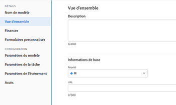

# Modifier les modèles de projet

<!-- Audited: 2/2024 -->

<!--The Resource Pools part also duplicates in the "Working with Resource Pools" article-->

Vous pouvez modifier des modèles de projet pour prendre en compte les modifications apportées aux processus et paramètres du projet. Après avoir mis à jour et enregistré les modifications sur un modèle, les nouvelles modifications sont visibles dans les nouveaux projets lorsque les projets sont créés à l’aide du modèle. Les modifications que vous apportez au modèle ne concernent pas le projet qui utilise actuellement ce modèle.

## Conditions d’accès

+++ Développez pour afficher les exigences d’accès aux fonctionnalités de cet article.

Vous devez disposer des accès suivants pour effectuer les étapes de cet article :

<table style="table-layout:auto"> 
 <col> 
 <col> 
 <tbody> 
  <tr> 
   <td role="rowheader">Forfait Adobe Workfront</td> 
   <td> 
N’importe quelle 
 </td> 
  </tr> 
  <tr> 
   <td role="rowheader">Licences Adobe Workfront</td> 
   <td>
      
Nouvelle : standard

      
Ou

      
Actuelle : formule

   </td> 
  </tr> 
  <tr> 
   <td role="rowheader">Niveau d’accès</td> 
   <td> 
Accès en modification aux modèles
 </td> 
  </tr> 
  <tr> 
   <td role="rowheader">Autorisations d’objet</td> 
   <td> 
    <ul> 
     <li> 
Autorisations de contribution à un modèle pour le modifier dans l’onglet Détails du modèle
 </li> 
     <li> 
Autorisations de gestion sur un modèle pour le modifier dans la zone Modifier le modèle
 </li> 
   </td> 
  </tr> 
 </tbody> 
</table>

Pour plus d’informations sur ce tableau, consultez [Conditions d’accès requises dans la documentation Workfront](/help/quicksilver/administration-and-setup/add-users/access-levels-and-object-permissions/access-level-requirements-in-documentation.md).

+++

## Modifier un modèle {#edit-a-template}

<!--
Editing a template differs depending on what environment you choose. 

### Edit a template in the Production environment {#edit-a-template-in-the-production-environment} 

1. Go to the template you want to edit.
1. (Conditional) To edit limited information about the template,  click **Template Details** in the left panel, then go to the areas listed in the left panel to edit information for each area. 
1. To edit information in the Details section, click the **Edit** icon , then select from any of the areas below, or click **Edit all** to edit information in all areas:

   * Overview
   * Custom Forms

     Names of customs forms display only if there are custom forms attached to the object.
   
   * Finance

   >[!TIP]
   >
   >For information about all fields that display in the Details area, continue with editing all fields using the Edit Template box below.

1. (Conditional) To edit all information about the template, click the **More** menu  next to the name of the template, then click **Edit**.

   The **Edit Template** box opens. The sections in this box contain the same fields available in  the Template Details section .

1. Consider editing information in any of the following sections:

   * [Overview](#overview) 
   * [Finance](#finance) 
   * [Portfolio](#portfolio) 
   * [Settings](#settings) 
   * [Access](#access) 
   * [Custom Forms](#custom-forms) 
   * [Tasks](#tasks) 
   * [Issues](#issues) 
   * [Comment](#comment)

### Overview {#overview}

1. Begin editing your template as described above.
1. In the **Edit Template** box, click **Overview**.

   

1. Update the following fields:

   <table style="table-layout:auto"> 
    <col> 
    <col> 
    <tbody> 
     <tr> 
      <td role="rowheader"><strong>Name</strong></td> 
      <td>Specify a name for the template.</td> 
     </tr> 
     <tr> 
      <td role="rowheader"><strong>Description</strong></td> 
      <td>Add additional information about the template.</td> 
     </tr> 
     <tr> 
      <td role="rowheader"><strong>Is Active</strong></td> 
      <td>
Select this checkbox if you want the template to be active. Other users can find this template and attach it to projects when creating projects. Deselect this checkbox if you want to deactivate templates that are no longer used. Deactivated templates cannot be attached to projects. This is enabled by default. 

<b>TIP</b>
      
      You can deactivate a template from the template header as described in the [Activate or deactivate a template](#activate-or-deactivate-a-template) section in this article.
</td> 
     </tr> 
     <tr> 
      <td role="rowheader"><strong>URL</strong></td> 
      <td>Specify a web link that relates to information about this template.</td> 
     </tr> 
     <tr> 
      <td role="rowheader"><strong>Schedule From</strong></td> 
      <td>
Specify whether the project using this template is scheduled from the <strong>Start Date</strong>, or from the <strong>Completion Date</strong>. This selection determines the planned dates of the future tasks on the project using this template. 

Select from the following: 
 
       <ul> 
        <li>
<strong>Schedule From Start Date</strong>: The Start Date of the template is actually the Start Day. When you schedule a template from Start Date, Adobe Workfront calculates the Completion Day of the template based on the Duration of all the template tasks. The Start Day of the template becomes the Planned Start Date of the future project.
</li> 
        <li>
<strong>Schedule from Completion Date</strong>: The Completion Date of the template is actually the Completion Day. When you schedule a template from Completion Date, Workfront calculates the Start Day of the template based on the Duration of all the template tasks. The Completion Day of the template becomes the Planned Completion Date of the future project. 
</li> 
       </ul>
For more information about the Start and Completion Days of template tasks, see <a href="../../../manage-work/projects/create-and-manage-templates/overview-of-start-completion-day-on-template.md" class="MCXref xref">Overview of Start and Completion Days in a template</a>. 

The Schedule From setting for templates is similar to that of projects. Your Workfront administrator selects the default Schedule From setting for the projects in your system. For information about setting project defaults, see <a href="../../../administration-and-setup/set-up-workfront/configure-system-defaults/set-project-preferences.md" class="MCXref xref">Configure system-wide project preferences</a>.
</td> 
     </tr> 
     <tr> 
      <td role="rowheader"><strong>Condition Type</strong></td> 
      <td>
Select between the following Condition Types:
 
       <ul> 
        <li><strong>Manual:</strong> The project owner sets the Condition of the project on the project manually. <strong></strong></li> 
        <li><strong>Progress Status:</strong> Workfront automatically sets the Condition of the future project based on the Progress Status of tasks on the Critical Path. For more information about understanding Progress Status, see <a href="../../../manage-work/tasks/task-information/task-progress-status.md" class="MCXref xref">Task Progress Status overview</a>.</li> 
       </ul></td> 
     </tr> 
     <tr> 
      <td role="rowheader"><strong>Priority</strong></td> 
      <td>
This is just a visual flag for you which allows you to prioritize your future projects. Select from the following options:
 
       <ul> 
        <li>
<strong>None</strong>
</li> 
        <li>
<strong>Low</strong>
</li> 
        <li>
<strong>Normal</strong>
</li> 
        <li>
<strong>High</strong>
</li> 
        <li>
<strong>Urgent</strong>
</li> 
       </ul>

Depending on the Project Preferences selected by your Workfront administrator, the names of priorities might be different for you. For more information about editing priorities, see <a href="../../../administration-and-setup/customize-workfront/creating-custom-status-and-priority-labels/create-customize-priorities.md" class="MCXref xref">Create and customize priorities</a>.

</td> 
     </tr> 
     <tr> 
      <td role="rowheader"><strong>Template Owner</strong></td> 
      <td>
The user who is designated as the Template Owner must be a Workfront active user. 

Consider the following about the user designated as the Template Owner: 
 
       <ul> 
        <li>They are automatically given Manage permissions to the template. </li> 
        <li>They are added to the project team and are automatically given Manage permissions to the project created from the template. </li> 
        <li>They become the Project Owner, when the project is created from this template. </li> 
       </ul></td> 
     </tr> 
     <tr> 
      <td role="rowheader"><strong>Template Sponsor</strong></td> 
      <td>
The user specified in this field becomes the Project Sponsor, when the template is added to the project. This user is added to the project team and is automatically given view permissions to the project. The user who is designated as the Template Sponsor must be a Workfront active user. 
</td> 
     </tr> 
     <tr> 
      <td role="rowheader"><strong>Resource Manager</strong></td> 
      <td>
The specified users are automatically given manage permissions to the future projects and can assign resources to the tasks and issues of the projects. You can specify more than one Resource Manager. 
</td> 
     </tr> 
     <tr data-mc-conditions="QuicksilverOrClassic.Quicksilver"> 
      <td role="rowheader"><strong>Group</strong></td> 
      <td>
In the drop-down list, select the group that you want to be associated with projects created from the template. It can be a group of any level. 

You can make sure you are selecting the right group by hovering over it and clicking the information icon  that displays next to it. This displays a tooltip listing information about the group, such as the hierarchy of groups above it and its administrators.
 
<b>NOTES</b>
      
    <ul> 
    <li>
In the Projects area on a group's page, when someone creates a project using a template that doesn't have a group selected, the system associates the currently open group with the project.

This is different from other areas where the system associates a user's Home Group with the project when the user creates the project using a template that doesn't have a group selected.

    </li> 
      <li>
If a user selects a template that has a group selected while creating a project—or while converting a task or issue to a project—the user can choose a different group for the project.
</li> 
      <li>Though this field is available in templates only in the new Adobe Workfront experience, you can see it in lists and reports both there and in Adobe Workfront Classic. </li> 
      </ul> 
</td> 
     </tr> 
     <tr> 
      <td role="rowheader"><strong>Company</strong></td> 
      <td>
Specify the Company that you want to associate with the template. Only active companies display in the list.
</td> 
     </tr> 
    </tbody> 
   </table>

1. (Optional) Continue editing the following sections, depending on the information you want to modify.

   Or

   Click **Save Changes**.

### Finance {#finance}

1. Begin editing your template as described above.
1. In the **Edit Template** box, click **Finance**.

   

1. Update the following fields:

   <table style="table-layout:auto"> 
    <col> 
    <col> 
    <tbody> 
     <tr> 
      <td role="rowheader"><strong>Performance Index Method</strong></td> 
      <td>
Specify whether the Earned Value metrics of the future project are calculated using hours or costs. For more information about the Performance Index Method, see <a href="../../../manage-work/projects/project-finances/set-pim.md" class="MCXref xref">Set the Performance Index Method (PIM)</a>. 
</td> 
     </tr> 
     <tr> 
      <td role="rowheader"><strong>Budget</strong></td> 
      <td>
Specify a Budget for the projects that are created from this template.
</td> 
     </tr> 
     <tr> 
      <td role="rowheader"><strong>Fixed Cost</strong></td> 
      <td>
Specify the Fixed Cost for the projects that are created from this template. This is different than the Labor Cost which comes from the hours on the project and the Expense Cost which comes from the amount of expenses on the project. The Fixed Cost of a project is taken into account when calculating the Net Value of a project and it is part of the Budgeted Cost.
</td> 
     </tr> 
     <tr> 
      <td role="rowheader"><strong>Fixed Revenue</strong></td> 
      <td>
Specify the Fixed Revenue for the projects that are created from this template.
</td> 
     </tr> 
     <tr> 
      <td role="rowheader"><strong>Template Currency</strong></td> 
      <td>
Specify the currency for the future project, if it is different than the default currency of your system. This field is not visible if you have only the default currency in the system. For more information about currency, see <a href="../../../administration-and-setup/manage-workfront/exchange-rates/set-up-exchange-rates.md" class="MCXref xref">Set up exchange rates</a>.
</td> 
     </tr> 
     <tr> 
      <td role="rowheader"><strong>Require time to be approved for this project</strong></td> 
      <td>
Select this option to require the Project Owner of the future project created from this template to approve time logged on the project. If you are using Billing Records and you select this option, only the approved hours on the project appear as available billable hours for the Billing Records. Approving time on the project is independent of approving timesheets. For more information about requiring time to be approved on a project, see <a href="../../../manage-work/projects/manage-projects/require-time-approval-for-projects.md" class="MCXref xref">Require time to be approved for a project</a>.
</td> 
     </tr> 
    </tbody> 
   </table>

1. (Optional) Continue editing the following sections, depending on the information you want to modify.

   Or

   Click **Save Changes**.

### Portfolio {#portfolio}

1. Begin editing your template as described above.
1. In the **Edit Template** box, click **Portfolio**.

   

1. Update the following fields:

   <table style="table-layout:auto">
    <col> 
    <tbody> 
     <tr> 
      <td role="rowheader"><strong>Portfolio</strong></td> 
      <td>
Specify a Portfolio for the projects that are created from this template. You must create a Portfolio first, before it appears in the drop-down list. 

Only active portfolios display in the list. For more information about creating portfolios, see <a href="../../../manage-work/portfolios/create-and-manage-portfolios/create-portfolios.md" class="MCXref xref">Create a portfolio </a>.
</td> 
     </tr> 
     <tr> 
      <td role="rowheader"><strong>Program</strong></td> 
      <td>
If you selected a Portfolio for the template, specify a <strong>Program</strong> for the future project. Some Portfolios might not have Programs. You must create a Program first, before it appears in this drop-down list. Only active programs display in the list.

For more information about creating programs, see <a href="../../../manage-work/portfolios/create-and-manage-programs/create-program.md" class="MCXref xref">Create a program</a>.
</td> 
     </tr> 
     <tr> 
      <td role="rowheader"><strong>Planned Benefit</strong></td> 
      <td>
Specify the Planned Benefit of the projects that are created from this template. The Planned Benefit is used in the Business Case of the project and the Portfolio Optimizer. 

For more information about the Planned Benefit of a project, see <a href="../../../manage-work/projects/project-finances/project-planned-benefit.md" class="MCXref xref">Overview of project Planned Benefit</a>. The Planned Benefit of a project is taken into account when the Net Value of a project is calculated. 

For more information about using the Portfolio Optimizer, see <a href="../../../manage-work/portfolios/portfolio-optimizer/manage-projects-in-portfolio-optimizer.md" class="MCXref xref">Manage projects in the Portfolio Optimizer</a> 
</td> 
     </tr> 
    </tbody> 
   </table>

1. (Optional) Continue editing the following sections, depending on the information you want to modify.

   Or

   Click **Save Changes**.

### Settings {#settings}

1. Begin editing your template as described above.
1. In the **Edit Template** box, click **Settings**.

   

1. Update the following fields: 

   <table style="table-layout:auto"> 
    <col> 
    <col> 
    <tbody> 
     <tr> 
      <td role="rowheader"><strong>Milestone Path</strong> </td> 
      <td> 
Select a Milestone Path for the template. Only active milestone paths display in the list. For more information about Milestone Paths, see <a href="../../../administration-and-setup/customize-workfront/configure-approval-milestone-processes/create-milestone-path.md" class="MCXref xref">Create a milestone path</a>.
 </td> 
     </tr> 
     <tr> 
      <td role="rowheader"><strong>Completion Mode</strong> </td> 
      <td> 
Controls how the future project will be marked as Complete.  Select from the following options:
 
       <ul> 
        <li> 
<strong>Automatic</strong>: The project is marked Complete when all the tasks and issues are completed.
 </li> 
        <li> 
<strong>Manual</strong>: You have to manually select the Complete status for the project, when all the tasks and issues are completed. 
 </li> 
       </ul> </td> 
     </tr> 
     <tr> 
      <td role="rowheader"><strong>Summary Completion Mode</strong> </td> 
      <td> 
Controls how the parent tasks on the future project are marked as Complete.  Select from the following options:
 
       <ul> 
        <li> 
<strong>Automatic</strong>: The parent tasks are marked Complete and they update their percent complete automatically, as the children tasks are completed and the percent complete of the children is updated. 
 </li> 
        <li> 
<strong>Manual</strong>: You have to manually update the percent complete and the status of the parent tasks, independently of what changes are made to the children tasks. 
 </li> 
       </ul> </td> 
     </tr> 
     <tr> 
      <td role="rowheader"><strong>Update Type</strong> </td> 
      <td> 
Controls when the changes you make to the timeline of the future project are saved on the project. 
 
       <b>EXAMPLE </b> 
        
The following changes to the project trigger an update to the timeline of the project:
 
        <ul> 
         <li> 
update the dates of tasks
 </li> 
         <li> 
change predecessor relationships 
 </li> 
         <li> 
change parent-child relationships
 </li> 
         <li> 
add or remove assignments in addition to changing the task constraint or duration type.
 </li> 
        </ul> 
       
 
Select from the following options: 
 
       <ul> 
        <li> 
<strong>Automatic and On Change</strong> (Default setting): The future project timeline is updated each time a change occurs in the project or in another project that the timeline is dependent on (On Change). The project timeline is also updated each night (Automatic). This is the recommended setting for this field because it ensures that the project timeline is always up to date. When you perform an action on a task or project that triggers a timeline recalculation, all available dates are immediately displayed, allowing you to continue working. On projects with more than 100 tasks, dates that require longer recalculations display briefly as a question mark (between 1 and 5 seconds, or up to a minute for large projects). This indicates that the recalculation is not yet finished, and the dates are subject to change. 
 </li> 
       </ul> 
       <ul> 
        <li> 
<strong>Change Only</strong>: The project timeline is updated each time a change occurs in the project or in another project that the timeline is dependent on. You might want to select this option if changes rarely occur in the project or in other projects that the timeline is dependent on. 
 </li> 
       </ul> 
       <ul> 
        <li> 
<strong>Automatic Only</strong>: The project timeline is updated each night; it is not updated immediately after changes are made. You might want to select this option if many changes occur each day in the project or in other projects that the timeline is dependent on. However, be aware that you chose this setting, as the project will not update at the same time that the changes are made. 
 </li> 
       </ul> 
       <ul> 
        <li> 
<strong>Manual Only</strong>: The project timeline is updated only when you select the option to Recalculate Timelines, as described in <a href="../../../manage-work/projects/manage-projects/recalculate-project-timeline.md" class="MCXref xref">Recalculate project timelines</a>. 
 </li> 
       </ul> 
You might want to select this option if you are making many changes to the project at one time, and you want the timeline recalculation to occur after all of the changes have been made (rather than after each individual change).
 </td> 
     </tr> 
     <tr> 
      <td role="rowheader"><strong>Schedule</strong> </td> 
      <td> 
Select a schedule for your template. This will become the schedule of the project that is created from this template. This should be the same schedule assigned to most people that are working on the project. You must create a schedule before you can assign it to a template. For more information about creating schedules, see <a href="../../../administration-and-setup/set-up-workfront/configure-timesheets-schedules/create-schedules.md" class="MCXref xref">Create a schedule</a>.  If you have not created custom schedules in your system, the Default Schedule is selected. 
 </td> 
     </tr> 
     <tr> 
      <td role="rowheader"><strong>User Time Off</strong> </td> 
      <td> 
Determines whether the time off of the Primary Assignee of a task adjusts the task planned dates. When you attach the template to an existing project, and the template has a different setting for this field than the project, the setting on the project remains unchanged. The default option for this setting for a new template is the same as the system-level project preference. 
 
For information about the project preferences at the System level, see <a href="../../../administration-and-setup/set-up-workfront/configure-system-defaults/set-project-preferences.md" class="MCXref xref">Configure system-wide project preferences</a>. 
 
For information about how this setting affects the task dates on a project, see <a href="../../../manage-work/projects/manage-projects/edit-projects.md" class="MCXref xref">Edit projects</a>. Select from the following options: 
 
       <ul> 
        <li> 
<strong>Consider user time off in task durations</strong>: When selecting this option, the planned dates of the tasks on the project created from this template adjust according to the time off of the Primary Assignee of the task, if the time off occurs during the duration of the task. 
 </li> 
        <li> 
<strong>Ignore user time off in task durations</strong>: When selecting this option, the planned dates of the tasks on the project created from this template remain as originally planned, even if the Primary Assignee of the task has time off during the duration of the task. 
 </li> 
       </ul> </td> 
     </tr> 
     <tr> 
      <td role="rowheader"><strong>Resource Leveling Mode</strong> </td> 
      <td> 
Select from the following options: 
 
       <ul> 
        <li> 
<strong>Manual</strong>: you must manually level your resources on the project created from this template (this is the default setting)
 </li> 
        <li> 
<strong>Automatic:</strong> Workfront levels the resources on the future project.  For more information about Resource Leveling, see <a href="../../../manage-work/gantt-chart/use-the-gantt-chart/level-resources-in-gantt.md" class="MCXref xref">Level Resources in the Gantt Chart </a>. 
 </li> 
       </ul> </td> 
     </tr> 
     <tr> 
      <td role="rowheader"><strong>Risk</strong> </td> 
      <td> 
Define the level of risk of the projects created from this template. The risk is just an indicator of how risky a project can be. You can prioritize the execution of your projects based on the level of risk. Consider selecting from the following levels of risk: 
 
       <ul> 
        <li> 
<strong>Very Low</strong> 
 </li> 
        <li> 
<strong>Low</strong> 
 </li> 
        <li> 
<strong>Medium</strong> 
 </li> 
        <li> 
<strong>High</strong> 
 </li> 
        <li> 
<strong>Very High</strong> 
 </li> 
       </ul> </td> 
     </tr> 
     <tr> 
      <td role="rowheader"><strong>Resource Pools</strong> </td> 
      <td> 
Specify the resource pools associated with the template. Resource pools are collections of users that are needed at the same time for the completion of a project. For more information about resource pools, see <a href="../../../resource-mgmt/resource-planning/resource-pools/work-with-resource-pools.md" class="MCXref xref"> Resource pools overview </a>.
 
 
<b>NOTE</b> 
      
      When you edit templates in bulk, only the resource pools that are common to all the templates selected appear in this field. If the templates selected have no shared resource pools, this field will be empty. The resource pools you specify here will overwrite the templates' individual resource pools.
 
 </td> 
     </tr> 
     <tr> 
      <td role="rowheader"><strong>Approval Process</strong> </td> 
      <td> 
Select the approval process you want to associate with the template. Your Workfront administrator or a user with administrative access to Approval Processes must define system-level or group-level project approval processes before you can associate them with a template. For more information about creating approval processes, see <a href="../../../administration-and-setup/customize-workfront/configure-approval-milestone-processes/create-approval-processes.md" class="MCXref xref">Create an approval process for work items</a>.
 
Consider the following when adding approval processes: 
 
      <ul> 
      <li>Only active approval processes display in the list. </li> 
      <li> 
System-wide and group-specific approval processes display in the list. An approval process associated with a group other than that of the template does not display in the list.
 
<b>IMPORTANT</b> 
      
      If the group associated with the template changes, the group-specific approval process becomes a single-use approval process. For more information about how changes to the group of the project or changes in the approval process affect approval settings, see <a href="../../../administration-and-setup/customize-workfront/configure-approval-milestone-processes/how-changes-affect-group-approvals.md">How group and approval process changes affect assigned approval processes</a>. 
 </li> 
      <li> 
If you added a single-use approval process, it displays as "Custom" in this field. For information, see <a href="../../../review-and-approve-work/manage-approvals/associate-approval-with-work.md" class="MCXref xref">Associate a new or existing approval process with work</a>. 
 
      </li> 
      <li> 
When bulk-editing templates, the following scenarios exist:
 
      <ul> 
         <li> 
When you select templates from the same group, both system-level and group-level approval processes display in this field.
 </li> 
         <li> 
When you select templates from different groups, only system-level approval processes display in this field.
 </li> 
         <li> 
When any of the templates has a single-use approval process attached, it is replaced by the system-level you select. 
 </li> 
      </ul> </li> 
      </ul> </td> 
     </tr> 
     <tr> 
      <td role="rowheader"><strong>Filter Hour Types</strong> </td> 
      <td> 
Consider the following:
 
Select <strong>No</strong> to make all project-specific hour types available on the future project. (This is the default selection)
 
Or
 
Select <strong>Yes</strong> to make only a subset of the project-specific hour types available on the future project, then select the hour types you want to make available. (Hold the Shift key to select multiple hour types.)
 
If you select this option, only the hour types you select are made available to select when logging hours on the project (or on tasks and issues within the project). You must select at least one hour type; if you select this option and you do not select any hour types, all hour types are made available on the project.
 
The same hour type selections must be made at the individual user level in order for the user to see these hour type options on the project. 
 
For more information about defining hour types at the user level, see the section <a href="../../../timesheets/create-and-manage-timesheets/log-time.md#understa" class="MCXref xref">Log time</a> in <a href="../../../timesheets/create-and-manage-timesheets/log-time.md" class="MCXref xref">Log time</a>.
 </td> 
     </tr> 
     <tr> 
      <td role="rowheader"><strong>Reminder Notification</strong> </td> 
      <td>Select the Reminder Notification that should be associated with the future project. You must configure Reminder Notifications for projects for this field to appear during editing a template.  For more information about configuring Reminder Notifications, see <a href="../../../administration-and-setup/manage-workfront/emails/set-up-reminder-notifications.md" class="MCXref xref">Set up reminder notifications</a>.</td> 
     </tr> 
    </tbody> 
   </table>

1. (Optional) Continue editing the following sections, depending on the information you want to modify.  
   Or
1. Click **Save Changes**.

### Access {#access}

1. Begin editing your template as described above.
1. In the **Edit Template** box, click **Access**.

   

   The Access you specify for your template will become the Access of users associated with the project when the template is used to create a project.

   Specify the following **Access** information for the template:

   <table style="table-layout:auto"> 
    <col> 
    <col> 
    <tbody> 
     <tr> 
      <td role="rowheader"><strong>When someone is assigned to a task</strong> </td> 
      <td> 
Select from <strong>View</strong>, <strong>Contribute,</strong> or <strong>Manage</strong> access to a task. The user assigned to a task is automatically granted this access to the task. 
 </td> 
     </tr> 
     <tr> 
      <td role="rowheader"><strong>Also grant access to the project</strong> </td> 
      <td> 
 Select from <strong>View</strong>, <strong>Contribute</strong>, or <strong>Manage</strong> access to the project. The user assigned to a task is automatically granted this access to the project, as well. 
 </td> 
     </tr> 
     <tr> 
      <td role="rowheader"><strong>When someone is assigned to an issue</strong> </td> 
      <td> 
Select from <strong>View</strong>, <strong>Contribute,</strong> or <strong>Manage</strong> access to an issue. The user assigned to an issue is automatically granted this access to the issue. 
 </td> 
     </tr> 
     <tr> 
      <td role="rowheader"><strong>Also grant access to the project</strong> </td> 
      <td> 
 Select from <strong>View</strong>, <strong>Contribute</strong>, or <strong>Manage</strong> access to the project. The user assigned to an issue is automatically granted this access to the project, as well. 
 </td> 
     </tr> 
     <tr> 
      <td role="rowheader"><strong>When someone submits a request: Give them access</strong> </td> 
      <td> 
 Select from <strong>View</strong>, <strong>Contribute</strong>, or <strong>Manage</strong> access to the request. When they submit a request to the project, they are granted this access to the request they submitted. For more information, see <a href="../../../workfront-basics/grant-and-request-access-to-objects/share-an-issue.md" class="MCXref xref">Share an issue </a>.
 </td> 
     </tr> 
     <tr> 
      <td role="rowheader"><strong>People from the same company will inherit the same permissions for all requests</strong> </td> 
      <td> 
Select this field if you want people from the same company to have the same access to all the requests on the project, whether they submitted them or not.
 </td> 
     </tr> 
     <tr> 
      <td role="rowheader"><strong>When someone is given access to this project: Give them access to ...</strong> </td> 
      <td> 
Select the access options that you want users to have on the project, if the project is shared with them. Select the specific options for their access, if they are designated as <strong>Viewers</strong>, <strong>Contributors</strong>, or <strong>Managers</strong> when sharing the project with them. 
 </td> 
     </tr> 
    </tbody> 
   </table>

1. (Optional) Continue editing the following sections, depending on the information you want to modify.

   Or

   Click **Save Changes**.

### Custom Forms {#custom-forms}

1. Begin editing your template as described above.
1. In the **Edit Template** box, click **Custom Forms**.

   

1. Select the custom form or forms that you want to associate with the template. You must build the custom forms before they are available to select in this field.

   Only active custom forms display in the list. For more information about building custom forms, see [Create or edit a custom form](../../../administration-and-setup/customize-workfront/create-manage-custom-forms/create-or-edit-a-custom-form.md).

   You can add up to ten custom forms to a template.

   The forms will be added to the project that is created from this template. 

1. (Optional) Continue editing the following section, depending on the information you want to modify.

   Or

   Click **Save Changes**.

### Tasks {#tasks}

You can define the defaults that will be associated with all the new tasks when you add them to a project that is created from the template.

For information about how these settings affect creating new tasks, see [Create tasks overview](../../../manage-work/tasks/create-tasks/create-tasks-overview.md).

1. Begin editing your template as described above.
1. In the **Edit Template** box, click **Tasks**.

   

1. In the **Task Default Approval Process** box, select the Approval Process you want to associate with all new tasks when you add them to a project created from this template. You must create an Approval Process for tasks before you can associate it with tasks. Only active approval processes display in the list. For more information about creating Approval Processes, see [Creating Approval Processes](../../../administration-and-setup/customize-workfront/configure-approval-milestone-processes/create-approval-processes.md).
1. In the **Task Default Custom Forms** box, select the custom form or forms that you want to associate with all new tasks when you add them to a project created from this template. You must build the custom forms before they are available to select in this field. Only active custom forms display in the list. For more information about building custom forms, see [Creating Custom Forms](../../../administration-and-setup/customize-workfront/create-manage-custom-forms/create-or-edit-a-custom-form.md). You can associate up to ten custom forms with a task.
1. (Optional) **Select Use Work Effort to automatically calculate task Planned Hours** if you want to enable managing task effort by using&nbsp;Work Effort instead of Planned Hours in the project created from the template.
1. (Conditional and optional) If you selected Use Work Effort to automatically calculate task Planned Hours, click the drop-down menu to update the percentage for each level of Work Effort. The following percentage values are the defaults:
 
   | Work Effort level |Percentage value|
   |---|---|
   | Small |25% |
   | Medium |50% |
   | Large |75% |

  For information about using Work Effort to manage the effort on tasks on projects, see [Work Effort overview](../../../manage-work/tasks/task-information/work-effort.md).

1. (Optional) Continue editing the following section, depending on the information you want to modify.

   Or

   Click **Save Changes**.

### Issues {#issues}

By editing issue settings, you can prevent users from adding issues inline in the future project created from the template.

1. Begin editing your template as described above.
1. In the **Edit Template** box, click **Issues**.

   

1. (Optional) Deselect the **Allow users to add issues inline** option. It is enabled by default.

   When disabling this option users cannot add issues inline to the project or the tasks in the Issues section, when the project is created from the template.

   >[!TIP]
   >
   >Disable this option if you want to enforce users to complete the New Issue Fields or the custom forms associated with new issues.

   When disabling this option, users with permissions to add issues to the project created from the template can do so by using the New Issue button or a request queue associated with the project.

   For more information about configuring issue settings on projects, see the [Issue Settings](../../../manage-work/projects/manage-projects/edit-projects.md#issue) section in the article [Edit projects](../../../manage-work/projects/manage-projects/edit-projects.md).

   For information about creating issues on projects, see [Create issues](../../../manage-work/issues/manage-issues/create-issues.md). 

1. (Optional) Continue editing the following section, depending on the information you want to modify.

   Or

   Click **Save Changes**.

### Comment {#comment}

1. Begin editing your template as described above.
1. In the **Edit Template** box, click **Comment**.

   

1. Specify a comment that you want to display in the updates stream of the template in the available field.

   This comment is visible for everyone with View access to the template and with access to view Notes.

1. Click **Save Changes**.

   Your changes will be submitted for this template.

   Now, when you use this template to create a project all these settings will transfer to the new project.

   <!--drafted section below for the edit template story: 
   remove this tag and add the Preview blurb at the top of this article in yellow, if it's not already there. Keep the "div class" tags below until 23.1 production: 

### Edit a template in the Preview environment {#edit-a-template-in-the-preview-environment}
-->

1. Accédez au modèle que vous souhaitez modifier.
1. (Conditionnel) Pour modifier des informations limitées sur le modèle, cliquez sur **Détails du modèle** dans le panneau de gauche, accédez ensuite aux zones répertoriées dans le panneau de gauche pour modifier les informations de chaque zone.
1. Pour modifier les informations de la section Détails, cliquez sur l’icône **Modifier** , puis sélectionnez l’une des zones ci-dessous ou cliquez sur **Tout modifier** pour modifier les informations dans toutes les zones :

   * Vue d’ensemble
   * Formulaires personnalisés

   Les noms des formulaires personnalisés ne s’affichent que s’il existe des formulaires personnalisés joints à l’objet.

   * Finances

   >[!TIP]
   >
   >Pour plus d’informations sur tous les champs qui s’affichent dans la zone Détails, continuez à modifier tous les champs à l’aide de la zone Modifier le modèle ci-dessous.

1. (Conditionnel) Pour modifier toutes les informations sur le modèle, cliquez sur le menu **Plus**  en regard du nom du modèle, puis cliquez sur **Modifier**.

   La zone **Modifier le modèle** s’ouvre. Les sections de cette zone contiennent les mêmes champs que ceux disponibles dans la section Détails du modèle.

1. Envisagez de modifier des informations dans l’une des sections suivantes :

   * [Nom de modèle](#template-name)
   * [Vue d’ensemble](#overview-preview)
   * [Finances](#finance-preview)
   * [Formulaires personnalisés](#custom-forms-preview)
   * [Paramètres du projet](#project-settings)
   * [Paramètres des tâches](#task-settings)
   * [Paramètres du problème](#issue-settings)
   * [Accès](#access-preview)

### Nom de modèle{#template-name}

1. Commencez à modifier votre modèle comme décrit ci-dessus.
1. Dans la zone **Modifier le modèle**, cliquez sur **Nom de modèle**.
1. (Facultatif) Continuez à modifier les sections suivantes, en fonction des informations que vous souhaitez modifier.

   Ou

   Cliquer sur **Enregistrer**.

### Vue d’ensemble {#overview-preview}

1. Commencez à modifier votre modèle comme décrit ci-dessus.
1. Dans la zone **Modifier le modèle**, cliquez sur **Vue d’ensemble**.

   

1. Mettez à jour les champs suivants :

   <table style="table-layout:auto"> 
       <col> 
       <col> 
       <tbody> 
         <tr> 
         <td role="rowheader"><strong>Description</strong></td> 
         <td>Ajoutez des informations supplémentaires sur le modèle.</td> 
       </tr> 
         <tr> 
         <td role="rowheader"><strong>Priorité</strong></td> 
         <td>
Il s’agit simplement d’un indicateur visuel qui vous permet de hiérarchiser vos projets futurs. Sélectionnez l’une des options suivantes :
 
         <ul> 
         <li>
<strong>Aucun</strong>
</li> 
         <li>
<strong>Faible</strong>
</li> 
         <li>
<strong>Normal</strong>
</li> 
         <li>
<strong>Élevé</strong>
</li> 
         <li>
<strong>Urgent</strong>
</li> 
         </ul>

Selon les préférences du projet sélectionnées par votre administrateur ou administratrice Workfront, les noms des priorités peuvent être différents pour vous. Pour plus d’informations sur la modification des priorités, voir <a href="../../../administration-and-setup/customize-workfront/creating-custom-status-and-priority-labels/create-customize-priorities.md" class="MCXref xref">Créer et personnaliser des priorités</a>.

</td> 
       </tr> 
       <tr> 
       <td role="rowheader"><strong>URL</strong></td> 
         <td>Spécifiez un lien web qui se rapporte aux informations sur ce modèle.</td> 
       </tr>
       <tr> 
       <td role="rowheader"><strong>Type de condition</strong></td> 
       <td>
Sélectionnez l’un des types de conditions suivants :
 
         <ul> 
         <li><strong>Manuel :</strong> la personne propriétaire du projet définit manuellement la condition du projet sur le projet. <strong></strong></li> 
         <li><strong>Statut de la progression :</strong> Workfront définit automatiquement la condition du projet futur en fonction du statut de la progression des tâches sur le chemin critique. Pour plus d’informations sur la compréhension du statut de la progression, voir <a href="../../../manage-work/tasks/task-information/task-progress-status.md" class="MCXref xref">Vue d’ensemble du statut de la progression de la tâche</a>.</li> 
       </ul>
         </td> 
         </tr> 
       <tr> 
         <td role="rowheader"><strong>Mode horaire</strong></td> 
         <td>
Indiquez si le projet est planifié à partir de la <strong>Date de début</strong> ou de la <strong>Date d’achèvement</strong>. Cette sélection détermine les dates prévues des tâches futures du projet utilisant ce modèle. 

Sélectionnez l’une des options suivantes : 
 
       <ul> 
       <li>
<strong>Planifier à partir de la date de début</strong> : la date de début du modèle est en fait le jour de début. Lorsque vous planifiez un modèle à partir de la date de début, Adobe Workfront calcule le jour d’achèvement du modèle en fonction de la durée de toutes les tâches du modèle. Le jour de début du modèle devient la date de début prévue du futur projet.
</li> 
       <li>
<strong>Planifier à partir de la date d’achèvement</strong> : la date d’achèvement est en fait le jour d’achèvement. Lorsque vous planifiez un modèle à partir de la date d’achèvement, Workfront calcule le jour de début du modèle en fonction de la durée de toutes les tâches du modèle. Le jour d’achèvement du modèle devient la date d’achèvement prévue du futur projet. 
</li> 
       </ul>
Pour plus d’informations sur les jours de début et d’achèvement des tâches du modèle, voir <a href="../../../manage-work/projects/create-and-manage-templates/overview-of-start-completion-day-on-template.md" class="MCXref xref">Vue d’ensemble des jours de début et d’achèvement dans un modèle</a>. 

Le paramètre Planifier à partir de pour les modèles est similaire à celui des projets. Votre administrateur ou administratrice Workfront sélectionne le paramètre Planifier à partir de par défaut pour les projets de votre système. Pour plus d’informations sur la définition des paramètres par défaut d’un projet, voir <a href="../../../administration-and-setup/set-up-workfront/configure-system-defaults/set-project-preferences.md" class="MCXref xref">Configurer les préférences du projet à l’échelle du système</a>.
</td> 
       </tr>

   <tr> 
         <td role="rowheader"><strong>Portfolio</strong></td> 
         <td>
Indiquez un Portfolio pour les projets créés à partir de ce modèle. Vous devez d’abord créer un portfolio pour l’afficher dans la liste déroulante. 

Seuls les portfolios actifs sont affichés dans la liste. Pour plus d’informations sur la création de portfolios, voir <a href="../../../manage-work/portfolios/create-and-manage-portfolios/create-portfolios.md" class="MCXref xref">Créer un portfolio</a>.
</td> 
       </tr> 
       <tr> 
         <td role="rowheader"><strong>Programme</strong></td> 
         <td>
Si vous avez sélectionné un portfolio pour le modèle, spécifiez également un <strong>Programme</strong> pour le futur projet. Certains portfolios peuvent ne pas avoir de programmes. Vous devez d’abord créer un programme pour qu’il apparaisse dans cette liste déroulante. Seuls les programmes actifs sont affichés dans la liste.

Pour plus d’informations sur la création de programmes, voir <a href="../../../manage-work/portfolios/create-and-manage-programs/create-program.md" class="MCXref xref">Créer un programme</a>.
</td> 
       </tr>  
       <tr data-mc-conditions="QuicksilverOrClassic.Quicksilver"> 
         <td role="rowheader"><strong>Groupe</strong></td> 
         <td>
Dans la liste déroulante, sélectionnez le groupe que vous souhaitez associer aux projets créés à partir du modèle. Il peut s’agir d’un groupe de n’importe quel niveau. 

Vous pouvez vous assurer que vous sélectionnez le groupe approprié en pointant dessus et en cliquant sur l’icône d’information  qui s’affiche en regard de celui-ci. Cette option permet d’afficher une infobulle contenant des informations sur le groupe, telles que la hiérarchie des groupes qui le précèdent et ses administrateurs et administratrices.
 
<b>NOTES</b>

   <ul> 
       <li>
Dans la zone Projets de la page d’un groupe, lorsqu’une personne crée un projet à l’aide d’un modèle pour lequel aucun groupe n’est sélectionné, le système associe le groupe ouvert au projet.

Cela diffère des autres zones où le système associe le groupe d’accueil d’un utilisateur ou d’une utilisatrice au projet lorsque l’utilisateur ou l’utilisatrice crée le projet à l’aide d’un modèle dont le groupe n’est pas sélectionné.
</li> 
       <li>
Si un utilisateur ou une utilisatrice sélectionne un modèle dont un groupe est sélectionné lors de la création d’un projet, ou lors de la conversion d’une tâche ou d’un problème en projet, il ou elle peut choisir un autre groupe pour le projet.
</li> 
       <li>Bien que ce champ ne soit disponible dans les modèles que dans la nouvelle expérience Adobe Workfront, vous pouvez le voir dans les listes et les rapports à cet endroit et dans Adobe Workfront Classic. </li> 
         </ul> 
</td> 
       </tr> 
       <tr> 
         <td role="rowheader"><strong>Entreprise</strong></td> 
         <td>
Indiquez l’entreprise que vous souhaitez associer au modèle. Seules les entreprises actives sont affichées dans la liste.
</td> 
       </tr> 
       <tr> 
         <td role="rowheader"><strong>Personne propriétaire du modèle</strong></td> 
         <td>
La personne désignée comme propriétaire du modèle doit être une personne active sur Workfront. 

Tenez compte des points suivants concernant la personne désignée comme propriétaire du modèle : 
 
         <ul> 
         <li>Les autorisations de gestion leur sont automatiquement accordées sur le modèle. </li> 
         <li>Elles sont ajoutées à l’équipe du projet et se voient attribuer automatiquement les autorisations de gestion du projet créé à partir du modèle. </li> 
         <li>Elles deviennent la personne propriétaire du projet lorsque le projet est créé à partir de ce modèle. </li> 
         <li> Si la personne désignée comme propriétaire du modèle dispose d’un accès limité aux modèles ou aux projets à partir de son niveau d’accès, ses autorisations de gestion sur le modèle et sur les projets seront limitées. Par exemple, si elles disposent uniquement de l’accès en affichage pour les modèles ou les projets dans leur niveau d’accès, elles se verront attribuer automatiquement les autorisation d’affichage sur le modèle et le projet lorsqu’elles seront désignées comme propriétaire du modèle.</li>
         </ul></td> 
       </tr> 
       <tr> 
         <td role="rowheader"><strong>Sponsor du modèle</strong></td> 
         <td>
La personne spécifiée dans ce champ devient le ou la la sponsor du projet, lorsque le modèle est ajouté au projet. Cette personne est ajoutée à l’équipe du projet et se voit attribuer automatiquement les autorisations d’affichage du projet. La personne désignée comme sponsor du modèle doit être une personne active sur Workfront. 
</td> 
       </tr> 
       <tr> 
         <td role="rowheader"><strong>Gestionnaire des ressources</strong></td> 
         <td>
Les utilisateurs et utilisatrices spécifiés disposent automatiquement des autorisations de gestion des projets futurs et peuvent affecter des ressources aux tâches et problèmes des projets. Vous pouvez spécifier plusieurs gestionnaires de ressources. 
</td> 
       </tr> 
      </table>

1. (Facultatif) Continuez à éditer les sections suivantes, en fonction des informations à modifier.

   Ou

   Cliquer sur **Enregistrer**.

### Finances {#finance-preview}

1. Commencez à modifier votre modèle comme décrit ci-dessus.
1. Dans la zone **Modifier le modèle**, cliquez sur **Finances**.

   

1. Mettez à jour les champs suivants :

   <table style="table-layout:auto"> 
       <col> 
       <col> 
       <tbody>
       <tr> 
         <td role="rowheader"><strong> Devise</strong></td> 
         <td>
Indiquez la devise du futur projet, si elle est différente de la devise par défaut de votre système. Ce champ n’est pas visible si vous n’avez que la devise par défaut dans le système. Pour plus d’informations sur la devise, voir <a href="../../../administration-and-setup/manage-workfront/exchange-rates/set-up-exchange-rates.md" class="MCXref xref">Configurer les taux de change</a>.
</td> 
       </tr>
       <tr> 
       <td role="rowheader"><strong>Budget</strong></td> 
       <td>
Spécifiez un Budget pour les projets créés à partir de ce modèle.
</td> 
       </tr>  
       <tr> 
         <td role="rowheader"><strong>Méthode d'indice de performances</strong></td> 
         <td>
Choisissez la manière dont Workfront calculera les métriques de Valeur acquise du futur projet. Choisissez l’une des options suivantes :
         <ul>
         <li>Basé sur les heures</li>
         <li>Basé sur les coûts</li>
         </ul>

   Pour plus d’informations sur la méthode d’indice de performances, voir <a href="../../../manage-work/projects/project-finances/set-pim.md" class="MCXref xref">Définir la méthode de l’indice de performances (PIM)</a>. 
</td>
   </tr> 
         <tr> 
         <td role="rowheader"><strong>Bénéfice prévu</strong></td> 
         <td>
Spécifiez le Bénéfice prévu des projets créés à partir de ce modèle. Le bénéfice prévu est utilisé dans l’analyse de rentabilité du projet et dans l’optimisateur de portfolio. 

Pour plus d’informations sur le bénéfice prévu d’un projet, voir <a href="../../../manage-work/projects/project-finances/project-planned-benefit.md" class="MCXref xref">Vue d’ensemble du bénéfice prévu du projet</a>. Le bénéfice prévu d’un projet est pris en compte dans le calcul de la valeur nette du projet. 

Pour plus d’informations sur l’utilisation de l’optimisateur de portfolio, voir <a href="../../../manage-work/portfolios/portfolio-optimizer/manage-projects-in-portfolio-optimizer.md" class="MCXref xref">Gérer des projets dans l’optimiseur de portfolio</a>. 
</td> 
       </tr> 
       <tr> 
         <td role="rowheader"><strong>Coûts fixes</strong></td> 
         <td>
Spécifiez le Coût fixe des projets créés à partir de ce modèle. Ce coût est différent du coût de la main-d’œuvre, qui correspond au nombre d’heures consacrées au projet, et du coût des dépenses, qui correspond au montant des dépenses consacrées au projet. Le coût fixe d’un projet est pris en compte dans le calcul de la valeur nette d’un projet et fait partie du coût budgété.
</td> 
       </tr> 
       <tr> 
       <td role="rowheader"><strong>Revenus fixes</strong></td> 
       <td>
Spécifiez les Revenus fixes des projets créés à partir de ce modèle.
</td> 
       </tr> 
       <tr> 
       <td role="rowheader"><strong>L'approbation pour ce projet demande du temps</strong></td> 
       <td>
Sélectionnez cette option pour exiger que la personne propriétaire du projet créé à partir de ce modèle approuve le temps consigné dans le projet. Si vous utilisez les enregistrements de facturation et que vous sélectionnez cette option, seules les heures approuvées sur le projet apparaissent comme heures facturables disponibles pour les enregistrements de facturation. L’approbation du temps sur le projet est indépendante de l’approbation des feuilles de temps. Pour plus d’informations sur la demande d’approbation du temps d’un projet, voir <a href="../../../manage-work/projects/manage-projects/require-time-approval-for-projects.md" class="MCXref xref">Demander l’approbation du temps pour un projet</a>.
</td> 
       </tr> 
       </tbody> 
      </table>

1. (Facultatif) Continuez à éditer les sections suivantes, en fonction des informations à modifier.

   Ou

   Cliquer sur **Enregistrer**.

### Formulaires personnalisés {#custom-forms-preview}

1. Commencez à modifier votre modèle comme décrit ci-dessus.
1. Dans la zone **Modifier le modèle**, cliquez sur **Formulaires personnalisés**.

   

   Les noms des formulaires personnalisés déjà joints au modèle s’affichent dans le panneau de gauche.

1. Cliquez dans le champ **Ajouter un formulaire personnalisé** et sélectionnez le ou les formulaires personnalisés que vous souhaitez associer au modèle. Vous devez créer les formulaires personnalisés avant de pouvoir les sélectionner dans ce champ.

   Seuls les formulaires personnalisés actifs sont affichés dans la liste. Pour plus d’informations sur la création de formulaires personnalisés, voir [Créer ou modifier un formulaire personnalisé](../../../administration-and-setup/customize-workfront/create-manage-custom-forms/create-or-edit-a-custom-form.md).

   Vous pouvez ajouter jusqu’à dix formulaires personnalisés à un modèle.

   Les formulaires sont ajoutés au projet créé à partir de ce modèle.

1. (Facultatif) Mettez à jour les informations dans l’un des champs des formulaires personnalisés. Les informations sont transférées vers les projets qui seront créés à partir du modèle.

1. (Facultatif) Cliquez sur l’icône **x** à droite du nom d’un formulaire personnalisé, puis cliquez sur **Supprimer** pour le supprimer du modèle.

1. (Facultatif) Continuez à modifier la section suivante, en fonction des informations que vous souhaitez modifier.

   Ou

   Cliquer sur **Enregistrer**.

### Paramètres du projet {#project-settings}

1. Commencez à modifier votre modèle comme décrit ci-dessus.
1. Dans la zone **Modifier le modèle**, cliquez sur **Paramètres du projet**.

   

1. Mettez à jour les champs suivants :

   <table style="table-layout:auto"> 
       <col> 
       <col> 
       <tbody> 
       <tr> 
       <td role="rowheader"><strong>Chemin jalonné</strong> </td> 
       <td> 
Sélectionnez un chemin jalonné pour le modèle. Seuls les chemins jalonnés actifs sont affichés dans la liste. Pour plus d’informations sur les chemins jalonnés, voir <a href="../../../administration-and-setup/customize-workfront/configure-approval-milestone-processes/create-milestone-path.md" class="MCXref xref">Créer un chemin jalonné</a>.
 </td> 
       </tr> 
       <tr> 
         <td role="rowheader"><strong>Mode d’achèvement</strong> </td> 
         <td> 
Contrôle la manière dont le futur projet sera marqué comme terminé.  Sélectionnez l’une des options suivantes :
 
         <ul> 
         <li> 
<strong>Automatique</strong> : le projet est marqué comme Terminé lorsque toutes les tâches et tous les problèmes sont terminés.
 </li> 
         <li> 
<strong>Manuel</strong> : lorsque toutes les tâches et tous les problèmes sont terminés, vous devez sélectionner manuellement le statut Terminé pour le projet. 
 </li> 
         </ul> </td> 
       </tr> 
       <tr> 
       <td role="rowheader"><strong>Mode d’achèvement du résumé</strong> </td> 
       <td> 
Contrôle la manière dont les tâches parent du futur projet sont marquées comme étant terminées.  Sélectionnez l’une des options suivantes :
 
       <ul> 
       <li> 
<strong>Automatique</strong> : les tâches parent sont marquées comme Terminé et elles mettent à jour leur pourcentage terminé automatiquement, à mesure que les tâches enfant sont terminées et que le pourcentage terminé des enfants est mis à jour. 
 </li> 
       <li> 
<strong>Manuel</strong> : vous devez mettre à jour manuellement le pourcentage terminé et le statut des tâches parent, indépendamment des modifications apportées aux tâches enfant. 
 </li> 
       </ul> </td> 
       </tr> 
       <tr> 
         <td role="rowheader"><strong>Type de mise à jour</strong> </td> 
         <td> 
Contrôle le moment où les modifications que vous apportez à la chronologie du futur projet sont enregistrées dans le projet. 
 
         <b>EXEMPLE</b> 
         
Les modifications suivantes apportées au projet déclenchent une mise à jour de la chronologie du projet :
 
         <ul> 
         <li> 
Mise à jour des dates des tâches
 </li> 
         <li> 
Modification des relations d’antériorité 
 </li> 
         <li> 
Modification des relations parent-enfant
 </li> 
         <li> 
Ajout ou suppression des affectations et modification de la contrainte de tâche ou du type de durée
 </li> 
         </ul> 
         
 
Sélectionnez l’une des options suivantes : 
 
         <ul> 
         <li> 
 <strong>Automatique et En cas de modification</strong> (paramètre par défaut) : la chronologie du projet est mise à jour chaque fois qu’une modification se produit dans le projet ou dans un autre projet dont la chronologie dépend (en cas de modification). La chronologie du projet est également mis à jour chaque nuit (Automatique). Il s’agit du paramètre recommandé pour ce champ, car il garantit que la chronologie du projet est toujours à jour. Lorsque vous effectuez une action sur une tâche ou un projet qui déclenche un nouveau calcul de la chronologie, toutes les dates disponibles sont immédiatement affichées, ce qui vous permet de continuer à travailler. Pour les projets de plus de 100 tâches, les dates qui nécessitent des recalculs plus longs s’affichent brièvement sous la forme d’un point d’interrogation (pendant 1 à 5 secondes, ou jusqu’à une minute pour les projets de grande envergure). Cela indique que le recalcul n’est pas encore terminé et que les dates sont susceptibles d’être modifiées. 
 </li> 
         </ul> 
         <ul> 
         <li> 
<strong>Modification uniquement</strong> : la chronologie du projet est mise à jour chaque fois qu’une modification est apportée dans le projet ou dans un autre projet dont la chronologie dépend. Sélectionnez cette option si des modifications se produisent rarement dans le projet ou dans d’autres projets dont la chronologie dépend. 
 </li> 
         </ul> 
         <ul> 
         <li> 
<strong>Automatique uniquement</strong> : la chronologie du projet est mise à jour chaque nuit. Elle n’est pas mise à jour immédiatement après les modifications. Vous pouvez sélectionner cette option si un grand nombre de modifications sont apportées chaque jour dans le projet ou dans d’autres projets dont la chronologie dépend. Cependant, gardez à l’esprit qu’avec ce paramètre le projet ne sera pas mis à jour en même temps que les modifications effectuées. 
 </li> 
         </ul> 
         <ul> 
         <li> 
<strong>Manuel uniquement</strong> : la chronologie du projet est mise à jour uniquement lorsque vous sélectionnez l’option Recalculer les chronologies, comme décrit dans <a href="../../../manage-work/projects/manage-projects/recalculate-project-timeline.md" class="MCXref xref">Recalculer les chronologies du projet</a>. 
 </li> 
         </ul> 
Sélectionnez cette option si vous apportez de nombreuses modifications au projet en même temps et que vous souhaitez que le recalcul de la chronologie se produise après toutes les modifications (plutôt qu’après chaque modification individuelle).
 </td> 
       </tr> 
       <tr> 
         <td role="rowheader"><strong>Planning</strong> </td> 
         <td> 
Sélectionnez un planning pour votre modèle. Il deviendra le planning du projet créé à partir de ce modèle. Il doit s’agir du même planning que celui attribué à la plupart des personnes travaillant sur le projet. Vous devez créer un planning avant de pouvoir l’affecter à un modèle. Pour plus d’informations sur la création de plannings, voir <a href="../../../administration-and-setup/set-up-workfront/configure-timesheets-schedules/create-schedules.md" class="MCXref xref">Créer un planning</a>.  Si vous n’avez pas créé de plannings personnalisés dans votre système, le planning par défaut est sélectionné. 
 </td> 
       </tr> 
       <tr> 
         <td role="rowheader"><strong>Congés de l’utilisateur ou de l’utilisatrice</strong> </td> 
         <td> 
Détermine si les congés de la personne cessionnaire principale d’une tâche modifient les dates prévues de la tâche. Lorsque vous joignez le modèle à un projet existant et que le paramètre de ce champ est différent de celui du projet, le paramètre du projet reste inchangé. L’option par défaut de ce paramètre pour un nouveau modèle est la même que la préférence de projet au niveau du système. 
 
Pour plus d’informations sur les préférences de projet au niveau du système, voir <a href="../../../administration-and-setup/set-up-workfront/configure-system-defaults/set-project-preferences.md" class="MCXref xref">Configurer les préférences de projet à l’échelle du système</a>. 
 
Pour plus d’informations sur l’impact de ce paramètre sur les dates de tâche d’un projet, voir <a href="../../../manage-work/projects/manage-projects/edit-projects.md" class="MCXref xref">Modifier des projets</a>. Sélectionnez l’une des options suivantes : 
 
         <ul> 
         <li> 
<strong>Prendre en compte les congés de l’utilisateur ou de l’utilisatrice dans la durée des tâches</strong> : lorsque vous sélectionnez cette option, les dates prévues des tâches sont ajustées en fonction des congés de la personne cessionnaire principale de la tâche, si les congés surviennent pendant la durée de la tâche. 
 </li> 
         <li> 
<strong>Ignorer les congés de l’utilisateur ou de l’utilisatrice dans la durée des tâches</strong> : lorsque vous sélectionnez cette option, les dates prévues des tâches du projet créé à partir de ce modèle restent telles que prévues initialement, même si la personne cessionnaire principale de la tâche est en congés pendant la durée de la tâche. 
 </li> 
         </ul> </td> 
       </tr> 
       <tr> 
         <td role="rowheader"><strong>Mode de nivellement des ressources</strong> </td> 
         <td> 
Sélectionnez l’une des options suivantes : 
 
         <ul> 
         <li> 
<strong>Manuel</strong> : vous devez niveler manuellement vos ressources sur le projet créé à partir de ce modèle (paramètre par défaut).
 </li> 
         <li> 
<strong>Automatique</strong> : Workfront met à niveau les ressources sur le futur projet.  Pour plus d’informations sur le nivellement des ressources, voir <a href="../../../manage-work/gantt-chart/use-the-gantt-chart/level-resources-in-gantt.md" class="MCXref xref">Niveler les ressources dans le graphique de Gantt</a>. 
 </li> 
         </ul> </td> 
       </tr> 
       <tr> 
         <td role="rowheader"><strong>Risque</strong> </td> 
         <td> 
Définissez le niveau de risque des projets créés à partir de ce modèle. Le risque n’est qu’un indicateur du degré de risque d’un projet. Vous pouvez hiérarchiser l’exécution de vos projets en fonction du niveau de risque. Envisagez de choisir parmi les niveaux de risque suivants : 
 
         <ul> 
         <li> 
<strong>Très faible</strong> 
 </li> 
         <li> 
<strong>Faible</strong> 
 </li> 
         <li> 
<strong>Moyen</strong> 
 </li> 
         <li> 
<strong>Élevé</strong> 
 </li> 
         <li> 
<strong>Très élevé</strong> 
 </li> 
         </ul> </td> 
       </tr> 
       <tr> 
         <td role="rowheader"><strong>Pools de ressources</strong> </td> 
         <td> 
Spécifiez les groupes de ressources associés au modèle. Les groupes de ressources constituent des collections d’utilisateurs et d’utilisatrices qui sont nécessaires simultanément pour l’achèvement d’un projet. Pour plus d’informations sur les groupes de ressources, voir <a href="../../../resource-mgmt/resource-planning/resource-pools/work-with-resource-pools.md" class="MCXref xref">Vue d’ensemble des groupes de ressources</a>.
 
 
<b>NOTE</b>

   Lorsque vous modifiez des modèles en bloc, seuls les groupes de ressources communs à tous les modèles sélectionnés apparaissent dans ce champ. Si les modèles sélectionnés ne comportent aucun groupe de ressources partagées, ce champ sera vide. Les groupes de ressources que vous spécifiez ici remplaceront les groupes de ressources individuels des modèles.
 
 </td>
   </tr>
       <tr> 
         <td role="rowheader"><strong>Filtrer les types d’heures</strong> </td> 
         <td> 
Tenez compte des points suivants :
 
Sélectionnez <strong>Non</strong> pour que tous les types d’heures spécifiques au projet soient disponibles sur le futur projet. (Il s’agit de la sélection par défaut).
 
Ou
 
Sélectionnez <strong>Oui</strong> pour que seul un sous-ensemble des types d’heures spécifiques au futur projet soit disponible sur le projet, puis sélectionnez les types d’heures que vous souhaitez rendre disponibles. (Maintenez la touche Maj enfoncée pour sélectionner plusieurs types d’heures.)
 
Si vous sélectionnez cette option, seuls les types d’heures que vous avez sélectionnés seront disponibles lors de la consignation des heures sur le projet (ou sur les tâches et les problèmes au sein du projet). Vous devez sélectionner au moins un type d’heure ; si vous sélectionnez cette option et que vous ne sélectionnez aucun type d’heure, tous les types d’heures sont disponibles sur le projet.
 
Les mêmes sélections de type d’heure doivent être effectuées au niveau de chaque personne pour que chacune puisse voir ces options de type d’heure sur le projet. 
 
Pour plus d’informations sur la définition des types d’heures au niveau de l’utilisateur ou l’utilisatrice, voir <a href="../../../timesheets/create-and-manage-timesheets/log-time.md#understa" class="MCXref xref">Consigner le temps</a> dans <a href="../../../timesheets/create-and-manage-timesheets/log-time.md" class="MCXref xref">Consigner le temps</a>.
 </td> 
       </tr> 
       <tr> 
         <td role="rowheader"><strong>Processus d’approbation</strong> </td> 
         <td> 
Sélectionnez le processus d’approbation que vous souhaitez associer au modèle. Votre administrateur ou administratrice Workfront, ou un utilisateur ou une utilisatrice disposant d’un accès administratif aux processus d’approbation, doit définir des processus d’approbation à l’échelle du système ou du groupe avant de pouvoir les associer à un modèle. Pour plus d’informations sur la création de processus d’approbation, voir <a href="../../../administration-and-setup/customize-workfront/configure-approval-milestone-processes/create-approval-processes.md" class="MCXref xref">Créer un processus d’approbation pour des éléments de travail</a>.
 
Tenez compte des éléments suivants lorsque vous ajoutez des processus d’approbation : 
 
         <ul> 
         <li>Seuls les processus d’approbation actifs sont affichés dans la liste. </li> 
         <li> 
Les processus d’approbation à l’échelle du système et du groupe s’affichent dans la liste. Un processus d’approbation associé à un groupe autre que celui du modèle ne s’affiche pas dans la liste.
 
<b>IMPORTANT</b>

   Si le groupe associé au modèle change, le processus d’approbation spécifique au groupe devient un processus d’approbation à usage unique. Pour plus d’informations sur la manière dont les modifications apportées au groupe du projet ou au processus d’approbation affectent les paramètres d’approbation, voir <a href="../../../administration-and-setup/customize-workfront/configure-approval-milestone-processes/how-changes-affect-group-approvals.md">Comment les modifications apportées au groupe et au processus d’approbation affectent les processus d’approbation affectés</a>. 
 </li>
   <li> 
Si vous avez ajouté un processus d’approbation à usage unique, il s’affiche avec la mention « Personnalisé » dans ce champ. Pour plus d’informations, voir <a href="../../../review-and-approve-work/manage-approvals/associate-approval-with-work.md" class="MCXref xref">Associer un processus d’approbation nouveau ou existant au travail</a>. 
 
         </li> 
         <li> 
Lors de la modification en bloc de modèles, les scénarios suivants peuvent se produire :
 
         <ul> 
            <li> 
Lorsque vous sélectionnez des modèles dans le même groupe, les processus d’approbation au niveau du système et au niveau du groupe s’affichent dans ce champ.
 </li> 
            <li> 
Lorsque vous sélectionnez des modèles dans différents groupes, seuls les processus d’approbation au niveau du système s’affichent dans ce champ.
 </li> 
            <li> 
Lorsque l’un des modèles est associé à un processus d’approbation à usage unique, ce dernier est remplacé par le niveau du système que vous avez sélectionné. 
 </li> 
         </ul> </li> 
         </ul> </td> 
       </tr> 
       <tr> 
         <td role="rowheader"><strong>Notification de rappel</strong> </td> 
         <td>Sélectionnez la notification de rappel qui doit être associée au futur projet. Vous devez configurer les notifications de rappel pour les projets pour que ce champ apparaisse lors de la modification d’un modèle.  Pour plus d’informations sur la configuration des notifications de rappel, voir <a href="../../../administration-and-setup/manage-workfront/emails/set-up-reminder-notifications.md" class="MCXref xref">Configurer des notifications de rappel</a>.</td> 
       </tr> 
       </tbody> 
      </table>

1. (Facultatif) Continuez à éditer les sections suivantes, en fonction des informations à modifier.\
   Ou
1. Cliquer sur **Enregistrer**.

### Paramètres de la tâche {#task-settings}

Vous pouvez définir les valeurs par défaut qui seront associées à toutes les nouvelles tâches lorsque vous les ajouterez à un projet créé à partir du modèle.

Pour plus d’informations sur l’impact de ces paramètres sur la création de tâches, voir [Vue d’ensemble de la création de tâches](../../../manage-work/tasks/create-tasks/create-tasks-overview.md).

1. Commencez à modifier votre modèle comme décrit ci-dessus.
1. Dans la zone **Modifier le modèle**, cliquez sur **Paramètres de la tâche**.

   

1. Dans le **Processus d’approbation par défaut de la tâche**, sélectionnez le processus d’approbation que vous souhaitez associer à toutes les nouvelles tâches lorsque vous les ajoutez à un projet créé à partir de ce modèle. Vous devez créer un processus d’approbation pour les tâches avant de pouvoir l’associer à des tâches. Seuls les processus d’approbation actifs sont affichés dans la liste. Pour plus d’informations sur la création de processus d’approbation, voir [Créer des processus d’approbation](../../../administration-and-setup/customize-workfront/configure-approval-milestone-processes/create-approval-processes.md).
1. Dans la zone **Formulaires personnalisés de tâche par défaut**, sélectionnez le ou les formulaires personnalisés à associer à toutes les nouvelles tâches lorsque vous les ajoutez à un projet créé à partir de ce modèle. Vous devez créer les formulaires personnalisés avant de pouvoir les sélectionner dans ce champ. Seuls les formulaires personnalisés actifs sont affichés dans la liste. Pour plus d’informations sur la création de formulaires personnalisés, voir [Créer des formulaires personnalisés](../../../administration-and-setup/customize-workfront/create-manage-custom-forms/create-or-edit-a-custom-form.md). Vous pouvez associer jusqu’à dix formulaires personnalisés à une tâche.
1. (Facultatif) Sélectionnez **Utiliser l’option Effort de travail pour calculer automatiquement les heures planifiées de la tâche** si vous souhaitez activer la gestion de l’effort de tâche en utilisant l’effort de travail au lieu du nombre d’heures prévues dans le projet créé à partir du modèle.
1. (Le cas échéant et facultatif) Si vous avez sélectionné Utiliser l’effort de travail pour calculer automatiquement le nombre d’heures prévues de la tâche, cliquez sur le menu déroulant pour mettre à jour le pourcentage pour chaque niveau d’effort de travail. Les valeurs en pourcentage suivantes sont les valeurs par défaut :

   | Vue d’ensemble de l’effort de travail | Valeur en pourcentage |
   |---|---|
   | Petite | 25 % |
   | Moyen | 50 % |
   | Grande | 75 % |

   Pour plus d’informations sur l’utilisation de l’effort de travail pour gérer l’effort sur les tâches sur les projets, voir [Vue d’ensemble de l’effort de travail](../../../manage-work/tasks/task-information/work-effort.md).

1. (Facultatif) Continuez à modifier la section suivante, en fonction des informations que vous souhaitez modifier.

   Ou

   Cliquer sur **Enregistrer**.

### Paramètres de l&#39;événement {#issue-settings}

En modifiant les paramètres des problèmes, vous pouvez empêcher les personnes d’ajouter des problèmes en ligne dans le futur projet créé à partir du modèle.

1. Commencez à modifier votre modèle comme décrit ci-dessus.
1. Dans la zone **Modifier le modèle**, cliquez sur **Paramètres du problème**.

   

1. (Facultatif) Désélectionnez l’option **Autoriser les utilisateurs et utilisatrices à ajouter des problèmes en ligne**. Cette option est activée par défaut.

   Lorsque vous désactivez cette option, les personnes ne peuvent pas ajouter de problèmes en ligne au projet ou aux tâches de la section Problèmes, lorsque le projet est créé à partir du modèle.

   >[!TIP]
   >
   >Désactivez cette option si vous souhaitez obliger les personnes à remplir les champs Nouveau problème ou les formulaires personnalisés associés aux nouveaux problèmes.

   Lorsque vous désactivez cette option, les personnes autorisées à ajouter des problèmes au projet créé à partir du modèle peuvent le faire à l’aide du bouton Nouveau problème ou d’une file d’attente des demandes associée au projet.

   Pour plus d’informations sur la configuration des paramètres de problème sur les projets, voir la section [Paramètres de problème](../../../manage-work/projects/manage-projects/edit-projects.md#issue) de l’article [Modifier les projets](../../../manage-work/projects/manage-projects/edit-projects.md).

   Pour plus d’informations sur la création de problèmes sur les projets, voir [Créer des problèmes](../../../manage-work/issues/manage-issues/create-issues.md).

1. (Facultatif) Continuez à modifier la section suivante, en fonction des informations que vous souhaitez modifier.

   Ou

   Cliquer sur **Enregistrer**.

### Accès {#access-preview}

1. Commencez à modifier votre modèle comme décrit ci-dessus.
1. Dans la zone **Modifier le modèle**, cliquez sur **Accès**.

   

   L’accès que vous spécifiez pour votre modèle correspond à celui accordé aux personnes associées au projet lorsque le modèle est utilisé pour créer un projet.

   Spécifiez les informations d’**Accès** pour le modèle :

   <table style="table-layout:auto"> 
       <col> 
       <col> 
       <tbody> 
       <tr> 
         <td role="rowheader"><strong>Lorsqu'une personne est affectée à une tâche</strong> </td> 
         <td> 
Sélectionnez parmi les accès <strong>Affichage</strong>, <strong>Contribution</strong> ou <strong>Gestion</strong> à une tâche. La personne affectée à une tâche se voit automatiquement accorder cet accès à la tâche. 
 </td> 
       </tr> 
       <tr> 
         <td role="rowheader"><strong>Accorder également l’accès au projet</strong> </td> 
         <td> 
 Sélectionnez parmi les accès <strong>Affichage</strong>, <strong>Contribution</strong> ou <strong>Gestion</strong> pour le projet. La personne affectée à une tâche se voit également accorder automatiquement cet accès au projet également. 
 </td> 
       </tr> 
       <tr> 
         <td role="rowheader"><strong>Lorsqu’une personne est affectée à un problème</strong> </td> 
         <td> 
Sélectionnez parmi les accès <strong>Affichage</strong>, <strong>Contribution</strong> ou <strong>Gestion</strong> pour un problème. La personne affectée à un problème se voit automatiquement accorder cet accès au problème. 
 </td> 
       </tr> 
       <tr> 
         <td role="rowheader"><strong>Accorder également l’accès au projet</strong> </td> 
         <td> 
 Sélectionnez parmi les accès <strong>Affichage</strong>, <strong>Contribution</strong> ou <strong>Gestion</strong> pour le projet. La personne affectée à un problème se voit également accorder automatiquement cet accès au projet. 
 </td> 
       </tr> 
       <tr> 
         <td role="rowheader"><strong>Lorsque quelqu’un soumet une demande : donnez-lui l’accès</strong> </td> 
         <td> 
 Sélectionnez parmi les accès <strong>Affichage</strong>, <strong>Contribution</strong> ou <strong>Gestion</strong> pour la demande. Lorsqu’une personne envoie une demande pour le projet, cet accès lui est accordé pour la demande envoyée. Pour plus d’informations, voir <a href="../../../workfront-basics/grant-and-request-access-to-objects/share-an-issue.md" class="MCXref xref">Partager un problème </a>.
 </td> 
       </tr> 
       <tr> 
         <td role="rowheader"><strong>Les personnes appartenant à la même entreprise hériteront d'autorisations identiques pour toutes les demandes</strong> </td> 
         <td> 
Sélectionnez ce champ si vous souhaitez que les personnes d’une même entreprise aient le même accès à toutes les demandes du projet, qu’elles les aient soumises ou non.
 </td> 
       </tr> 
       <tr> 
         <td role="rowheader"><strong>Lorsque quelqu’un reçoit l’accès à ce projet : donnez-lui l’accès à...</strong> </td> 
         <td> 
Sélectionnez les options d’accès au projet à attribuer aux personnes, si le projet est partagé avec eux. Sélectionnez les options d’accès spécifiques pour ces personnes : <strong>Observation</strong>, <strong>Contribution</strong> ou <strong>Responsable</strong> lors du partage du projet avec elles. 
 </td> 
       </tr> 
       </tbody> 
      </table>

1. (Facultatif) Continuez à éditer les sections suivantes, en fonction des informations à modifier.

   Ou

   Cliquer sur **Enregistrer**.

   Vos modifications seront envoyées pour ce modèle.

   Désormais, lorsque vous utilisez ce modèle pour créer un projet, tous ces paramètres s’appliqueront au nouveau projet.

## Modifier des modèles en masse

Vous pouvez modifier des modèles en masse et mettre à jour toutes leurs informations en même temps.

Pour modifier des modèles en bloc, procédez comme suit :

1. Cliquez sur l’icône **Menu principal**  dans le coin supérieur droit d’Adobe Workfront.

1. Cliquez sur **Modèles**.
1. Sélectionnez le document dans la liste.
1. Cliquez sur **Modifier**.

   La boîte de dialogue **Modifier les modèles** s’affiche.

   

1. Cliquez sur les sections à gauche pour modifier tous les modèles sélectionnés.

   Pour plus d’informations sur la modification d’informations sur les modèles, voir la section [Modifier un modèle](#edit-a-template) de cet article.

1. Cliquez sur **Enregistrer les modifications**.

   Toutes les modifications que vous avez apportées sont désormais visibles sur tous les modèles sélectionnés.

## Ajouter des tâches à un modèle

Après avoir créé votre modèle et modifié ses informations, vous pouvez y ajouter des tâches.

L’ajout de tâches à un modèle est similaire à l’ajout de tâches à un projet.

Pour plus d’informations sur l’ajout de tâches à un projet, voir [Créer des tâches dans un projet](../../../manage-work/tasks/create-tasks/create-tasks-in-project.md).

Lorsque vous ajoutez des tâches à un modèle, la durée et les jours de début et d’achèvement du modèle sont modifiés en conséquence. Pour plus d’informations sur les jours de début et d’achèvement du modèle et les tâches de modèle, voir [Vue d’ensemble des jours de début et d’achèvement d’un modèle](../../../manage-work/projects/create-and-manage-templates/overview-of-start-completion-day-on-template.md).

## Ajouter des éléments supplémentaires à un modèle

Une fois que vous avez créé votre modèle et modifié ses informations, vous pouvez y ajouter d’autres éléments. Les éléments que vous ajoutez seront disponibles pour le projet lorsque vous le créez à partir du modèle.

L’ajout des éléments suivants à un modèle est identique à leur ajout à un projet :

* Documents
* Risques

  Pour plus d’informations sur la création de risques, consultez la section [Créer et modifier des risques sur les projets](../../../manage-work/projects/define-a-business-case/create-edit-risks-on-projects.md#create) de l’article [Créer et modifier des risques sur les projets](../../../manage-work/projects/define-a-business-case/create-edit-risks-on-projects.md).

* Processus d&#39;approbation

  Pour plus d’informations sur l’association des processus d’approbation au travail, voir [Associer un processus d’approbation nouveau ou existant à un travail](../../../review-and-approve-work/manage-approvals/associate-approval-with-work.md).

* Taux de facturation

  Pour plus d’informations sur le remplacement des taux de facturation d’un projet, voir [Vue d’ensemble du remplacement des taux de facturation des fonctions et du calcul du revenu sur un projet](../../../manage-work/projects/project-finances/override-role-billing-rates-and-calculate-project-revenue.md).

* Frais

  Pour plus d’informations sur l’ajout de dépenses, voir [Gérer les dépenses liées à un projet](../../../manage-work/projects/project-finances/manage-project-expenses.md).

* Groupes de rubriques et rubriques de files d’attente

  Pour plus d’informations sur l’ajout de groupes de rubriques et de rubriques de files d’attente à un projet ou à un modèle, voir [Créer une file d’attente des demandes](../../../manage-work/requests/create-and-manage-request-queues/create-request-queue.md).

Vous pouvez ajouter les éléments suivants aux tâches du modèle :

* Documents
* Frais

  Pour plus d’informations sur l’ajout de dépenses, voir [Gérer les dépenses liées à un projet](../../../manage-work/projects/project-finances/manage-project-expenses.md).

* Approbations

  Pour plus d’informations sur l’association des approbations au travail, voir [Associer un processus d’approbation nouveau ou existant à un travail](../../../review-and-approve-work/manage-approvals/associate-approval-with-work.md).

## Activer ou désactiver un modèle

Vous pouvez désactiver un modèle si vous souhaitez que les personnes ne puissent pas le trouver et créer des projets à partir de celui-ci. Vous ne pouvez pas joindre un modèle désactivé aux projets ni l’utiliser pour créer un projet.

Les modèles désactivés n’affectent pas les projets existants qui ont été créés à l’aide de ces derniers.

Pour désactiver un modèle, procédez comme suit :

1. Accédez à un modèle actif, cliquez sur le menu **Plus**  en regard du nom du modèle, puis sur **Désactiver**.

   

   Le modèle n’est plus actif et les personnes ne peuvent plus le trouver pour créer des projets à partir de celui-ci.
1. (Facultatif) Cliquez sur le menu **Plus**  en regard du nom du modèle, puis cliquez sur **Activer**.

   Le modèle est maintenant actif et peut être joint à des projets ou utilisé pour créer des projets.

