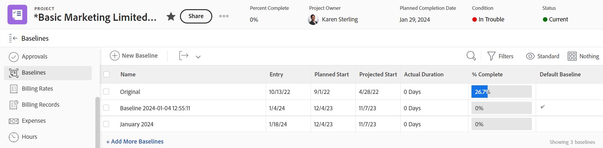

# Créer des références de projet

<!-- Audited: 12/2023 -->

Une référence est un instantané de projet qui représente des éléments d’information clés inclus dans le plan initial du projet ou à tout moment pendant la durée du projet.

Tirez parti des références pour comparer les informations du plan actuel au plan d’origine, ou à tout autre moment dans le temps, afin d’identifier les tâches problématiques, la dégradation de la portée et d’autres tendances au fil du temps.

## Conditions d’accès

+++ Développez pour afficher les exigences d’accès aux fonctionnalités de cet article.

<!--
drafted for P&P:

<table style="table-layout:auto"> 
 <col> 
 <col> 
 <tbody> 
  <tr> 
   <td role="rowheader">Adobe Workfront plan*</td> 
   <td> 
Any
 </td> 
  </tr> 
  <tr> 
   <td role="rowheader">Adobe Workfront license*</td> 
   <td> 
Current license: Standard 
 
   Or
   
Legacy license: Plan 
 
   </td> 
  </tr> 
  <tr> 
   <td role="rowheader">Access level*</td> 
   <td> 
Edit access to Projects
 
<b>NOTE</b>
   
   If you still don't have access, ask your Workfront administrator if they set additional restrictions in your access level. For information about access to projects, see <a href="../../../administration-and-setup/add-users/configure-and-grant-access/grant-access-projects.md" class="MCXref xref">Grant access to projects</a>. For information on how a Workfront administrator can change your access level, see <a href="../../../administration-and-setup/add-users/configure-and-grant-access/create-modify-access-levels.md" class="MCXref xref">Create or modify custom access levels</a>. 
 </td> 
  </tr> 
  <tr> 
   <td role="rowheader">Object permissions</td> 
   <td> 
View permissions to the project or higher to view baselines
 
Manage permissions to the project to create baselines
 
 For information about project permissions, see <a href="../../../workfront-basics/grant-and-request-access-to-objects/share-a-project.md" class="MCXref xref">Share a project in Adobe Workfront</a>.
 
For information on requesting additional access, see <a href="../../../workfront-basics/grant-and-request-access-to-objects/request-access.md" class="MCXref xref">Request access to objects </a>.
 </td> 
  </tr> 
 </tbody> 
</table>
-->

<table style="table-layout:auto"> 
 <col> 
 <col> 
 <tbody> 
  <tr> 
   <td role="rowheader">Formule Adobe Workfront</td> 
   <td> 
Tous
 </td> 
  </tr> 
  <tr> 
   <td role="rowheader">Licence Adobe Workfront*</td> 
    <td>
Nouveau : Standard

        
ou

        
Actuel : formule 
 </td> 
  </tr> 
  <tr> 
   <td role="rowheader">Niveau d’accès</td> 
   <td> 
Accès en modification aux projets
 </td> 
  </tr> 
  <tr> 
   <td role="rowheader">Autorisations d’objet</td> 
   <td> 
Autorisations d’affichage pour le projet ou supérieures, afin d’afficher les références
 
Autorisations de gestion du projet, pour créer des références
 </td> 
  </tr> 
 </tbody> 
</table>

* Pour plus d’informations sur ce tableau, consultez [Conditions d’accès requises dans la documentation Workfront](/help/quicksilver/administration-and-setup/add-users/access-levels-and-object-permissions/access-level-requirements-in-documentation.md).

+++

## Remarques sur l’utilisation des références

* Vous pouvez capturer des instantanés d’un projet au cours de sa durée de vie afin de suivre sa progression, et créer ainsi plusieurs références.
* Vous pouvez afficher les informations incluses dans les références d’un projet en créant une références ou un rapport de rniveau de référence.
* Lorsque vous créez une référence, les informations sur les tâches sont également capturées sur les tâches de référence de cette référence.
* Vous pouvez consulter les informations sur les tâches de référence en créant un rapport de tâche de référence.

>[!IMPORTANT]
>
>Une référence capture un instantané du nom, des dates et des informations financières du projet. La référence n’inclut pas les valeurs des champs personnalisés du projet. Pour plus d’informations sur les informations financières incluses dans la référence, consultez la section [Finances du projet incluses dans les références du projet](../../../manage-work/projects/project-finances/project-finances-included-in-project-baselines.md).

## Créer une référence

Pour créer une référence, procédez comme suit :

* **Automatiquement** : votre administrateur ou administratrice Workfront ou de groupes définit les préférences de projet pour que Workfront crée automatiquement une référence lorsqu’un projet est actif. Lorsque ce paramètre est activé, une référence est créée lorsque le projet est actif. Lorsque ce paramètre n’est pas activé, vous devez créer manuellement des références.

  Pour plus d’informations sur la configuration des préférences de projet et la configuration de la création automatique de références, consultez la section [Configurer les préférences de projet à l’échelle du système](../../../administration-and-setup/set-up-workfront/configure-system-defaults/set-project-preferences.md).

  >[!CAUTION]
  >
  >L’activation de ce paramètre crée automatiquement une référence pour un projet chaque fois que le statut du projet passe à Actif. La première référence créée est celle par défaut. Vous devez créer manuellement toutes les autres références pendant la durée du projet.

* **Manuellement** : vous pouvez créer de nouvelles références pour le projet au fur et à mesure de son évolution. Vous pouvez ensuite comparer des références pour suivre l’évolution du projet dans le temps.

Pour créer une référence, procédez comme suit :

1. Accédez à un projet.
1. Dans le panneau de gauche, cliquez sur **Références**.

   

1. Cliquez sur **Nouveau niveau de référence.**
1. Indiquez le nom de la référence.
1. (Facultatif) S’il s’agit de la première référence, vous pouvez la choisir comme référence par défaut.
1. Cliquer sur **Enregistrer**.

   Par défaut, les informations suivantes s’affichent sur la référence que vous avez créée :

   * Nom de la référence
   * Date de saisie de référence
   * Date de début prévue pour le projet lorsque la référence a été créée.
   * Date de début prévisionnelle pour le projet lorsque la référence a été créée.
   * Durée réelle du projet lorsque la référence a été créée.
   * % d’achèvement du projet lorsque la référence a été créée.
   * Indicateur de référence par défaut qui indique si une référence est la référence par défaut du projet.

     >[!TIP]
     >
     >Vous ne pouvez pas afficher les informations de deux références quelconques en même temps dans la même vue ou dans le même rapport. Vous pouvez uniquement afficher les informations d’une référence donnée et de la référence par défaut dans le même rapport. Vous pouvez modifier la référence que vous considérez être la référence par défaut à tout moment pendant la durée du projet.

1. (Facultatif) Cliquez sur le bouton **Afficher**, puis créez une vue ou modifiez la vue actuelle pour lui ajouter des champs et comparer les informations supplémentaires entre les références. Pour plus d’informations, voir la section [Créer ou modifier des vues dans Adobe Workfront](/help/quicksilver/reports-and-dashboards/reports/reporting-elements/create-edit-views.md).

## Créer un rapport de niveau de référence ou de tâche de référence

Pour afficher des informations de référence, vous pouvez également créer un rapport de niveau de référence ou de tâche de référence. Vous pouvez ainsi afficher n’importe quel nombre de champs relatifs aux références ou aux tâches de référence pour les comparer dans une vue.

>[!TIP]
>
>Vous devez créer une référence avant de pouvoir créer un rapport de niveau de référence ou de tâche de référence.

Pour plus d’informations sur la création d’un rapport, voir la section [Créer un rapport personnalisé](../../../reports-and-dashboards/reports/creating-and-managing-reports/create-custom-report.md).

Nous vous recommandons d’ajouter un regroupement Nom de projet à votre rapport de niveau de référence ou de tâche de référence afin de faciliter la lecture.

Pour plus d’informations sur la création d’un regroupement, voir la section [Créer des regroupements dans Adobe Workfront](../../../reports-and-dashboards/reports/reporting-elements/create-groupings.md).
