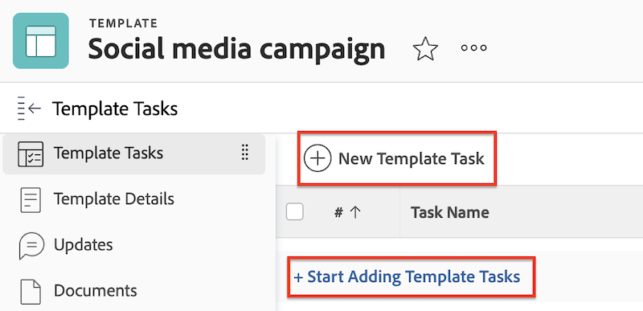

# Créer un projet connecté à Frame.io

L’intégration de Workfront et Frame.io vous permet de créer des projets dans Workfront qui sont mis en miroir dans Frame.io, offrant ainsi une expérience de révision et d’approbation transparente.

Lorsqu’un projet Workfront est connecté à Frame.io, vous pouvez :

* **Affecter des utilisateurs Frame.io à des tâches** : les utilisateurs ayant accès à Frame.io sont avertis par e-mail lorsqu’ils sont affectés à une tâche Workfront, ce qui signale qu’il reste du travail à accomplir.
* **Partager le projet avec des utilisateurs Frame.io** : lorsqu’un projet est partagé avec des utilisateurs dotés de Frame.io, ils ont accès au projet dans Workfront et Frame.io.
* **Partage de contenu créatif avec Frame.io** : les coordinateurs de projet peuvent envoyer des instructions et du contenu de Workfront directement à l’utilisateur créatif dans Frame.io à l’aide d’un dossier de projet de synchronisation unidirectionnelle. [!BADGE Bientôt disponible]{type=Informative}
* **Suivre la progression de la tâche** : les créatifs peuvent envoyer des ressources terminées et marquer les tâches comme terminées, le tout sans quitter Frame.io.

## Conditions d’accès

+++ Développez pour afficher les exigences d’accès aux fonctionnalités de cet article. 

>[!IMPORTANT]
>
>Cette fonctionnalité n’est disponible que pour les organisations qui ont été intégrées à l’[!DNL Adobe Admin Console].

Vous devez disposer des éléments suivants :

<table style="table-layout:auto"> 
 <col> 
 <col> 
 <tbody> 
  <tr> 
   <td role="rowheader">Formule Adobe Workfront</td> 
   <td> 
Tous
 </td> 
  </tr> 
  <tr> 
   <td role="rowheader">Licence Adobe Workfront</td> 
   <td> 
Standard
 </td> 
  </tr> 
  <tr> 
   <td role="rowheader">Configurations des niveaux d’accès</td> 
   <td> 
Accès en modification aux projets
 </td> 
  </tr> 
  <tr> 
   <td role="rowheader">Autorisations d’objet</td> 
   <td> 
Lorsque vous créez un projet, vous recevez automatiquement les autorisations de gestion du projet.
 </td> 
  </tr> 
 </tbody> 
</table>

Pour plus d’informations sur le contenu de ce tableau, voir [Conditions d’accès requises dans la documentation Workfront](/help/quicksilver/administration-and-setup/add-users/access-levels-and-object-permissions/access-level-requirements-in-documentation.md).

+++

## Conditions préalables

* Configurez le compte Frame.io par défaut dans la zone Configuration de Workfront .
* Activation des utilisateurs Frame.io dans le profil utilisateur de Workfront

## Créer un modèle de projet

Lors de la création d’un modèle, vous pouvez saisir les informations pour toutes les tâches et pour les paramètres de votre futur projet. Ces informations seront ensuite transférées à tout projet que vous créerez à partir du modèle.

Les projets dans Frame.io sont organisés par équipes, qui sont connectées aux groupes Workfront. Nous vous recommandons d’utiliser un modèle de projet pour créer des projets connectés, car vous pouvez définir le groupe de projets au préalable.

Si vous choisissez de créer le projet à partir de zéro, Workfront ajoute automatiquement le groupe de projets Par défaut et le projet Frame.io miroir est créé sous cette équipe par défaut dans Frame.io.

>[!NOTE]
>
>La mise à jour du groupe après la création du projet ne modifie pas l&#39;équipe Frame.io.

### Créez le modèle et spécifiez le groupe de projets

{{step1-to-templates}}

1. Cliquez sur **Nouveau modèle**.
1. Saisissez un nom pour votre modèle, puis appuyez sur **Entrée** pour enregistrer le nom.
1. Dans le panneau de gauche, cliquez sur **Détails du modèle**.
1. Dans la section **Association de modèles**, veillez à spécifier un groupe. Si vous n&#39;ajoutez pas de groupe, le groupe de projets par défaut est ajouté et le projet dans Frame.io est créé sous l&#39;équipe par défaut correspondante dans Frame.io.

Passez à la section suivante.

### Ajouter des tâches et affecter des utilisateurs prenant en charge Frame.io

1. Dans le panneau de gauche, cliquez sur **Tâches de modèles**.
1. Cliquez sur **Commencer à ajouter des tâches de modèles** pour ajouter rapidement des tâches à votre modèle. Vous pouvez configurer des paramètres supplémentaires ultérieurement.

   Ou

   Cliquez sur **Nouvelle tâche de modèle** pour ajouter une tâche à la fois et configurer des paramètres supplémentaires.
   
1. Ajoutez un nom de tâche.
1. Dans la zone **Affectations**, affectez des utilisateurs ou des équipes. Si vous affectez un utilisateur Frame.io activé, que ce soit individuellement ou dans une équipe, il se voit accorder un accès collaborateur au projet Frame.io et est averti de la tâche dans le projet Frame.io par e-mail. À partir de cet e-mail, ils peuvent rejoindre le projet Frame.io et commencer à travailler.
1. Répétez les étapes 1 et 2 si nécessaire.

Passez à la section suivante.

### Configurer des détails de modèle supplémentaires

Workfront dispose de solides fonctionnalités de gestion de projet. Nous vous recommandons d’utiliser l’article [Modifier les modèles de projet](/help/quicksilver/manage-work/projects/create-and-manage-templates/edit-templates.md) pour configurer les zones suivantes du modèle :

* Vue d’ensemble
* Finances
* Formulaires personnalisés
* Paramètres du projet
* Paramètres des tâches
* Paramètres de l&#39;événement
* Accès

### Créer un projet à partir du modèle

Une fois que vous avez créé un modèle, vous pouvez l’utiliser pour créer des projets.

{{step1-to-projects}}

1. Cliquez sur **Nouveau projet à partir d’un modèle**.
1. À l’aide de la zone de recherche, commencez à saisir le nom du modèle dont vous avez besoin.
1. Sélectionnez le nom du modèle, puis cliquez sur **Utiliser le modèle**.
   
1. Ajustez les paramètres du projet selon vos besoins, puis cliquez sur **Créer un projet**.
1. Dans le panneau de gauche, cliquez sur **Documents**.
1. Utilisez le dossier de synchronisation unidirectionnelle pour partager automatiquement des contenus créatifs avec Frame.io. [!BADGE Bientôt disponible]{type=Informative}

   >[!NOTE]
   >
   >Cette fonctionnalité est actuellement en cours de développement. Pour partager des informations avec les utilisateurs dans Frame.io, chargez les fichiers dans l&#39;onglet Document. Lorsque le statut du projet est défini sur Actuel, ces fichiers sont automatiquement transférés sur Frame.io.

1. Dans l’en-tête du projet, modifiez le projet de **Planification** en **Actuel**.

Une fois le projet créé et les contenus publicitaires chargés, vous pouvez affecter un workflow de révision et d’approbation à la ressource dans Workfront. Pour plus d&#39;informations, voir [Créer une demande de révision ou d&#39;approbation de document](/help/quicksilver/review-and-approve-work/document-reviews-and-approvals/manage-document-approvals/create-a-document-approval.md). <!-- name may need to change -->

## Créer un nouveau projet à partir de zéro

Vous pouvez créer un projet à partir de zéro si nécessaire.

>[!IMPORTANT]
>
>* Les projets dans Frame.io sont organisés par équipes, qui sont connectées aux groupes Workfront. Nous vous recommandons d’utiliser un modèle de projet pour créer des projets connectés, car vous pouvez définir le groupe de projets au préalable.
>
>
>* Si vous choisissez de créer le projet à partir de zéro, Workfront ajoute automatiquement le groupe de projets Par défaut et le projet Frame.io miroir est créé sous cette équipe par défaut dans Frame.io.
>
>La mise à jour du groupe après la création du projet ne modifie pas l&#39;équipe Frame.io.

### Créer le projet

{{step1-to-projects}}

1. Cliquez sur **Nouveau projet**.
1. Saisissez un nom pour votre projet, puis appuyez sur **Entrée** pour enregistrer le nom.

Passez à la section suivante.

### Ajouter des tâches et affecter des utilisateurs prenant en charge Frame.io

1. Dans le panneau de gauche, cliquez sur **Tâches**.
1. Cliquez sur **Commencer à ajouter des tâches** pour ajouter rapidement des tâches à votre projet. Vous pouvez configurer des paramètres supplémentaires ultérieurement.

   Ou

   Cliquez sur **Nouvelle tâche** pour ajouter une tâche à la fois et configurer des paramètres supplémentaires.
   
1. Ajoutez un nom de tâche.
1. Dans la zone **Affectations**, affectez des utilisateurs ou des équipes. Si vous affectez un utilisateur Frame.io activé, que ce soit individuellement ou dans une équipe, il se voit accorder un accès collaborateur au projet Frame.io et est averti de la tâche dans le projet Frame.io par e-mail. À partir de cet e-mail, ils peuvent rejoindre le projet Frame.io et commencer à travailler.
1. Répétez les étapes 1 et 2 si nécessaire.

Passez à la section suivante.

### Chargement de contenu créatif

1. Dans le panneau de gauche, cliquez sur **Documents**.
1. Utilisez le dossier de synchronisation unidirectionnelle pour partager automatiquement des contenus créatifs avec Frame.io. [!BADGE Bientôt disponible]{type=Informative}

   >[!NOTE]
   >
   >Cette fonctionnalité est actuellement en cours de développement. Pour partager des informations avec les utilisateurs dans Frame.io, chargez les fichiers dans l&#39;onglet Document. Lorsque le statut du projet est défini sur Actuel, ces fichiers sont automatiquement transférés sur Frame.io

Passez à la section suivante.

### Configurer les détails supplémentaires du projet

Workfront dispose de solides fonctionnalités de gestion de projet. Nous vous recommandons d’utiliser l’article [Modifier les projets](/help/quicksilver/manage-work/projects/manage-projects/edit-projects.md) pour configurer les zones suivantes du projet :

* Vue d’ensemble
* Finances
* Formulaires personnalisés
* Paramètres du projet
* Paramètres des tâches
* Paramètres de l&#39;événement
* Accès

### Définir le projet sur actuel

1. Dans l’en-tête du projet, modifiez le projet de Planification en Actuel.
Une fois le projet créé et les contenus publicitaires chargés, vous pouvez affecter un workflow de révision et d’approbation à la ressource dans Workfront.

Une fois le projet créé et les contenus publicitaires chargés, vous pouvez affecter un workflow de révision et d’approbation à la ressource dans Workfront.

Pour plus d&#39;informations, voir [Créer une demande de révision ou d&#39;approbation de document](/help/quicksilver/review-and-approve-work/document-reviews-and-approvals/manage-document-approvals/create-a-document-approval.md). <!-- name may need to change -->
