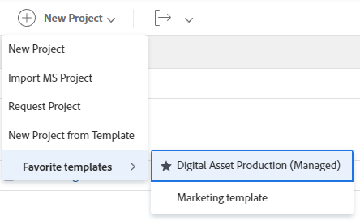
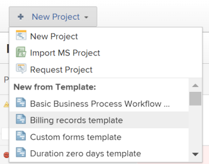
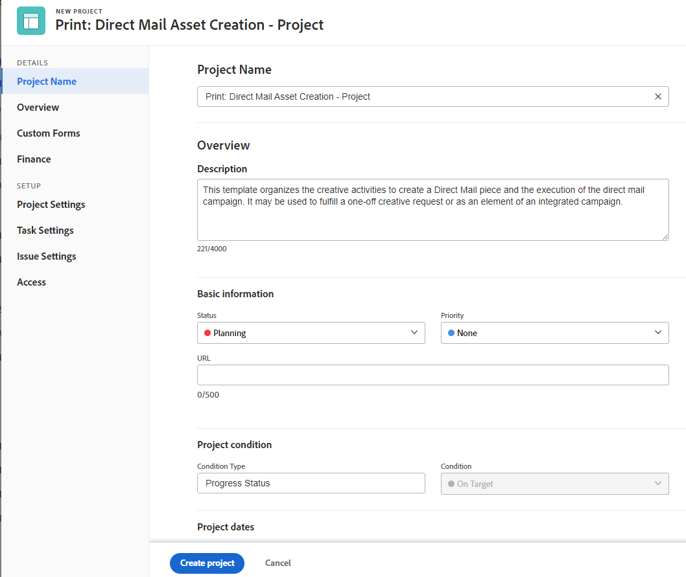

# Créer un projet à partir d’un modèle

<!-- Audited: 10/2025 -->

Vous pouvez utiliser des modèles en tant que cadre pour créer des projets dans Adobe Workfront. Si certains de vos projets se répètent fréquemment, vous pouvez utiliser des modèles pour la chronologie générale du nouveau projet pour éviter de créer le même projet à nouveau.

Les modèles vous permettent de capturer des processus, des informations et des paramètres reproductibles associés à vos projets. Les informations associées à un modèle sont transférées vers le projet. Cela inclut les tâches, les affectations, les durées, les documents, les détails financiers, les risques et les formulaires personnalisés.

>[!TIP]
>
>Workfront définit le groupe et le statut du nouveau projet comme suit :
>
>* Le statut par défaut d’un projet créé à partir d’un modèle correspond au statut défini par votre administrateur ou une administratrice Workfront dans la zone principale Préférences du projet, ou par un administrateur ou une administratrice de groupe (ou un administrateur ou une administratrice Workfront) dans la zone Préférences du projet pour un groupe. Pour plus d’informations sur la configuration des préférences du projet, consultez [Configurer les préférences de projet à l’échelle du système](../../../administration-and-setup/set-up-workfront/configure-system-defaults/set-project-preferences.md) ou [Configurer les préférences de projet de groupe](../../../administration-and-setup/manage-groups/create-and-manage-groups/configure-project-preferences-group.md).
>
>* Le groupe du nouveau projet est le groupe du modèle. Si le modèle n’est pas associé à un groupe, le groupe du projet est le groupe principal de l’utilisateur ou de l’utilisatrice qui crée le projet.
>
>* Les statuts disponibles pour un nouveau projet correspondent aux statuts du groupe du projet (qui peut être le groupe du modèle ou le groupe principal de l’utilisateur ou de l’utilisatrice qui a créé le projet).

Vous disposez des options suivantes pour créer un projet à partir d’un modèle :

* Créer un projet à partir d’un modèle dans la zone Projets
* Créer un projet à partir d’un modèle au niveau du modèle
* Joindre un modèle à un projet existant

  Pour plus d’informations, consultez [Joindre un modèle à un projet](../../../manage-work/projects/create-and-manage-templates/attach-template-to-project.md).

* Créer un projet à partir d’un modèle dans la zone des groupes

## Conditions d’accès

+++ Développez pour afficher les exigences d’accès aux fonctionnalités de cet article.

<table style="table-layout:auto"> 
 <col> 
 <col> 
 <tbody> 
  <tr> 
   <td role="rowheader">Package Adobe Workfront</td> 
   <td> 
Tous
 </td> 
  </tr> 
  <tr> 
   <td role="rowheader">Licence Workfront</td> 
   <td> 
Standard

        
Plan
 </td> 
  </tr> 
  <tr> 
   <td role="rowheader">Configuration du niveau d’accès</td> 
   <td> 
Modifier l’accès aux projets et aux modèles

   
Modifiez l’accès aux Portfolios et Programmes si le modèle que vous utilisez contient un Portfolio et un Programme
  
   </td> 
  </tr> 
  <tr> 
   <td role="rowheader">Autorisations d’objet</td> 
   <td> 
Autorisations d’affichage pour un modèle
 
  
Si le modèle que vous utilisez contient un Portfolio et un programme, vous devez disposer des autorisations de niveau Gérer sur le portfolio et le programme pour créer le projet 
 
   
Lorsque vous créez un projet, vous recevez automatiquement les autorisations de gestion du projet.
</td> 
  </tr> 
 </tbody> 
</table>

Pour plus d’informations, voir [Conditions d’accès dans la documentation Workfront](/help/quicksilver/administration-and-setup/add-users/access-levels-and-object-permissions/access-level-requirements-in-documentation.md).

+++

<!--
Old:

<table style="table-layout:auto"> 
 <col> 
 <col> 
 <tbody> 
  <tr> 
   <td role="rowheader">Adobe Workfront plan</td> 
   <td> 
Any 
 </td> 
  </tr> 
  <tr> 
   <td role="rowheader">Workfront license*</td> 
   <td> 
New: Standard

        
or

        
Current: Plan 
 </td> 
  </tr> 
  <tr> 
   <td role="rowheader">Access level</td> 
   <td> 
Edit access to Projects and to Templates

   
   
edit access to Portfolios and Programs, if the template you use contains a Portfolio and a Program

   
   </td> 
  </tr> 
  <tr> 
   <td role="rowheader">Object permissions</td> 
   <td> 
View permissions to a template
 
  
If the template you use contains a Portfolio and a Program, you must have Manage permissions to the portfolio and program to create the project 
 
   
When you create a project, you automatically receive Manage permissions to the project.
</td> 
  </tr> 
 </tbody> 
</table>
-->

## Créer un projet à partir d’un modèle dans la zone Projets

Vous pouvez créer un projet à partir de la zone Projets du menu principal, ou à partir de la zone Projets d’un portfolio ou d’un programme.

>[!NOTE]
>
>Votre administrateur ou administratrice système ou administrateur ou administratrice de groupes peut modifier votre interface à l’aide d’un modèle de mise en page. Dans ce cas, certains noms de sections et de zones mentionnées dans les étapes suivantes peuvent être différents dans votre instance de Workfront.

1. Utilisez l’une des méthodes suivantes :

   * Cliquez sur l’icône **[!UICONTROL Menu principal]**  dans le coin supérieur gauche, puis cliquez sur **Projets** et développez **Nouveau projet**.
   * Accédez à un portfolio, puis développez **Nouveau projet**.

     >[!TIP]
     >
     >Lorsque vous créez un projet à l’aide d’un modèle de portfolio, le champ Portfolio du nouveau projet se met à jour pour afficher le portfolio à partir duquel vous avez créé le projet. Le champ Portfolio du modèle est alors remplacé, s’il est spécifié.

   * Accédez à un programme, puis développez **Nouveau projet**.

     >[!TIP]
     >
     >Lorsque vous créez un projet à l’aide d’un modèle issu d’un programme, le champ Programme des nouveaux projets est mis à jour afin d’afficher le programme à partir duquel vous avez créé le projet. Le champ Portfolio du modèle se met à jour pour afficher le portfolio du programme à partir duquel vous avez créé le projet. Cela remplace les champs Programme et Portfolio du modèle, s’ils sont spécifiés.

   * Si vous êtes administrateur ou administratrice de groupes, vous pouvez également créer un projet dans la section Projets d’un groupe que vous gérez. Pour plus d’informations, voir [Créer et modifier les projets d’un groupe](../../../administration-and-setup/manage-groups/work-with-group-objects/create-and-modify-a-groups-projects.md).

     >[!TIP]
     >
     >Lorsque vous créez un projet à partir d’un groupe, le groupe à partir duquel vous créez le projet s’affiche dans le champ Groupe du nouveau projet uniquement lorsque le champ Groupe du modèle n’est pas spécifié. Si le champ Groupe du modèle est spécifié, le champ Groupe du nouveau projet correspond à celui du modèle.

   <!--
   
(this, above, is hyperlinked to the classic version of this article; the Milestone View steps are similar to creating a project in Classic than to the way you do it in NWE)

   -->

   

1. Cliquez sur le nom d’un modèle dans la liste **Modèles favoris**.

   

   Ou procédez comme suit :

   1. Cliquez sur **Nouveau projet à partir d’un modèle**.
   1. (Facultatif) Dans le champ **Modèles de recherche**, commencez à saisir le nom d’un modèle et cliquez dessus lorsqu’il s’affiche dans la liste.
   1. Cliquez sur le nom de l’un des types de modèles suivants pour le sélectionner :

      * Modèle de stockage Workfront hérité

        Les modèles de stockage Workfront hérités affichent une icône de stockage hérité  en regard de leur nom.

        Les documents sur le modèle et sur les futurs projets seront stockés dans le stockage Workfront.
      * Un modèle de stockage dans le cloud Adobe

        Les documents sur le modèle et sur les projets futurs seront stockés dans l’espace de stockage cloud d’Adobe.

      >[!NOTE]
      >
      >* L’utilisation d’un modèle de stockage dans le cloud Adobe crée un projet de stockage dans le cloud Adobe.
      >
      >* L’utilisation d’un modèle de stockage Workfront hérité crée un projet de stockage Workfront hérité.
      >
      >* Lors de la création de projets à l’aide de modèles provenant d’un portfolio ou d’un programme, les scénarios suivants existent :
      >     * Vous ne pouvez pas utiliser un modèle de stockage dans le cloud Adobe d’un portfolio ou programme de stockage Workfront hérité pour créer un projet.
      >     * Vous pouvez créer un projet de stockage dans le cloud Adobe pour un portfolio ou un programme de stockage Adobe à l’aide d’un modèle de stockage hérité. Les documents et dossiers de modèle ne sont pas joints au nouveau projet.
      >
      > Votre instance Workfront peut ne pas avoir les deux types de stockage de documents.
      >
      >Pour plus d’informations, voir [Présentation de la gestion des documents pour les projets et les objets associés](/help/quicksilver/manage-work/projects/manage-projects/manage-documents-on-projects.md).

   1. (Conditionnel et facultatif) Si vous avez sélectionné un modèle de stockage hérité, sélectionnez le paramètre Créer ce projet sur l’espace de stockage dans le cloud d’Adobe dans le coin inférieur droit de la zone Nouveau projet . Un projet de stockage dans le cloud Adobe sera ainsi créé. Les documents et les dossiers de documents du modèle ne seront pas ajoutés au projet.

   1. Consultez les détails du modèle suivant sur la droite :

      * Durée du modèle
      * Propriétaire du modèle
      * Nombre de tâches de niveau supérieur comprenant les noms des trois premières tâches
      * Nombre de toutes les tâches dans le modèle
      * Noms des modèles de formulaires personnalisés

   1. (Facultatif) Passez la souris sur le nom d’un modèle dans le panneau de gauche et cliquez sur l’icône **Favoris** **icône**  pour le marquer comme favori en vue d’une utilisation ultérieure.

      Ou

      Développez la liste **Modèles favoris** et sélectionnez un modèle dans la liste déroulante.

      >[!TIP]
      >
      >Vous pouvez avoir jusqu’à 40 articles marqués comme favoris dans Workfront. Il s’agit notamment de modèles et d’autres éléments.

   1. Cliquez sur **Utiliser un modèle** lorsque vous avez sélectionné un modèle.

      

      <!--
      no longer available, after unshimming - Oct 2025:
      >[!NOTE]
      >
      >If you have the Milestone View applied to the list of projects, click the name of a template in the **New from Template section**.
      >
      >
      >
      >
      -->

   La boîte de dialogue **Nouveau projet** s’ouvre.

   

1. (Conditionnel) Si un champ est déjà renseigné dans le modèle, le champ est pré-renseigné dans la zone **Nouveau projet**.

   Modifiez les valeurs pré-renseignées pour mieux les faire correspondre à votre projet.

   Pour plus d’informations, voir [Modifier les projets](../../../manage-work/projects/manage-projects/edit-projects.md).
1. Cliquez sur **Créer un projet**.

   Tous les détails définis dans le modèle sont associés automatiquement au nouveau projet si vous ne les avez pas modifiés à l’étape précédente.

   Un dossier de documents portant le même nom que le projet est automatiquement créé pour les projets d’espace de stockage dans le cloud Adobe dans la section Documents du projet.

## Créer un projet à partir d’un modèle dans la zone Modèles

Au lieu de commencer dans la zone Projets, vous pouvez créer un projet à partir d’un modèle.

>[!NOTE]
>
>Les modèles associés au stockage de documents Workfront créent des projets de stockage Workfront hérités. Les modèles associés à l’espace de stockage Adobe pour les documents créent des projets d’espace de stockage Adobe. Votre instance Workfront peut ne pas avoir les deux types de stockage de documents.
>
>Pour plus d’informations, voir [Présentation de la gestion des documents pour les projets et les objets associés](/help/quicksilver/manage-work/projects/manage-projects/manage-documents-on-projects.md).

{{step1-to-templates}}

1. Cliquez sur le nom du modèle à utiliser.
1. Cliquez sur le menu **Plus**  à droite du nom du modèle dans l’en-tête, puis cliquez sur **Créer un projet**.

   

   La boîte de dialogue **Nouveau projet** s’ouvre.

1. Saisissez un nom pour le projet. Workfront utilise le nom du modèle pour nommer le nouveau projet.

1. Passez en revue chaque section de la zone **Nouveau projet** et apportez les modifications nécessaires.

   

   Si un champ est déjà rempli dans le modèle, il sera pré-rempli dans la boîte de dialogue **Nouveau projet**. Vous pouvez modifier les valeurs pré-remplies pour qu’elles correspondent mieux à votre projet.

   Pour plus d’informations, voir [Modifier les projets](../../../manage-work/projects/manage-projects/edit-projects.md).

1. Cliquez sur **Créer un projet**.

   Tous les détails définis dans le modèle sont associés automatiquement au nouveau projet si vous ne les avez pas modifiés à l’étape précédente.

   Un dossier de documents portant le même nom que le projet est automatiquement créé pour les projets d’espace de stockage dans le cloud Adobe dans la section Documents du projet.
