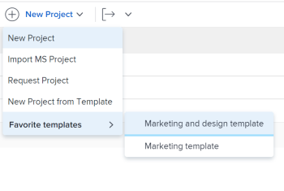

# Création d’un projet à l’aide d’un modèle

Vous pouvez utiliser des modèles comme structure pour créer des projets. Si des projets se répètent fréquemment, l’utilisation de modèles pour la chronologie générale du nouveau projet vous évite d’avoir à créer les mêmes projets à plusieurs reprises.

Les modèles vous permettent de capturer des processus, des informations et des paramètres répétables associés à vos projets. Les informations associées à un modèle sont transférées vers le projet. Cela inclut les tâches, les affectations, les durées, les documents, les détails financiers, les risques et les formulaires personnalisés.

>[!TIP]
>
>Workfront définit le groupe et l’état du nouveau projet comme suit :
>
>* L’état par défaut d’un nouveau projet créé à partir d’un modèle correspond à l’état défini par votre administrateur Workfront dans la zone principale Préférences du projet ou par un administrateur de groupe (ou un administrateur Workfront) dans la zone Préférences du projet pour un groupe. Pour plus d’informations sur la configuration des préférences du projet, voir [Configuration des préférences de projet à l’échelle du système](../../../administration-and-setup/set-up-workfront/configure-system-defaults/set-project-preferences.md) ou [Configuration des préférences de projet pour un groupe](../../../administration-and-setup/manage-groups/create-and-manage-groups/configure-project-preferences-group.md).
>
>* Le Groupe du nouveau projet est le Groupe du modèle. Si le modèle n’est pas associé à un groupe, le groupe du projet est le groupe d’accueil de l’utilisateur qui crée le projet.
>
>* Les états disponibles pour un nouveau projet correspondent aux états du Groupe du projet qui est soit le Groupe du modèle, soit le Groupe d’accueil de l’utilisateur qui crée le projet.

Vous disposez des options suivantes pour créer un projet à partir d’un modèle :

* Création d’un projet à partir d’un modèle dans la zone Projets
* Créer un projet à partir d’un modèle au niveau du modèle
* Joindre un modèle à un projet existant

   Pour plus d’informations, voir [Joindre un modèle à un projet](../../../manage-work/projects/create-and-manage-templates/attach-template-to-project.md).

* Création d’un projet à partir d’un modèle dans la zone Groupes

## Exigences d’accès

<!--drafted for P&P:

<table style="table-layout:auto"> 
 <col> 
 <col> 
 <tbody> 
  <tr> 
   <td role="rowheader">Adobe Workfront plan*</td> 
   <td> 
Any 
 </td> 
  </tr> 
  <tr> 
   <td role="rowheader">Workfront license*</td> 
   <td> 
Current license: Standard 

   Or
   
Legacy license: Plan 

    </td> 
  </tr> 
  <tr> 
   <td role="rowheader">Access level configurations*</td> 
   <td> 
Edit access to Projects and to Templates
 
<b>NOTE</b>
   
   If you still don't have access, ask your Workfront administrator if they set additional restrictions in your access level. For information about access to projects, see <a href="../../../administration-and-setup/add-users/configure-and-grant-access/grant-access-projects.md" class="MCXref xref">Grant access to projects</a>. For information on how a Workfront administrator can change your access level, see <a href="../../../administration-and-setup/add-users/configure-and-grant-access/create-modify-access-levels.md" class="MCXref xref">Create or modify custom access levels</a>. 
 </td> 
  </tr> 
  <tr> 
   <td role="rowheader">Object permissions</td> 
   <td> 
View permissions to a template
 
When you create a project you automatically receive Manage permissions to the project 
 
 For information about project permissions, see <a href="../../../workfront-basics/grant-and-request-access-to-objects/share-a-project.md" class="MCXref xref">Share a project in Adobe Workfront</a>.
 
For information on requesting additional access, see <a href="../../../workfront-basics/grant-and-request-access-to-objects/request-access.md" class="MCXref xref">Request access to objects </a>.
 </td> 
  </tr> 
 </tbody> 
</table>
-->

Vous devez disposer des accès suivants pour effectuer les étapes de cet article :

<table style="table-layout:auto"> 
 <col> 
 <col> 
 <tbody> 
  <tr> 
   <td role="rowheader">Formule Adobe Workfront*</td> 
   <td> 
Tous 
 </td> 
  </tr> 
  <tr> 
   <td role="rowheader">Présentation des licences Workfront*</td> 
   <td> 
Plan 
 </td> 
  </tr> 
  <tr> 
   <td role="rowheader">Niveau d’accès*</td> 
   <td> 
Modifier l’accès aux projets et aux modèles
 
<b>NOTE</b>

Si vous n’avez toujours pas accès à , demandez à votre administrateur Workfront s’il définit des restrictions supplémentaires à votre niveau d’accès. Pour plus d’informations sur l’accès aux projets, voir <a href="../../../administration-and-setup/add-users/configure-and-grant-access/grant-access-projects.md" class="MCXref xref">Accorder l’accès aux projets</a>. Pour plus d’informations sur la façon dont un administrateur Workfront peut modifier votre niveau d’accès, voir <a href="../../../administration-and-setup/add-users/configure-and-grant-access/create-modify-access-levels.md" class="MCXref xref">Création ou modification de niveaux d’accès personnalisés</a>. 
 </td>
</tr> 
  <tr> 
   <td role="rowheader">Autorisations d’objet</td> 
   <td> 
Affichage des autorisations pour un modèle
 
Lorsque vous créez un projet, vous recevez automatiquement les autorisations Manage (Gérer les autorisations) pour ce projet. 
 
 Pour plus d’informations sur les autorisations de projet, voir <a href="../../../workfront-basics/grant-and-request-access-to-objects/share-a-project.md" class="MCXref xref">Partage d’un projet dans Adobe Workfront</a>.
 
Pour plus d’informations sur la demande d’accès supplémentaire, voir <a href="../../../workfront-basics/grant-and-request-access-to-objects/request-access.md" class="MCXref xref">Demande d’accès aux objets </a>.
 </td> 
  </tr> 
 </tbody> 
</table>

&#42;Pour connaître le plan, le type de licence ou l’accès dont vous disposez, contactez votre administrateur Workfront.

## Création d’un projet à partir d’un modèle dans la zone Projets

Vous pouvez créer un projet à partir de la zone Projets du menu principal ou de la zone Projets d’un portfolio ou d’un programme.

1. Utilisez l’une des méthodes suivantes :

   * Cliquez sur le bouton **Menu Principal** , cliquez sur **Projets**, puis développez **Nouveau projet**.
   * Accédez à un portfolio, puis développez **Nouveau projet**.

      >[!TIP]
      >
      >Lorsque vous créez un projet à l’aide d’un modèle d’un portfolio, le champ Portfolio du nouveau projet se met à jour pour afficher le portfolio à partir duquel vous avez choisi de créer le projet. Le champ Portfolio du modèle est alors remplacé, s’il est spécifié.

   * Accédez à un programme, puis développez **Nouveau projet**.

      >[!TIP]
      >
      >Lorsque vous créez un projet à l’aide d’un modèle issu d’un programme, le champ Programme des nouveaux projets est mis à jour afin d’afficher le programme à partir duquel vous avez choisi de créer le projet. Le champ Portfolio du modèle se met à jour pour afficher le portefeuille du programme à partir duquel vous avez choisi de créer le projet. Cela remplace les champs Programme et Portfolio du modèle, s’ils sont spécifiés.

   * Si vous êtes administrateur de groupe, vous pouvez également créer un projet dans la section Projets d’un groupe que vous gérez. Pour plus d’informations, voir [Création et modification des projets d’un groupe](../../../administration-and-setup/manage-groups/work-with-group-objects/create-and-modify-a-groups-projects.md).

      >[!TIP]
      >
      >Lorsque vous créez un projet à partir d’un groupe, le groupe à partir duquel vous créez le projet s’affiche dans le champ Groupe du nouveau projet uniquement lorsque le champ Groupe du modèle n’est pas spécifié. Si le champ Groupe du modèle est spécifié, le champ Groupe du nouveau projet est celui du modèle.
   <!--
   
(this, above, is hyperlinked to the classic version of this article; the Milestone View steps are similar to creating a project in Classic than to the way you do it in NWE)

   -->

   

1. Cliquez sur le nom d’un modèle dans le **Modèles favoris** list

   

   Ou

   Procédez comme suit :

   1. Sélectionner **Nouveau projet à partir du modèle**.
   1. Dans le **Modèles de recherche** , commencez à saisir le nom d’un modèle et cliquez dessus lorsqu’il s’affiche dans la liste.
   1. Consultez les détails du modèle à droite.

      Les détails du modèle sont les suivants :

      * Durée du modèle
      * Propriétaire du modèle
      * Nombre de tâches de niveau supérieur qui incluent les noms des trois premières tâches
      * Nombre de tâches dans le modèle
      * Les noms des modèles de formulaires personnalisés
   1. (Facultatif) Pointez sur le nom d’un modèle, puis cliquez sur le bouton **Favoris** **icon**  pour le marquer comme favori pour une utilisation ultérieure.

      Ou

      Développez l’objet **Modèles favoris** et sélectionnez un modèle dans la liste déroulante.

      >[!TIP]
      >
      >Vous pouvez marquer jusqu’à 40 éléments Workfront comme favoris. Cela inclut les modèles et d’autres éléments.

   1. Cliquez sur **Utiliser un modèle** lorsque vous avez sélectionné un modèle.

   

   >[!NOTE]
   >
   >Si la vue Milestone est appliquée à la liste des projets, cliquez sur le nom d’un modèle dans la variable **Nouveau à partir de la section Modèle**.
   >
   >
   >   >

1. Le **Nouveau projet** s’ouvre.

   

1. Si un champ est déjà renseigné dans le modèle, il est prérenseigné dans la variable **Nouveau projet** de la boîte. Vous pouvez modifier les valeurs prérenseignées afin de mieux correspondre à votre projet. Pour plus d’informations, voir [Modification de projets](../../../manage-work/projects/manage-projects/edit-projects.md).
1. Cliquez sur **Créer un projet**.

   Tous les détails définis dans le modèle sont associés automatiquement au projet nouvellement créé si vous ne les avez pas modifiés à l’étape précédente.

## Création d’un projet à partir d’un modèle dans la zone Modèles

Au lieu de commencer dans la zone Projets , vous pouvez créer un projet à partir d’un modèle en commençant par celui-ci.

 

1. Dans la **Menu Principal**, cliquez sur **Modèles**.

1. Cliquez sur le nom du modèle à utiliser.
1. Cliquez sur le bouton **Plus** menu , puis cliquez sur **Créer un projet.**

   

   Le **Nouveau projet** s’ouvre.

1. Indiquez un nom pour le projet, puis passez en revue chaque section et apportez les modifications nécessaires.

   

   Si un champ est déjà renseigné dans le modèle, il est prérenseigné dans la variable **Nouveau projet** de la boîte. Vous pouvez modifier les valeurs prérenseignées afin de mieux correspondre à votre projet. Pour plus d’informations, voir [Modification de projets](../../../manage-work/projects/manage-projects/edit-projects.md).

1. Cliquez sur **Créer un projet.**

   Tous les détails définis dans le modèle sont associés automatiquement au projet nouvellement créé si vous ne les avez pas modifiés à l’étape précédente.
