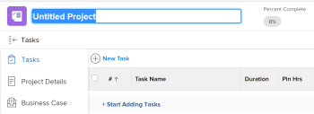

# Créer un projet

<!--

(NOTE:this is linked from the UI from the Projects global nav section in classic. Do not change/ remove)

-->

Les projets représentent une grande quantité de travail à faire dans Adobe Workfront.

## Exigences d’accès

<!--drafted for P&P - replace table below with this:

<table style="table-layout:auto"> 
 <col> 
 <col> 
 <tbody> 
  <tr> 
   <td role="rowheader">Workfront plan*</td> 
   <td> 
Any
 </td> 
  </tr> 
  <tr> 
   <td role="rowheader">Workfront license*</td> 
   <td> 
Current license: Standard 

   Or
   
Legacy license: Plan 

    </td> 
  </tr> 
  <tr> 
   <td role="rowheader">Access level*</td> 
   <td> 
Edit access to Projects
 
<b>NOTE</b>
   
   If you still don't have access, ask your Workfront administrator if they set additional restrictions in your access level. For information about access to projects, see <a href="../../../administration-and-setup/add-users/configure-and-grant-access/grant-access-projects.md" class="MCXref xref">Grant access to projects</a>. For information on how a Workfront administrator can change your access level, see <a href="../../../administration-and-setup/add-users/configure-and-grant-access/create-modify-access-levels.md" class="MCXref xref">Create or modify custom access levels</a>. 
 </td> 
  </tr> 
  <tr> 
   <td role="rowheader">Object permissions</td> 
   <td> 
When you create a project you automatically receive Manage permissions to the project 
 
 For information about project permissions, see <a href="../../../workfront-basics/grant-and-request-access-to-objects/share-a-project.md" class="MCXref xref">Share a project in Adobe Workfront</a>.
 
For information on requesting additional access, see <a href="../../../workfront-basics/grant-and-request-access-to-objects/request-access.md" class="MCXref xref">Request access to objects </a>.
 </td> 
  </tr> 
 </tbody> 
</table>

-->

Vous devez disposer des accès suivants pour effectuer les étapes de cet article :

<table style="table-layout:auto"> 
 <col> 
 <col> 
 <tbody> 
  <tr> 
   <td role="rowheader">Formule Workfront*</td> 
   <td> 
Tous
 </td> 
  </tr> 
  <tr> 
   <td role="rowheader">Licence Workfront*</td> 
   <td> 
Plan 
 </td> 
  </tr> 
  <tr> 
   <td role="rowheader">Niveau d’accès*</td> 
   <td> 
Modifier l’accès aux projets
 
<b>NOTE</b>

Si vous n’avez toujours pas accès à , demandez à votre administrateur Workfront s’il définit des restrictions supplémentaires à votre niveau d’accès. Pour plus d’informations sur l’accès aux projets, voir <a href="../../../administration-and-setup/add-users/configure-and-grant-access/grant-access-projects.md" class="MCXref xref">Accorder l’accès aux projets</a>. Pour plus d’informations sur la façon dont un administrateur Workfront peut modifier votre niveau d’accès, voir <a href="../../../administration-and-setup/add-users/configure-and-grant-access/create-modify-access-levels.md" class="MCXref xref">Création ou modification de niveaux d’accès personnalisés</a>. 
 </td>
</tr> 
  <tr> 
   <td role="rowheader">Autorisations d’objet</td> 
   <td> 
Lorsque vous créez un projet, vous recevez automatiquement les autorisations de gestion du projet. 
 
 Pour plus d’informations sur les autorisations de projet, voir <a href="../../../workfront-basics/grant-and-request-access-to-objects/share-a-project.md" class="MCXref xref">Partage d’un projet dans Adobe Workfront</a>.
 
Pour plus d’informations sur la demande d’accès supplémentaire, voir <a href="../../../workfront-basics/grant-and-request-access-to-objects/request-access.md" class="MCXref xref">Demande d’accès aux objets </a>.
 </td> 
  </tr> 
 </tbody> 
</table>

&#42;Pour connaître le plan, le type de licence ou l’accès dont vous disposez, contactez votre administrateur Workfront.

## Méthodes de création de projets

Vous pouvez créer un projet dans Workfront à l’aide de l’une des méthodes suivantes :

* Créez un projet à partir de zéro sans utiliser de modèle. Cet article décrit comment créer entièrement un projet.

* Copiez un projet existant.\
   Pour plus d’informations sur la copie d’un projet, voir [Copier un projet](../../../manage-work/projects/manage-projects/copy-project.md).

* Utilisez un modèle.\
   Pour plus d’informations sur l’utilisation d’un modèle pour créer un projet, voir [Création d’un projet à l’aide d’un modèle](../../../manage-work/projects/create-projects/create-project-from-template.md).

* Importez un projet à partir du projet Microsoft.\
   Pour plus d’informations sur l’importation d’un projet à partir d’un projet MS, voir [Importation d’un projet à partir d’un projet Microsoft](../../../manage-work/projects/create-projects/import-project-from-ms-project.md).

* Importez un projet à l’aide de lancements.

   En tant qu’administrateur de Workfront, vous pouvez importer des projets à l’aide d’un démarrage rapide.

   Pour plus d’informations sur l’importation de données à l’aide de lancements dans Workfront, voir [Importer des données dans Adobe Workfront à l’aide d’un modèle de démarrage rapide](../../../administration-and-setup/manage-workfront/using-kick-starts/import-data-via-kickstarts.md) .

   Pour plus d’informations sur l’importation de projets à l’aide de lancements, voir [Scénario de démarrage : préparation simple de l’importation de projets et de tâches](../../../administration-and-setup/manage-workfront/using-kick-starts/kick-starts-scenario-simple-project-task-import-prep.md) .

* Publiez une initiative à partir d’un scénario dans le planificateur de scénario Adobe Workfront. Le planificateur de scénario nécessite une licence supplémentaire. Pour plus d’informations sur le planificateur de scénario Workfront, voir [Présentation du planificateur de scénarios](../../../scenario-planner/scenario-planner-overview.md). Pour plus d’informations sur la création de projets à partir d’initiatives de publication, voir  [Mettre à jour ou créer des projets en publiant des initiatives dans le planificateur de scénarios](../../../scenario-planner/publish-scenarios-update-projects.md).

## Conditions préalables

Avant de commencer, vous devez vous assurer que

* L’administrateur du système ou du groupe a activé la préférence &quot;Autoriser les utilisateurs à créer des projets sans utiliser de modèle&quot; dans la zone Configuration.

   Pour plus d’informations, voir [Configuration des préférences de projet à l’échelle du système](../../../administration-and-setup/set-up-workfront/configure-system-defaults/set-project-preferences.md).

## Paramètres par défaut du projet

Lorsque vous créez un projet, Workfront lui applique un ensemble de paramètres par défaut. Par exemple, le mode État, Groupe ou Planification est prédéfini lors de la création d’un projet.

Tenez compte des points suivants :

* En tant qu’administrateur Workfront ou administrateur de groupe, vous pouvez configurer les paramètres par défaut d’un nouveau projet lors de la configuration des préférences du projet.
* Workfront applique les paramètres du groupe, le cas échéant, avant d’appliquer ceux définis par l’administrateur Workfront.
* Si vous créez un projet à l’aide d’un modèle, les paramètres du modèle prévalent sur ceux définis par l’administrateur Workfront ou de groupe.

>[!NOTE]
>
>Nous vous recommandons de spécifier l’état par défaut d’un nouveau projet, à savoir Planification. Au fur et à mesure que vous apportez des modifications au nouveau projet, les notifications ne se déclenchent pas pour les utilisateurs affectés au projet.

Pour plus d’informations sur la configuration de l’état par défaut et d’autres paramètres par défaut pour un nouveau projet, voir [Configuration des préférences de projet à l’échelle du système](../../../administration-and-setup/set-up-workfront/configure-system-defaults/set-project-preferences.md).

## Création d’un projet à partir de zéro

1. Utilisez l’une des méthodes suivantes :

   * Cliquez sur le bouton **Menu Principal** , cliquez sur **Projets**, puis développez **Nouveau projet**.
   * Accédez à un portfolio, puis développez **Nouveau projet**.

      >[!TIP]
      >
      >Lorsque vous créez un projet à l’aide d’un modèle d’un portfolio, le champ Portfolio du nouveau projet se met à jour pour afficher le portfolio à partir duquel vous avez choisi de créer le projet. Le champ Portfolio du modèle est alors remplacé, s’il est spécifié.

   * Accédez à un programme, puis développez **Nouveau projet**.

      >[!TIP]
      >
      >Lorsque vous créez un projet à l’aide d’un modèle issu d’un programme, le champ Programme des nouveaux projets est mis à jour afin d’afficher le programme à partir duquel vous avez choisi de créer le projet. Le champ Portfolio du modèle se met à jour pour afficher le portefeuille du programme à partir duquel vous avez choisi de créer le projet. Cela remplace les champs Programme et Portfolio du modèle, s’ils sont spécifiés.

   * Si vous êtes administrateur de groupe, vous pouvez également créer un projet dans la section Projets d’un groupe que vous gérez. Pour plus d’informations, voir [Création et modification des projets d’un groupe](../../../administration-and-setup/manage-groups/work-with-group-objects/create-and-modify-a-groups-projects.md).

      >[!TIP]
      >
      >Lorsque vous créez un projet à partir d’un groupe, le groupe à partir duquel vous créez le projet s’affiche dans le champ Groupe du nouveau projet uniquement lorsque le champ Groupe du modèle n’est pas spécifié. Si le champ Groupe du modèle est spécifié, le champ Groupe du nouveau projet est celui du modèle.
   

1. Cliquez sur **Nouveau projet** si vous souhaitez créer un projet à partir de zéro.
1. Saisissez un nom pour votre projet. Appuyez sur Entrée pour enregistrer le nom.

   

   L’en-tête de la page du projet affiche un aperçu rapide de l’état actuel et de la progression d’un projet. Les informations contenues dans l’en-tête du projet changent à mesure que les informations du projet sont mises à jour.

1. Cliquez sur **Commencer à ajouter** **Tâches**.

   Ou

   Cliquez sur **Nouvelle tâche** pour ajouter des tâches au projet et leur affecter des ressources.\
   Pour plus d’informations sur l’ajout de tâches à un projet, voir [Création de tâches dans un projet](../../../manage-work/tasks/create-tasks/create-tasks-in-project.md).

1. Modifiez les détails du projet en cliquant sur le bouton **Plus de menu** puis **Modifier**  en regard du nom du projet.

   Le **Modifier le projet** s’ouvre.

   Pour plus d’informations sur la modification d’un projet, voir [Modification de projets](../../../manage-work/projects/manage-projects/edit-projects.md).

1. (Facultatif) Après avoir configuré les paramètres du projet et ajouté les tâches, vous pouvez modifier l’état du projet en **Actuel**.

   Cela indique que le projet est maintenant prêt à démarrer et que les utilisateurs affectés aux tâches peuvent maintenant commencer à travailler dessus.

   Pour plus d’informations sur les états d’un projet, voir [Accéder à la liste des états du projet système](../../../administration-and-setup/customize-workfront/creating-custom-status-and-priority-labels/project-statuses.md).
