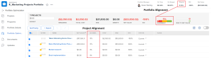

# Application d’une fiche d’évaluation à un projet et génération d’une note d’alignement

Vous pouvez utiliser une fiche d’évaluation pour mesurer l’alignement d’un projet avec les critères précédemment définis d’un portfolio. Une fiche d&#39;évaluation reflète souvent la mission, les valeurs et les objectifs stratégiques d&#39;une organisation.

Pour plus d’informations sur les Fiches d’évaluation et sur la manière d’en créer une, voir [Création d’une Fiche d’évaluation](../../../administration-and-setup/set-up-workfront/configure-system-defaults/create-scorecard.md).

## Exigences d’accès

Vous devez disposer des accès suivants pour effectuer les étapes de cet article :

<table style="table-layout:auto"> 
 <col> 
 <col> 
 <tbody> 
  <tr> 
   <td role="rowheader">Formule Adobe Workfront*</td> 
   <td> <p>Professionnel ou supérieur</p> </td> 
  </tr> 
  <tr> 
   <td role="rowheader">Licence Adobe Workfront*</td> 
   <td> <p>Plan </p> </td> 
  </tr> 
  <tr> 
   <td role="rowheader">Paramétrages du niveau d'accès*</td> 
   <td> <p>Modifier l’accès aux projets</p> <p>Affichage ou accès supérieur à Portfolio</p> <p>Remarque : Si vous n’avez toujours pas accès à , demandez à votre administrateur Workfront s’il définit des restrictions supplémentaires à votre niveau d’accès. Pour plus d’informations sur la façon dont un administrateur Workfront peut modifier votre niveau d’accès, voir <a href="../../../administration-and-setup/add-users/configure-and-grant-access/create-modify-access-levels.md" class="MCXref xref">Création ou modification de niveaux d’accès personnalisés</a>.</p> </td> 
  </tr> 
  <tr> 
   <td role="rowheader">Autorisations d’objet</td> 
   <td> <p>Gestion des autorisations d’un projet</p> <p>Affichage ou autorisations supérieures d’un portfolio </p> <p>Pour plus d’informations sur la demande d’accès supplémentaire, voir <a href="../../../workfront-basics/grant-and-request-access-to-objects/request-access.md" class="MCXref xref">Demande d’accès aux objets </a>.</p> </td> 
  </tr> 
 </tbody> 
</table>

&#42;Pour connaître le plan, le type de licence ou l’accès dont vous disposez, contactez votre administrateur Workfront.

## Fiches d’évaluation du projet {#project-scorecards}

* [Aperçu des Fiches d’évaluation](#scorecards-overview)
* [Fiches d’évaluation du projet](#project-scorecards)

### Aperçu des Fiches d’évaluation {#scorecards-overview}

En règle générale, un chef de projet complète les informations de la fiche d’évaluation afin de produire une valeur d’alignement comprise entre 0 et 100 pour le projet. La valeur produite est ensuite utilisée lorsque le gestionnaire de portefeuille passe en revue les projets dans l’optimiseur de portefeuille pour les comparer.

Pour plus d’informations sur l’optimisation du portfolio, reportez-vous à l’article [Portfolio Optimizer - Aperçu](../../../manage-work/portfolios/portfolio-optimizer/portfolio-optimizer-overview.md).

### Application d’une fiche d’évaluation à un projet

En tant qu’utilisateur disposant d’une licence Plan et d’autorisations Gérer pour un projet, vous pouvez joindre une fiche d’évaluation au projet.

Pour plus d’informations sur les autorisations de projet, voir [Partage d’un projet dans Adobe Workfront](../../../workfront-basics/grant-and-request-access-to-objects/share-a-project.md).

Vous pouvez ajouter des fiches d’évaluation à un projet dans le cadre de la création de l’analyse de performances du projet.

Pour plus d’informations sur la création d’un dossier d’affaires, voir [Création d’une analyse de cas pour un projet](../../../manage-work/projects/define-a-business-case/create-business-case.md).

L’administrateur ou l’administrateur de groupe Adobe Workfront doit activer la section Fiche d’évaluation dans la zone Analyse de cas de vos projets avant de pouvoir accéder aux Fiches d’évaluation à partir de l’Analyse de cas. Pour plus d’informations sur la configuration des préférences de projet et l’activation des zones de l’analyse de cas, voir [Configuration des préférences de projet à l’échelle du système](../../../administration-and-setup/set-up-workfront/configure-system-defaults/set-project-preferences.md).

Pour appliquer une fiche d’évaluation à un projet :

1. Accédez à un projet auquel vous souhaitez appliquer une fiche d’évaluation.
1. Cliquez sur **Analyse de cas** dans le panneau de gauche.
1. Recherchez le **Fiche d’évaluation** de l’Analyse de cas.\
   Vous devez créer une Fiche d’évaluation avant la **Fiche d’évaluation** s’affiche sur l’Analyse de cas.

   Pour plus d’informations sur la création d’une fiche d’évaluation, voir [Création d’une Fiche d’évaluation](../../../administration-and-setup/set-up-workfront/configure-system-defaults/create-scorecard.md).

1. Sélectionnez une fiche d’évaluation dans le menu déroulant.

   

1. Spécifiez une réponse pour toutes les questions de la fiche d’évaluation.

   Workfront applique un score à chaque question à laquelle la réponse est donnée et calcule un score global du projet en fonction du score individuel de chaque question.

   Pour plus d’informations sur la génération du score d’alignement global du projet, voir [Génération d’un score d’alignement pour un projet](#generate-an-alignment-score-for-a-project).

1. Cliquez sur **Enregistrer** pour enregistrer la fiche d’évaluation et noter le projet.

   La fiche d’évaluation est maintenant associée au projet et le projet est noté.

<!--This functionality was removed when we redesigned bulk editing projects with 23.2: 

1. (Conditional) When changes occur in the values of scorecard questions, you must recalculate the scorecard to reflect the new values for the project score. To recaulate the scorecard, do the following: 

   1. Go to a list of projects and select all projects in the list. 
   1. Click the **Edit** icon at the top of the list. 
   1. Click **Settings** in the left panel, then check the **Recalculate Scorecards** option at the end of the Settings area. 
   1. Click Save. This recalculates the score value based on the scorecards attached for all the selected projects.  

      >[!NOTE]
      >
      >   The option to recalculate scorecards has been removed from the Preview environment, when editing projects in bulk. 

-->

## Génération d’un score d’alignement

* [Génération d’un score d’alignement pour un projet](#generate-an-alignment-score-for-a-project)
* [Génération d’un score d’alignement pour un portfolio](#generate-an-alignment-score-for-a-portfolio)

### Génération d’un score d’alignement pour un projet {#generate-an-alignment-score-for-a-project}

Le score d’alignement est la valeur produite après avoir rempli la fiche d’évaluation.

Les Fiches d’évaluation contiennent des questions avec des choix de réponses auxquelles ont été attribuées des valeurs numériques, appelées points d’alignement. Ces points sont utilisés pour déterminer dans quelle mesure le projet s’aligne avec votre organisation. Les points d&#39;alignement de chaque question contiennent un nombre compris entre 0 et 100.

Une fois la fiche d’évaluation terminée, Workfront calcule le score d’alignement du projet sous forme de pourcentage, en utilisant la formule suivante :

```
Project Alignment Score = The sum of the question points from the scorecard met at a given time/ The sum of the possible points on the scorecard
```

Pour plus d’informations, voir [Création d’une Fiche d’évaluation](../../../administration-and-setup/set-up-workfront/configure-system-defaults/create-scorecard.md).

### Génération d’un score d’alignement pour un portfolio {#generate-an-alignment-score-for-a-portfolio}

Le score d&#39;alignement du portfolio est une moyenne des scores d&#39;alignement de tous les projets du portfolio.

Lorsque les fiches d’évaluation des projets sont terminées, Workfront utilise ces valeurs pour calculer le score d’alignement du portfolio en pourcentage, en utilisant la formule suivante :

Score d’alignement du Portfolio = somme des pourcentages des scores d’alignement du projet/nombre de projets dans le portefeuille

>[!NOTE]
>
>Si un projet n’est associé à aucune Fiche d’évaluation et n’a donc pas de score d’alignement, il est considéré comme ayant un alignement de 0 % dans le portefeuille. Le projet est pris en compte dans le nombre de projets du portfolio.

## Affichage de la note d’alignement

Vous pouvez afficher le score d’alignement d’un projet au niveau du projet ou dans Portfolio Optimizer.

* [Affichage de la note d’alignement sur un projet](#View%20the)
* [Affichage des scores d’alignement du projet et du portfolio dans Portfolio Optimizer](#View%20the2)

### Affichage de la note d’alignement sur un projet

Si vous disposez des droits de contribution au projet, vous pouvez afficher le score d’alignement d’un projet au niveau du projet.

1. Accédez au projet dont vous souhaitez afficher la note d’alignement.
1. Cliquez sur **Analyse de cas** dans le panneau de gauche.
1. Accédez au **Résumé des cas d’affaires** sur le côté droit de l’écran.

   La note d’alignement se trouve dans le résumé de l’analyse de cas, dans la variable **Aligné** .

   

### Affichage des scores d’alignement du projet et du portfolio dans Portfolio Optimizer

Si vous avez accès à la fonction Gérer , vous pouvez afficher le score d’alignement d’un projet ou d’un portfolio dans Portfolio Optimizer.

Pour plus d’informations sur les informations affichées dans Portfolio Optimizer, voir [Portfolio Optimizer - Aperçu](../../../manage-work/portfolios/portfolio-optimizer/portfolio-optimizer-overview.md).

* [Recherchez la note d’alignement du projet dans Portfolio Optimizer.](#locate-the-alignment-score-of-the-project-in-the-portfolio-optimizer)
* [Recherchez la note d’alignement du portfolio dans Portfolio Optimizer.](#locate-the-alignment-score-of-the-portfolio-in-the-portfolio-optimizer)

   

#### Recherchez la note d’alignement du projet dans Portfolio Optimizer. {#locate-the-alignment-score-of-the-project-in-the-portfolio-optimizer}

1. Cliquez sur le bouton **Menu Principal** icon , puis **Portfolios**.

1. Cliquez sur le nom d’un Portfolio.
1. Cliquez sur **Optimisation des Portfolios** dans le panneau de gauche.

   Portfolio Optimizer s’affiche.

1. Le score d’alignement d’un projet s’affiche sous la forme d’un pourcentage dans la variable **Alignement** de Portfolio Optimizer.

   Il s’agit du score d’alignement du projet en fonction de la fiche d’évaluation associée au projet.

#### Recherchez la note d’alignement du portfolio dans Portfolio Optimizer.  {#locate-the-alignment-score-of-the-portfolio-in-the-portfolio-optimizer}

1. Accédez au **Projets** dans la barre de navigation globale.
1. Sélectionnez la **Portfolios** .
1. Cliquez sur le nom d’un Portfolio.
1. Sélectionnez la **Optimisation des Portfolios** .
1. Dans la partie supérieure de Portfolio Optimizer, recherchez le **Aligné** , ainsi que la variable **Alignement** jauge indiquant le score d&#39;alignement du portfolio.

   Il s’agit du score d’alignement du portfolio.

   Pour plus d’informations sur la génération du score d’alignement d’un portfolio, voir [Génération d’un score d’alignement pour un portfolio](#generate-an-alignment-score-for-a-portfolio).

## Score Portfolio Optimizer - Aperçu

Il existe une différence entre le score d’alignement et le score d’optimisation de portefeuille d’un projet.

Le score d’alignement d’un projet est calculé en fonction des points obtenus après avoir rempli la fiche d’évaluation. Ce score est ensuite utilisé pour déterminer le score d’alignement du portfolio. Le score d&#39;alignement est affiché en pourcentage.

Le score d’alignement d’un projet s’affiche dans la variable **Alignement** de Portfolio Optimizer.

Le score d’optimisation de portefeuille est un classement calculé automatiquement dans Portfolio Optimizer selon lequel les projets peuvent être classés par priorité. Le score d’optimisation de portefeuille s’affiche sous la forme d’une icône d’indicateur accompagnée d’un nombre et s’affiche dans la variable **Score** de Portfolio Optimizer. Un score Portfolio Optimizer n’est généré que lorsque toutes les sections de l’analyse de cas sont terminées, à l’exception des objectifs.

Pour plus d’informations sur la création d’une analyse de cas pour un projet, voir [Création d’une analyse de cas pour un projet](../../../manage-work/projects/define-a-business-case/create-business-case.md).

Pour plus d’informations sur le calcul du score d’optimisation de portefeuille d’un projet, voir [Score Portfolio Optimizer - Aperçu](../../../manage-work/portfolios/portfolio-optimizer/portfolio-optimizer-score.md).
