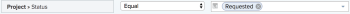
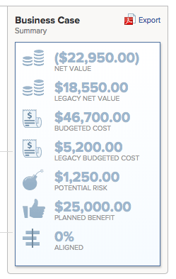

# Approuver une analyse de rentabilité

<!--Audit: 6/2025-->

Après avoir complété et soumis le business case d’une demande de projet, le business case doit être approuvé. Cela dépend du workflow dans votre organisation. Un projet peut être lancé sans que le business case ne soit approuvé, mais l’administrateur ou administratrice Adobe Workfront et les responsables du projet ne considèrent peut-être pas qu’il s’agit là de la meilleure solution.

Pour plus d’informations sur la façon de remplir et de soumettre un business case, voir l’article [Créer un business case pour un projet](../../../manage-work/projects/define-a-business-case/create-business-case.md).

## Conditions d’accès

+++ Développez pour afficher les exigences d’accès aux fonctionnalités de cet article.

<table style="table-layout:auto"> 
 <col> 
 <col> 
 <tbody> 
  <tr> 
   <td role="rowheader"><p>Package Adobe Workfront</p></td> 
   <td> 
   <p>Prime ou version ultérieure</p>
   </td> 
  </tr> 
  <tr> 
   <td role="rowheader">Licence Adobe Workfront</td> 
   <td> 
   <p>Standard </p> 
   <p>Plan </p> </td> 
  </tr> 
  <tr> 
   <td role="rowheader">Configurations des niveaux d’accès</td> 
   <td> <p>Accès en modification aux projets</p> </td> 
  </tr> 
  <tr> 
   <td role="rowheader"><p>Autorisations d’objet</p></td> 
   <td> <p>Autorisations de gestion d’un projet</p> <p>Autorisations d’affichage ou supérieures à un portfolio</p>  </td> 
  </tr> 
 </tbody> 
</table>

Pour plus d’informations, voir [Conditions d’accès requises dans la documentation Workfront](/help/quicksilver/administration-and-setup/add-users/access-levels-and-object-permissions/access-level-requirements-in-documentation.md).

+++

## Vue d’ensemble de l’approbation d’un business case

Tenez compte des éléments suivants lors de l’approbation du business case d’un projet :

* Vous devez avoir les droits de gestion d’un projet pour en approuver le business case.
* Vous ne pourrez pas voir les projets qui attendent l’approbation de l’analyse de rentabilité sous le widget Mes approbations dans l’Accueil.
* Vous devez vous rendre manuellement sur les projets individuels qui nécessitent l’approbation d’un business case pour voir s’ils sont en attente d’approbation. Il n’existe pas de mécanisme de notification Workfront permettant d’avertir quelqu’un qu’il doit approuver le business case d’un projet.
* Vous pouvez trouver les projets ayant un business case en attente d’approbation soit en créant un rapport de projet, soit en accédant au portfolio auquel ils sont associés.

  Pour plus d’informations sur les portfolios, voir l’article [Vue d’ensemble des portfolios dans Adobe Workfront](../../../manage-work/portfolios/portfolios-overview/portfolio-overview.md).

## Approuver le business case en élaborant un rapport de projet

Vous pouvez créer un rapport pour les projets afin de voir quels sont les projets dont le business case doit être approuvé.

Pour établir un rapport pour les projets dont le business case est en attente d’approbation :

1. Créez un rapport pour les projets.

   Pour plus d’informations sur la création de rapports, voir l’article [Créer un rapport personnalisé](../../../reports-and-dashboards/reports/creating-and-managing-reports/create-custom-report.md).

1. Sélectionnez l’onglet **Vue** du rapport, puis cliquez sur **Ajouter une colonne**.

1. Commencez à saisir *Statut* dans le champ **Afficher dans cette colonne** et sélectionnez ce champ lorsqu’il apparaît dans la liste.

   Cette colonne affiche le statut des projets.

1. Sélectionnez l’onglet **Filtres** du rapport, puis cliquez sur **Ajouter une règle de filtrage**.

1. Commencez à saisir *Statut* dans le champ **Afficher uniquement les projets dans lesquels le champ ...** et sélectionnez-le lorsqu’il apparaît dans la liste.
1. Sélectionnez **Égal** pour le modificateur de filtre.
1. Commencez à saisir *Demandé* dans le champ disponible.

   Cela permet de s&#39;m’assurer que le rapport n’inclut que les projets dont le statut est Demandé.

   

1. (Facultatif) Cliquez sur **Ajouter une autre règle de filtrage**.

   Vous pouvez ajouter des filtres supplémentaires pour n’afficher que les projets pour lesquels vous êtes la personne propriétaire du projet, la personne sponsorisant le projet ou la personne propriétaire du portfolio.

   Vous pouvez, par exemple, utiliser les instructions de filtre suivantes :

   ```
   Project Sponsor ID Equals $$USER.ID
   ```

   pour afficher les projets pour lesquels vous êtes la personne désignée comme sponsor du projet ;

   ```
   Project Owner ID Equals $$USER.ID
   ```

   pour afficher les projets dont vous êtes la personne propriétaire ;

   ```
   Project Portfolio Owner ID Equals $$USER. ID
   ```

   pour afficher les projets dans lesquels vous êtes la personne désignée comme gestionnaire de portfolio.

1. Cliquez sur **Enregistrer et fermer**.

   Remarquez que tous les projets figurant dans le rapport ont le statut **Demandé**.

1. Cliquez sur le nom d’un projet dans le rapport pour l’ouvrir.
1. Cliquez sur **Business case** dans le panneau de gauche.
1. Cliquez sur **Approuver** ou **Rejeter** dans la zone Récapitulatif du business case pour approuver ou rejeter le business case.

<!--  -->

Le statut du projet passe à **Approuvé** si le business case est approuvé.

Le statut du projet passe à **Rejeté** si le business case est rejeté.

>[!NOTE]
>
>L’utilisateur ou utilisatrice qui a soumis l’approbation du business case ne reçoit aucune notification si sa demande de projet a été approuvée ou rejetée.

## Approuver le business case en accédant aux projets demandés dans un portfolio

Pour plus d’informations sur la révision des projets demandés, voir l’article [Réviser les projets demandés](../../../manage-work/portfolios/create-and-manage-portfolios/review-requested-projects.md).
