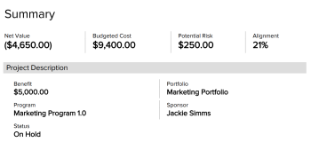

# Vue d’ensemble des zones du business case

Cet article décrit les zones du business case d’un projet.

Pour plus d’informations sur la création d’un business case pour un projet, voir [Créer le business case d’un projet](../../../manage-work/projects/define-a-business-case/create-business-case.md).

Votre équipe d’administration Adobe Workfront ou votre administrateur ou administratrice de groupes doit activer toutes les sections du business case avant qu’elles ne soient visibles sur le projet, à l’exception de la section Informations sur le projet.La section Informations sur le projet est activée par défaut.

Pour plus d’informations sur l’activation des zones du business case, voir la section « Business case » dans [Configurer les préférences du projet à l’échelle du système](../../../administration-and-setup/set-up-workfront/configure-system-defaults/set-project-preferences.md).

Les zones suivantes font partie du business case d’un projet :

* Informations sur le projet
* Objectifs
* Frais
* Établissement du budget de ressources
* Risques
* Carte de score
* Formulaires personnalisés
* Récapitulatif du business case

## Informations sur le projet

L’équipe d’administration Workfront ne peut pas configurer la zone **Informations sur le projet** du business case. Tous les projets disposent d’une zone Informations sur le projet dans le business case.

La section « Informations sur le projet » du business case comprend les informations de base d’un projet, avant son lancement.

Envisagez de modifier les champs suivants :

* **Description** : saisissez une description pour votre projet.
* **Propriétaire du projet**

  Par défaut, la personne qui crée le projet est également propriétaire du projet. Vous pouvez modifier ce champ et indiquer une autre personne active comme propriétaire du projet.

* **Sponsor du projet**

  Envisagez d’ajouter une personne autre que la personne propriétaire du projet comme sponsor du projet. La personne sponsor reçoit l’approbation du business case.-

* **Portfolio** : spécifiez un portfolio pour le projet. Vous devez créer le portfolio et lui attribuer le statut **Actif** avant de pouvoir le sélectionner dans ce menu déroulant.

  Pour plus d’informations sur les portfolios, voir [Vue d’ensemble des portfolios dans Adobe Workfront](../../../manage-work/portfolios/portfolios-overview/portfolio-overview.md).

  Pour plus d’informations sur la création de portfolios, voir [Créer un portfolio](../../../manage-work/portfolios/create-and-manage-portfolios/create-portfolios.md).

* **Bénéfice prévu** : estimez le bénéfice monétaire prévu pour votre organisation lorsque ce projet sera achevé. Il peut s’agir de n’importe quel montant en devise et doit être positif. Par exemple, 10 000 $.
* **Statut** : par défaut, le statut d’une demande de projet est défini sur **Idée**.

  Si vous sélectionnez un statut autre qu’Idée ou Planification, le bouton **Soumettre** disparaît de la zone Récapitulatif du business case et vous ne pouvez plus soumettre le business case pour approbation.

* **Date de début fixée** : indiquez la date à laquelle vous souhaitez que le projet commence.
* **Date de fin fixée** : indiquez la date à laquelle vous souhaitez que le projet se termine.

  >[!NOTE]
  >
  >Les dates de début et de fin fixées dans le business case n’ont pas d’incidence sur les dates de début et de fin prévues du projet. Il s’agit des dates demandées par la personne qui a créé le projet pour le développement idéal du projet. En revanche, les dates de début et de fin prévues du projet indiquent la chronologie prévisionnelle du projet, basée sur les tâches du projet.

## Objectifs

Les objectifs définissent les buts du projet. Cette zone est activée par défaut dans le business case, mais l’équipe d’administration Workfront peut choisir de ne pas l’afficher. Ce champ affiche les objectifs par ordre de priorité.

<!--

(NOTE: below snippet: NWE only, not classic)

-->

>[!TIP]
>
>Vous pouvez créer des objectifs stratégiques pour votre organisation qui ne sont pas liés au business case d’un projet. Vous devez avoir accès aux Objectifs Adobe Workfront pour pouvoir créer des objectifs stratégiques. Vous pouvez ensuite les associer à des projets en dehors de leurs business cases. Pour plus d’informations sur la création d’objectifs à l’aide des Objectifs Workfront, voir [Vue d’ensemble des Objectifs Adobe Workfront](../../../workfront-goals/goal-management/wf-goals-overview.md).

La définition des objectifs est facultative pour que le projet reçoive un score dans l’optimisateur de portfolio. Cette section est la seule section facultative du business case. Toutes les autres sections du business case doivent être complétées avant que le projet ne soit évalué dans l’optimisateur de portfolio.Vous pouvez indiquer un niveau de priorité pour un objectif lorsque vous le créez.

Pour plus d’informations sur les objectifs, voir [Créer des objectifs de business case](../../../manage-work/projects/define-a-business-case/create-business-case-goals.md).

## Frais

Les dépenses représentent les coûts non liés à la main-d’œuvre qui peuvent être engagés pendant la durée de vie d’un projet.Cette zone est activée par défaut dans le business case, mais l’administrateur ou l’administratrice Workfront peut choisir de ne pas l’afficher. 

Toutes les dépenses que vous saisissez dans le business case sont également saisies dans l’onglet Dépenses du projet, en tant que dépenses prévues.

Les dépenses affectent les champs suivants du projet :

* Coût budgété
* Valeur nette

Pour plus d’informations sur les coûts budgétés et les valeurs nettes, voir [Vue d’ensemble des champs financiers du business case](../../../manage-work/projects/define-a-business-case/business-case-finances.md).

Pour plus d’informations sur les dépenses, voir [Gérer les dépenses du projet](../../../manage-work/projects/project-finances/manage-project-expenses.md).

Votre administrateur ou administratrice Workfront peut définir des types de dépenses personnalisés.

Pour plus d’informations sur la création de types de dépenses personnalisés, voir [Créer des types de dépenses personnalisés](../../../administration-and-setup/set-up-workfront/configure-system-defaults/create-custom-expense-types.md).

## Établissement du budget de ressources

Vous pouvez effectuer les actions suivantes dans la zone Établissement du budget des ressources du business case :

* Associer des groupes de ressources au projet.
* Établir le budget de vos ressources au niveau du projet.

Les heures budgétées pour les ressources du projet s’affichent dans la zone Établissement du budget de ressources du business case, générant ainsi le coût budgété de la main-d’œuvre du projet. Cette partie du business case est activée par défaut.

Pour plus d’informations sur l’établissement du budget des ressources pour le projet dans le business case, voir [Établir le budget des ressources dans le business case](../../../manage-work/projects/define-a-business-case/budget-resources-in-business-case.md).

Tenez compte des éléments suivants lorsque vous consultez la section Établissement du budget de ressources du business case :

* Vous pouvez établir le budget des informations sur les ressources à l’aide des outils suivants :

   * Planificateur de ressources

     Pour plus d’informations, voir [Établir le budget des ressources dans le business case à l’aide du planificateur de ressources](../../../manage-work/projects/define-a-business-case/budget-resources-in-business-case-use-resource-planner.md).

   * Planificateur de scénarios, si votre entreprise a acheté une licence supplémentaire pour le planificateur de scénarios d’Adobe.

     Pour plus d’informations, voir [Établir le budget des ressources dans le business case à l’aide du planificateur de scénarios](../../../manage-work/projects/define-a-business-case/budget-resources-in-business-case-use-scenario-planner.md).

     Le planificateur de scénarios n’est disponible que dans la nouvelle expérience Adobe Workfront et nécessite une licence supplémentaire. Pour plus d’informations sur le planificateur de scénarios de Workfront, voir [Vue d’ensemble du planificateur de scénarios](../../../scenario-planner/scenario-planner-overview.md).

* Les informations affichées ici s’affichent également dans le planificateur de ressources ou le planificateur de scénarios au niveau du système. 

  <!--
  
(NOTE: the "or" stays in&nbsp;NWE&nbsp;only) 

  -->

* Après avoir établi le budget de vos ressources, le coût budgété de la main-d’œuvre du projet s’affiche dans la zone Établissement du budget de ressources si les fonctions sont associées à des taux de coûts par heure.Le coût budgété de la main-d’œuvre s’affiche dans la devise du projet.

  >[!IMPORTANT]
  >
  >Le coût budgété de la main-d’œuvre correspond au coût associé aux fonctions dans le projet, et non aux utilisateurs et utilisatrices. La somme de tous les coûts budgétés de la main-d’œuvre pour les utilisateurs et utilisatrices peut être égale ou non au coût budgété de la main-d’œuvre de la fonction associée aux utilisateurs et utilisatrices. 

  Pour plus d’informations sur les budgétés de la main-d’œuvre, voir [Vue d’ensemble des champs financiers du business case](../../../manage-work/projects/define-a-business-case/business-case-finances.md).

  Pour plus d’informations sur la création de fonctions et l’association du taux de coûts par heure à ces fonctions, voir [Créer et gérer des fonctions](../../../administration-and-setup/set-up-workfront/organizational-setup/create-manage-job-roles.md).

## Risques

Les risques sont des facteurs susceptibles d’empêcher un projet de se terminer dans le respect des délais ou du budget prévus. La définition de ces facteurs est importante pour que la personne gestionnaire de portfolio ou sponsor du projet puisse prendre une décision éclairée sur l’approbation du projet.Cette zone est activée par défaut dans le business case, mais l’administrateur ou l’administratrice Workfront peut choisir de ne pas l’afficher.

Vous pouvez associer un coût potentiel aux risques que vous définissez au cas où ils se produiraient. Le coût des risques d’un projet affecte la valeur nette du projet. 

Pour plus d’informations sur la valeur nette du projet, voir [Vue d’ensemble des champs financiers du business case](../../../manage-work/projects/define-a-business-case/business-case-finances.md).

Pour plus d’informations sur la création de risques, voir [Créer et modifier des risques sur des projets](../../../manage-work/projects/define-a-business-case/create-edit-risks-on-projects.md).

Votre équipe d’administration Workfront peut définir des types de risques personnalisés.

Pour plus d’informations sur la création et la modification de types de risques personnalisés, voir [Modifier et créer des types de risques](../../../administration-and-setup/set-up-workfront/configure-system-defaults/edit-create-risk-types.md).

## Carte de score

Les cartes de performance mesurent l’alignement du projet. Cette zone est activée par défaut dans le business case, mais l’équipe d’administration Workfront peut choisir de ne pas l’afficher.

Pour plus d’informations sur l’application d’une carte de performance à un projet et la génération d’un score d’alignement, voir [Appliquer une carte de performance à un projet et générer un score d’alignement](../../../manage-work/projects/define-a-business-case/apply-scorecard-to-project-to-generate-alignment-score.md).

Pour appliquer une carte de performance, votre équipe d’administration Workfront doit en créer une. La zone **Carte de performance** du business case ne s’affiche que si une carte de performance est créée.

Pour plus d’informations sur la création d’une carte de performance, voir [Créer une carte de performance](../../../administration-and-setup/set-up-workfront/configure-system-defaults/create-scorecard.md).

## Formulaires personnalisés

Vous pouvez joindre des formulaires personnalisés à un projet lors de la définition d’un business case. Cette zone n’est pas activée par défaut dans le business case. L’équipe d’administration Workfront doit l’activer pour l’afficher dans le business case.

Pour plus d’informations sur l’activation des zones du business case, voir [Configurer les préférences du projet à l’échelle du système](../../../administration-and-setup/set-up-workfront/configure-system-defaults/set-project-preferences.md).

Pour appliquer un formulaire personnalisé, votre équipe d’administration Workfront doit d’abord en créer un.

Pour plus d’informations sur la création d’un formulaire personnalisé, voir [Création d’un formulaire personnalisé](/help/quicksilver/administration-and-setup/customize-workfront/create-manage-custom-forms/form-designer/design-a-form/design-a-form.md).

Vous pouvez utiliser des formulaires personnalisés pour collecter des informations supplémentaires qui ne sont pas affichées dans les autres champs du business case.

Pour plus d’informations sur l’application d’un formulaire personnalisé, voir [Joindre un formulaire personnalisé à un business case](../../../manage-work/projects/define-a-business-case/attach-custom-form-to-business-case.md).

## Récapitulatif du business case

* [Vue d’ensemble du récapitulatif du business case](#overview-of-the-business-case-summary)
* [Exporter le business case](#export-the-business-case)

### Vue d’ensemble du récapitulatif du business case {#overview-of-the-business-case-summary}

Vous pouvez consulter un récapitulatif des finances principales du projet et voir si un projet est aligné ou non avec une carte de performance dans le panneau Récapitulatif du business case, dans le coin supérieur droit du business case.

Vous ne pouvez pas modifier le récapitulatif du business case. Il ne s’agit que d’une vue rapide de l’état du projet en matière de champs financiers et de carte de performance.-\
-

Les champs suivants s’affichent dans le récapitulatif du business case :

* Valeur nette du projet
* Coût budgété du projet
* Coût potentiel des risques
* Bénéfice prévu
* Score d’alignement

Pour plus d’informations sur ces champs, voir [Vue d’ensemble des champs financiers du business case](../../../manage-work/projects/define-a-business-case/business-case-finances.md).

### Exporter le business case {#export-the-business-case}

<!--

(NOTE: made this into a standalone article, linked in the first paragraph of this section)

-->

Vous pouvez exporter le business case en fichier PDF, au cas où vous auriez besoin de l’imprimer ou de le joindre à un e-mail dans un format plus condensé.-

Pour plus d’informations, voir [Exporter le business case d’un projet](../../../manage-work/projects/define-a-business-case/export-business-case.md).

<!--

To export a Business Case:

<ol>
<li value="1">Go to the <strong>Business Case</strong> area of a project. </li>
<li value="2"> 
In the<strong>Business Case Summary</strong> area, click <strong>Export</strong>. A PDF file is downloaded to your computer. The file contains all areas of the Business Case in an easy to read format.
 
  
 </li>
<li value="3">(Optional) You can attach the PDF file to an email, or print it.&nbsp;</li>
</ol>

-->

<!--

You can export the Business Case to a PDF file, in case you need to print it or attach it to an email in a more condensed format.&nbsp; The file contains all areas of the Business Case in an easy to read format.

For information about how to export the Business Case, see <a href="../../../manage-work/projects/define-a-business-case/export-business-case.md" class="MCXref xref">Export the Business Case of a project </a>
 <!--

(NOTE: drafted and will replace the info above, when the standalone arrticle is live >> Becky!)

-->

--&gt;
