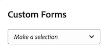

# Association d’un formulaire personnalisé à un dossier d’affaires

Les Forms personnalisées sont utilisées pour collecter des informations qui ne sont pas affichées dans les champs Adobe Workfront existants. 

Pour plus d’informations sur la création d’un Forms personnalisé, reportez-vous à l’article [Création ou modification d’un formulaire personnalisé](../../../administration-and-setup/customize-workfront/create-manage-custom-forms/create-or-edit-a-custom-form.md).

## Exigences d’accès

Vous devez disposer des accès suivants pour effectuer les étapes de cet article :

<table style="table-layout:auto"> 
 <col> 
 <col> 
 <tbody> 
  <tr> 
   <td role="rowheader">Formule Adobe Workfront*</td> 
   <td> 
Pro ou version ultérieure
 </td> 
  </tr> 
  <tr> 
   <td role="rowheader">Licence Adobe Workfront*</td> 
   <td> 
Plan 
 </td> 
  </tr> 
  <tr> 
   <td role="rowheader">Paramétrages du niveau d'accès*</td> 
   <td> 
Modifier l’accès aux projets
 
Remarque : Si vous n’avez toujours pas accès à , demandez à votre administrateur Workfront s’il définit des restrictions supplémentaires à votre niveau d’accès. Pour plus d’informations sur la façon dont un administrateur Workfront peut modifier votre niveau d’accès, voir <a href="../../../administration-and-setup/add-users/configure-and-grant-access/create-modify-access-levels.md" class="MCXref xref">Création ou modification de niveaux d’accès personnalisés</a>.
 </td> 
  </tr> 
  <tr> 
   <td role="rowheader">Autorisations d’objet</td> 
   <td> 
Gestion des autorisations ou des autorisations supérieures au projet
 
Pour plus d’informations sur la demande d’accès supplémentaire, voir <a href="../../../workfront-basics/grant-and-request-access-to-objects/request-access.md" class="MCXref xref">Demande d’accès aux objets </a>.
 </td> 
  </tr> 
 </tbody> 
</table>

&#42;Pour connaître le plan, le type de licence ou l’accès dont vous disposez, contactez votre administrateur Workfront.

## Joindre des Forms personnalisées aux projets

Vous pouvez joindre des Forms personnalisées à un projet dans les zones suivantes :

* Lors de la modification d’un projet, dans la section Détails du projet .
* Lors de la modification d’un projet, dans la zone Modifier le projet .
* Lorsque vous modifiez plusieurs projets en bloc, à partir d’une liste de projets.

   Pour plus d’informations sur l’association de formulaires personnalisés à des projets lors de la modification d’un ou de plusieurs projets, reportez-vous à l’article . [Modification de projets](../../../manage-work/projects/manage-projects/edit-projects.md).

* Lors de la création de l’analyse de cas d’un projet, dans l’analyse de cas, comme décrit dans cet article.

Pour plus d’informations sur l’association de formulaires personnalisés à des objets, voir [Ajout d’un formulaire personnalisé à un objet](../../../workfront-basics/work-with-custom-forms/add-a-custom-form-to-an-object.md).

## Joindre Forms personnalisé à l’analyse de cas

Pour ajouter une option personnalisée d’ à un cas d’entreprise, votre administrateur Workfront doit sélectionner cette option dans Configuration. Pour plus d’informations sur l’activation de formulaires personnalisés dans Configuration, reportez-vous à la section [Configuration des préférences de projet à l’échelle du système](../../../administration-and-setup/set-up-workfront/configure-system-defaults/set-project-preferences.md) dans l’article [Configuration des préférences de projet à l’échelle du système](../../../administration-and-setup/set-up-workfront/configure-system-defaults/set-project-preferences.md).

Pour joindre un formulaire personnalisé :

1. Accédez au projet auquel vous souhaitez joindre le formulaire, puis cliquez sur **Analyse de cas** dans le panneau de gauche.

   Le Business Case s’affiche.

1. Dans le **Formulaire personnalisé** , sélectionnez le formulaire personnalisé à joindre dans le menu déroulant.

   

1. (Facultatif) Sélectionnez **Modifier le formulaire personnalisé**.\
   

1. (Facultatif) Indiquez les informations dans les champs du formulaire personnalisé, puis cliquez sur **Enregistrer** .
