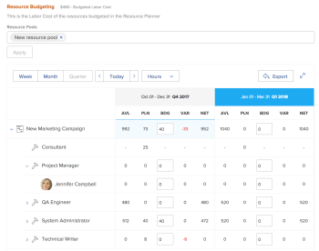

# Budgétiser les ressources dans l’analyse de rentabilité à l’aide du planificateur de ressources

<!--Audited: 06/2025-->

Dans le cadre de la planification des ressources, vous pouvez utiliser le planificateur de ressources au niveau du projet pour budgétiser les fonctions nécessaires à la réalisation des travaux d’un projet lors de l’élaboration de l’analyse de rentabilité.

Pour plus d’informations sur la création d’un business case, voir [Créer un business case pour un projet](../../../manage-work/projects/define-a-business-case/create-business-case.md).

>[!TIP]
>
>Les informations que vous saisissez dans le planificateur de ressources au niveau du projet sont également visibles dans le planificateur de ressources au niveau du système. Le contraire est également vrai. Pour plus d’informations sur le planificateur de ressources, voir [Vue d’ensemble du planificateur de ressources](../../../resource-mgmt/resource-planning/get-started-resource-planner.md).

Vous pouvez également budgétiser les ressources dans l’analyse de rentabilité à l’aide du planificateur de scénarios Adobe Workfront. Pour plus d’informations, voir [Budgétiser les ressources dans l’analyse de rentabilité à l’aide du planificateur de scénarios](../../../manage-work/projects/define-a-business-case/budget-resources-in-business-case-use-scenario-planner.md).

## Conditions d’accès

+++ Développez pour afficher les exigences d’accès aux fonctionnalités de cet article. 

<table style="table-layout:auto"> 
 <col> 
 <col> 
 <tbody> 
  <tr> 
   <td role="rowheader">
Formule Adobe Workfront
</td> 
   <td> 
Prime ou version ultérieure

    </td> 
  </tr> 
  <tr> 
   <td role="rowheader">
Licence Adobe Workfront
</td> 
   <td> 
Léger ou supérieur

   
Révision ou supérieur

<b>IMPORTANT :</b>
 
   
Vous devez disposer d'une licence Standard ou Plan pour modifier les informations de budget des ressources. 
 
   </td> 
  </tr> 
  <tr> 
   <td role="rowheader">
Configurations des niveaux d’accès
</td> 
   <td> 
Modifiez l’accès aux éléments suivants : 
 
    <ul> 
     <li> 
Projets
 </li> 
     <li> 
Gestion des ressources
 </li> 
     <li> 
Données financières
 </li> 
    </ul> </td> 
  </tr> 
  <tr> 
   <td role="rowheader">
Autorisations d’objet
</td> 
   <td> 
Gérer les autorisations sur le projet
 </td> 
  </tr> 
 </tbody> 
</table>

Pour plus d’informations, voir [Conditions d’accès requises dans la documentation Workfront](/help/quicksilver/administration-and-setup/add-users/access-levels-and-object-permissions/access-level-requirements-in-documentation.md).

+++

## Conditions préalables

Avant de commencer, vous devez effectuer les opérations suivantes :

* Remplissez toutes les conditions requises pour la planification des ressources dans Adobe Workfront. Pour plus d’informations, voir [Vue d’ensemble du planificateur de ressources](../../../resource-mgmt/resource-planning/get-started-resource-planner.md).

* Associer des groupes de ressources au projet.

  <!--
  
(NOTE:(you must have tasks assigned to job roles and users on the project - this is optional because the users and their roles come from the pools))

  -->

  >[!NOTE]
  >
  >Vous ne pouvez pas budgétiser les ressources affectées aux problèmes dans l’analyse de rentabilité. Vous pouvez les budgétiser dans le planificateur de ressources au niveau du système. Pour plus d’informations sur le planificateur de ressources, voir [Vue d’ensemble du planificateur de ressources](../../../resource-mgmt/resource-planning/get-started-resource-planner.md).

* Bien qu’il ne s’agisse pas d’une condition préalable, nous vous recommandons également d’indiquer les heures prévues pour les tâches du projet. Cela vous aide à comprendre la quantité de travail qu’une tâche peut nécessiter, ce qui vous aide à décider du temps pour lequel les ressources doivent être budgétisées afin de mener à bien la tâche. Pour plus d’informations sur l’association des tâches au nombre d’heures prévues, voir [Modifier les tâches](../../../manage-work/tasks/manage-tasks/edit-tasks.md).

## Appliquer des groupes de ressources à un projet et budgétiser les ressources dans l’analyse de rentabilité

>[!IMPORTANT]
>
>Vous pouvez budgétiser vos ressources pour une période de 15 ans. Si vous budgétisez des ressources pour un projet d’une durée supérieure à 15 ans, les informations budgétaires risquent de ne pas être exactes.

Pour appliquer les groupes de ressources et budgétiser les ressources du projet dans l’analyse de rentabilité d’un projet sans groupe de ressources :

1. Accédez au projet pour lequel vous souhaitez budgétiser les ressources.
1. Cliquez sur **Analyse de rentabilité** dans le panneau de gauche.
1. (Conditionnel) Si votre société ne dispose pas d’une licence pour le planificateur de scénarios Workfront, cliquez sur **Modifier l’établissement du budget de ressources** dans la section **Établissement du budget de ressources**, puis passez à l’étape 5.

   <!--
   
(NOTE: ensure it stays right - this is 5 instead of 6 because step 2 won't print for nwe)

   -->

1. (Facultatif et le cas échéant) Si les informations sur le projet ont été publiées à partir d’une initiative sur le planificateur de scénarios, effectuez l’une des opérations suivantes :

   * Sélectionnez Planificateur de ressources dans le champ **Choisir les heures à utiliser pour calculer le coût budgété de la main-d&#39;œuvre du projet** puis cliquez sur **Choisir** > **Modifier l&#39;établissement du budget de ressources**.

   <!-- -->

   * Si le planificateur de scénarios a été sélectionné pour l’établissement du budget de ressources du projet, cliquez sur **Modifier** > **Modifier l’établissement du budget de resources**.

     <!-- -->

   Cette fonction utilise les heures budgétées du projet pour calculer les coûts budgétés de main-d’œuvre pour le projet.

   Le planificateur de scénarios n’est disponible que dans la nouvelle expérience Adobe Workfront et nécessite une licence supplémentaire. Pour plus d’informations sur le planificateur de scénarios Workfront, voir [Vue d’ensemble du planificateur de scénarios](../../../scenario-planner/scenario-planner-overview.md).

   >[!NOTE]
   >
   >Nous vous recommandons de prendre la décision d’utiliser le planificateur de ressources ou le planificateur de scénarios lorsque vous commencez à travailler sur un projet. Le fait de passer souvent de l’un à l’autre au cours de la vie du projet peut donner lieu à des incohérences dans la manière dont vous budgétez les ressources du projet.

1. Dans le champ **Sélectionner le groupe de ressources**, spécifiez un ou plusieurs **groupes de ressources**.

   Vous ne devez spécifier que les groupes de ressources qui contiennent des utilisateurs et utilisatrices actifs.

   >[!TIP]
   >
   >Si le projet est déjà associé à des groupes de ressources, le planificateur de ressources s’affiche par défaut. Pour ajouter d’autres groupes de ressources au projet, modifiez le projet. Pour plus d’informations sur la modification d’un projet, voir [Modifier les projets](../../../manage-work/projects/manage-projects/edit-projects.md).

1. Cliquez sur **Appliquer**.

   Le planificateur de ressources s’affiche pour le projet sélectionné.

   Par défaut, les 20 premières fonctions associées à ce projet sont répertoriées dans la section Établissement du budget de ressources par ordre alphabétique.

   Pour plus d’informations sur le planificateur de ressources, voir [Vue d’ensemble du planificateur de ressources](../../../resource-mgmt/resource-planning/get-started-resource-planner.md).

   <!---->

1. (Facultatif et le cas échéant) Développez les fonctions pour voir les personnes qui leur sont associées.

   >[!NOTE]
   >
   >Les utilisateurs et utilisatrices actifs sont affichés sous les fonctions qui leur sont associées uniquement s’ils répondent aux critères suivants :
   >
   >   
   >   
   >   * Ils appartiennent à l’un des groupes de ressources du projet.
   >   * Des heures budgétées leur sont attribuées.
   >   * Ils sont associés à l’une des fonctions du projet.
   >   
   >

1. Cliquez sur **Aujourd’hui** pour revenir à la période d’aujourd’hui.
1. (Facultatif) Cliquez sur **Semaine**, **Mois** ou **Trimestre** pour afficher les informations relatives au projet selon différentes périodes.
1. (Facultatif) Cliquez sur le menu déroulant **Heures**, puis sélectionnez **Heures**, **équivalent temps complet** ou **Coût** pour modifier l’affichage des informations dans le planificateur de ressources. Les heures sont affichées par défaut.

1. (Facultatif) Cliquez sur **Exporter** pour exporter le planificateur de ressources vers un fichier Excel.

   >[!NOTE]
   >
   >Vous pouvez exporter des données pour un maximum de 12 périodes à la fois.

1. (Facultatif) Cliquez sur l’icône **Plein écran**  pour afficher le planificateur de ressources en mode plein écran.

1. Mettez à jour le champ **BDG** (heures budgétées) avec des valeurs d’heures, d’équivalent temps complet ou de coûts pour les personnes, les rôles ou le projet en effectuant l’une des opérations suivantes :

   * Estimez manuellement le nombre d’heures, d’équivalent temps complet ou les valeurs de coût pour les rôles, les personnes ou le projet.

     ou

   * Cliquez sur l’icône **Options** pour le projet ou les fonctions et sélectionnez une option pour budgétiser automatiquement les heures pour les rôles, les personnes ou le projet.

   Pour plus d’informations sur la budgétisation dans la vue Projet du planificateur de ressources, voir [Budgétiser les ressources dans le planificateur de ressources à l’aide des vues Projet et Rôle](../../../resource-mgmt/resource-planning/budget-resources-project-role-views-resource-planner.md).

   >[!NOTE]
   >
   >Vous pouvez budgéter des heures, des équivalents temps plein ou des coûts pour vos ressources pour n&#39;importe quelle période affichée dans la zone de budgétisation des ressources, indépendamment de la chronologie du projet. Par exemple, si vous souhaitez indiquer que vos ressources peuvent ne pas être disponibles pendant la chronologie du projet (où elles sont associées aux heures planifiées), mais qu&#39;elles peuvent être disponibles à un autre moment, vous pouvez les budgéter pour des périodes où les heures planifiées sont nulles, si c&#39;est à ce moment qu&#39;elles deviennent disponibles pour travailler.

1. (Facultatif) Pour savoir si vous pouvez déplacer les heures budgétées, les équivalents temps plein ou les coûts vers une autre période, cliquez sur l&#39;icône **Options**, puis **Ajuster les dates de budget**.

   Pour plus d’informations sur l’ajustement des dates budgétées, voir [Ajuster les dates de budgétisation dans le planificateur de ressources](../../../resource-mgmt/resource-planning/adjust-budgeting-dates.md).

1. Cliquer sur **Enregistrer**.

   Si des taux de coût horaire sont associés à vos fonctions, la budgétisation des ressources dans la zone Établissement du budget de ressources calcule le **coût budgété de main-d’œuvre** du projet. Le coût budgété de main-d’œuvre est affiché dans la zone Établissement du budget de ressources du business case et dans le récapitulatif du business case.

   >[!TIP]
   >
   >Le coût s’affiche dans le business case dans la devise du projet.

   Les informations budgétaires spécifiées dans le business case sont également affichées dans le planificateur de ressources.

   Lorsque vous copiez un projet, vous avez la possibilité de copier également les heures budgétées dans le nouveau projet. Seules les heures budgétées dans le planificateur de ressources sont copiées. Pour plus d’informations, voir [Copier un projet](../manage-projects/copy-project.md).
