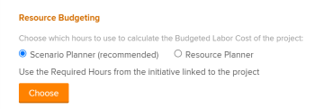

# Budgétiser les ressources dans l’analyse de rentabilité à l’aide du planificateur de scénarios

Dans le cadre de la planification des ressources, vous pouvez utiliser le planificateur de scénarios Adobe Workfront pour budgéter les fonctions nécessaires à l’exécution du travail dans un projet lorsque vous créez le business case.

Pour plus d’informations sur la création d’un business case, voir [Créer un business case pour un projet](../../../manage-work/projects/define-a-business-case/create-business-case.md).

>[!TIP]
>
>Les informations sur les fonctions de l’initiative liée au projet que vous saisissez dans le planificateur de scénarios au niveau du système sont visibles dans la zone Établissement du budget de ressources du business case du projet lorsque vous publiez l’initiative. Le planificateur de scénarios n’est disponible que dans la nouvelle expérience Adobe Workfront et nécessite une licence supplémentaire. Pour plus d’informations sur le planificateur de scénario Workfront, voir [Vue d’ensemble du planificateur de scénarios](../../../scenario-planner/scenario-planner-overview.md).

Vous pouvez également budgéter des ressources dans le business case à l’aide du planificateur de ressources. Pour plus d’informations, consultez les sections suivantes :

* [Budgéter des ressources dans le business case](../../../manage-work/projects/define-a-business-case/budget-resources-in-business-case.md)
  <!--* [Budget resources by project in the Resource Planner](../../../resource-mgmt/resource-planning/budget-by-project-resource-planner-d.md)-->

>[!NOTE]
>
>Nous vous recommandons d’utiliser le planificateur de ressources ou le planificateur de scénarios lorsque vous commencez à travailler sur un projet. Le fait de passer souvent de l’un à l’autre au cours de la vie du projet peut donner lieu à des incohérences dans la manière dont vous budgétez les ressources du projet.

## Conditions d’accès

Vous devez disposer des éléments suivants :

<table style="table-layout:auto"> 
 <col> 
 </col> 
 <col> 
 </col> 
 <tbody> 
  <tr> 
   <td role="rowheader">Formule Adobe Workfront*</td> 
   <td> 
Entreprises ou niveau supérieur
 </td> 
  </tr> 
  <tr> 
   <td role="rowheader">Licence Adobe Workfront*</td> 
   <td> 
Révision ou supérieur
 </td> 
  </tr> 
  <tr> 
   <td role="rowheader">Produit</td> 
   <td> 
Vous devez acheter une licence supplémentaire pour le planificateur de scénarios Adobe Workfront pour accéder aux fonctionnalités décrites dans cet article.
 
Pour plus d’informations sur l’obtention du planificateur de scénarios Workfront, voir <a href="../../../scenario-planner/access-needed-to-use-sp.md" class="MCXref xref">Accès nécessaire pour utiliser le planificateur de scénarios</a>. 
 </td> 
  </tr> 
  <tr> 
   <td role="rowheader">Configurations du niveau d’accès*</td> 
   <td> 
Modifiez l’accès aux éléments suivants : 
 
    <ul> 
     <li> 
Projets
 </li> 
     <li> 
Données financières
 </li> 
     <li> 
Planificateur de scénarios 
 </li> 
    </ul> 
Pour plus d’informations sur l’accès nécessaire pour budgéter les ressources, voir également la section <a href="../../../resource-mgmt/resource-planning/access-needed-to-budget-resources.md" class="MCXref xref">Accès nécessaire pour budgéter des ressources dans Adobe Workfront</a>.
 
Note : si vous n’avez toujours pas l’accès nécessaire, demandez à votre équipe d’administration Adobe Workfront si elle a défini des restrictions supplémentaires à votre niveau d’accès. Pour plus d’informations sur la façon dont un administrateur ou une administratrice Workfront peut modifier votre niveau d’accès, voir <a href="../../../administration-and-setup/add-users/configure-and-grant-access/create-modify-access-levels.md" class="MCXref xref">Créer ou modifier des niveaux d’accès personnalisés</a>.
 </td> 
  </tr> 
  <tr> 
   <td role="rowheader">Autorisations d’objet</td> 
   <td> 
Gérer les autorisations sur le projet
 
Pour plus d’informations sur la demande d’accès supplémentaire, voir la section <a href="../../../workfront-basics/grant-and-request-access-to-objects/request-access.md" class="MCXref xref">Demander un accès aux objets </a>.
 </td> 
  </tr> 
 </tbody> 
</table>

&#42;Pour connaître le forfait, le type de licence ou l’accès dont vous disposez, contactez votre administrateur ou administratrice Workfront.

## Conditions préalables

Avant de commencer, vous devez effectuer les opérations suivantes :

* Créez un plan à l’aide du planificateur de scénarios.

  Pour plus d’informations, voir [Créer et modifier des plans dans le planificateur de scénarios](../../../scenario-planner/create-and-edit-plans.md).

* Créez une initiative sur le plan et associez-la à un projet.

  Veillez à indiquer les informations sur les fonctions requises pour l’initiative et à mettre à jour le projet lié avec ces informations.

  Pour plus d’informations, consultez les articles suivants :

   * [Créer et modifier des initiatives dans le planificateur de scénarios](../../../scenario-planner/create-and-edit-initiatives.md)
   * [Importer des projets dans des plans dans le planificateur de scénarios](../../../scenario-planner/import-projects-to-plans.md)
   * [Mettre à jour ou créer des projets en publiant des initiatives dans le planificateur de scénarios](../../../scenario-planner/publish-scenarios-update-projects.md).

* Bien qu’il ne s’agisse pas de conditions préalables, nous vous recommandons également d’effectuer les opérations suivantes :

   * Affectez des tâches du projet aux fonctions budgétées dans le planificateur de scénarios.
   * Indiquez le nombre d’heures prévues pour les tâches du projet.

     Cela vous permet de vous faire une idée de la quantité de travail nécessaire pour accomplir une tâche, et vous aide ainsi à définir la quantité de temps pour laquelle budgéter des ressources.

     Pour plus d’informations sur l’association de tâches à un nombre d’heures prévues, voir [Modifier les tâches](../../../manage-work/tasks/manage-tasks/edit-tasks.md).

## Budgéter des ressources dans le business case à l’aide du planificateur de scénarios pour les projets liés aux initiatives

>[!IMPORTANT]
>
>Vous pouvez budgétiser vos ressources pour une période de 15 ans. Si vous budgétisez des ressources pour un projet d’une durée supérieure à 15 ans, les informations budgétaires risquent de ne pas être exactes.
><!--
><MadCap:conditionalText data-mc-conditions="QuicksilverOrClassic.Draft mode">>
>(is this still accurate for the Scenario Planner?)>
></MadCap:conditionalText>>
>-->

1. Accédez au projet pour lequel vous souhaitez budgétiser les ressources.

   >[!TIP]
   >
   >Il s’agit d’un projet lié à une initiative du planificateur de scénarios dont l’initiative liée a été publiée au moins une fois.

1. Cliquez sur **Business case** dans le panneau de gauche.
1. (Le cas échéant) Dans la section **Établissement du budget de ressources** effectuez l’une des opérations suivantes :

   * Si vous venez de publier des informations à partir du planificateur de scénarios, sélectionnez le planificateur de scénarios dans le champ **Choisissez les heures à utiliser pour calculer le coût budgété de la main-d’oeuvre pour le projet** dans la zone Établissement du budget de ressources, puis cliquez sur **Choisir**.

     

   * Si le planificateur de ressources a été précédemment sélectionné pour l’établissement du budget de ressources du projet, cliquez sur **Modifier** > **Planificateur de scénarios** > **Choisir**.

     

     Workfront utilise les heures de fonction requises de l’initiative liée pour calculer le coût budgété de la main-d’oeuvre et les heures budgétées du projet. Il s’agit de l’option recommandée. Le coût s’affiche dans le business case dans la devise du projet.

     Lorsque vous copiez un projet et que vous choisissez de copier les heures budgétées dans le nouveau projet, les heures budgétées à l’aide du planificateur de scénarios ne sont pas copiées dans le nouveau projet. Seules les heures budgétées dans le planificateur de ressources sont copiées. Pour plus d’informations, voir [Copier un projet](../manage-projects/copy-project.md).

     >[!IMPORTANT]
     >
     >Lorsque vous utilisez le planificateur de scénarios pour budgéter les ressources du projet, le coût budgété de la main-d’oeuvre s’affiche dans les zones suivantes de Workfront :
     >
     >   
     >   
     >   * Zone Établissement du budget des ressources du business case
     >   * Le planificateur de scénarios au niveau du système dispose du coût des ressources humaines de l’initiative liée au projet. Pour plus d’informations, voir [Créer et modifier des initiatives dans le planificateur de scénarios](../../../scenario-planner/create-and-edit-initiatives.md).
     >   
     >

1. (Facultatif) Cliquez sur **Afficher dans le planificateur de scénarios** pour ouvrir le plan contenant l’initiative liée au projet. Le planificateur de scénarios s’ouvre alors dans un nouvel onglet du navigateur.
1. (Facultatif) Mettez à jour les informations sur l’initiative. Pour plus d’informations, voir [Créer et modifier des initiatives dans le planificateur de scénarios](../../../scenario-planner/create-and-edit-initiatives.md).

   >[!NOTE]
   >
   >Vous devez publier l’initiative après chaque modification de la zone Établissement du budget de ressources sur le projet à mettre à jour.
