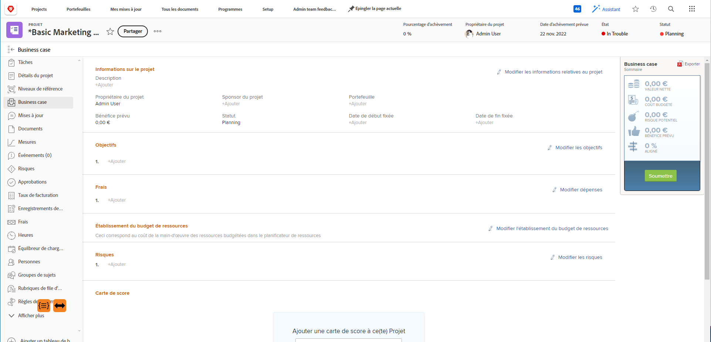

# Créer des objectifs d’analyse de rentabilité

<!-- Audited: 6/2025 -->

Dans le cadre de la création d’un business case, vous pouvez créer une série d’objectifs pour définir les objectifs d’un projet. Ces objectifs sont utilisés pour communiquer l’objectif de la réalisation d’un projet au responsable Portfolio ou au sponsor du projet.

<!--

(NOTE: below snippet: NWE only, not classic)

-->

>[!TIP]
>
>Vous pouvez créer des objectifs stratégiques pour votre organisation qui ne sont pas liés au business case d’un projet. Vous devez avoir accès aux Objectifs Adobe Workfront pour pouvoir créer des objectifs stratégiques. Vous pouvez ensuite les associer à des projets en dehors de leurs business cases. Pour plus d’informations sur la création d’objectifs à l’aide des objectifs Workfront, voir [Vue d’ensemble des objectifs Adobe Workfront](../../../workfront-goals/goal-management/wf-goals-overview.md).

Tenez compte des éléments suivants lorsque vous définissez les objectifs de business case pour vos projets :

* Les objectifs de business case sont spécifiques à chaque projet. Vous ne pouvez pas copier des objectifs d&#39;un projet à un autre ni établir des objectifs au niveau du système. Ils doivent être définis au niveau de chaque projet.
* Votre administrateur Adobe Workfront ou votre administrateur de groupe doit activer la section Objectifs du projet avant qu’elle ne s’affiche dans l’Analyse de rentabilité. Pour plus d’informations sur l’activation des champs Business case de projets, voir [Configurer les préférences des projets à l’échelle du système](../../../administration-and-setup/set-up-workfront/configure-system-defaults/set-project-preferences.md).

* Les objectifs ne sont pas une section obligatoire de l’analyse de rentabilité du projet.

  Un projet peut recevoir un score auquel donner la priorité dans Portfolio Optimizer, même si la section Objectifs n’est pas définie.

  Pour plus d’informations sur le score de l’optimisateur de portfolio, voir [Appliquer une carte de performance à un projet et générer un score d’alignement](../../../manage-work/projects/define-a-business-case/apply-scorecard-to-project-to-generate-alignment-score.md).

* Vous ne pouvez pas créer de rapports sur les objectifs de l’analyse de rentabilité.

## Conditions d’accès

+++ Développez pour afficher les exigences d’accès aux fonctionnalités de cet article.

<table style="table-layout:auto"> 
 <col> 
 </col> 
 <col> 
 </col> 
 <tbody> 
  <tr> 
   <td role="rowheader">
Formule Adobe Workfront*
</td> 
   <td> 
Current : Prime ou version ultérieure

   
Hérité : Pro ou supérieur
  </td> 
  </tr> 
  <tr> 
   <td role="rowheader">
Licence Adobe Workfront*
</td>
   <td> 
   
Actuel : Standard
 
   
Hérité : plan 
 
   </td> 
  </tr> 
  <tr> 
   <td role="rowheader">Configurations des niveaux d’accès</td> 
   <td> 
Accès en modification aux projets
 </td> 
  </tr> 
  <tr> 
   <td role="rowheader">
Autorisations d’objet
</td> 
   <td> 
Autorisations de gestion ou supérieures du projet
 </td> 
  </tr> 
 </tbody> 
</table>

* Pour plus d’informations sur ce tableau, consultez [Conditions d’accès requises dans la documentation Workfront](/help/quicksilver/administration-and-setup/add-users/access-levels-and-object-permissions/access-level-requirements-in-documentation.md).

+++

## Ajouter un objectif au business case d’un projet

{{step1-to-projects}}

1. Dans la liste des projets, sélectionnez le projet pour lequel vous souhaitez définir des objectifs d&#39;analyse de rentabilité.
1. Dans le volet de gauche, cliquez sur **Analyse de rentabilité**. La section **Analyse de rentabilité** s’affiche.

   <!---->

1. Dans la section **Objectifs**, cliquez sur **Modifier les objectifs**.

1. Dans le premier champ, saisissez la description de l’objectif.

1. Dans le menu déroulant **Importance**, sélectionnez le niveau d’importance (ou de priorité) de cet objectif :

   * Le plus élevé
   * Élevé
   * Moyen
   * Faible
   * Le plus faible

     <!---->

     >[!NOTE]
     >
     >Vous ne pouvez pas personnaliser les niveaux d’importance des objectifs.

1. (Facultatif) Pour ajouter un autre objectif, cliquez sur **Ajouter un autre objectif** et répétez les étapes 5 à 6.

1. Cliquer sur **Enregistrer**.
