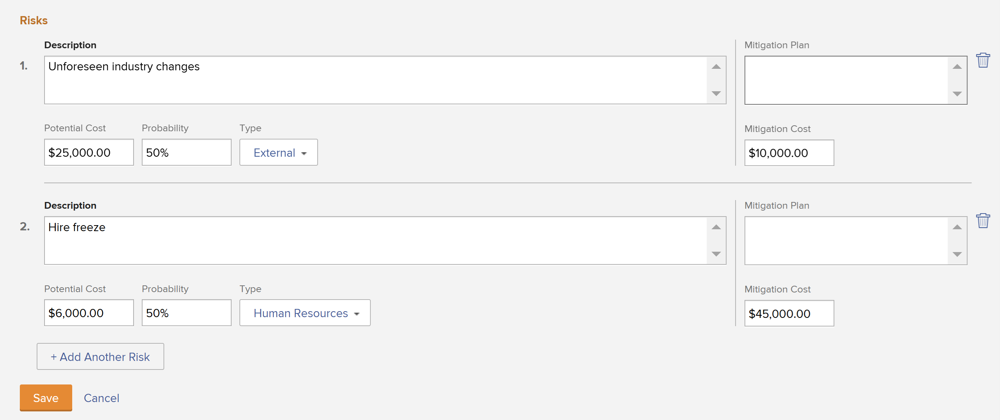

# Créer et modifier des risques sur les projets

<!--Audited: 01/2025-->

<!--The highlighted information on this page refers to functionality not yet generally available. It is available only in the Preview environment for all customers. The same features will also be available in the Production environment for all customers after a week from the Preview release.    

For more information, see [Interface modernization](/help/quicksilver/product-announcements/product-releases/interface-modernization/interface-modernization.md). -->

Les risques sont des événements ou des facteurs possibles qui empêchent un projet de se terminer à temps ou dans les limites du budget. Vous pouvez enregistrer les risques dans le cadre de la création de l’analyse de rentabilité d’un projet ou en utilisant l’onglet Risques .

Vous ne pouvez créer des risques que sur les projets ou les modèles. Vous ne pouvez pas associer des risques à des tâches ou des problèmes.

Les risques peuvent être associés au coût, mais le coût réel des risques n’a aucune incidence sur le coût réel du projet.

>[!NOTE]
>
>Cet article définit les risques associés au projet tels que vous les définissez dans l&#39;Analyse de rentabilité du projet ou tels que vous les ajoutez dans l&#39;onglet Risques du projet.
>
>Pour plus d’informations sur le champ Risque disponible lors de la modification d’un projet, voir [Modifier des projets](../../../manage-work/projects/manage-projects/edit-projects.md).

## Conditions d’accès

Vous devez disposer des accès suivants pour effectuer les étapes décrites dans cet article :

+++ Développez pour afficher les exigences d’accès aux fonctionnalités de cet article.

<table style="table-layout:auto"> 
 <col> 
 <col> 
 <tbody> 
  <tr> 
   <td role="rowheader">Formule Adobe Workfront</td> 
   <td> 
Tous
 </td> 
  </tr> 
  <tr> 
   <td role="rowheader">Licence Adobe Workfront*</td> 
   <td> 
Nouveau : Standard 

   
Actuel : formule 
 </td> 
  </tr> 
  <tr> 
   <td role="rowheader">Configurations des niveaux d’accès</td> 
   <td> 
Modifier l’accès aux projets et aux données financières
 </td> 
  </tr> 
  <tr> 
   <td role="rowheader">Autorisations d’objet</td> 
   <td> 
 Autorisations de gestion qui incluent la gestion des finances sur le projet pour lequel vous souhaitez créer ou modifier des risques. 
 </td> 
  </tr> 
 </tbody> 
</table>

*Pour plus d’informations, voir [Conditions d’accès dans la documentation de Workfront](/help/quicksilver/administration-and-setup/add-users/access-levels-and-object-permissions/access-level-requirements-in-documentation.md).

+++

## Créer et modifier des risques dans le business case

Vous pouvez créer des risques lors de la planification du business case d’un projet. Vous pouvez ensuite les modifier dans le business case, lorsque des modifications sont apportées à leur probabilité, à leur plan de réduction des risques ou à leur coût, par exemple. Pour plus d’informations sur la création d’un business case, voir [Créer un business case pour un projet](../../../manage-work/projects/define-a-business-case/create-business-case.md).

Votre équipe d’administration Workfront ou de groupes doit activer la section **Risques** du business case dans la zone Préférences du projet avant de pouvoir l’afficher au niveau du projet dans la section Business Case. Pour plus d’informations sur la définition des préférences de projet, voir [Configurer les préférences de projet à l’échelle du système](../../../administration-and-setup/set-up-workfront/configure-system-defaults/set-project-preferences.md).

La création et la modification des risques dans le business case sont identiques.

Pour créer ou modifier un risque dans le business case :

1. Accédez au projet pour lequel vous souhaitez créer des risques.
1. Cliquez sur **Business case** dans le panneau de gauche.
1. Dans la section **Risques**, cliquez sur **Modifier les risques**.
1. Saisissez ou modifiez les informations suivantes :

   * **Description :** décrivez le risque.

   * **Coût potentiel** : indiquez le coût estimé si le risque doit se produire.

   * **Probabilité** : indiquez la probabilité que le risque se produise en pourcentage.

   * **Type** : indiquez à quelle catégorie le risque appartient.
   * **Plan de réduction des risques** : mettez à jour la description du plan pour atténuer le risque.

   * **Coût de réduction** : indiquez le coût du plan de réduction des risques que vous devez mettre en place pour éviter que le risque ne se produise.

   

1. (Facultatif) Cliquez sur **Ajouter un autre risque** pour ajouter des risques supplémentaires.
1. Cliquer sur **Enregistrer**.

## Créer et modifier des risques dans la zone Risques

Outre la création et la modification de risques dans le business case, vous pouvez le faire à l’aide de la section **Risques** d’un projet.

Vous pouvez créer et modifier des risques dans la section Risques d&#39;un projet ou d&#39;un modèle. La création de risques pour les modèles est identique à la création de risques pour les projets.

### Créer des risques dans la zone Risques {#create-risks-in-the-risks-area}

1. Accédez au projet pour lequel vous souhaitez créer des risques.
1. Cliquez sur **Risques** dans le panneau de gauche.

   

1. Cliquez sur **Commencer à ajouter des risques** et créez des risques en modifiant leurs informations en ligne. **Description** est un champ obligatoire

   Ou

   Cliquez sur **Nouveau risque**.

   La boîte de dialogue **Nouveau risque** s’ouvre.

   

1. (Conditionnel) Si vous ajoutez un risque dans la boîte **Nouveau risque**, saisissez les informations suivantes :

   * **Description** : Décrivez le risque. Champ obligatoire.
   * **Type de risque** : indiquez à quelle catégorie le risque appartient.\
     Votre équipe d’administration Workfront définit les types de risque disponibles dans votre environnement. Pour plus d’informations sur la définition des types de risque, voir l’article [Modifier et créer des types de risque](../../../administration-and-setup/set-up-workfront/configure-system-defaults/edit-create-risk-types.md).

   * **Probabilité** : indiquez la probabilité que le risque se produise sous la forme d’une valeur de pourcentage.
   * **Coût potentiel** : indiquez le coût estimé si le risque doit se produire.
   * **Coût de l’atténuation** : indiquez le coût du plan d’atténuation que vous devez mettre en place pour éviter que le risque ne se produise.
   * **Coût réel** : indiquez le coût réel du risque si le risque s&#39;est produit.
   * **Plan d’atténuation** : mettez à jour la description du plan pour atténuer le risque.

1. (Le cas échéant) Cliquez sur **Entrée** si vous créez le risque en ligne.

   Ou

   Cliquez sur **Enregistrer** si vous modifiez les informations dans la zone **Nouveau risque**.

1. (Facultatif) Sélectionnez un **Statut** différent pour le risque, dans le menu déroulant du **Statut** lors de l’application de la vue **Standard** pour la liste des risques.

   Par défaut, le **Statut** d&#39;un risque est **Identifié**.

### Modifier des risques dans la zone Risques {#edit-risks-in-the-risks-area}

Vous pouvez modifier les risques pendant la durée de vie d’un projet, lorsque des changements se produisent dans leur probabilité, leur coût potentiel ou leur statut, par exemple.

Vous pouvez modifier un risque à la fois ou plusieurs risques en bloc.

Pour modifier les risques :

1. Accédez à un projet pour lequel vous souhaitez modifier les risques existants.
1. Cliquez sur **Risques** dans le panneau de gauche.
1. Commencez à modifier en ligne les champs correspondant aux risques que vous voyez dans la liste pour modifier un risque à la fois.

   Ou

   Sélectionnez un ou plusieurs risques, puis cliquez sur **Modifier** pour modifier plusieurs risques en même temps.

   >[!NOTE]
   >
   >Vous appliquez les mêmes informations à tous les risques sélectionnés lorsque vous modifiez plusieurs risques à la fois. Les informations associées à chaque risque avant vos modifications sont remplacées par une modification en bloc.

1. Si vous avez cliqué sur **Modifier**, la boîte de dialogue **Modifier le risque** ou **Modifier les risques** s&#39;ouvre.

   Envisagez de modifier les champs suivants :

   * **Description** : modifiez la description du risque.
   * **Type de risque** : indiquez à quelle catégorie le risque appartient.
   * **Probabilité** : indiquez la probabilité que le risque se produise sous la forme d’une valeur de pourcentage.
   * **Coût potentiel** : indiquez le coût estimé si le risque doit se produire.
   * **Coût de l’atténuation** : indiquez le coût du plan d’atténuation que vous devez mettre en place pour éviter que le risque ne se produise.
   * **Coût réel** : indiquez le coût réel du risque si le risque s&#39;est produit.
   * **Plan d’atténuation** : mettez à jour la description du plan pour atténuer le risque.

1. Cliquer sur **Enregistrer**.
1. (Facultatif) Modifiez le **Statut** pour un risque, dans le menu déroulant du **Statut** lors de l’application de la vue **Standard** pour la liste des risques.

   >[!NOTE]
   >
   >Vous ne pouvez pas modifier le **Statut** des risques dans la boîte de dialogue **Modifier le risque**. Vous ne pouvez le faire que dans une modification en ligne.
