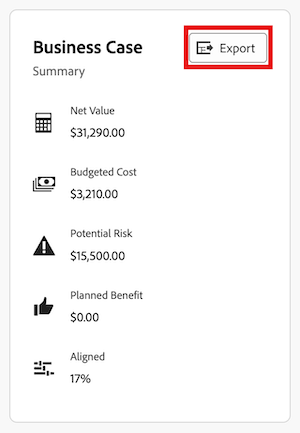

# Exporter le business case d’un projet

Vous pouvez exporter le business case vers un fichier PDF au cas où vous auriez besoin de l&#39;imprimer ou de le joindre à un e-mail dans un format plus condensé.

## Conditions d’accès

+++ Développez pour afficher les exigences d’accès aux fonctionnalités de cet article.

<table style="table-layout:auto"> 
 <col> 
 <col> 
 <tbody> 
  <tr> 
   <td role="rowheader">
Package Adobe Workfront
</td> 
   <td> 
Prime ou version ultérieure 
  </td> 
  </tr> 
  <tr> 
   <td role="rowheader">
Licence Adobe Workfront
</td> 
   <td> 
   
Léger ou supérieur

   
Révision ou supérieur
 </td> 
  </tr> 
  <tr> 
   <td role="rowheader">Configurations des niveaux d’accès</td> 
   <td> 
Accès Afficher aux projets, aux données financières et à la gestion des ressources
 </td> 
  </tr> 
  <tr> 
   <td role="rowheader">Autorisations d’objet</td> 
   <td> 
Autorisations en affichage ou autorisations supérieures sur le projet
 </td> 
  </tr> 
 </tbody> 
</table>

Pour plus d’informations, voir [Conditions d’accès requises dans la documentation Workfront](/help/quicksilver/administration-and-setup/add-users/access-levels-and-object-permissions/access-level-requirements-in-documentation.md).

+++

## Exporter le business case

{{step1-to-projects}}

1. Sur la page **Projets**, sélectionnez le projet à partir duquel vous souhaitez exporter l&#39;Analyse de rentabilité.
1. Cliquez sur **Business case** dans le panneau de gauche.
1. Dans le coin supérieur droit de la zone **Résumé de l’analyse de rentabilité**, cliquez sur **Exporter**. Un fichier PDF est téléchargé sur votre ordinateur.

   

