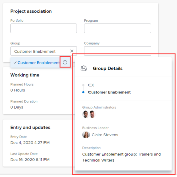
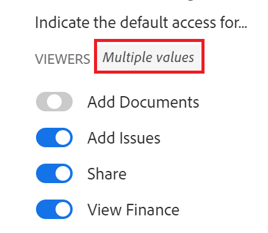

# Modifier des projets

<!--Audited: 07/2024-->

<!--The highlighted information on this page refers to functionality not yet generally available. It is available for all customers in the Preview environment and for a select group of customers in the Production environment.-->

<!--

***Linked to many articles,

The Resource Pools part also duplicates in the "Working with Resource Pools" article 

The Update Type section is also documented in Selecting the Project Update Type article

Keep the reference link to the other article that also documents the Update Type) 

(NOTE 2: information described here also exists in these articles:

** Project Overview area

**Manage project Finance area

If you need to update just one field, check to see if that field is also listed there and update in both places.)

-->

Vous pouvez modifier un projet dans Adobe Workfront aussi souvent que nécessaire. Nous vous recommandons de modifier les projets au minimum après que leur statut passe à Actif, afin d’éviter toute confusion en envoyant des notifications sur les modifications à l’ensemble de l’équipe de projet.

Idéalement, vous devez modifier un projet lorsque son statut est Planification. Pour plus d’informations sur l’équipe de projet, voir [Vue d’ensemble de l’équipe de projet](../../../manage-work/projects/planning-a-project/project-team-overview.md).

## Conditions d’accès

+++ Développez pour afficher les exigences d’accès aux fonctionnalités de cet article.

<table style="table-layout:auto"> 
 <col> 
 <col> 
 <tbody> 
  <tr> 
   <td role="rowheader">Forfait Adobe Workfront</td> 
   <td> 
N’importe quelle
 </td> 
  </tr> 
  <tr> 
   <td role="rowheader">Licence Adobe Workfront*</td> 
   <td>
Nouvelle : standard 
 
   Ou
   
Actuelle : formule 
 </td> 
  </tr> 
  <tr> 
   <td role="rowheader">Configurations du niveau d’accès</td> 
   <td> 
Modifier l’accès aux projets
 </td> 
  </tr> 
  <tr> 
   <td role="rowheader">Autorisations d’objet</td> 
   <td> 
     
Autorisations de gestion d’un projet 
 
     </td> 
  </tr> 
 </tbody> 
</table>

*Pour plus d’informations sur les informations contenues dans ce tableau, voir [Exigences d’accès dans la documentation Workfront](/help/quicksilver/administration-and-setup/add-users/access-levels-and-object-permissions/access-level-requirements-in-documentation.md).

+++

## Limites de la modification de projets

Certaines limites peuvent vous empêcher de modifier des projets.

Tenez compte des points suivants lors de la modification de projets :

* Vous ne pouvez pas modifier les projets qui se trouvent dans un processus d’approbation, sauf pour enregistrer la durée et modifier le statut.
* Vous pouvez joindre des documents ou des modèles à un projet dont le statut est Terminé, Inactif ou En attente d’approbation seulement si une personne de votre équipe d’administration Workfront ou de groupe a activé cette fonctionnalité dans la zone Préférences du projet. Pour plus d’informations sur la définition des préférences de projet, voir [Configurer les préférences de projet à l’échelle du système](../../../administration-and-setup/set-up-workfront/configure-system-defaults/set-project-preferences.md).
* Vous ne pouvez modifier que les informations suivantes sur un projet dont le statut est Inactif ou Terminé :

   * Modifier les dépenses existantes
   * Ajouter, supprimer ou modifier des formulaires personnalisés

## Modifier un projet

En modifiant un projet, vous pouvez modifier les informations et les paramètres du projet, ainsi que les tâches et les problèmes liés au projet.

Le statut par défaut de certains paramètres mentionnés dans cet article peut être modifié en fonction de leur état dans le modèle à partir duquel le projet a été créé.

Pour plus d’informations sur la modification de modèles, voir [Modifier des modèles de projet](../../../manage-work/projects/create-and-manage-templates/edit-templates.md).

Pour plus d’informations sur la création d’un projet à partir d’un modèle, voir [Créer un projet à l’aide d’un modèle](/help/quicksilver/manage-work/projects/create-projects/create-project-from-template.md).

{{step1-to-projects}}

1. (Facultatif) Cliquez sur **Projets auxquels je participe** ou **Projets dont je suis propriétaire** dans le coin supérieur droit pour afficher les projets dont vous êtes propriétaire ou ceux dont vous faites partie de l’équipe de projet.

   

   >[!NOTE]
   >
   >Si vous faites partie de l’équipe d’administration de groupes, vous pouvez afficher et modifier les projets de votre groupe dans la zone Groupes, ainsi que dans la zone Projets. Pour plus d’informations, voir [Créer et modifier les projets d’un groupe](../../../administration-and-setup/manage-groups/work-with-group-objects/create-and-modify-a-groups-projects.md).

1. Cliquez sur le nom du projet à modifier pour ouvrir la page du projet.

1. (Facultatif) Pour modifier des informations limitées sur un projet, cliquez sur **Détails du projet** dans le panneau de gauche. Si vous souhaitez modifier toutes les informations relatives au projet, passez à l’étape 5. <!--accurate?!-->

   

   >[!NOTE]
   >
   >Selon la manière dont votre équipe d’administration Workfront ou de groupes a modifié votre modèle de disposition, les champs de la zone Détails du projet peuvent être réorganisés ou masqués. Pour plus d’informations, voir [Personnaliser la vue Détails à l’aide d’un modèle de disposition](../../../administration-and-setup/customize-workfront/use-layout-templates/customize-details-view-layout-template.md).

   Pour modifier les informations de la section Détails, procédez comme suit :

   1. (Facultatif) Cliquez sur l’icône **Réduire tout**  dans le coin supérieur droit pour réduire toutes les zones.
   1. (Facultatif et le cas échéant) Lorsqu’une zone est réduite, cliquez sur la **flèche pointant vers la droite**  en regard de chaque zone pour développer la zone à modifier.
   1. Pour plus d’informations sur la modification des informations dans l’onglet Détails du projet, voir les articles suivants :

      * [Gérer les informations dans la zone de vue d’ensemble du projet](../../../manage-work/projects/manage-projects/understand-project-overview-area.md)
      * [Gérer les informations dans la zone Finances d’un projet](../../../manage-work/projects/project-finances/manage-project-finance-area.md)

   1. (Facultatif) Pour joindre un formulaire personnalisé, commencez à saisir son nom dans le champ **Ajouter un formulaire personnalisé**, puis sélectionnez-le lorsqu’il s’affiche dans la liste et cliquez sur **Enregistrer les modifications**.
   1. (Facultatif) Cliquez sur l’icône **Exporter**  pour exporter les informations de la vue d’ensemble et des formulaires personnalisés vers un fichier PDF, puis cliquez sur **Exporter**. Sélectionnez l’une des options suivantes :

      * Sélectionner tout (s’affiche uniquement lorsqu’au moins un formulaire personnalisé est joint)
      * Vue d’ensemble
      * Le nom d’un ou de plusieurs formulaires personnalisés

      Le fichier PDF est téléchargé sur votre ordinateur.

      

      Pour plus d’informations, voir [Exporter les formulaires personnalisés et les détails des objets](../../../workfront-basics/work-with-custom-forms/export-custom-forms-details.md).

   Pour plus d’informations sur les champs visibles dans la section Détails du projet, passez à la modification du projet dans la zone Modifier le projet, comme décrit ci-dessous.
1. Pour modifier toutes les informations relatives au projet, cliquez sur le menu **Plus**  en regard du nom du projet, puis sur **Modifier**.

   Ou

   Dans une liste de projets, sélectionnez un ou plusieurs projets, puis cliquez sur l’icône **Modifier**  en haut de la liste.

   Pour plus d’informations sur la modification de projets en masse, voir la section [Modifier des projets en masse](#edit-projects-in-bulk) dans cet article.

   La zone **Modifier le projet** s’ouvre.

   >[!IMPORTANT]
   >
   >Pour afficher l’option Modifier, vous devez disposer des autorisations de gestion du projet.

   Tous les champs de projet sont disponibles dans la zone Modifier le projet et sont regroupés par zones répertoriées dans le panneau de gauche.

   >[!NOTE]
   >
   >Selon la façon dont l’administrateur ou l’administratrice Workfront ou de groupe a modifié votre modèle de disposition, les zones du panneau de gauche de la section Modifier le projet ou les champs répertoriés dans ces zones peuvent être réorganisés ou ne pas s’afficher. Pour plus d’informations, voir [Personnaliser la vue Détails à l’aide d’un modèle de disposition](../../../administration-and-setup/customize-workfront/use-layout-templates/customize-details-view-layout-template.md).

1. (Le cas échéant) Si vous avez cliqué sur le menu **Plus**, puis sur **Modifier**, mettez à jour les informations dans l’une des zones suivantes du panneau de gauche :

   * [Nom du projet](#project-name)
   * [Vue d’ensemble](#overview)
   * [Formulaires personnalisés](#custom-forms)
   * [Finances](#finance)
   * [Paramètres du projet](#project-settings)
   * [Paramètres de la tâche](#task-settings)
   * [Paramètres du problème](#issue-settings)
   * [Accès](#access)

   >[!NOTE]
   >
   >Selon la manière dont votre administrateur ou administratrice Workfront configure le modèle de disposition pour la zone Détails du projet, les sections et les champs de la zone Modifier le projet peuvent être différents dans votre environnement. Pour plus d’informations, voir [Personnaliser la vue Détails à l’aide d’un modèle de disposition](../../../administration-and-setup/customize-workfront/use-layout-templates/customize-details-view-layout-template.md).

### Nom du projet {#project-name}

1. Commencez à éditer votre projet comme décrit ci-dessus.
1. Cliquez sur **Nom du projet** dans le panneau de gauche.

   

1. Mettez à jour le nom du projet.

   Vous ne pouvez pas modifier le nom du projet lorsque vous modifiez des projets en masse.

### Vue d’ensemble {#overview}

1. Commencez à éditer votre projet comme décrit ci-dessus.
1. Cliquez sur **Vue d’ensemble** dans le panneau de gauche.

   

1. Mettez à jour les informations suivantes sur le projet :

   <table style="table-layout:auto"> 
      <col> 
      <col> 
      <tbody> 
      <tr> 
         <td role="rowheader"><strong>Description</strong> </td> 
         <td> 
Ajoutez des informations supplémentaires sur le projet.
 </td> 
      </tr> 
      <tr> 
         <td role="rowheader"><strong>Statut</strong> </td> 
         <td> 
Sélectionnez le statut du projet. Vous ne pouvez pas marquer un projet comme terminé avant que toutes les tâches et tous les problèmes ne soient terminés. Pour plus d’informations sur les statuts d’un projet, voir <a href="../../../administration-and-setup/customize-workfront/creating-custom-status-and-priority-labels/project-statuses.md" class="MCXref xref">Accéder à la liste des statuts des projets système</a>
 </td> 
      </tr> 
      <tr> 
         <td role="rowheader"><strong>Priorité</strong> </td> 
         <td> 
 
Il s’agit simplement d’un indicateur visuel qui vous permet de hiérarchiser vos projets.
 
Selon les préférences du projet sélectionnées par votre administrateur ou administratrice Workfront, les noms des priorités peuvent être différents pour vous. Pour plus d’informations sur la modification des priorités, voir <a href="../../../administration-and-setup/customize-workfront/creating-custom-status-and-priority-labels/create-customize-priorities.md" class="MCXref xref">Créer et personnaliser les priorités</a>
 
 </td> 
      </tr> 
      <tr> 
         <td role="rowheader"><strong>URL</strong> </td> 
         <td> 
Spécifiez un lien web qui se rapporte aux informations sur ce projet.
 </td> 
      </tr> 
      <tr> 
         <td role="rowheader"><strong>Type de condition</strong> </td> 
         <td> 
Sélectionnez l’un des types de conditions suivants : 
         <ul> 
         <li><strong>Manuel :</strong> le ou la propriétaire de l’ouvrage fixe manuellement les conditions du projet.</li> 
         <li><strong>Statut de la progression :</strong> Workfront définit automatiquement la condition en fonction du statut de la progression des tâches sur le chemin critique. Pour plus d’informations sur le statut de la progression, voir <a href="../../../manage-work/tasks/task-information/task-progress-status.md" class="MCXref xref">Vue d’ensemble du statut de la progression de la tâche</a>.</li> 
         </ul>
Votre administrateur ou administratrice Workfront, ou encore un administrateur ou une administratrice de groupe, sélectionne le mode de calcul par défaut de la condition des projets pour votre système ou votre groupe. Pour plus d’informations sur la définition des valeurs par défaut des projets, voir <a href="../../../administration-and-setup/set-up-workfront/configure-system-defaults/set-project-preferences.md" class="MCXref xref">Configurer les préférences des projets à l’échelle du système</a>. 

 </td> 
      </tr> 
      <tr> 
         <td role="rowheader"><strong>Condition</strong> </td> 
         <td> 
 
(S’affiche uniquement lorsque vous avez sélectionné <strong>Manuel</strong> pour le type de condition <strong></strong>) : sélectionnez une condition pour indiquer la progression du projet. 
 
Pour plus d’informations sur la manière dont les conditions du projet peuvent être définies automatiquement ou manuellement, voir <a href="../../../manage-work/projects/manage-projects/project-condition-and-condition-type.md" class="MCXref xref">Vue d’ensemble de la condition du projet et du type de condition</a>.
 
 </td> 
      </tr> 
      <tr> 
         <td role="rowheader"><strong>Mode horaire</strong> </td> 
         <td> 
Indiquez si le projet est planifié à partir de la date de début ou de la date d’achèvement. Cette sélection détermine les dates planifiées des tâches du projet. 
         <ul> 
         <li><strong>Date de début</strong> : la première tâche du projet a la même date de début planifiée que le projet par défaut. Pour plus d’informations sur la tâche Date de début planifiée, voir <a href="../../../manage-work/tasks/task-information/task-planned-start-date.md" class="MCXref xref">Vue d’ensemble de la tâche Date de début planifiée</a>. La chronologie du projet est calculée à partir de la date de début et la date d’achèvement du projet est calculée par le système, sur la base de la durée de toutes les tâches. </li> 
         <li><strong>Date d’achèvement</strong> : la dernière tâche du projet a la même date d’achèvement prévue que le projet. La chronologie du projet est calculée à partir de la date d’achèvement et la date de début du projet est calculée par le système en soustrayant la durée de toutes les tâches de la date d’achèvement du projet. </li> 
         </ul>
Votre administrateur ou administratrice Workfront ou de groupe sélectionne le paramètre Mode planning par défaut pour votre système ou votre groupe. Pour plus d’informations sur la définition des valeurs par défaut des projets, voir <a href="../../../administration-and-setup/set-up-workfront/configure-system-defaults/set-project-preferences.md" class="MCXref xref">Configurer les préférences de projet à l’échelle du système</a>.

 </td> 
      </tr> 
      <tr> 
         <td role="rowheader"><strong>Date et heure de début prévues</strong> </td> 
         <td> 
 
Spécifiez la date à laquelle vous sélectionnez <strong>Planifier à partir de la date de début</strong>.  
 
Il s’agit d’un champ en lecture seule lorsque vous sélectionnez <strong>Planifier à partir de la date d’achèvement</strong>. 
 
 </td> 
      </tr> 
      <tr> 
         <td role="rowheader"><strong>Date et heure d’achèvement prévues</strong> </td> 
         <td> 
Spécifiez la date à laquelle vous sélectionnez <strong>Planifier à partir de la date d’achèvement</strong>. 
 
Il s’agit d’un champ en lecture seule lorsque vous sélectionnez <strong>Planifier à partir de la date de début</strong>. 
 </td> 
      </tr> 
      <tr> 
         <td role="rowheader"><strong>Portfolio</strong></td> 
         <td>Indiquez le portfolio auquel le projet appartient. Vous devez d’abord créer un portfolio pour l’afficher dans la liste déroulante. Seuls les portfolios actifs peuvent être associés à un projet. Pour plus d’informations sur la création de portfolios, voir <a href="../../../manage-work/portfolios/create-and-manage-portfolios/create-portfolios.md" class="MCXref xref">Créer un portfolio</a>.
         
<b>NOTE</b>

         
Vous devez disposer des autorisations de gestion sur le portfolio pour pouvoir l’ajouter ou la supprimer au projet.

      </td> 
      </tr> 
      <tr> 
         <td role="rowheader"><strong>Programme</strong></td> 
         <td> 
Si vous avez sélectionné un portfolio pour le projet, indiquez un programme pour le projet. Certains portfolios peuvent ne pas avoir de programmes. Vous devez d’abord créer un programme pour qu’il apparaisse dans cette liste déroulante. Seuls les programmes actifs peuvent être associés à un projet. 
 
Pour plus d’informations sur la création de programmes, voir <a href="../../../manage-work/portfolios/create-and-manage-programs/create-program.md" class="MCXref xref">Créer un programme</a>.
 
      
<b>NOTE</b>

         
Pour pouvoir l’ajouter ou la supprimer au projet, vous devez disposer des autorisations de gestion du programme.
   
      </td> 
      </tr> 
      <tr> 
         <td role="rowheader"><strong>Groupe</strong></td> 
         <td> 
 
Indiquez le nom du groupe associé au projet. 
Il s’agit d’un champ obligatoire. Vous ne pouvez pas avoir de projet qui n’est pas associé à un groupe. 
 
Vous pouvez vous assurer que vous sélectionnez le bon groupe en le survolant et en cliquant sur l’icône d’information  qui s’affiche en regard. Cette option permet d’afficher une infobulle contenant des informations sur le groupe, telles que la hiérarchie des groupes qui le précèdent et ses administrateurs et administratrices.
 Par défaut, l’un des groupes suivants est automatiquement associé à un projet lors de sa création, à moins que vous ne spécifiiez un groupe différent :
 
         <ul> 
         <li> 
Lorsque le projet est créé à partir de la zone Projets, le groupe résidentiel de la personne ayant créé le projet est associé au projet. 
 
Il en va de même lorsque le projet est créé à partir de la section Projets d’un portfolio ou d’un programme.
 </li> 
         <li> 
Lorsque le projet est créé à partir de la page principale d’un groupe dans la zone de configuration, ce groupe est associé au projet.
 </li> 
         </ul> 
 
  
 
         
<b>NOTES</b>

         <ul>
         <li>
Si le projet, ses tâches ou ses problèmes sont associés à un statut personnalisé au niveau du groupe, le fait de changer le groupe du projet peut entraîner une modification du statut du projet, des tâches ou des problèmes, afin de correspondre au nouveau groupe.
</li>
         <li>
Si le projet, ses tâches ou ses problèmes sont déjà associés à un processus d’approbation au niveau du groupe à l’aide de statuts personnalisés au niveau du groupe, le changement de groupe peut créer un conflit entre les statuts d’approbation du groupe précédent et ceux existant au niveau du système.

         
Envisagez de supprimer les processus d’approbation au niveau du groupe pour le projet, ses tâches ou ses problèmes avant de mettre à jour le groupe.

         
Pour plus d’informations sur la création de processus d’approbation au niveau du groupe, voir <a href="../../../administration-and-setup/manage-groups/work-with-group-objects/create-and-modify-groups-approval-processes.md" class="MCXref xref">Processus d’approbation au niveau du groupe</a>.

         
Pour plus d’informations sur la création d’un statut personnalisé au niveau du groupe, voir <a href="../../../administration-and-setup/manage-groups/manage-group-statuses/create-or-edit-a-group-status.md" class="MCXref xref">Créer ou modifier un statut de groupe</a>.
</li></ul> </td> 
      </tr> 
      <tr> 
         <td role="rowheader"><strong>Entreprise</strong> </td> 
         <td> 
Indiquez une entreprise associée au projet. Vous devez créer une entreprise avant de pouvoir l’associer à un projet. Seules les entreprises actives peuvent être associées à un projet. Pour plus d’informations sur la création d’entreprises, voir <a href="../../../administration-and-setup/set-up-workfront/organizational-setup/create-and-edit-companies.md" class="MCXref xref">Créer et modifier des entreprises</a>.
 </td> 
      </tr> 
      <tr> 
         <td role="rowheader"><strong>Propriétaire du projet</strong> </td> 
         <td> 
Commencez à saisir le nom d’une personne pour l’ajouter au projet, puis sélectionnez-la lorsqu’elle s’affiche dans la liste. La personne est ajoutée à l’équipe de projet et reçoit automatiquement les autorisations de gestion du projet. La personne désignée comme propriétaire du projet doit être une personne active de Workfront.

         </td> 
      </tr> 
      <tr> 
         <td role="rowheader"><strong>Sponsor du projet</strong> </td> 
         <td> 
Commencez à saisir le nom d’une personne pour l’ajouter au projet, puis sélectionnez-la lorsqu’elle s’affiche dans la liste. La personne est ajoutée à l’équipe du projet et reçoit automatiquement des autorisations de visualisation du projet. La personne désignée comme sponsor du projet doit être une personne active de Workfront. 
 </td> 
      </tr> 
      <tr> 
         <td role="rowheader"><strong>Gestionnaire des ressources</strong> </td> 
         <td> 
 Commencez à saisir les noms des personnes pour les ajouter au projet, puis sélectionnez-les lorsqu’elles s’affichent dans la liste. Les personnes sont ajoutées à l’équipe du projet et reçoivent automatiquement des autorisations de gestion du projet et peuvent affecter des ressources aux tâches et aux problèmes du projet. Les personnes conservent les autorisations de gestion sur le projet même si elles sont supprimées du champ Gestionnaire de ressources. Vous pouvez spécifier plusieurs gestionnaires de ressources. 
 </td> 
      </tr>

   <tr> 
         <td role="rowheader"><strong>Créateur ou créatrice du problème converti</strong> </td> 
         <td> 
 Par défaut, ce champ est rempli automatiquement avec le nom de la personne qui a créé le problème à partir duquel le projet a été converti. Vous pouvez remplacer ce nom par n’importe quel autre nom dans Workfront.  
 </td> 
      </tr>

   </tbody> 
      </table>

   >[!TIP]
   >
   >Lors de la mise à jour des champs Propriétaire du projet, Sponsor du projet et Gestionnaire des ressources, remarquez l’avatar, le rôle principal de la personne ou son adresse e-mail afin de distinguer les personnes dont les noms sont identiques.
   >
   >Les personnes doivent être associées à au moins une fonction pour l’afficher à mesure que vous les ajoutez.
   >
   >Pour pouvoir voir les adresses e-mail des utilisateurs et utilisatrices, le paramètre Afficher les coordonnées doit être activé dans votre niveau d’accès. Pour plus d’informations, consultez [Accorder l’accès aux utilisateurs et utilisatrices](../../../administration-and-setup/add-users/configure-and-grant-access/grant-access-other-users.md).

1. (Facultatif) Continuez à modifier les sections suivantes, en fonction des informations que vous souhaitez modifier.

   Ou

   Cliquer sur **Enregistrer**.

### Formulaires personnalisés {#custom-forms}

En fonction de votre niveau d’accès et de votre autorisation sur le projet, les scénarios suivants se produisent :

* Si vous n’avez pas l’autorisation de modifier les formulaires personnalisés pour le projet, vous ne pouvez pas modifier les champs des formulaires personnalisés joints. Vous ne pouvez visualiser que les champs des formulaires personnalisés joints au projet.
* Si vous avez accès à une section d’un formulaire personnalisé en mode Visualisation (et non en mode Modification), vous ne pouvez pas modifier les champs de cette section.
* Si vous n’avez pas accès à une section de l’un des formulaires personnalisés joints au projet, la section ne s’affiche pas dans la boîte Modifier le projet.

Lorsque plusieurs projets sont sélectionnés pour être modifiés en bloc, les scénarios suivants se présentent :

* Si vous n’avez pas l’autorisation de modifier le formulaire personnalisé sur au moins un des projets sélectionnés, vous ne pouvez pas modifier les champs de l’un des formulaires personnalisés joints. Vous ne pouvez visualiser les champs que sur les formulaires personnalisés joints.
* Si vous avez accès à une section d’un formulaire personnalisé en mode Visualisation (et non en mode Modification), vous ne pouvez pas modifier les champs de cette section. Vous ne pouvez visualiser que les champs de cette section.
* Si vous n’avez pas accès à une section de l’un des formulaires personnalisés joints à au moins un des projets, la section ne s’affiche pas dans la boîte Modifier les projets.
* Si vous avez des champs obligatoires sur l’un des formulaires personnalisés joints à tous les projets et que vous sélectionnez un champ sans le modifier, vous devez annuler vos modifications sur ce champ ou y ajouter des informations avant de pouvoir enregistrer les projets que vous avez sélectionnés. Si vous ne sélectionnez aucun champ obligatoire, vous pouvez enregistrer les projets que vous avez sélectionnés même si le champ obligatoire est vide.

Pour plus d’informations sur l’accès aux formulaires personnalisés, voir les articles suivants :

* [Partager un formulaire personnalisé](../../../administration-and-setup/customize-workfront/create-manage-custom-forms/share-access-to-a-custom-form.md)
* [Organisation et prévisualisation d’un formulaire](/help/quicksilver/administration-and-setup/customize-workfront/create-manage-custom-forms/form-designer/design-a-form/organize-a-form.md)

Pour modifier les informations sur les formulaires personnalisés lors de la modification d’un projet :

1. Commencez à éditer votre projet comme décrit ci-dessus.
1. Cliquez sur **Formulaires personnalisés** dans le panneau de gauche.

   

1. Cliquez sur la boîte **Ajouter un formulaire personnalisé** et sélectionnez un formulaire dans la liste pour le joindre au projet. Par défaut, les 40 premiers formulaires s’affichent par ordre alphabétique. Si le formulaire n’apparaît pas dans la liste, commencez à saisir son nom, puis sélectionnez-le lorsqu’il apparaît dans la liste.

   >[!NOTE]
   >
   >Vous devez créer les formulaires personnalisés avant de pouvoir les sélectionner dans ce champ. Seuls les formulaires personnalisés actifs apparaissent dans la liste. Pour plus d’informations sur la création de formulaires personnalisés, voir [Concevoir un formulaire avec le concepteur de formulaires](/help/quicksilver/administration-and-setup/customize-workfront/create-manage-custom-forms/form-designer/design-a-form/design-a-form.md). Vous pouvez ajouter jusqu’à dix formulaires personnalisés à un projet.

1. (Le cas échéant) Si vous avez joint un formulaire personnalisé au projet, modifiez tous les champs du formulaire. Vous devez spécifier tous les champs obligatoires avant de pouvoir enregistrer le projet.
1. (Facultatif) Cliquez sur l’icône **X** à droite du nom d’un formulaire personnalisé pour le supprimer, puis cliquez sur **Supprimer**.
1. (Facultatif) Continuez à modifier les sections suivantes, en fonction des informations que vous souhaitez modifier.

   Ou

   Cliquer sur **Enregistrer**.

### Finances {#finance}

En fonction de votre niveau d’accès et de votre autorisation sur le projet, les scénarios suivants se produisent :

* Si vous avez les autorisations Voir les données financières et Voir les finances pour le projet, vous ne pouvez voir que les champs de la section Finances. Vous ne pouvez pas modifier les champs de cette section.
* Si vous disposez des autorisations Modifier les données financières et Gérer les finances pour le projet, vous pouvez mettre à jour les champs de cette section.

Lorsque plusieurs projets sont sélectionnés pour les modifier en bloc, les scénarios suivants se présentent :

* Si vous sélectionnez au moins un projet pour lequel vous disposez des droits Voir les finances (au lieu de Gérer les finances), vous ne pouvez visualiser les champs de cette section que pour tous les projets sélectionnés. Vous ne pouvez pas modifier en bloc les champs de la section Finances.
* Si vous sélectionnez au moins un projet pour lequel vous n’avez pas d’autorisations de finance, cette section ne s’affiche pas du tout.

Pour modifier les champs de la zone Finance :

1. Commencez à éditer votre projet comme décrit ci-dessus.
1. Cliquez sur **Finance** dans le panneau de gauche.

   

1. Mettez à jour les informations financières suivantes pour le projet :

   <table style="table-layout:auto"> 
    <col> 
    <col> 
    <tbody> 
     <tr data-mc-conditions=""> 
      <td role="rowheader"><strong>Devise</strong> </td> 
      <td> 
 
Spécifiez la devise du projet, si elle est différente de la devise par défaut de votre système. Vous ne pouvez pas modifier la devise d’un projet s’il contient déjà des informations financières. Ce champ n’est pas visible si vous n’avez que la devise par défaut dans le système. 
 
Pour plus d’informations sur les devises, voir <a href="../../../administration-and-setup/manage-workfront/exchange-rates/set-up-exchange-rates.md" class="MCXref xref">Définir les taux de change</a>. 
 
 </td> 
     </tr> 
     <tr> 
      <td role="rowheader"><strong>Budget</strong> </td> 
      <td> Spécifiez un budget pour le projet. </td> 
     </tr> 
     <tr> 
      <td role="rowheader"><strong>Méthode d’indice de performances</strong> </td> 
      <td> 
Sélectionnez <b>Basé sur les heures</b>, ou <b>Basé sur les coûts</b> pour indiquer si les mesures de la valeur acquise du projet (telles que l’indice de performances des coûts ou l’estimation du coût réel) sont calculées en fonction des heures ou des coûts. 
 
Pour plus d’informations sur la méthode de l’indice de performances, voir <a href="../../../manage-work/projects/project-finances/set-pim.md" class="MCXref xref">Définir la méthode de l’indice de performance (PIM)</a>. 
 
Une personne de votre équipe d’administration Workfront ou de groupe sélectionne le paramètre par défaut de la méthode d’indice de performances pour votre système ou votre groupe. Pour plus d’informations sur la définition des valeurs par défaut des projets, voir <a href="../../../administration-and-setup/set-up-workfront/configure-system-defaults/set-project-preferences.md" class="MCXref xref">Configurer les préférences des projets à l’échelle du système</a>.
 </td> 
     </tr> 
     <tr> 
      <td role="rowheader"><strong>Estimation à l’achèvement</strong> </td> 
      <td> 
 
Indiquez comment Workfront doit calculer l’estimation à l’achèvement (EAC). 

      Sélectionnez l’une des options suivantes : 
      <ul><li><b>Calculer au niveau du projet</b></li>
      <li><b>Regrouper depuis tâches/sous-tâches</b></li> </ul>
      
Pour plus d’informations sur le calcul de l’estimation à l’achèvement, voir <a href="../../../manage-work/projects/project-finances/calculate-eac.md" class="MCXref xref">Calculer l’estimation à l’achèvement (EAC)</a>.
 
Une personne de votre équipe d’administration Workfront ou de groupe sélectionne le paramètre d’estimation à l’achèvement par défaut pour votre système ou votre groupe. Pour plus d’informations sur la définition des valeurs par défaut des projets, voir <a href="../../../administration-and-setup/set-up-workfront/configure-system-defaults/set-project-preferences.md" class="MCXref xref">Configurer les préférences des projets à l’échelle du système</a>.
 
 </td> 
     </tr> 
     <tr> 
      <td role="rowheader"><strong>Bénéfice prévu</strong> </td> 
      <td> 
Estimez le bénéfice prévu du projet. Cette estimation est utilisée dans l’analyse de rentabilité du projet et dans l’optimiseur de portfolio. Pour plus d’informations sur le bénéfice prévu d’un projet, voir <a href="../../../manage-work/projects/project-finances/project-planned-benefit.md" class="MCXref xref">Vue d’ensemble du bénéfice prévu d’un projet</a>. Le bénéfice prévu d’un projet est pris en compte dans le calcul de la valeur nette du projet. 
 
Pour plus d’informations, voir <a href="../../../manage-work/portfolios/portfolio-optimizer/manage-projects-in-portfolio-optimizer.md" class="MCXref xref">Gérer des projets dans l’optimiseur de portfolio</a>. 
 </td> 
     </tr> 
     <tr> 
      <td role="rowheader"><strong>Bénéfice réel</strong> </td> 
      <td> 
Estimez le bénéfice réel du projet. Il s’agit d’un montant en devise qui représente le bénéfice que votre entreprise ou votre service tirerait de la réalisation de ce projet. 
 </td> 
     </tr> 
      <tr> 
      <td role="rowheader"><strong>Coût fixe</strong> </td> 
      <td> 
Indiquez le coût fixe du projet. Ce coût est différent du coût de la main-d’œuvre, qui correspond au nombre d’heures consacrées au projet, et du coût des dépenses, qui correspond au montant des dépenses consacrées au projet. Le coût fixe d’un projet est pris en compte dans le calcul de la valeur nette d’un projet et fait partie du coût budgété. 
 </td> 
     </tr> 
     <tr> 
      <td role="rowheader"><strong>Revenus fixes</strong> </td> 
      <td> 
Indiquez le revenu fixe pour le projet. 
 </td> 
     </tr> 
    </tbody> 
   </table>

1. (Facultatif) Continuez à éditer les sections suivantes, en fonction des informations à modifier.

   Ou

   Cliquer sur **Enregistrer**.

### Paramètres du projet {#project-settings}

1. Commencez à éditer votre projet comme décrit ci-dessus.
1. Cliquez sur **Paramètres du projet** dans le panneau de gauche.

   

1. Mettez à jour les informations suivantes :

   <table style="table-layout:auto"> 
      <col> 
      <col> 
      <tbody> 
      <tr> 
      <td role="rowheader"><strong>Chemin jalonné</strong> </td> 
       <td> 
Sélectionnez un chemin jalonné pour le projet. Seuls les chemins jalonnés actifs sont affichés dans la liste.
 
Pour plus d’informations sur les chemins jalonnés, voir <a href="../../../administration-and-setup/customize-workfront/configure-approval-milestone-processes/create-milestone-path.md" class="MCXref xref">Créer un chemin jalonné</a>.
 </td> 
      </tr> 
      <tr> 
      <td role="rowheader"><strong>Mode d’achèvement</strong> </td> 
      <td> 
Contrôlez la façon dont le projet est marqué comme terminé. Sélectionnez l’une des options suivantes : 
       <ul> 
       <li>
<strong>Automatique</strong> : le projet est marqué comme terminé lorsque toutes les tâches et tous les problèmes sont résolus.

Le statut du projet ne devient automatiquement complet que si le statut du projet est en cours lorsque les tâches sont terminées. 
</li> 
       <li><strong>Manuel</strong> : vous devez sélectionner manuellement le statut Terminé pour le projet, lorsque toutes les tâches et tous les problèmes sont terminés.</li> 
       </ul>
 </td> 
       </tr> 
       <tr> 
       <td role="rowheader"><strong>Mode d'achèvement du sommaire</strong></td> 
       <td> 
Contrôlez la façon dont les tâches parents sont marquées comme terminées. Sélectionnez l’une des options suivantes : 
       <ul> 
       <li><strong>Automatique</strong> : les tâches parents sont marquées comme terminées et leur pourcentage terminé est mis à jour automatiquement, au fur et à mesure que les tâches enfants sont terminées et que le pourcentage terminé des tâches enfants est mis à jour. </li> 
       <li><strong>Manuel</strong> : vous devez mettre à jour manuellement le pourcentage terminé et le statut des tâches parents, indépendamment des modifications apportées aux tâches enfants. Vous pouvez ainsi marquer une tâche parent comme terminée même si les sous-tâches sont incomplètes. </li> 
       </ul>
 </td> 
       </tr> 
       <tr> 
       <td role="rowheader"><strong>Type de mise à jour</strong></td> 
       <td> 
Contrôlez le moment où les modifications apportées à la chronologie du projet sont enregistrées sur le projet ou les tâches parents. Par exemple, les modifications suivantes apportées au projet entraînent une mise à jour de la chronologie du projet : 
       <ul> 
       <li>Mettre à jour les dates des tâches</li> 
       <li>Modifier les relations entre les prédécesseurs des tâches</li> 
       <li>
Modifier les relations parents-enfants, en ajoutant ou en supprimant des affectations et en modifiant la contrainte de tâche ou le type de durée

Lorsque les tâches sont mises à jour, leurs objets parents (tâches parents ou projet) sont mis à jour au moment indiqué par le type de mise à jour. 

Si les objets parents ne sont pas mis à jour immédiatement après la modification lorsque vous sélectionnez le type de mise à jour « Automatique et En cas de modification » ou « Modification uniquement », actualisez la page.

Sélectionnez l’une des options suivantes : 

- <strong>Automatique et En cas de modification</strong> (Paramètre par défaut) : la chronologie du projet est mise à jour à chaque fois qu’un changement intervient dans le projet ou dans un autre projet dont le projet dépend (En cas de modification). La chronologie du projet est également mis à jour chaque nuit (Automatique).

C’est le paramètre recommandé pour ce champ, car il garantit que le projet est toujours à jour.

Lorsque vous effectuez une action sur une tâche ou un projet qui déclenche un recalcul de la chronologie, toutes les dates disponibles sont immédiatement affichées, ce qui vous permet de continuer à travailler. Pour les projets de plus de 100 tâches, les dates qui nécessitent des recalculs plus longs s’affichent brièvement sous la forme d’un point d’interrogation (pendant 1 à 5 secondes, ou jusqu’à une minute pour les projets de grande envergure). Cela indique que le recalcul n’est pas encore terminé et que les dates sont susceptibles d’être modifiées.

- <strong>Change Only</strong> : la chronologie du projet est mise à jour chaque fois qu’une modification intervient dans le projet ou dans un autre projet dont le projet dépend. Sélectionnez cette option si des modifications se produisent rarement dans le projet ou dans d’autres projets dont la chronologie dépend.

- <strong>Automatique uniquement</strong> : la chronologie du projet est mise à jour chaque nuit. Ainsi, la chronologie n’est pas mise à jour immédiatement après les modifications.

Sélectionnez cette option si de nombreuses modifications interviennent chaque jour dans le projet ou dans d’autres projets dont la chronologie dépend. Cependant, gardez à l’esprit qu’avec ce paramètre le projet ne sera pas mis à jour en même temps que les modifications effectuées.

- <strong>Manuel uniquement</strong> : la chronologie du projet n’est mise à jour qu’avec la sélection de l’option Recalculer les chronologies. Pour plus d’informations sur le recalcul manuel de la chronologie du projet, voir <a href="../../../manage-work/projects/manage-projects/recalculate-project-timeline.md" class="MCXref xref">Recalculer la chronologie du projet</a>. 

Sélectionnez cette option si vous apportez de nombreuses modifications au projet en même temps et que vous souhaitez que le recalcul de la chronologie se produise après toutes les modifications (plutôt qu’après chaque modification individuelle).
</li> 
       </ul>
 </td> 
       </tr> 
       <tr> 
       <td role="rowheader"><strong>Planning</strong> </td> 
       <td> 
Sélectionnez un planning pour votre projet. Il doit s’agir du même planning que celui attribué à la plupart des personnes travaillant sur le projet. Vous devez créer un planning avant de pouvoir l’affecter à un projet ou à une personne. Si vous n’avez pas créé de plannings personnalisés dans votre système, le planning par défaut est sélectionné.
 
Pour plus d’informations sur la création de plannings, voir <a href="../../../administration-and-setup/set-up-workfront/configure-timesheets-schedules/create-schedules.md" class="MCXref xref">Créer un planning</a>. 
 </td> 
       </tr> 
       <tr> 
       <td role="rowheader"><strong>Congés de l’utilisateur ou de l’utilisatrice</strong> </td> 
       <td> 
Détermine si les congés de la personne cessionnaire principale d’une tâche modifie les dates prévues de la tâche sur le projet. 

Votre administrateur ou administratrice de Workfront ou de groupe sélectionne la valeur par défaut de ce paramètre pour votre système ou votre groupe. Pour plus d’informations sur la définition des valeurs par défaut des projets, voir <a href="../../../administration-and-setup/set-up-workfront/configure-system-defaults/set-project-preferences.md" class="MCXref xref">Configurer les préférences des projets à l’échelle du système</a>. 

Sélectionnez l’une des options suivantes : - <strong>Prendre en compte les congés de l’utilisateur et de l’utilisatrice dans la durée des tâches</strong> : lorsque cette option est sélectionnée, les dates prévues des tâches sont ajustées en fonction des congés de la personne cessionnaire principale de la tâche, si ces congés ont lieu pendant la durée de la tâche. 

Par exemple, si une tâche avec une contrainte de Dès Que Possible est planifiée pour commencer le 1er juin et se terminer le 3 juin, et que la personne cessionnaire principale est en congé le 2 juin, avec la sélection de cette option, les dates prévues de la tâche sont du 1er au 4 juin. En fonction de la contrainte de la tâche, les scénarios suivants existent : 
 
       <ul> 
       <li>Pour les contraintes de tâches liées au planning à partir d’une date de début (Dès Que Possible, Première Heure Disponible, Commencer Au Plus Tôt, Commencer Au Plus Tard, Il Faut Commencer Le), la date de début prévue n’est pas modifiée, à l’inverse de la date d’achèvement prévue.</li> 
       <li>Pour les contraintes de tâches liées au planning à partir d’une date d’achèvement (Aussi Tard Que Possible, Dernière Heure Disponible, Finir Au Plus Tôt, Finir Au Plus Tôt, Il Faut Terminer Le), la date d’achèvement prévue n’est pas modifiée, à l’inverse de la date de début prévue.</li> 
       <li>Pour les tâches avec une contrainte de dates fixes, la date de début et la date d’achèvement prévues ne sont pas modifiées. </li> 
       </ul>
La durée de la tâche n’est pas modifiée lorsque vous sélectionnez ce paramètre. Seules les dates prévues sont modifiées, en fonction de la contrainte de tâche. Pour plus d’informations sur les contraintes de tâches, consultez la section <a href="../../../manage-work/tasks/task-constraints/task-constraint-overview.md" class="MCXref xref">Vue d’ensemble des contraintes de tâches</a>. 

- <strong>Ignorer les congés de l’utilisateur ou de l’utilisatrice dans la durée des tâches</strong> : lorsque cette option est sélectionnée, les dates prévues des tâches du projet restent telles qu’elles ont été planifiées à l’origine, même si la personne cessionnaire principale de la tâche a des jours de congé prévus pendant la durée de la tâche. 

Tenez compte des éléments suivants lorsque vous sélectionnez l’une des options disponibles pour ce paramètre :
 
       <ul> 
       <li>
L'option par défaut de ce paramètre pour un nouveau projet est la même que la préférence de projet au niveau du système. 

Pour plus d’informations sur les préférences de projet au niveau du système, consultez la section <a href="../../../administration-and-setup/set-up-workfront/configure-system-defaults/set-project-preferences.md" class="MCXref xref">Configurer les préférences des projets à l’échelle du système</a>. 
</li> 
       <li>Lorsque vous joignez un modèle à un projet existant, les paramètres du projet sont mis à jour pour correspondre à ceux du modèle. </li> 
       <li>
Workfront décide des dates de tâches prévues à ajuster en fonction de la valeur de la contrainte de tâche. En fonction de cette contrainte, la date de début ou de fin prévue, ou les deux, peuvent être affectées ou rester inchangées. Par exemple, si la contrainte de tâche est Dates Fixes, les dates ne sont pas ajustées lorsque la personne cessionnaire principale prend des congés, même si l’option <strong>Prendre en compte les congés de l’utilisateur ou de l’utilisatrice dans la durée des tâches</strong> est sélectionnée. 
</li> 
       </ul></td> 
      </tr> 
      <tr> 
       <td role="rowheader"><strong>Mode de nivellement des ressources</strong> </td> 
       <td> 
 
Sélectionnez l’une des options suivantes :
 
- <strong>Manuel</strong> : vous devez niveler manuellement vos ressources (il s’agit du paramètre par défaut).
 
- <strong>Automatique</strong> : Workfront nivelle vos ressources.
 
Pour plus d’informations sur le nivellement des ressources, consultez la section <a href="../../../manage-work/gantt-chart/use-the-gantt-chart/level-resources-in-gantt.md" class="MCXref xref">Niveler les ressources dans le graphique de Gantt </a>.
 
 </td> 
      </tr> 
      <tr> 
       <td role="rowheader"><strong>Risque</strong> </td> 
       <td> 
 
Définissez le niveau de risque de votre projet. Le risque n’est qu’un indicateur du degré de risque d’un projet. Vous pouvez hiérarchiser l’exécution de vos projets en fonction du niveau de risque.
 
 
Envisagez de choisir parmi les niveaux de risque suivants :
 
- Très faible
 
- Faible
 
- Moyen
 
- Élevé
 
- Très élevé
 
Les niveaux de risque que vous indiquez ici ne peuvent pas être personnalisés.
 
Ces risques n’ont rien à voir avec les risques potentiels qui pourraient survenir pendant la durée de vie d’un projet et que vous devez enregistrer dans l’onglet Risques du projet ou dans l’analyse de rentabilité. Pour plus d’informations sur les risques potentiels d’un projet, voir <a href="../../../administration-and-setup/set-up-workfront/configure-system-defaults/edit-create-risk-types.md" class="MCXref xref">Modifier et créer des types de risques</a>. 
 
 
 </td> 
      </tr> 
      <tr> 
       <td role="rowheader"><strong>Pools de ressources</strong> </td> 
       <td> 
 
Spécifiez les groupes de ressources associés au projet. Les groupes de ressources sont des ensembles de personnes qui sont nécessaires en même temps pour l’achèvement d’un projet. Ils permettent en outre d’établir le budget du projet dans le planificateur de ressources. Pour plus d’informations sur les groupes de ressources, voir <a href="../../../resource-mgmt/resource-planning/resource-pools/work-with-resource-pools.md" class="MCXref xref">Vue d’ensemble des groupes de ressources</a>. 
 
Lorsque vous modifiez des projets en masse, seuls les groupes de ressources communs à tous les projets sélectionnés apparaissent dans ce champ. Si les projets sélectionnés n’ont pas de groupes de ressources partagés, ce champ sera vide. Les groupes de ressources que vous spécifiez ici remplaceront les groupes de ressources individuels des projets.
 
 </td> 
      </tr> 
      <tr> 
       <td role="rowheader"> <strong>Autoriser le remplacement des taux de facturation au niveau du projet par des taux de facturation au niveau de l’entreprise</strong></td> 
       <td>Sélectionnez cette option pour permettre aux taux de facturation au niveau de l’entreprise de remplacer les taux historiques des fonctions, à moins que ces taux ne soient marqués comme facturés. L’activation de cette option annule les taux historiques des fonctions, à moins qu’ils ne soient marqués comme facturés.  Pour plus d’informations, voir <a href="../../../manage-work/projects/project-finances/override-project-level-with-company-level-billing-rates.md" class="MCXref xref">Remplacer les taux de facturation au niveau d’un projet par des taux de facturation au niveau de l’entreprise</a>.</td> 
      </tr> 
      <tr> 
       <td role="rowheader"><strong>L'approbation pour ce projet demande du temps</strong></td> 
       <td> 
 Sélectionnez cette option pour demander à la personne propriétaire du projet d’approuver le temps consigné sur le projet. Si vous utilisez les enregistrements de facturation et que vous sélectionnez cette option, seules les heures approuvées sur le projet apparaissent comme heures facturables disponibles pour les enregistrements de facturation. L’approbation du temps sur le projet est indépendante de l’approbation des feuilles de temps. 
 
Pour plus d’informations sur la demande de temps pour l’approbation pour un projet, voir <a href="../../../manage-work/projects/manage-projects/require-time-approval-for-projects.md" class="MCXref xref">Demander du temps pour l’approbation d’un projet</a>.
 </td> 
      </tr> 
      <tr> 
       <td role="rowheader"><strong>Filtrer les types d’heures</strong> et <strong>Types d’heures</strong></td> 
       <td> 
 
Sélectionnez l’une des options suivantes :
 
       <ul> 
       <li> 
Sélectionnez <strong>Non</strong> pour que tous les types d’heures spécifiques au projet soient disponibles sur le projet. (Il s’agit de la sélection par défaut).
 
Ou
 </li> 
       <li>Sélectionnez <strong>Oui</strong> pour que seul un sous-ensemble des types d’heures spécifiques au projet soit disponible sur le projet, puis sélectionnez les types d’heures que vous souhaitez rendre disponibles dans le champ <b>Types d’heures</b>.</li> 
       
<b>CONSEIL</b>

       
Le champ <b>Types d’heures</b> n’est pas modifiable lorsque vous sélectionnez <b>Non</b>.
 
       
Si vous sélectionnez cette option, seuls les types d’heures que vous avez sélectionnés seront disponibles lors de la consignation des heures sur le projet (ou sur les tâches et les problèmes au sein du projet). Vous devez sélectionner au moins un type d’heure ; si vous sélectionnez cette option et que vous ne sélectionnez aucun type d’heure, tous les types d’heures sont disponibles sur le projet.
 </ul>

   
Les mêmes sélections de type d’heure doivent être effectuées au niveau de chaque personne pour que chacune puisse voir ces options de type d’heure sur le projet. Pour plus d’informations sur la définition des types d’heures au niveau de l’utilisateur ou de l’utilisatrice, voir <a href="../../../timesheets/create-and-manage-timesheets/log-time.md" class="MCXref xref">Consigner le temps</a>. 
 
 </td> 
      </tr> 
      <tr data-mc-conditions=""> 
       <td role="rowheader"><strong>Notification de rappel</strong> </td> 
       <td> 
 
Sélectionnez la notification de rappel qui doit être associée au projet. Vous devez configurer les notifications de rappel des projets pour que ce champ apparaisse lors de la modification d’un projet. Pour plus d’informations sur la configuration des notifications de rappel, voir <a href="../../../administration-and-setup/manage-workfront/emails/set-up-reminder-notifications.md"><a href="../../../administration-and-setup/manage-workfront/emails/set-up-reminder-notifications.md" class="MCXref xref">Configurer les notifications de rappel</a>.</a>
 
 </td> 
      </tr> 
      <tr data-mc-conditions=""> 
       <td role="rowheader"><strong>Processus d'approbation</strong></td> 
       <td> 
Sélectionnez le processus d’approbation à associer au projet. Votre administrateur ou administratrice Workfront doit définir les processus d’approbation au niveau du système avant que vous puissiez les associer à des projets. Toute personne disposant d’un accès administratif aux processus d’approbation peut également créer des processus d’approbation spécifiques à un groupe. Pour plus d’informations sur la création de processus d’approbation, voir <a href="../../../administration-and-setup/customize-workfront/configure-approval-milestone-processes/create-approval-processes.md" class="MCXref xref">Créer un processus d’approbation pour les éléments de travail</a>.
 
Tenez compte des éléments suivants lorsque vous ajoutez des processus d’approbation : 
 
       <ul> 
       <li>Seuls les processus d’approbation actifs sont affichés dans la liste. </li> 
       <li> 
Les processus d’approbation à l’échelle du système et du groupe s’affichent dans la liste. Un processus d’approbation associé à un groupe autre que celui du projet ne s’affiche pas dans la liste.
 
Si le groupe associé au projet change, le processus d’approbation spécifique au groupe devient un processus d’approbation à usage unique. Pour plus d’informations sur la manière dont les modifications apportées au groupe du projet ou au processus d’approbation affectent les paramètres d’approbation, voir <a href="../../../administration-and-setup/customize-workfront/configure-approval-milestone-processes/how-changes-affect-group-approvals.md" class="MCXref xref">Comment les modifications apportées aux groupes et aux processus d’approbation affectent les processus d’approbation attribués</a>. 
 </li> <!--(NOTE: this bullet stays here although the sections it might appear in are QS only, so we can use the snippet for both Qs and classic)-->
       
Lors de la modification de projets en masse, les scénarios suivants peuvent se produire :
 
       <ul> 
       <li> 
Lorsque vous sélectionnez des projets dans le même groupe, les processus d’approbation au niveau du système et au niveau du groupe s’affichent dans ce champ.
 </li> 
       <li> 
Lorsque vous sélectionnez des projets dans différents groupes, seuls les processus d’approbation au niveau du système s’affichent dans ce champ.
 </li> 
       <li> 
Lorsque l’un des projets est associé à une procédure d’approbation à usage unique, celle-ci est remplacée par la procédure d’approbation au niveau du système ou du groupe que vous avez sélectionnée. 
 </li> 
      </ul> </td> 
      </tr> 
      <tr> 
      </tr> 
      </tbody> 
      </table>

1. (Facultatif) Continuez à éditer les sections suivantes, en fonction des informations à modifier.

   Ou

   Cliquer sur **Enregistrer**.

### Paramètres de la tâche {#task-settings}

Vous pouvez définir les valeurs par défaut qui seront associées à toutes les nouvelles tâches lorsque vous les ajouterez au projet.

Pour plus d’informations sur la manière dont ces paramètres affectent la création de nouvelles tâches, voir la section [Paramètres par défaut des tâches lors de l’ajout de tâches à un projet](../../../manage-work/tasks/create-tasks/create-tasks-overview.md#understa) dans l’article [Vue d’ensemble de la création de tâches](../../../manage-work/tasks/create-tasks/create-tasks-overview.md).

1. Commencez à éditer votre projet comme décrit ci-dessus.
1. Cliquez sur **Paramètres de la tâche** dans le panneau de gauche.

   

1. Dans la zone **Processus d’approbation de tâche par défaut**, sélectionnez le processus d’approbation des tâches à associer à toutes les nouvelles tâches lorsque vous les ajoutez au projet.

   Votre administration Workfront (ou une personne disposant d’un accès administratif aux processus d’approbation) doit créer un processus d’approbation au niveau du système ou du groupe pour une tâche avant de pouvoir l’associer à un projet. Seuls les processus d’approbation actifs sont affichés dans la liste. Pour plus d’informations sur la création de processus d’approbation, voir [Créer un processus d’approbation pour les éléments de travail](../../../administration-and-setup/customize-workfront/configure-approval-milestone-processes/create-approval-processes.md). Pour plus d’informations sur la manière dont les modifications apportées au groupe du projet ou au processus d’approbation affectent les paramètres d’approbation, voir [Comment les modifications apportées aux groupes et aux processus d’approbation affectent les processus d’approbation attribués](../../../administration-and-setup/customize-workfront/configure-approval-milestone-processes/how-changes-affect-group-approvals.md).

   Lors de la modification de projets en masse, les scénarios suivants peuvent se produire :

   * Lorsque vous sélectionnez plusieurs projets dans le même groupe, les processus d’approbation des tâches au niveau du système et du groupe s’affichent dans ce champ.
   * Lorsque vous sélectionnez plusieurs projets dans différents groupes, seuls les processus d’approbation des tâches au niveau du système s’affichent dans ce champ.

1. Dans la zone **Formulaires personnalisés de tâche par défaut**, sélectionnez le ou les formulaires personnalisés à associer à toutes les nouvelles tâches lorsque vous les ajoutez au projet. Vous devez créer les formulaires personnalisés avant de pouvoir les sélectionner dans ce champ. Seuls les formulaires personnalisés actifs sont affichés dans la liste. Pour plus d’informations sur la création de formulaires personnalisés, voir [Concevoir un formulaire avec le concepteur de formulaires](/help/quicksilver/administration-and-setup/customize-workfront/create-manage-custom-forms/form-designer/design-a-form/design-a-form.md). Vous pouvez associer jusqu’à dix formulaires personnalisés à une tâche.
1. (Facultatif) Sélectionnez **Utiliser l’option Effort de travail pour calculer automatiquement les heures planifiées de la tâche** pour activer la gestion de l’effort de tâche en utilisant l’effort de travail au lieu du nombre d’heures prévues.

   

1. (Le cas échéant et facultatif) Si vous avez sélectionné Utiliser l’effort de travail pour calculer automatiquement les heures planifiées de la tâche, cliquez sur le menu déroulant pour chaque niveau d’effort et sélectionnez un pourcentage pour chaque niveau. Les pourcentages suivants sont les valeurs par défaut :

   | Taille | Pourcentage |
   |---|---|
   | Petite | 25 % |
   | Moyen | 50 % |
   | Grande | 75 % |

   >[!TIP]
   >
   >Lorsque le type de mise à jour du projet est défini sur Automatique et que vous sélectionnez ce paramètre, le nombre d’heures prévues des tâches est mis à jour en fonction de la durée de la tâche et du pourcentage d’effort de travail, s’ils sont définis sur zéro. Pour plus d’informations sur l’utilisation de l’effort de travail afin de planifier l’effort pour une tâche, voir [Vue d’ensemble de l’effort de travail](../../../manage-work/tasks/task-information/work-effort.md).

1. (Facultatif) Continuez à éditer les sections suivantes, en fonction des informations à modifier.

   Ou

   Cliquer sur **Enregistrer**.

### Paramètres de l&#39;événement {#issue-settings}

1. Commencez à éditer votre projet comme décrit ci-dessus.
1. Cliquez sur **Paramètres des problèmes** dans le panneau de gauche.

   

1. (Facultatif) Désélectionnez l’option **Autoriser les utilisateurs et utilisatrices à ajouter des événements en ligne**. Elle est sélectionné par défaut.

   Lorsque cette option est désélectionnée, les utilisateurs et utilisatrices ne peuvent pas ajouter de problèmes en ligne au projet ou aux tâches dans la section Problèmes.

   >[!TIP]
   >
   >Désélectionnez cette option pour obliger les utilisateurs et utilisatrices à remplir les champs Nouveau problème et les formulaires personnalisés associés aux nouveaux problèmes. Permettre aux utilisateurs et utilisatrices de saisir les problèmes en ligne leur permet de contourner les champs Nouveau problème et les formulaires personnalisés lors de la création de problèmes. Pour plus d’informations sur la définition des champs et des formulaires personnalisés associés aux nouveaux problèmes, voir [Créer une file d’attente de demandes](../../../manage-work/requests/create-and-manage-request-queues/create-request-queue.md).

   Lorsque cette option est désélectionnée, les personnes autorisées à ajouter des problèmes au projet ou aux tâches peuvent le faire de la manière suivante :

   * Cliquez sur Nouveau problème en haut de la liste des problèmes dans la section Problèmes du projet ou des tâches.
   * Lorsque le projet est configuré comme file d’attente des demandes, il est possible de saisir une nouvelle demande dans la zone Demandes.

   >[!NOTE]
   >
   >Lors de l’édition de projets en masse, ce paramètre est activé s’il est activé pour au moins un projet. Il est désactivé si tous les projets sélectionnés l’ont désactivé.

   <!--drafted for bulk edit projects: the statement above needs to be corrected when the new UI for bulk edit projects is updated; not sure if we'll need to describe this at all or we can cover this in  a "Considerations" mini section inside the Editing in bulk section below- ??? -->

1. (Facultatif) Continuez à éditer les sections suivantes, en fonction des informations à modifier.

   Ou

   Cliquer sur **Enregistrer**.

### Accès {#access}

1. Commencez à éditer votre projet comme décrit ci-dessus.
1. Cliquez sur **Accéder** dans le panneau de gauche.

   

1. Spécifiez les informations d’**accès** suivantes pour le projet :

   <table style="table-layout:auto"> 
    <col> 
    <col> 
    <tbody> 
     <tr data-mc-conditions=""> 
      <td role="rowheader"><strong>Lorsqu’une personne est affectée à une tâche</strong></td> 
      <td>
Choisissez parmi <strong>Afficher</strong>, <strong>Contribuer</strong> ou <strong>Gérer</strong> l’accès à une tâche. La personne affectée à une tâche se voit automatiquement accorder cet accès à la tâche.
</td> 
     </tr> 
     <tr data-mc-conditions=""> 
      <td role="rowheader"><strong>Accorder également l’accès au projet</strong></td> 
      <td>
Sélectionnez Parmi <strong>Afficher</strong>, <strong>Contribuer</strong> ou <strong>Gérer</strong> l’accès au projet. La personne affectée à une tâche se voit également accorder automatiquement cet accès au projet également. 
</td> 
     </tr> 
     <tr data-mc-conditions=""> 
      <td role="rowheader"><strong>Lorsqu’une personne est affectée à un problème</strong></td> 
      <td>
Choisissez parmi <strong>Afficher</strong>, <strong>Contribuer</strong> ou <strong>Gérer</strong> l’accès à un problème. La personne affectée à un problème se voit automatiquement accorder cet accès au problème. Pour plus d’informations, voir <a href="../../../workfront-basics/grant-and-request-access-to-objects/share-an-issue.md" class="MCXref xref">Partager un problème</a>. 
</td> 
     </tr> 
     <tr data-mc-conditions=""> 
      <td role="rowheader"><strong>Accorder également l’accès au projet</strong></td> 
      <td>
Choisissez parmi <strong>Afficher</strong>, <strong>Contribuer</strong> ou <strong>Gérer</strong> l’accès au projet. La personne affectée à un problème se voit également accorder automatiquement cet accès au projet. 
</td> 
     </tr> 
     <tr data-mc-conditions=""> 
      <td role="rowheader"><strong>Lorsqu’une personne soumet une demande : lui donner accès</strong></td> 
      <td>
Choisissez parmi <strong>Afficher</strong>, <strong>Contribuer</strong> ou <strong>Gérer</strong> l’accès à la demande. Lorsque le projet est également une file d’attente des demandes et qu’une personne soumet une demande au projet, cet accès lui est accordé pour la demande qu’elle a soumise. Pour plus d’informations sur la configuration d’un projet en tant que file d’attente des demandes, voir <a href="../../../manage-work/requests/create-and-manage-request-queues/create-request-queue.md" class="MCXref xref">Créer une file d’attente des demandes</a>. 
</td> 
     </tr> 
     <tr data-mc-conditions=""> 
      <td role="rowheader"><strong>Les personnes appartenant à la même entreprise hériteront d'autorisations identiques pour toutes les demandes.</strong></td> 
      <td>
Sélectionnez ce champ si vous souhaitez que les personnes d’une même entreprise aient le même accès à toutes les demandes du projet, qu’elles les aient soumises ou non. 
</td> 
     </tr> 
     <tr> 
      <td role="rowheader"><strong>Lorsque quelqu’un reçoit l’accès à ce projet : indiquer l’accès par défaut pour...</strong></td> 
      <td>
Sélectionnez les options d’accès au projet à attribuer aux personnes, si le projet est partagé avec eux. Sélectionnez les options spécifiques pour leur accès si elles sont désignées comme <strong>Observateurs ou observatrices</strong>, <strong>Contributeurs ou contributrices</strong> ou encore <strong>Gestionnaires</strong> lorsque vous partagez le projet avec elles. 

L’accès <strong>Supprimer</strong> dans le niveau d’autorisation <strong>Gérer</strong> détermine si les personnes peuvent supprimer le projet lui-même. Les personnes ayant un accès <strong>Gérer</strong> au projet peuvent supprimer des tâches et des problèmes dans le projet, que cette option soit sélectionnée ou non, si elles disposent des autorisations <strong>Gérer</strong> pour les tâches et les problèmes.
</td> 
     </tr> 
    </tbody> 
   </table>

1. Cliquer sur **Enregistrer**.

### Dossiers liés

La fonctionnalité de dossier lié crée automatiquement des dossiers dans Adobe Experience Manager Assets et connecte ces dossiers à Workfront.

Cette section n’apparaît que si toutes les conditions suivantes sont remplies :

* Votre organisation a été migrée vers Adobe Admin Console.
* Votre organisation a activé et configuré une intégration avec Adobe Experience Manager.
* Le modèle utilisé pour créer ce projet a activé et configuré les dossiers liés.

Pour des instructions sur la modification des dossiers liés, voir [Modifier les valeurs de workflow dans un projet](/help/quicksilver/documents/adobe-workfront-for-experience-manager-assets-essentials/use-aem-workflows.md#edit-workflow-values-in-a-project) dans l’article Utiliser les workflows dans l’intégration Experience Manager Assets.

>[!NOTE]
>
>Les dossiers liés étant créés lors de la création du projet, la modification du workflow des dossiers liés sur un projet existant est inefficace. La modification de ces valeurs lors de la création d’un projet fonctionne comme prévu.

## Modifier un projet dans l’en-tête du projet (limité)

Vous pouvez modifier un nombre limité d’informations dans l’en-tête du projet.

L’administrateur ou l’administratrice du système ou du groupe peut personnaliser les champs affichés dans l’en-tête du projet.

Les champs suivants sont inclus par défaut dans l’en-tête du projet.

* Nom du projet
* Pourcentage d’achèvement
* Propriétaire du projet
* Date et heure d’achèvement prévues

  >[!NOTE]
  >
  >Vous ne pouvez modifier ce champ que lorsque le projet est planifié à partir de la date d’achèvement. Lorsque le projet est planifié à partir de la date de début, Workfront calcule la date et l’heure d’achèvement prévues en fonction de la durée des tâches.

* Condition

  >[!NOTE]
  >
  >Vous ne pouvez modifier ce champ que si le type de condition du projet est Manuel. Lorsque le type de condition est défini sur Statut de la progression, Workfront calcule la condition en fonction de la progression des tâches. Pour plus d’informations, voir [Vue d’ensemble de la condition du projet et du type de condition](../../../manage-work/projects/manage-projects/project-condition-and-condition-type.md).

* Statut
* Prendre des décisions d’approbation si vous êtes approbateur ou approbatrice dans un processus d’approbation en cours

## Modifier des projets en masse

Vous pouvez modifier des projets en masse et mettre à jour les informations pour tous les projets sélectionnés en même temps.

Tenez compte des points suivants lorsque vous éditez des projets en masse :

* Les informations que vous modifiez sur tous les projets sélectionnés remplacent les informations existantes sur les projets individuels, à l’exception du champ Gestionnaire de ressources.

  L’ajout d’une nouvelle personne gestionnaire de ressources lors de l’édition de projets en masse ajoute ce personne à tous les projets sélectionnés. Si d’autres personnes gestionnaires de ressources sont associées aux projets sélectionnés, elles restent sur les projets, en plus de celle qui a été ajoutée par la modification en masse.

* Lorsque vous sélectionnez des projets qui ont des valeurs différentes pour le même champ, ce dernier affiche un indicateur « Valeurs multiples » dans la zone « Modifier les projets ». Les champs qui sont des cases à cocher, des boutons radio et des bascules affichent un indicateur « Valeurs multiples » en regard.

  

* En plus de l’indicateur « Valeurs multiples », lorsque les options choisies sont différentes sur au moins un des projets sélectionnés, les champs qui ont des options multiples s’affichent de l’une des manières suivantes :

   * Les champs de cases à cocher comportent une ligne au lieu d’une case à cocher pour l’option qui est cochée pour certains projets, mais pas pour tous les projets sélectionnés.

     

   * Les champs à bascule s’affichent en grisé, avec la bascule au milieu pour l’option qui est activée pour certains projets, mais pas pour tous les projets sélectionnés.

  

   * Les champs de type bouton radio dont certaines options sont sélectionnées, mais pas toutes, affichent tous les boutons radio comme étant vides.

     

* Lorsque vous mettez à jour une option dans un champ à options multiples (tel qu’un champ qui s’affiche sous la forme d’un ensemble de bascules ou de cases à cocher), toutes les autres options doivent correspondre entre les projets sélectionnés.

  >[!IMPORTANT]
  >
  >Par exemple, pour un champ avec trois cases à cocher (Option 1, Option 2 et Option 3), l’Option 1 est décochée pour tous les projets, et les Options 2 et 3 sont cochées pour certains projets et décochées pour d’autres projets que vous avez sélectionnés. Pour cocher l’Option 1 pour tous les projets, vous devez également faire correspondre les options 2 et 3 à tous les projets sélectionnés avant de pouvoir enregistrer vos modifications. Vous devez donc les sélectionner ou les désélectionner afin qu’elles puissent correspondre à tous les projets sélectionnés. Si vous ne modifiez aucune des options, vous pouvez enregistrer le champ tel quel et les projets conservent leur sélection actuelle pour toutes les options.

* Lorsque vous sélectionnez plusieurs projets appartenant à des groupes différents, les statuts qui s’affichent dans le champ Statut sont des statuts au niveau du système et non au niveau du groupe.

Pour modifier des projets en masse :

{{step1-to-projects}}

1. Sélectionnez plusieurs projets dans la liste.
1. Cliquez sur l’icône **Modifier**  en haut de la liste.
La boîte de dialogue **Modifier projets** s’ouvre.

   

Selon la façon dont l’administrateur ou l’administratrice Workfront ou de groupe a modifié votre modèle de disposition, les zones du panneau de gauche de la section Modifier le projet ou les champs répertoriés dans ces zones peuvent être réorganisés ou ne pas s’afficher. Pour plus d’informations, voir [Personnaliser la vue Détails à l’aide d’un modèle de disposition](../../../administration-and-setup/customize-workfront/use-layout-templates/customize-details-view-layout-template.md).

1. Cliquez sur **Vue d’ensemble** pour éditer des informations générales sur les projets sélectionnés.  Pour plus d’informations sur la modification de la zone Vue d’ensemble, voir la section [Vue d’ensemble](#overview) dans cet article.

   >[!TIP]
   >
   >Les champs que vous modifiez s’affichent sur un arrière-plan violet clair.

1. Cliquez sur **Formulaires personnalisés** pour modifier, ajouter ou remplacer les formulaires personnalisés associés aux projets sélectionnés.

   Les formulaires personnalisés qui sont attachés à tous les projets sélectionnés s’affichent dans la sous-section **Formulaires personnalisés communs** de la zone **Formulaires personnalisés**.

   

   >[!TIP]
   >
   >   Les noms des formulaires communs à tous les projets sélectionnés s’affichent dans le panneau gauche de la zone Modifier les projets.

1. Commencez à taper le nom d’un formulaire personnalisé dans le champ **Ajouter un formulaire personnalisé**.

   

   Les formulaires personnalisés déjà attachés aux projets sélectionnés s’affichent dans la sous-section **Formulaires joints** dans le champ **Ajouter un formulaire personnalisé**.

   Les formulaires personnalisés supplémentaires qui peuvent être associés à des projets, mais qui ne sont rattachés à aucun des projets sélectionnés, s’affichent dans la sous-section **Formulaires à ajouter** dans le champ **Ajouter un formulaire personnalisé**.

1. Cliquez pour sélectionner d’autres formulaires personnalisés dans les sous-sections **Ajouter un formulaire personnalisé** ou **Formulaires à ajouter** lorsqu’il s’affiche dans la liste.

   Lorsqu’un formulaire personnalisé est déjà attaché à certains projets sélectionnés, le nom du formulaire indique le nombre de projets auxquels le formulaire est déjà attaché, lors de l’ajout d’un formulaire.

1. (Facultatif) Cliquez sur l’icône **x** à droite du nom d’un formulaire personnalisé, puis cliquez sur **Supprimer** pour le supprimer de tous les projets sélectionnés.

   >[!CAUTION]
   >
   >La suppression des formulaires personnalisés entraîne la perte de toutes les informations relatives aux champs personnalisés des formulaires. Il n’est pas possible de les récupérer.

   Pour plus d’informations sur la modification des formulaires personnalisés, voir la section [Formulaires personnalisés](#custom-forms) dans cet article.

1. Cliquez sur **Finance** pour modifier les informations financières de tous les projets sélectionnés.
Pour plus d’informations sur la modification de la zone Finance, voir la section [Finance](#finance) dans cet article.
1. Cliquez sur **Paramètres du projet** pour modifier les paramètres de tous les projets sélectionnés.
Pour plus d’informations sur la modification de la zone Paramètres du projet, voir la section [Paramètres du projet](#project-settings) dans cet article.
1. Cliquez sur **Paramètres de la tâche** pour modifier les paramètres de la tâche pour tous les projets sélectionnés.
Pour plus d’informations sur la modification de la zone Paramètres de la tâche, voir la section [Paramètres de la tâche](#task-settings) dans cet article.
1. Cliquez sur **Paramètres du problème** pour modifier les paramètres du problème pour tous les projets sélectionnés.
Pour plus d’informations sur la modification de la zone Paramètres du problème, voir la section [Paramètres du problème](#issue-settings) dans cet article.
1. Cliquez sur **Accès** pour modifier les paramètres d’accès de tous les projets sélectionnés.
Pour plus d’informations sur la modification de la zone Accès, voir la section [Accès](#access) dans cet article.
1. (Facultatif) Pour supprimer les informations que vous avez ajoutées dans la zone Modifier les projets, passez la souris sur un champ modifié, puis cliquez sur l’icône Rejeter **x** en haut à droite du champ.

   

1. (Facultatif) Cliquez sur **Annuler** en bas de la page **Modifier les projets** pour supprimer toutes les modifications apportées à tous les projets.
1. Cliquer sur **Enregistrer**.

<!-- Old information for how to bulk edit in classic/ before project bulk edit redesign: 

### Edit projects in bulk in the Production environment

To edit projects in bulk:

1. Click the **Main Menu** icon  in the upper-right corner of Adobe Workfront.

1. Click **Projects**.  
1. Select several projects in the list.
1. Click **Edit**.

   The **Edit Projects** dialog box opens.

   

1. Specify the information on all selected projects in the following sections:

   * **Overview**

     For information, see the [Overview](#overview) section in this article.
   
   * **Finance**

     For information, see the [Finance](#finance) section in this article.
   
   * **Portfolio**

     For information, see the "Project association" section in the [Overview](#overview) section in this article.
   
   * **Settings**

     For information, see the [Project Settings](#project-settings) section in this article.
   
   * **Access**

     For information, see the [Access](#access) section in this article.
   
   * **Custom Forms**

     For information, continue with step 7 below.

     <!--   
     
(NOTE:&nbsp;make sure this stays accurate)
   
     

   * **Tasks**

     For information, see the [Task Settings](#task-settings) section in this article.
   
   * **Issues**

     For information, see the   [Issue Settings](#issue-settings) section in this article.
   
   * **Comment**

     For information, continue with step 9 below.

     <!--   
     
(NOTE: ensure this step stays accurate)
   
     

1. (Optional) In the Settings area, select any of the following options:

   * **Recalculate Costs and Revenues**: Select this option to recalculate Costs and Revenues on all projects selected.
   * **Recalculate Timelines**: Select this option to recalculate the Timelines of all projects selected.
   * **Recalculate Scorecards**: Select this option to recalculate the Scorecard values for all projects selected.

   

1. Click **Custom Forms** to edit the custom forms attached to all the projects selected.

   If the projects selected do not have any common custom forms, no forms are listed in this section.

   You can edit only the fields on the forms that are attached to all projects selected and which you have permissions to edit. 

1. (Optional) In the Custom Forms section, select the **Recalculate Custom Expressions** option to ensure that all Calculated Custom Fields that are on the Custom Forms attached to the projects selected are up to date.

   >[!IMPORTANT]
   >
   >We recommend not to select more than 500 projects at a time when you recalculate custom expressions.

1. (Optional) Click **Comment**, then select the Post an update to each project box and specify a comment that you want to display in the updates stream of the project in the available field and do one of the following:

   * Click the **People** icon  to tag a user who will be notified about your comment.
   * Click the **Lock** icon  to restrict your comment only to people within your company.

   This comment is visible for everyone with View access to the project and with access to view Notes.

1. Click **Save Changes**.

   All changes you made are now visible on all the selected projects.

-->