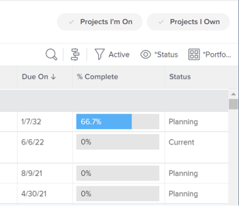

# Modifier les projets

<!--Audited: 07/2024-->

<!--The highlighted information on this page refers to functionality not yet generally available. It is available only in the Preview environment for all customers. After the monthly releases to Production, the same features are also available in the Production environment for customers who enabled fast releases.    

For information about fast releases, see [Enable or disable fast releases for your organization](/help/quicksilver/administration-and-setup/set-up-workfront/configure-system-defaults/enable-fast-release-process.md). -->

<!--

***Linked to many articles,

The Resource Pools part also duplicates in the "Working with Resource Pools" article 

The Update Type section is also documented in Selecting the Project Update Type article

Keep the reference link to the other article that also documents the Update Type) 

(NOTE 2: information described here also exists in these articles:

** Project Overview area

**Manage project Finance area

If you need to update just one field, check to see if that field is also listed there and update in both places.)

-->

Vous pouvez modifier un projet dans Adobe Workfront aussi souvent que nécessaire. Nous vous recommandons de modifier les projets de façon minimale une fois que leur statut passe à Actif, afin d’éviter toute confusion causée par l’envoi de notifications sur les modifications à l’ensemble de l’équipe de projet.

Idéalement, vous devez modifier un projet lorsque celui-ci est au statut Planification. Pour plus d’informations sur l’équipe de projet, voir [Vue d’ensemble de l’équipe de projet](../../../manage-work/projects/planning-a-project/project-team-overview.md).

## Conditions d’accès

+++ Développez pour afficher les exigences d’accès aux fonctionnalités de cet article.

<table style="table-layout:auto"> 
 <col> 
 <col> 
 <tbody> 
  <tr> 
   <td role="rowheader">Package Adobe Workfront</td> 
   <td> 
Tous
 </td> 
  </tr> 
  <tr> 
   <td role="rowheader">Licence Adobe Workfront</td> 
   <td>
Standard
 
   
Plan
 </td> 
  </tr> 
  <tr> 
   <td role="rowheader">Configurations des niveaux d’accès</td> 
   <td> 
Accès en modification aux projets
 </td> 
  </tr> 
  <tr> 
   <td role="rowheader">Autorisations d’objet</td> 
   <td> 
     
Autorisations de gestion d’un projet
 
     </td> 
  </tr> 
 </tbody> 
</table>

* Pour plus d’informations sur ce tableau, consultez [Conditions d’accès requises dans la documentation Workfront](/help/quicksilver/administration-and-setup/add-users/access-levels-and-object-permissions/access-level-requirements-in-documentation.md).

+++

<!--Old:

<table style="table-layout:auto"> 
 <col> 
 <col> 
 <tbody> 
  <tr> 
   <td role="rowheader">Adobe Workfront plan</td> 
   <td> 
Any
 </td> 
  </tr> 
  <tr> 
   <td role="rowheader">Adobe Workfront license*</td> 
   <td>
New: Standard 
 
   Or
   
Current: Plan 
 </td> 
  </tr> 
  <tr> 
   <td role="rowheader">Access level configurations</td> 
   <td> 
Edit access to Projects
 </td> 
  </tr> 
  <tr> 
   <td role="rowheader">Object permissions</td> 
   <td> 
     
Manage permissions to a project 
 
     </td> 
  </tr> 
 </tbody> 
</table>

*For more detail about the information in this table, see [Access requirements in Workfront documentation](/help/quicksilver/administration-and-setup/add-users/access-levels-and-object-permissions/access-level-requirements-in-documentation.md).-->

## Limites de modification des projets

Certaines restrictions peuvent vous empêcher de modifier des projets.

Tenez compte des points suivants lors de la modification de projets :

* Vous ne pouvez pas modifier les projets qui se trouvent dans un processus d’approbation, sauf pour consigner des heures et modifier le statut.
* Vous ne pouvez joindre des documents ou des modèles à un projet dont le statut est Terminé, Immobilisé ou En attente d’approbation que si votre administrateur ou administratrice de Workfront ou de groupes a activé cette fonctionnalité dans la zone Préférences du projet. Pour plus d’informations sur la définition des préférences de projet, voir [Configurer des préférences de projet à l’échelle du système](../../../administration-and-setup/set-up-workfront/configure-system-defaults/set-project-preferences.md).
* Vous ne pouvez modifier que les informations suivantes pour un projet dont le statut est Immobilisé ou Terminé :

   * Modifier les dépenses existantes
   * Ajoutez, supprimez ou modifiez des formulaires personnalisés.

## Modifier un projet

En modifiant un projet, vous pouvez modifier ses informations et ses paramètres, ainsi que les tâches et les problèmes qui y sont liés.

Certains paramètres mentionnés dans cet article peuvent être modifiés par rapport à leur statut par défaut dans le modèle à partir duquel le projet a été créé.

Pour plus d’informations sur la modification de modèles, voir [Modifier des modèles de projet](../../../manage-work/projects/create-and-manage-templates/edit-templates.md).

Pour plus d’informations sur la création d’un projet à partir d’un modèle, voir [Créer un projet à l’aide d’un modèle](/help/quicksilver/manage-work/projects/create-projects/create-project-from-template.md).

{{step1-to-projects}}

1. (Facultatif) Cliquez sur **Projets auxquels je participe** ou **Projets dont je suis propriétaire** dans le coin supérieur droit pour afficher les projets dont vous êtes propriétaire ou ceux pour lesquels vous faites partie de l’équipe de projet.

   

   >[!NOTE]
   >
   >Si vous êtes administrateur ou administratrice de groupes, vous pouvez afficher et modifier les projets de votre groupe dans la zone Groupes, ainsi que dans la zone Projets. Pour plus d’informations, voir [Créer et modifier des projets d’un groupe](../../../administration-and-setup/manage-groups/work-with-group-objects/create-and-modify-a-groups-projects.md).

1. Cliquez sur le nom du projet à modifier pour ouvrir la page du projet.

1. (Facultatif) Pour modifier des informations limitées sur un projet, cliquez sur **Détails du projet** dans le panneau de gauche. Si vous souhaitez modifier toutes les informations relatives au projet, passez à l’étape 5. <!--accurate?!-->

   

   >[!NOTE]
   >
   >Selon la manière dont votre équipe d’administration Workfront ou de groupes a modifié votre modèle de mise en page, les champs de la zone Détails du projet peuvent être réorganisés ou masqués. Pour plus d’informations, voir [Personnaliser la vue Détails à l’aide d’un modèle de mise en page](../../../administration-and-setup/customize-workfront/use-layout-templates/customize-details-view-layout-template.md).

   Pour modifier les informations de la section Détails, procédez comme suit :

   1. (Facultatif) Cliquez sur l’icône **Tout réduire**  dans le coin supérieur droit pour réduire toutes les zones.
   1. (Facultatif et conditionnel) Lorsqu’une zone est réduite, cliquez sur la **flèche pointant vers la droite**  en regard de chaque zone pour développer la zone à modifier.
   1. Pour plus d’informations sur la modification des informations dans l’onglet Détails du projet, voir les articles suivants :

      * [Gérer les informations dans la zone Vue d’ensemble du projet](../../../manage-work/projects/manage-projects/understand-project-overview-area.md)
      * [Gérer les informations dans la zone Finances d’un projet](../../../manage-work/projects/project-finances/manage-project-finance-area.md)

   1. (Facultatif) Pour joindre un formulaire personnalisé, commencez à saisir le nom d’un formulaire dans le champ **Ajouter un formulaire personnalisé**, sélectionnez-le lorsqu’il s’affiche dans la liste, puis cliquez sur **Enregistrer les modifications**.
   1. (Facultatif) Cliquez sur l’icône **Exporter**  pour exporter les informations de la Présentation et des formulaires personnalisés dans un fichier PDF, puis cliquez sur **Exporter**. Sélectionnez l’une des options suivantes :

      * Sélectionner tout (ne s’affiche que lorsqu’au moins un formulaire personnalisé est joint)
      * Vue d’ensemble
      * Nom d’un ou de plusieurs formulaires personnalisés

      Le fichier PDF est téléchargé sur votre ordinateur.

      

      Pour plus d’informations, voir [Exporter les formulaires personnalisés et les détails des objets](../../../workfront-basics/work-with-custom-forms/export-custom-forms-details.md).

   Pour plus d’informations sur les champs visibles dans la section Détails du projet, passez à la modification du projet dans la zone Modifier le projet, comme décrit ci-dessous.
1. Pour modifier toutes les informations sur le projet, cliquez sur le menu **Plus**  en regard du nom du projet, puis cliquez sur **Modifier**.

   Ou

   Dans une liste de projets, sélectionnez un ou plusieurs projets, puis cliquez sur l’icône **Modifier**  en haut de la liste.

   Pour plus d’informations sur la modification de projets en bloc, voir la section [Modifier des projets en bloc](#edit-projects-in-bulk) dans cet article.

   La zone **Modifier le projet** s’ouvre.

   >[!IMPORTANT]
   >
   >Pour afficher l’option Modifier, vous devez disposer d’autorisations de gestion sur le projet.

   Tous les champs de projet sont disponibles dans la zone Modifier le projet et sont regroupés dans les zones répertoriées dans le panneau de gauche.

   >[!NOTE]
   >
   >Selon la façon dont l’administrateur ou l’administratrice Workfront ou de groupe a modifié votre modèle de mise en page, les zones du panneau de gauche de la section Modifier le projet ou les champs répertoriés dans ces zones peuvent être réorganisés ou ne pas s’afficher. Pour plus d’informations, voir [Personnaliser la vue Détails à l’aide d’un modèle de mise en page](../../../administration-and-setup/customize-workfront/use-layout-templates/customize-details-view-layout-template.md).

1. (Le cas échéant) Si vous avez cliqué sur le menu **Plus** puis sur **Modifier**, mettez à jour les informations dans l’une des zones suivantes du panneau de gauche :

   * [Nom du projet](#project-name)
   * [Vue d’ensemble](#overview)
   * [Formulaires personnalisés](#custom-forms)
   * [Finances](#finance)
   * [Paramètres du projet](#project-settings)
   * [Paramètres de la tâche](#task-settings)
   * [Paramètres du problème](#issue-settings)
   * [Accès](#access)
   * [Commentaire](#comment)

   >[!NOTE]
   >
   >Selon la manière dont votre administrateur ou administratrice Workfront configure le modèle de mise en page pour la zone Détails du projet, les sections et les champs de la zone Modifier le projet peuvent être différents dans votre environnement. Pour plus d’informations, voir [Personnaliser la vue Détails à l’aide d’un modèle de mise en page](../../../administration-and-setup/customize-workfront/use-layout-templates/customize-details-view-layout-template.md).

### Nom du projet {#project-name}

1. Commencez à modifier votre projet comme décrit ci-dessus.
1. Cliquez sur **Nom du projet** dans le panneau de gauche.

   

1. Mettez à jour le nom du projet.

   Vous ne pouvez pas modifier le nom du projet lorsque vous modifiez des projets en bloc.

### Vue d’ensemble {#overview}

1. Commencez à modifier votre projet comme décrit ci-dessus.
1. Cliquez sur **Vue d’ensemble** dans le panneau de gauche.

   

1. Mettez à jour les informations suivantes sur le projet :

   <table style="table-layout:auto"> 
      <col> 
      <col> 
      <tbody> 
      <tr> 
         <td role="rowheader"><strong>Description</strong> </td> 
         <td> 
Ajoutez des informations supplémentaires sur le projet.
 </td> 
      </tr> 
      <tr> 
         <td role="rowheader"><strong>Statut</strong> </td> 
         <td> 
Sélectionnez le statut du projet. Vous ne pouvez pas marquer un projet comme Terminé tant que toutes les tâches et tous les problèmes ne sont terminés. Pour plus d’informations sur les statuts des projets, voir <a href="../../../administration-and-setup/customize-workfront/creating-custom-status-and-priority-labels/project-statuses.md" class="MCXref xref">Accéder à la liste des statuts des projets du système</a>.
 </td> 
      </tr> 
      <tr> 
         <td role="rowheader"><strong>Priorité</strong> </td> 
         <td> 
 
Il s’agit simplement d’un indicateur visuel qui vous permet de hiérarchiser vos projets.
 
Selon les préférences du projet sélectionnées par votre administrateur ou administratrice Workfront, les noms des priorités peuvent être différents pour vous. Pour plus d’informations sur la modification des priorités, voir <a href="../../../administration-and-setup/customize-workfront/creating-custom-status-and-priority-labels/create-customize-priorities.md" class="MCXref xref">Créer et personnaliser des priorités</a>
 
 </td> 
      </tr> 
      <tr> 
         <td role="rowheader"><strong>URL</strong> </td> 
         <td> 
Spécifiez un lien web qui se rapporte aux informations sur ce projet.
 </td> 
      </tr> 
      <tr> 
         <td role="rowheader"><strong>Type de condition</strong> </td> 
         <td> 
Effectuez une sélection parmi les types de condition suivants : 
         <ul> 
         <li><strong>Manuel :</strong> la personne propriétaire du projet définit manuellement la condition sur le projet.</li> 
         <li><strong>Statut de la progression :</strong> Workfront définit automatiquement la condition en fonction du statut de la progression des tâches sur le chemin critique. Pour plus d’informations sur la compréhension du statut de la progression, voir <a href="../../../manage-work/tasks/task-information/task-progress-status.md" class="MCXref xref">Vue d’ensemble du statut de la progression de la tâche</a>.</li> 
         </ul>
Votre équipe d’administration Workfront ou de groupes sélectionne la valeur par défaut du mode de calcul de la condition des projets pour votre système ou votre groupe. Pour plus d’informations sur la définition des paramètres par défaut d’un projet, voir <a href="../../../administration-and-setup/set-up-workfront/configure-system-defaults/set-project-preferences.md" class="MCXref xref">Configurer les préférences de projet à l’échelle du système</a>. 

 </td> 
      </tr> 
      <tr> 
         <td role="rowheader"><strong>Condition</strong> </td> 
         <td> 
 
(S’affiche uniquement après avoir sélectionné <strong>Manuel</strong> pour le <strong>Type de condition</strong>) : sélectionnez une condition pour indiquer le déroulement du projet. 
 
Pour plus d’informations sur la définition automatique ou manuelle des conditions de projet, voir <a href="../../../manage-work/projects/manage-projects/project-condition-and-condition-type.md" class="MCXref xref">Vue d’ensemble de la condition du projet et du type de condition</a>.
 
 </td> 
      </tr> 
      <tr> 
         <td role="rowheader"><strong>Mode horaire</strong> </td> 
         <td> 
Indiquez si le projet est planifié à partir de la date de début ou de la date d’achèvement. Cette sélection détermine les dates prévues des tâches du projet. 
         <ul> 
         <li><strong>Date de début</strong> : par défaut, la première tâche du projet a la même date de début prévue que celle du projet. Pour plus d’informations sur la date de début prévue de la tâche, voir <a href="../../../manage-work/tasks/task-information/task-planned-start-date.md" class="MCXref xref">Vue d’ensemble de la date de début prévue de la tâche</a>. La chronologie du projet est calculée à partir de la date de début et la date d’achèvement du projet est calculée par le système, en fonction de la durée de toutes les tâches. </li> 
         <li><strong>Date d’achèvement</strong> : la date d’achèvement prévue de la dernière tâche du projet est la même que celle du projet. La chronologie du projet est calculée à partir de la date d’achèvement et la date de début du projet est calculée par le système, en soustrayant la durée de toutes les tâches de la date d’achèvement du projet. </li> 
         </ul>
Votre administrateur ou administratrice Workfront ou de groupes sélectionne le paramètre Mode horaire par défaut pour votre système ou votre groupe. Pour plus d’informations sur la définition des paramètres par défaut d’un projet, voir <a href="../../../administration-and-setup/set-up-workfront/configure-system-defaults/set-project-preferences.md" class="MCXref xref">Configurer les préférences du projet à l’échelle du système</a>.

 </td> 
      </tr> 
      <tr> 
         <td role="rowheader"><strong>Date et heure de début prévues</strong> </td> 
         <td> 
 
Indiquez la date lorsque vous sélectionnez <strong>Planifier à partir de la date de début</strong>.  
 
Il s’agit d’un champ en lecture seule lorsque vous sélectionnez <strong>Planifier à partir de la date d’achèvement</strong>. 
 
 </td> 
      </tr> 
      <tr> 
         <td role="rowheader"><strong>Date et heure d’achèvement prévues</strong> </td> 
         <td> 
Indiquez la date lorsque vous sélectionnez <strong>Planifier à partir de la date d’achèvement</strong>. 
 
Il s’agit d’un champ en lecture seule lorsque vous sélectionnez <strong>Planifier à partir de la date de début</strong>. 
 </td> 
      </tr> 
      <tr> 
         <td role="rowheader"><strong>Portfolio</strong></td> 
         <td>Indiquez un Portfolio auquel le projet appartient. Vous devez d’abord créer un portfolio avant qu’il n’apparaisse dans la liste déroulante.
Seuls les portfolios actifs peuvent être associés à un projet. Pour plus d’informations sur la création de portfolios, voir <a href="../../../manage-work/portfolios/create-and-manage-portfolios/create-portfolios.md" class="MCXref xref">Créer un portfolio</a>.
         
<b>NOTE</b>

         
Vous devez disposer des autorisations de niveau Gérer pour le portfolio afin de pouvoir l’ajouter ou le supprimer du projet.

      </td> 
      </tr> 
      <tr> 
         <td role="rowheader"><strong>Programme</strong></td> 
         <td> 
Si vous avez sélectionné un portfolio pour le projet, spécifiez également un programme. Certains portfolios peuvent ne pas avoir de programmes. Vous devez d’abord créer un programme avant qu’il n’apparaisse dans cette liste déroulante. Seuls les programmes actifs peuvent être associés à un projet. 
 
Pour plus d’informations sur la création de programmes, voir <a href="../../../manage-work/portfolios/create-and-manage-programs/create-program.md" class="MCXref xref">Créer un programme</a>.
 
      
<b>NOTE</b>

         
Vous devez disposer des autorisations de niveau Gérer pour le programme afin de pouvoir l’ajouter ou le supprimer du projet.
   
      </td> 
      </tr> 
      <tr> 
         <td role="rowheader"><strong>Groupe</strong></td> 
         <td> 
 
Indiquez le nom du groupe associé au projet. 
Champ obligatoire. Un projet doit obligatoirement être associé à un groupe. 
 
Vous pouvez vous assurer que vous sélectionnez le groupe approprié en pointant dessus et en cliquant sur l’icône d’information  qui s’affiche en regard de celui-ci. Une info-bulle s’affiche, répertoriant les informations relatives au groupe, telles que la hiérarchie des groupes au-dessus et son équipe d’administration.
 Par défaut, l’un des groupes suivants est automatiquement associé à un projet lors de sa création, sauf si vous spécifiez un autre groupe :
 
         <ul> 
         <li> 
Lorsque le projet est créé à partir de la zone Projets, le groupe principal du créateur ou de la créatrice du projet est associé au projet. 
 
C’est également le cas lorsque le projet est créé à partir de la section Projets d’un portfolio ou d’un programme.
 </li> 
         <li> 
Lorsque le projet est créé à partir de la page principale d’un groupe dans la zone Configuration, ce groupe est associé au projet.
 </li> 
         </ul> 
 
  
 
         
<b>NOTES</b>

         <ul>
         <li>
Si le projet, ses tâches ou ses problèmes sont associés à un statut personnalisé au niveau du groupe, le fait de changer le groupe du projet peut entraîner une modification du statut du projet, des tâches ou des problèmes, afin de correspondre au nouveau groupe.
</li>
         <li>
Si le projet, ses tâches ou ses problèmes sont déjà associés à un processus d’approbation au niveau du groupe à l’aide de statuts personnalisés au niveau du groupe, le changement de groupe peut créer un conflit entre les statuts d’approbation du groupe précédent et ceux existant au niveau du système.

         
Envisagez de supprimer les processus d’approbation au niveau du groupe pour le projet, ses tâches ou ses problèmes avant de mettre à jour le groupe.

         
Pour plus d’informations sur la création de processus d’approbation au niveau du groupe, voir <a href="../../../administration-and-setup/manage-groups/work-with-group-objects/create-and-modify-groups-approval-processes.md" class="MCXref xref">Processus d’approbation au niveau du groupe</a>.

         
Pour plus d’informations sur la création d’un statut personnalisé au niveau du groupe, voir <a href="../../../administration-and-setup/manage-groups/manage-group-statuses/create-or-edit-a-group-status.md" class="MCXref xref">Créer ou modifier un statut de groupe</a>.
</li></ul> </td> 
      </tr> 
      <tr> 
         <td role="rowheader"><strong>Entreprise</strong> </td> 
         <td> 
Indiquez une entreprise associée au projet. Vous devez créer une entreprise avant de pouvoir l’associer à un projet. Seules les entreprises actives peuvent être associées à un projet. Pour plus d’informations sur la création d’entreprises, voir <a href="../../../administration-and-setup/set-up-workfront/organizational-setup/create-and-edit-companies.md" class="MCXref xref">Créer et modifier des entreprises</a>.
 </td> 
      </tr> 
      <tr> 
         <td role="rowheader"><strong>Propriétaire du projet</strong> </td> 
         <td> 
Commencez à saisir le nom d’un utilisateur ou d’une utilisatrice pour l’ajouter au projet, puis sélectionnez le nom lorsqu’il s’affiche dans la liste. La personne est ajoutée à l’équipe du projet et se voit attribuer automatiquement les autorisations de gestion du projet. La personne désignée comme propriétaire du projet doit être une personne active sur Workfront.

         </td> 
      </tr> 
      <tr> 
         <td role="rowheader"><strong>Sponsor du projet</strong> </td> 
         <td> 
Commencez à saisir le nom d’un utilisateur ou d’une utilisatrice pour l’ajouter au projet, puis sélectionnez le nom lorsqu’il s’affiche dans la liste. La personne est ajoutée à l’équipe du projet et se voit attribuer automatiquement les autorisations d’affichage du projet. La personne désignée comme sponsor du projet doit être une personne active sur Workfront. 
 </td> 
      </tr> 
      <tr> 
         <td role="rowheader"><strong>Gestionnaire des ressources</strong> </td> 
         <td> 
 Commencez à saisir les noms des utilisateurs et utilisatrices à ajouter au projet, puis sélectionnez les noms lorsqu’ils s’affichent dans la liste. Les utilisateurs et utilisatrices sont ajoutés à l’équipe du projet. Ils disposent automatiquement des autorisations de gestion du projet et peuvent affecter des ressources aux tâches et problèmes qui y sont liés. Les utilisateurs et utilisatrices conservent les autorisations de gestion du projet même lorsqu’ils sont supprimés du champ Personne gestionnaire de ressources. Vous pouvez spécifier plusieurs personnes gestionnaires de ressources. 
 </td> 
      </tr>

   <tr> 
         <td role="rowheader"><strong>Créateur ou créatrice du problème converti</strong> </td> 
         <td> 
 Par défaut, ce champ est automatiquement renseigné avec le nom de l’utilisateur ou de l’utilisatrice qui a créé le problème à partir duquel le projet a été converti. Vous pouvez mettre à jour ce nom avec n’importe quel autre nom d’utilisateur ou d’utilisatrice dans Workfront.  
 </td> 
      </tr>

   </tbody> 
      </table>

   >[!TIP]
   >
   >Lors de la mise à jour des champs Personne propriétaire du projet, Personne sponsor du projet et Personne gestionnaire de ressources, prêtez attention à l’avatar, au rôle principal de l’utilisateur ou de l’utilisatrice ou à son adresse e-mail pour faire la distinction entre les personnes portant des noms identiques.
   >
   >Les utilisateurs et utilisatrices doivent être associés à au moins une fonction pour l’afficher à mesure que vous les ajoutez.
   >
   >Pour que les utilisateurs et utilisatrices puissent afficher les e-mails de leurs utilisateurs et utilisatrices, le paramètre Afficher les coordonnées doit être activé dans votre niveau d’accès. Pour plus d’informations, voir [Accorder l’accès aux utilisateurs et utilisatrices](../../../administration-and-setup/add-users/configure-and-grant-access/grant-access-other-users.md).

1. (Facultatif) Continuez à modifier les sections suivantes, en fonction des informations que vous souhaitez modifier.

   Ou

   Cliquer sur **Enregistrer**.

### Formulaires personnalisés {#custom-forms}

Selon votre niveau d’accès et votre autorisation sur le projet, les scénarios suivants existent :

* Si vous ne disposez pas des autorisations de modification des formulaires personnalisés sur le projet, vous ne pouvez pas modifier les champs des formulaires personnalisés joints. Vous ne pouvez afficher que les champs des formulaires personnalisés joints au projet.
* Si vous disposez de l’accès Afficher (et non Modifier) à une section sur un formulaire personnalisé, vous ne pouvez pas modifier les champs de cette section.
* Si vous n’avez pas accès à une section sur l’un des formulaires personnalisés joints au projet, la section ne s’affiche pas dans la zone Modifier le projet.

Lors de la sélection de plusieurs projets pour les modifier en bloc, les scénarios suivants se présentent :

* Si vous ne disposez pas des autorisations de modification des formulaires personnalisés pour au moins un des projets sélectionnés, vous ne pouvez pas modifier les champs des formulaires personnalisés joints. Vous ne pouvez afficher que les champs des formulaires personnalisés joints.
* Si vous disposez de l’accès Afficher (et non Modifier) à une section sur un formulaire personnalisé, vous ne pouvez pas modifier les champs de cette section. Vous pouvez uniquement afficher les champs de cette section.
* Si vous n’avez pas accès à une section sur l’un des formulaires personnalisés joints à au moins un des projets, la section ne s’affiche pas dans la zone Modifier les projets.
* Si vous avez des champs obligatoires sur l’un des formulaires personnalisés joints à tous les projets et que vous sélectionnez un champ sans le modifier, vous devez ignorer vos modifications dans ce champ ou y ajouter des informations avant de pouvoir enregistrer les projets que vous avez sélectionnés. Si vous ne sélectionnez pas de champ obligatoire, vous pouvez enregistrer les projets que vous avez sélectionnés même si le champ obligatoire est vide.

Pour plus d’informations sur l’accès aux formulaires personnalisés, reportez-vous aux articles suivants :

* [Partager un formulaire personnalisé](../../../administration-and-setup/customize-workfront/create-manage-custom-forms/share-access-to-a-custom-form.md)
* [Organisation et prévisualisation d’un formulaire](/help/quicksilver/administration-and-setup/customize-workfront/create-manage-custom-forms/form-designer/design-a-form/organize-a-form.md)

Pour modifier des informations sur des formulaires personnalisés lors de la modification d’un projet :

1. Commencez à modifier votre projet comme décrit ci-dessus.
1. Cliquez sur **Formulaires personnalisés** dans le panneau de gauche.

   

1. Cliquez sur la boîte de dialogue **Ajouter un formulaire personnalisé** et sélectionnez un formulaire dans la liste pour le joindre au projet. Par défaut, les 40 premiers formulaires s’affichent par ordre alphabétique. Si le formulaire ne figure pas dans la liste, commencez à saisir son nom, puis sélectionnez-le lorsqu’il apparaît dans la liste.

   >[!NOTE]
   >
   >Vous devez créer les formulaires personnalisés avant de pouvoir les sélectionner dans ce champ. Seuls les formulaires personnalisés actifs sont affichés dans la liste. Pour plus d’informations sur la création de formulaires personnalisés, voir [Créer un formulaire personnalisé](/help/quicksilver/administration-and-setup/customize-workfront/create-manage-custom-forms/form-designer/design-a-form/design-a-form.md). Vous pouvez ajouter jusqu’à dix formulaires personnalisés à un projet.

1. (Le cas échéant) Si vous avez joint un formulaire personnalisé au projet, modifiez les champs du formulaire. Vous devez spécifier tous les champs requis avant de pouvoir enregistrer le projet.
1. (Le cas échéant) Cliquez sur l’**Icône X** à droite du nom d’un formulaire personnalisé pour le supprimer, puis cliquez sur **Supprimer**.
1. (Facultatif) Continuez à modifier les sections suivantes, en fonction des informations que vous souhaitez modifier.

   Ou

   Cliquer sur **Enregistrer**.

### Finances {#finance}

Selon votre niveau d’accès et votre autorisation sur le projet, les scénarios suivants existent :

* Si vous disposez de l’accès Afficher pour les données financières et des autorisations Afficher pour les finances pour le projet, vous ne pouvez afficher que les champs de la section Finances. Vous ne pouvez pas modifier les champs de cette section.
* Si vous disposez de l’accès Modifier pour les données financières et des autorisations Gérer pour les finances, vous pouvez mettre à jour les champs de cette section.

Lorsque vous sélectionnez plusieurs projets pour les modifier en bloc, les scénarios suivants sont possibles :

* Si vous sélectionnez au moins un projet pour lequel vous disposez des autorisations Afficher pour les finances (au lieu des autorisations Gérer pour les finances), vous ne pouvez afficher que les champs de cette section pour tous les projets sélectionnés. Vous ne pouvez pas modifier les champs en bloc dans la section Finances.
* Si vous sélectionnez au moins un projet pour lequel vous ne disposez d’aucune autorisation relative aux finances, cette section ne s’affiche pas du tout.

Pour modifier les champs de la zone Finances, procédez comme suit :

1. Commencez à modifier votre projet comme décrit ci-dessus.
1. Cliquez sur **Finances** dans le panneau de gauche.

   

1. Mettez à jour les informations financières suivantes pour le projet :

   <table style="table-layout:auto"> 
    <col> 
    <col> 
    <tbody> 
     <tr data-mc-conditions=""> 
      <td role="rowheader"><strong>Devise</strong> </td> 
      <td> 
 
Indiquez la devise du projet, si elle est différente de la devise par défaut de votre système. Vous ne pouvez pas modifier la devise d’un projet s’il contient déjà des informations financières. Ce champ n’est pas visible si vous avez uniquement la devise par défaut dans le système. 
 
Pour plus d’informations sur la devise, consultez <a href="../../../administration-and-setup/manage-workfront/exchange-rates/set-up-exchange-rates.md" class="MCXref xref">Configurer les taux de change</a>. 
 
 </td> 
     </tr> 
     <tr> 
      <td role="rowheader"><strong>Budget</strong> </td> 
      <td> Spécifiez un budget pour le projet. </td> 
     </tr> 
     <tr> 
      <td role="rowheader"><strong>Méthode d’indice de performances</strong> </td> 
      <td> 
Sélectionnez <b>Basé sur les heures</b>, ou <b>Basé sur les coûts</b> pour indiquer si les mesures Valeur acquise du projet (telles que l’Indice Coûts Performances ou le Coût réel estimé) sont calculées à l’aide des heures ou des coûts. 
 
Pour plus d’informations sur la méthode d’indice de performances, consultez <a href="../../../manage-work/projects/project-finances/set-pim.md" class="MCXref xref">Définir la méthode de l’indice de performances (PIM)</a>. 
 
Votre administrateur ou administratrice Workfront ou de groupes sélectionne le paramètre Méthode d’indice de performances par défaut pour votre système ou votre groupe. Pour plus d’informations sur la définition des paramètres par défaut d’un projet, consultez <a href="../../../administration-and-setup/set-up-workfront/configure-system-defaults/set-project-preferences.md" class="MCXref xref">Configurer les préférences de projet à l’échelle du système</a>.
 </td> 
     </tr> 
     <tr> 
      <td role="rowheader"><strong>Estimation à l’achèvement</strong> </td> 
      <td> 
 
Indiquez comment Workfront doit calculer l’estimation à l’achèvement (EAC). 

      Sélectionnez l’une des options suivantes : 
      <ul><li><b>Calculer au niveau du projet</b></li>
      <li><b>Regrouper depuis les tâches/sous-tâches</b></li> </ul>
      
Pour plus d’informations sur la manière dont l’estimation à l’achèvement est calculée, consultez <a href="../../../manage-work/projects/project-finances/calculate-eac.md" class="MCXref xref">Calculer l’estimation à l’achèvement (EAC)</a>.
 
Votre administrateur ou administratrice Workfront ou de groupes sélectionne le paramètre par défaut d’Estimation à l’achèvement pour votre système ou votre groupe. Pour plus d’informations sur la définition des paramètres par défaut d’un projet, consultez <a href="../../../administration-and-setup/set-up-workfront/configure-system-defaults/set-project-preferences.md" class="MCXref xref">Configurer les préférences de projet à l’échelle du système</a>.
 
 </td> 
     </tr> 
     <tr> 
      <td role="rowheader"><strong>Bénéfice prévu</strong> </td> 
      <td> 
Estimez le bénéfice prévu du projet. Il est utilisé dans le business case du projet et dans l’optimisateur de portfolio. Pour plus d’informations sur le bénéfice prévu d’un projet, voir <a href="../../../manage-work/projects/project-finances/project-planned-benefit.md" class="MCXref xref">Vue d’ensemble du bénéfice prévu du projet</a>. Le bénéfice prévu d’un projet est pris en compte lors du calcul de la valeur nette d’un projet. 
 
Pour plus d’informations, voir <a href="../../../manage-work/portfolios/portfolio-optimizer/manage-projects-in-portfolio-optimizer.md" class="MCXref xref">Gérer les projets dans Portfolio Optimizer : index d’article</a> . 
 </td> 
     </tr> 
     <tr> 
      <td role="rowheader"><strong>Bénéfice réel</strong> </td> 
      <td> 
Estimez le bénéfice réel du projet. Il s’agit d’un montant en devise qui représente le bénéfice estimé pour votre entreprise ou service à l’issue de ce projet. 
 </td> 
     </tr> 
      <tr> 
      <td role="rowheader"><strong>Coût fixe</strong> </td> 
      <td> 
Indiquez le coût fixe du projet. Il s’agit d’une donnée différente du coût du travail et du coût des dépenses, qui font référence aux heures passées sur le projet et au montant des dépenses pour le projet, respectivement. Le coût fixe d’un projet est pris en compte dans le calcul de la valeur nette d’un projet et fait partie du coût budgété. 
 </td> 
     </tr> 
     <tr> 
      <td role="rowheader"><strong>Revenus fixes</strong> </td> 
      <td> 
Indiquez les revenus fixes du projet. 
 </td> 
     </tr> 
    </tbody> 
   </table>

1. (Facultatif) Continuez à modifier les sections suivantes, en fonction des informations que vous souhaitez modifier.

   Ou

   Cliquer sur **Enregistrer**.

### Paramètres du projet {#project-settings}

1. Commencez à modifier votre projet comme décrit ci-dessus.
1. Cliquez sur **Paramètres du projet** dans le panneau de gauche.

   

1. Mettez à jour les informations suivantes :

   <table style="table-layout:auto"> 
      <col> 
      <col> 
      <tbody> 
      <tr> 
      <td role="rowheader"><strong>Chemin jalonné</strong> </td> 
       <td> 
Sélectionnez un chemin jalonné pour le projet. Seuls les chemins jalonnés actifs s’affichent dans la liste.
 
Pour plus d’informations sur les chemins jalonnés, voir <a href="../../../administration-and-setup/customize-workfront/configure-approval-milestone-processes/create-milestone-path.md" class="MCXref xref">Créer un chemin jalonné</a>.
 </td> 
      </tr> 
      <tr> 
      <td role="rowheader"><strong>Mode d’achèvement</strong> </td> 
      <td> 
Contrôle la manière dont le projet est marqué comme terminé. Sélectionnez l’une des options suivantes : 
       <ul> 
       <li>
<strong>Automatique</strong> : le projet est marqué comme Terminé lorsque toutes les tâches et tous les problèmes sont terminés.

Le statut du projet passe automatiquement à Terminé uniquement lorsque le statut du projet est Actif et lorsque les tâches sont terminées. 
</li> 
       <li><strong>Manuel</strong> : lorsque toutes les tâches et tous les problèmes sont terminés, vous devez sélectionner manuellement le statut Terminé pour le projet.</li> 
       </ul>
 </td> 
       </tr> 
       <tr> 
       <td role="rowheader"><strong>Mode d'achèvement du sommaire</strong></td> 
       <td> 
Contrôle la manière dont les tâches parent sont marquées comme étant terminées. Sélectionnez l’une des options suivantes : 
       <ul> 
       <li><strong>Automatique</strong> : les tâches parent sont marquées comme Terminé et elles mettent à jour leur pourcentage terminé automatiquement, à mesure que les tâches enfant sont terminées et que le pourcentage terminé des enfants est mis à jour. </li> 
       <li><strong>Manuel</strong> : vous devez mettre à jour manuellement le pourcentage terminé et le statut des tâches parent, indépendamment des modifications apportées aux tâches enfant. Cela vous permet de marquer une tâche parent comme étant terminée même si les sous-tâches sont incomplètes. </li> 
       </ul>
 </td> 
       </tr> 
       <tr> 
       <td role="rowheader"><strong>Type de mise à jour</strong></td> 
       <td> 
Contrôle le moment où les modifications que vous apportez à la chronologie du projet sont enregistrées dans le projet ou les tâches parent. Par exemple, les modifications suivantes apportées au projet déclenchent une mise à jour de la chronologie du projet : 
       <ul> 
       <li>Mise à jour des dates des tâches</li> 
       <li>Modification des relations d’antériorité des tâches</li> 
       <li>
Modification des relations parents-enfants, en ajoutant ou en supprimant des affectations et en modifiant la contrainte de tâche ou le type de durée

Lorsque les tâches sont mises à jour, leurs objets parent (tâches parent ou projet) sont mis à jour au moment indiqué par le type de mise à jour. 

Si les objets parent ne se mettent pas à jour immédiatement après la modification lors de la sélection du type de mise à jour « Automatique et En cas de modification » ou « Modification uniquement », actualisez la page.

Sélectionnez l’une des options suivantes : 

- <strong>Automatique et En cas de modification</strong> (paramètre par défaut) : la chronologie du projet est mise à jour chaque fois qu’une modification se produit dans le projet ou dans un autre projet dont le projet dépend (en cas de modification). La chronologie du projet est également mise à jour chaque nuit (automatique).

Il s’agit du paramètre recommandé pour ce champ, car il garantit que le projet est toujours à jour.

Lorsque vous effectuez une action sur une tâche ou un projet qui déclenche un nouveau calcul de la chronologie, toutes les dates disponibles sont immédiatement affichées, ce qui vous permet de continuer à travailler. Sur les projets comportant plus de 100 tâches, les dates nécessitant des nouveaux calculs plus longs s’affichent brièvement sous forme de point d’interrogation (entre 1 et 5 secondes, ou jusqu’à une minute pour les projets volumineux). Cela indique que le nouveau calcul n’est pas encore terminé et que les dates sont susceptibles d’être modifiées.

- <strong>Modification uniquement</strong> : la chronologie du projet est mise à jour chaque fois qu’une modification est apportée dans le projet ou dans un autre projet dont le projet dépend. Vous pouvez sélectionner cette option si des modifications sont rarement apportées dans le projet ou dans d’autres projets dont la chronologie dépend.

- <strong>Automatique uniquement</strong> : la chronologie du projet est mise à jour chaque nuit ; la chronologie n’est pas mise à jour immédiatement après l’apport des modifications.

Vous pouvez sélectionner cette option si un grand nombre de modifications sont apportées chaque jour dans le projet ou dans d’autres projets dont la chronologie dépend. Sachez toutefois que si vous choisissez ce paramètre, le projet ne sera pas mis à jour au moment où les modifications sont apportées.

- <strong>Manuel uniquement</strong> : la chronologie du projet n’est mise à jour que lorsque vous sélectionnez l’option Recalculer les chronologies. Pour plus d’informations sur le recalcul manuel de la chronologie du projet, voir <a href="../../../manage-work/projects/manage-projects/recalculate-project-timeline.md" class="MCXref xref">Recalculer les chronologies d’un projet</a>. 

Vous pouvez sélectionner cette option si vous apportez de nombreuses modifications au projet en même temps et que vous souhaitez que le recalcul de la chronologie soit effectué après toutes les modifications (plutôt qu’après chaque modification individuelle).
</li> 
       </ul>
 </td> 
       </tr> 
       <tr> 
       <td role="rowheader"><strong>Planning</strong> </td> 
       <td> 
Sélectionnez un planning pour votre projet. Il doit s’agir du même planning que celui affecté à la plupart des personnes qui travaillent sur le projet. Vous devez créer un planning avant de pouvoir l’affecter à un projet ou à un utilisateur ou une utilisatrice. Si vous n’avez pas créé de plannings personnalisés dans votre système, la planning par défaut est sélectionné.
 
Pour plus d’informations sur la création de plannings, voir <a href="../../../administration-and-setup/set-up-workfront/configure-timesheets-schedules/create-schedules.md" class="MCXref xref">Créer un planning</a>. 
 </td> 
       </tr> 
       <tr> 
       <td role="rowheader"><strong>Congés de l’utilisateur ou de l’utilisatrice</strong> </td> 
       <td> 
Détermine si les congés de la personne cessionnaire principale d’une tâche modifient les dates prévues de la tâche dans le projet. 

Votre administrateur ou administratrice Workfront ou un administrateur ou une administratrice de groupe sélectionne la valeur par défaut de ce paramètre pour votre système ou votre groupe. Pour plus d’informations sur la définition des valeurs par défaut d’un projet, voir <a href="../../../administration-and-setup/set-up-workfront/configure-system-defaults/set-project-preferences.md" class="MCXref xref">Configurer les préférences de projet à l’échelle du système</a>. 

Sélectionnez l’une des options suivantes :  - <strong>Prendre en compte les congés de l’utilisateur ou de l’utilisatrice dans la durée des tâches</strong> : lorsque vous sélectionnez cette option, les dates prévues des tâches sont ajustées en fonction des congés de la personne cessionnaire principale de la tâche, si les congés surviennent pendant la durée de la tâche. 

Par exemple, si une tâche avec une contrainte de date Aussi Tôt Que Possible est planifiée pour commencer le 1er juin et se terminer le 3 juin, et que la personne cessionnaire principale est en congés le 2 juin, lorsque cette sélection est activée, les dates prévues de la tâche sont comprises entre le 1er et le 4 juin. Selon la contrainte de tâche, les scénarios suivants existent : 
 
       <ul> 
       <li>Pour les contraintes de tâche liées à la planification à partir d’une date de début (Aussi Tôt Que Possible, Première Heure Disponible, Commencer Au Plus Tôt, Commencer Au Plus Tard, Il Faut Commencer Le), la date de début prévue ne change pas, mais la date d’achèvement prévue change.</li> 
       <li>Pour les contraintes de tâche liées à la planification à partir d’une date d’achèvement (Aussi Tard Que Possible, Dernière Heure Disponible, Finir Au Plus Tôt, Finir Au Plus Tard, Doit Se Terminer Le), la date d’achèvement prévue ne change pas, mais la date de début prévue change.</li> 
       <li>Pour les tâches avec une contrainte de dates fixes, ni la date de début prévue ni la date d’achèvement ne changent. </li> 
       </ul>
La durée de la tâche ne change pas lorsque vous sélectionnez ce paramètre. Seules les dates prévues changent, en fonction de la contrainte de tâche. Pour plus d’informations sur la contrainte de tâche, voir <a href="../../../manage-work/tasks/task-constraints/task-constraint-overview.md" class="MCXref xref">Vue d’ensemble des contraintes de tâches</a>. 

- <strong>Ignorer les congés de l’utilisateur ou de l’utilisatrice dans la durée des tâches</strong> : lorsque vous sélectionnez cette option, les dates prévues des tâches du projet restent telles que prévues initialement, même si la personne cessionnaire principale de la tâche est en congés pendant la durée de la tâche. 

Tenez compte des points suivants lors de la sélection des options de ce paramètre :
 
       <ul> 
       <li>
L’option par défaut de ce paramètre pour un nouveau projet est la même que la préférence de projet au niveau du système. 

Pour plus d’informations sur les préférences de projet au niveau du système, voir <a href="../../../administration-and-setup/set-up-workfront/configure-system-defaults/set-project-preferences.md" class="MCXref xref">Configurer les préférences de projet à l’échelle du système</a>. 
</li> 
       <li>Lorsque vous joignez un modèle à un projet existant, le paramètre du projet est mis à jour pour correspondre à celui du modèle. </li> 
       <li>
Workfront décide des dates de tâche prévues à ajuster en fonction de la valeur Contrainte de tâche de la tâche. En fonction de cette valeur, la date de début prévue ou la date d’achèvement prévue, ou les deux, peuvent être affectés, ou peuvent même rester identiques. Par exemple, si une tâche comporte une contrainte de dates fixes, les dates ne sont pas ajustées lorsque la personne cessionnaire principale est en congés, même lorsque l’option <strong>Prendre en compte les congés de l’utilisateur ou de l’utilisatrice dans la durée des tâches</strong> est sélectionnée. 
</li> 
       </ul></td> 
      </tr> 
      <tr> 
       <td role="rowheader"><strong>Mode de nivellement des ressources</strong> </td> 
       <td> 
 
Sélectionnez l’une des options suivantes :
 
- <strong>Manuel</strong> : vous devez niveler manuellement vos ressources (paramètre par défaut).
 
- <strong>Automatique</strong> : Workfront nivelle vos ressources.
 
Pour plus d’informations sur le nivellement des ressources, voir <a href="../../../manage-work/gantt-chart/use-the-gantt-chart/level-resources-in-gantt.md" class="MCXref xref">Niveler les ressources dans le graphique de Gantt</a>.
 
 </td> 
      </tr> 
      <tr> 
       <td role="rowheader"><strong>Risque</strong> </td> 
       <td> 
 
Définissez le niveau de risque de votre projet. Le risque n’est qu’un simple indicateur des risques que peut représenter un projet. Vous pouvez hiérarchiser l’exécution de vos projets en fonction du niveau de risque.
 
 
Envisagez de choisir parmi les niveaux de risque suivants :
 
- Très faible
 
- Faible
 
- Moyen
 
- Élevé
 
- Très élevé
 
Les niveaux de risques que vous indiquez ici ne peuvent pas être personnalisés.
 
Ils ne sont pas liés aux risques potentiels qui peuvent se produire pendant la durée d’un projet et que vous devez enregistrer dans l’onglet Risques du projet, ou dans le business case. Pour plus d’informations sur les risques potentiels du projet, voir <a href="../../../administration-and-setup/set-up-workfront/configure-system-defaults/edit-create-risk-types.md" class="MCXref xref">Modifier et créer des types de risque</a>. 
 
 
 </td> 
      </tr> 
      <tr> 
       <td role="rowheader"><strong>Pools de ressources</strong> </td> 
       <td> 
 
Spécifiez les groupes de ressources associés au projet. Les groupes de ressources sont des ensembles d’utilisateurs et d’utilisatrices qui doivent être disponibles au même moment pour la réalisation d’un projet et qui permettent la budgétisation du projet dans le planificateur de ressources. Pour plus d’informations sur les groupes de ressources, voir <a href="../../../resource-mgmt/resource-planning/resource-pools/work-with-resource-pools.md" class="MCXref xref">Vue d’ensemble des groupes de ressources</a>. 
 
Lorsque vous modifiez des projets en bloc, seuls les groupes de ressources communs à tous les projets sélectionnés s’affichent dans ce champ. Si les projets sélectionnés n’ont aucun groupe de ressources partagé, ce champ est vide. Les groupes de ressources que vous spécifiez ici remplaceront les groupes de ressources individuels des projets.
 
 </td> 
      </tr> 
      <tr> 
       <td role="rowheader"> <strong>Autoriser le remplacement des taux de facturation au niveau du projet par des taux de facturation au niveau de l’entreprise</strong></td> 
       <td>Sélectionnez cette option pour permettre aux taux de facturation au niveau de l’entreprise de remplacer les taux historiques des fonctions, sauf si ces taux sont marqués comme facturés. L’activation de cette option remplace les taux historiques des fonctions à moins qu’ils ne soient marqués comme facturés.  Pour plus d’informations, voir <a href="../../../manage-work/projects/project-finances/override-project-level-with-company-level-billing-rates.md" class="MCXref xref">Remplacer les taux de facturation au niveau du projet par les taux de facturation au niveau de l’entreprise</a>.</td> 
      </tr> 
      <tr> 
       <td role="rowheader"><strong>L'approbation pour ce projet demande du temps</strong></td> 
       <td> 
 Sélectionnez cette option pour exiger que la personne propriétaire du projet approuve le temps consigné dans le projet. Si vous utilisez des enregistrements de facturation et que vous sélectionnez cette option, seules les heures approuvées sur le projet apparaissent comme des heures facturables disponibles pour les enregistrements de facturation. Approuver le temps consigné d’un projet ne nécessite pas l’approbation des feuilles de temps. 
 
Pour plus d’informations sur la demande d’approbation du temps d’un projet, voir <a href="../../../manage-work/projects/manage-projects/require-time-approval-for-projects.md" class="MCXref xref">Demander l’approbation du temps pour un projet</a>.
 </td> 
      </tr> 
      <tr> 
       <td role="rowheader"><strong>Filtrer les types d’heure</strong> et  <strong>Types d’heure</strong></td> 
       <td> 
 
Sélectionnez l’une des options suivantes :
 
       <ul> 
       <li> 
Sélectionnez <strong>Non</strong> pour que tous les types d’heures spécifiques au projet soient disponibles sur le projet. (Il s’agit de la sélection par défaut.)
 
Ou
 </li> 
       <li>Sélectionnez <strong>Oui</strong> pour que seul un sous-ensemble des types d’heures spécifiques au projet soit disponible sur le projet, puis sélectionnez les types d’heures que vous souhaitez rendre disponibles dans le champ <b>Types d’heures</b>.</li> 
       
<b>CONSEIL</b>

       
Le champ <b>Types d’heures</b> n’est pas modifiable lorsque vous sélectionnez <b>Non</b>.
 
       
Si vous sélectionnez cette option, seuls les types d’heures que vous avez sélectionnés seront disponibles lors de l’enregistrement des heures sur le projet (ou sur les tâches et les problèmes au sein du projet). Vous devez sélectionner au moins un type d’heure ; si vous sélectionnez cette option et que vous ne sélectionnez aucun type d’heure, tous les types d’heures sont disponibles sur le projet.
 </ul>

   
Les mêmes sélections de type d’heure doivent être effectuées au niveau de l’utilisateur ou de l’utilisatrice au niveau individuel pour que la personne puisse voir ces options de type d’heure sur le projet. Pour plus d’informations sur la définition des types d’heures au niveau de l’utilisateur ou utilisatrice, voir <a href="../../../timesheets/create-and-manage-timesheets/log-time.md" class="MCXref xref">Consigner le temps</a>. 
 
 </td> 
      </tr> 
      <tr data-mc-conditions=""> 
       <td role="rowheader"><strong>Notification de rappel</strong> </td> 
       <td> 
 
Sélectionnez la notification de rappel qui doit être associée au projet. Vous devez configurer les notifications de rappel pour les projets pour que ce champ apparaisse lors de la modification d’un projet. Pour plus d’informations sur la configuration des notifications de rappel, voir <a href="../../../administration-and-setup/manage-workfront/emails/set-up-reminder-notifications.md"><a href="../../../administration-and-setup/manage-workfront/emails/set-up-reminder-notifications.md" class="MCXref xref">Configurer des notifications de rappel</a>.</a>
 
 </td> 
      </tr> 
      <tr data-mc-conditions=""> 
       <td role="rowheader"><strong>Processus d’approbation</strong></td> 
       <td> 
Sélectionnez le processus d’approbation que vous souhaitez associer au projet. Votre administrateur ou administratrice Workfront doit définir les processus d’approbation au niveau du système avant que vous puissiez les associer à des projets. Un utilisateur ou une utilisatrice disposant d’un accès administratif aux processus d’approbation peut également créer des processus d’approbation spécifiques à un groupe.Pour plus d’informations sur la création de processus d’approbation, voir <a href="../../../administration-and-setup/customize-workfront/configure-approval-milestone-processes/create-approval-processes.md" class="MCXref xref">Créer un processus d’approbation pour les éléments de travail</a>.
 
Tenez compte des éléments suivants lorsque vous ajoutez des processus d’approbation : 
 
       <ul> 
       <li>Seuls les processus d’approbation actifs sont affichés dans la liste. </li> 
       <li> 
Les processus d’approbation à l’échelle du système et spécifiques au groupe s’affichent dans la liste. Un processus d’approbation associé à un groupe autre que celui du projet ne s’affiche pas dans la liste.
 
Si le groupe associé au projet change, le processus d’approbation spécifique au groupe devient un processus d’approbation à usage unique. Pour plus d’informations sur la manière dont les modifications apportées au groupe du projet ou au processus d’approbation affectent les paramètres d’approbation, voir <a href="../../../administration-and-setup/customize-workfront/configure-approval-milestone-processes/how-changes-affect-group-approvals.md" class="MCXref xref">Comment les modifications apportées au groupe et au processus d’approbation affectent les processus d’approbation affectés</a>. 
 </li> <!--(NOTE: this bullet stays here although the sections it might appear in are QS only, so we can use the snippet for both Qs and classic)-->
       
Lors de la modification en bloc de projets, les scénarios suivants peuvent se produire :
 
       <ul> 
       <li> 
Lorsque vous sélectionnez des projets dans le même groupe, les processus d’approbation au niveau du système et au niveau du groupe s’affichent dans ce champ.
 </li> 
       <li> 
Lorsque vous sélectionnez des projets dans différents groupes, seuls les processus d’approbation au niveau du système s’affichent dans ce champ.
 </li> 
       <li> 
Lorsque l’un des projets est associé à un processus d’approbation à usage unique, ce dernier est remplacé par le processus d’approbation au niveau du système ou du groupe que vous avez sélectionné. 
 </li> 
      </ul> </td> 
      </tr> 
      <tr> 
      </tr> 
      </tbody> 
      </table>

1. (Facultatif) Continuez à modifier les sections suivantes, en fonction des informations que vous souhaitez modifier.

   Ou

   Cliquer sur **Enregistrer**.

### Paramètres de la tâche {#task-settings}

Vous pouvez définir les valeurs par défaut qui seront associées à toutes les nouvelles tâches lorsque vous les ajouterez au projet.

Pour plus d’informations sur la façon dont ces paramètres affectent la création de tâches, voir la section [Paramètres par défaut des tâches lors de l’ajout de tâches à un projet](../../../manage-work/tasks/create-tasks/create-tasks-overview.md#understa) dans l’article [Vue d’ensemble de création de tâches](../../../manage-work/tasks/create-tasks/create-tasks-overview.md).

1. Commencez à modifier votre projet comme décrit ci-dessus.
1. Cliquez sur **Paramètres de la tâche** dans le panneau de gauche.

   

1. Dans la zone **Processus d’approbation de tâche par défaut**, sélectionnez le processus d’approbation de tâche que vous souhaitez associer à toutes les nouvelles tâches lorsque vous les ajoutez au projet.

   Votre administrateur ou administratrice de Workfront (ou un utilisateur ou une utilisatrice disposant d’un accès administratif aux processus d’approbation) doit créer un processus d’approbation à l’échelle du système ou du groupe pour une tâche avant de pouvoir l’associer à un projet. Seuls les processus d’approbation actifs sont affichés dans la liste. Pour plus d’informations sur la création de processus d’approbation, voir [Créer un processus d’approbation pour les éléments de travail](../../../administration-and-setup/customize-workfront/configure-approval-milestone-processes/create-approval-processes.md). Pour plus d’informations sur la façon dont les modifications apportées au groupe du projet ou au processus d’approbation affectent les paramètres d’approbation, voir [Comment les modifications apportées aux groupes et aux processus d’approbation affectent les processus d’approbation affectés](../../../administration-and-setup/customize-workfront/configure-approval-milestone-processes/how-changes-affect-group-approvals.md).

   Lors de la modification en bloc de projets, les scénarios suivants peuvent se produire :

   * Lorsque vous sélectionnez plusieurs projets dans le même groupe, les deux processus d’approbation des tâches à l’échelle du système et du groupe s’affichent dans ce champ.
   * Lorsque vous sélectionnez plusieurs projets dans différents groupes, seuls les processus d’approbation des tâches à l’échelle du système s’affichent dans ce champ.

1. Dans la zone **Formulaires personnalisés de tâche par défaut**, sélectionnez le ou les formulaires personnalisés que vous souhaitez associer à toutes les nouvelles tâches lorsque vous les ajoutez au projet. Vous devez créer les formulaires personnalisés avant de pouvoir les sélectionner dans ce champ. Seuls les formulaires personnalisés actifs sont affichés dans la liste. Pour plus d’informations sur la création de formulaires personnalisés, voir [Créer un formulaire personnalisé](/help/quicksilver/administration-and-setup/customize-workfront/create-manage-custom-forms/form-designer/design-a-form/design-a-form.md). Vous pouvez associer jusqu’à dix formulaires personnalisés à une tâche.
1. (Facultatif) Sélectionnez **Utiliser l’option Effort de travail pour calculer automatiquement le nombre d’heures prévues de la tâche** si vous souhaitez activer la gestion de l’effort de tâche à l’aide de l’effort de travail au lieu du nombre d’heures prévues.

   

1. (Le cas échéant et facultatif) Si vous avez sélectionné Utiliser l’option Effort de travail pour calculer automatiquement le nombre d’heures prévues de la tâche, cliquez sur le menu déroulant pour chaque niveau d’effort et sélectionnez un pourcentage pour chaque niveau. Les pourcentages suivants sont des valeurs par défaut :

   | Taille | Pourcentage |
   |---|---|
   | Petite | 25 % |
   | Moyen | 50 % |
   | Grande | 75 % |

   >[!TIP]
   >
   >Lorsque le type de mise à jour du projet est défini sur Automatique et que vous sélectionnez ce paramètre, le nombre d’heures prévues des tâches est mis à jour en fonction de la durée de la tâche et du pourcentage d’effort de travail, s’ils sont définis sur zéro. Pour plus d’informations sur l’utilisation de l’effort de travail pour planifier l’effort d’une tâche, voir [Vue d’ensemble de l’effort de travail](../../../manage-work/tasks/task-information/work-effort.md).

1. (Facultatif) Continuez à modifier les sections suivantes, en fonction des informations que vous souhaitez modifier.

   Ou

   Cliquer sur **Enregistrer**.

### Paramètres de l&#39;événement {#issue-settings}

1. Commencez à modifier votre projet comme décrit ci-dessus.
1. Cliquez sur **Paramètres de l’événement** dans le panneau de gauche.

   

1. (Facultatif) Désélectionnez l’option **Autoriser les utilisateurs et utilisatrices à ajouter des problèmes en ligne**. Elle est sélectionnée par défaut.

   Lorsque cette option est désélectionnée, les utilisateurs et utilisatrices ne peuvent pas ajouter de problèmes en ligne au projet ou aux tâches dans la section Problèmes.

   >[!TIP]
   >
   >Désélectionnez cette option si vous souhaitez obliger les utilisateurs et utilisatrices à remplir les champs Nouveau problème ou les formulaires personnalisés associés aux nouveaux problèmes. Permettre aux utilisateurs et utilisatrices de saisir des problèmes en ligne leur permet de contourner les champs Nouveau problème et les formulaires personnalisés lors de la création de problèmes. Pour plus d’informations sur la définition des champs et des formulaires personnalisés pour les nouveaux problèmes, voir [Créer une file d’attente des demandes](../../../manage-work/requests/create-and-manage-request-queues/create-request-queue.md).

   Lorsque cette option est désélectionnée, les utilisateurs et utilisatrices autorisés à ajouter des problèmes au projet ou aux tâches peuvent le faire de la manière suivante :

   * Cliquez sur Nouveau problème en haut de la liste des problèmes dans la section Problèmes du projet ou des tâches.
   * Lorsque le projet est configuré comme une file d’attente des demandes, les utilisateurs et utilisatrices peuvent saisir une nouvelle demande dans la zone Demandes.

   >[!NOTE]
   >
   >Lors de la modification de projets en bloc, ce paramètre est activé si au moins un projet l’a activé et il est désactivé si tous les projets sélectionnés l’ont désactivé.

   <!--drafted for bulk edit projects: the statement above needs to be corrected when the new UI for bulk edit projects is updated; not sure if we'll need to describe this at all or we can cover this in  a "Considerations" mini section inside the Editing in bulk section below- ??? -->

1. (Facultatif) Continuez à modifier les sections suivantes, en fonction des informations que vous souhaitez modifier.

   Ou

   Cliquer sur **Enregistrer**.

### Accès {#access}

1. Commencez à modifier votre projet comme décrit ci-dessus.
1. Cliquez sur **Accéder** dans le panneau de gauche.

   

1. Spécifiez les informations d’**accès** suivantes pour le projet :

   <table style="table-layout:auto"> 
    <col> 
    <col> 
    <tbody> 
     <tr data-mc-conditions=""> 
      <td role="rowheader"><strong>Lorsqu’une personne est affectée à une tâche</strong></td> 
      <td>
Choisissez parmi les accès <strong>Afficher</strong>, <strong>Contribuer</strong> ou <strong>Gérer</strong> à une tâche. L’utilisateur ou l’utilisatrice affecté à une tâche se voit automatiquement accorder cet accès à la tâche.
</td> 
     </tr> 
     <tr data-mc-conditions=""> 
      <td role="rowheader"><strong>Accorder également l’accès au projet</strong></td> 
      <td>
Sélectionnez parmi les accès <strong>Afficher</strong>, <strong>Contribuer</strong> ou <strong>Gérer</strong> au projet. L’utilisateur ou l’utilisatrice affecté à une tâche se voit automatiquement accorder cet accès au projet. 
</td> 
     </tr> 
     <tr data-mc-conditions=""> 
      <td role="rowheader"><strong>Lorsqu’une personne est affectée à un problème</strong></td> 
      <td>
Choisissez parmi les accès <strong>Afficher</strong>, <strong>Contribuer</strong> ou <strong>Gérer</strong> à un problème. La personne affectée à un problème se voit automatiquement accorder cet accès au problème. Pour plus d’informations, voir <a href="../../../workfront-basics/grant-and-request-access-to-objects/share-an-issue.md" class="MCXref xref">Partager un problème</a>. 
</td> 
     </tr> 
     <tr data-mc-conditions=""> 
      <td role="rowheader"><strong>Accorder également l’accès au projet</strong></td> 
      <td>
Choisissez parmi les accès <strong>Afficher</strong>, <strong>Contribuer</strong> ou <strong>Gérer</strong> à un projet. L’utilisateur ou l’utilisatrice affecté à un problème se voit automatiquement accorder cet accès au projet. 
</td> 
     </tr> 
     <tr data-mc-conditions=""> 
      <td role="rowheader"><strong>Lorsque quelqu’un soumet une demande : donnez-lui l’accès</strong></td> 
      <td>
Choisissez parmi les accès <strong>Afficher</strong>, <strong>Contribuer</strong> ou <strong>Gérer</strong> à la demande. Lorsque le projet est également une file d’attente des demandes et qu’un utilisateur ou une utilisatrice soumet une demande au projet, cet accès lui est accordé pour la demande qu’il ou elle a soumise. Pour plus d’informations sur la configuration d’un projet en tant que file d’attente des demandes, voir <a href="../../../manage-work/requests/create-and-manage-request-queues/create-request-queue.md" class="MCXref xref">Créer une file d’attente des demandes</a>. 
</td> 
     </tr> 
     <tr data-mc-conditions=""> 
      <td role="rowheader"><strong>Les personnes appartenant à la même entreprise hériteront d'autorisations identiques pour toutes les demandes.</strong></td> 
      <td>
Sélectionnez ce champ si vous souhaitez que les personnes d’une même entreprise disposent du même accès à toutes les demandes du projet, qu’elles les aient soumises ou non. 
</td> 
     </tr> 
     <tr> 
      <td role="rowheader"><strong>Lorsque quelqu’un reçoit l’accès à ce projet : indiquez l’accès par défaut pour...</strong></td> 
      <td>
Sélectionnez les options d’accès dont vous souhaitez que les utilisateurs et utilisatrices disposent, si le projet est partagé avec eux. Sélectionnez les options spécifiques à leur accès s’ils sont désignés comme <strong>Observateurs/Observatrices</strong>, <strong>Contributeurs/Contributrices</strong> ou <strong>Gestionnaires</strong> lorsque vous partagez le projet avec eux. 

L’accès <strong>Supprimer</strong> au niveau d’autorisation <strong>Gérer</strong> détermine si les utilisateurs peuvent supprimer le projet lui-même. Les utilisateurs ayant un accès <strong>Gérer</strong> au projet peuvent supprimer des tâches et des événements dans le projet, que cette option soit sélectionnée ou non, s’ils disposent des autorisations <strong>Gérer</strong> pour les tâches et les événements. 
</td> 
     </tr> 
    </tbody> 
   </table>

1. Cliquer sur **Enregistrer**.

### Commentaire

1. Commencez à modifier votre projet comme décrit ci-dessus.
1. Cliquez sur **Commentaire** dans le panneau de gauche.

   

1. Ajoutez un commentaire dans l&#39;espace prévu à cet effet. Workfront ajoute le commentaire dans la zone Mises à jour du projet. Pour plus d&#39;informations sur la mise à jour de travail, voir [Mettre à jour le travail](/help/quicksilver/workfront-basics/updating-work-items-and-viewing-updates/update-work.md).
1. Cliquer sur **Enregistrer**.

## Modifier un projet dans l’en-tête du projet (limité)

Vous pouvez modifier un nombre limité d’informations dans l’en-tête du projet.

L’administration système ou du groupe peut personnaliser les champs affichés dans l’en-tête du projet.

Les champs suivants sont inclus par défaut dans l’en-tête du projet.

* Nom du projet
* Pourcentage d’achèvement
* Propriétaire du projet
* Date et heure d’achèvement prévues

  >[!NOTE]
  >
  >Vous ne pouvez modifier ce champ que lorsque le projet est planifié à partir de la date d’achèvement. Lorsque le projet est planifié à partir de la date de début, Workfront calcule la date et l’heure d’achèvement prévue en fonction de la durée des tâches.

* Condition

  >[!NOTE]
  >
  >Vous ne pouvez modifier ce champ que si le type de condition du projet est Manuel. Lorsque le type de condition est défini sur Statut de progression, Workfront calcule la condition en fonction de la progression des tâches. Pour plus d’informations, voir [Vue d’ensemble des conditions du projet et des types de conditions](../../../manage-work/projects/manage-projects/project-condition-and-condition-type.md).

* Statut
* Prendre des décisions d’approbation si vous occupez le rôle d’approbateur ou d’approbatrice dans un processus d’approbation en cours

## Modifier des projets en masse

Vous pouvez modifier des projets en masse et mettre à jour les informations pour tous les projets sélectionnés en même temps.

Tenez compte des points suivants lorsque vous modifiez des projets en bloc :

* Les informations que vous modifiez sur tous les projets sélectionnés remplacent les informations existantes sur les projets individuels, à l’exception du champ Gestionnaire de ressources.

  L’ajout d’un nouveau gestionnaire de ressources lors de la modification de projets en bloc ajoute ce gestionnaire à tous les projets sélectionnés. Si d’autres gestionnaires de ressources sont associés aux projets sélectionnés, ils restent sur les projets en plus de celui qui a été ajouté par la modification en bloc.

* Lorsque vous sélectionnez des projets qui ont des valeurs différentes pour le même champ, le champ affiche un indicateur « Plusieurs valeurs » dans la boîte « Modifier les projets ». L’indicateur « Plusieurs valeurs » s’affiche en regard des champs qui sont des cases à cocher, des cases d’option et des boutons bascules.

  

* Outre l’indicateur « Plusieurs valeurs », lorsque les options choisies sont différentes sur au moins un des projets sélectionnés, les champs qui ont des options multiples s’affichent de l’une des manières suivantes :

   * Les champs de type case à cocher comportent une ligne au lieu d’une case à cocher pour l’option qui est cochée pour certains projets, mais pas pour tous les projets sélectionnés.

     

   * Les champs de type bouton (bascule) sont grisés. Le bouton (bascule) est positionné au centre pour l’option qui est activée dans certains projets, mais pas dans tous les projets sélectionnés.

  

   * Les champs de type case d’option dont certaines options sont sélectionnées, mais pas toutes, affichent toutes les cases d’option comme étant vides.

     

* Lorsque vous mettez à jour une option dans un champ à options multiples (tel qu’un champ qui s’affiche sous la forme d’un ensemble de boutons bascules ou de cases à cocher), toutes les autres options doivent correspondre entre les projets sélectionnés.

  >[!IMPORTANT]
  >
  >Par exemple, vous pouvez avoir un champ avec trois cases à cocher (Option 1, Option 2 et Option 3). L’Option 1 est décochée pour tous les projets et les Options 2 et 3 sont cochées pour certains projets et décochées pour d’autres projets que vous avez sélectionnés. Si vous souhaitez cocher l’option 1 pour tous les projets, vous devez également faire correspondre les Options 2 et 3 entre tous les projets sélectionnés avant de pouvoir enregistrer vos modifications. Vous devez donc les sélectionner ou les désélectionner afin qu’elles soient définies de manière uniforme entre les projets sélectionnés. Si vous ne modifiez aucune des options, vous pouvez enregistrer le champ en l’état. Les projets conserveront les options actuellement indiquées.

* Lorsque vous sélectionnez plusieurs projets appartenant à des groupes différents, les statuts qui s’affichent dans le champ Statut sont des statuts au niveau du système et non au niveau du groupe.

Pour modifier des projets en bloc, procédez comme suit :

{{step1-to-projects}}

1. Sélectionnez plusieurs projets dans la liste.
1. Cliquez sur l’icône **Modifier**  en haut de la liste.
La boîte de dialogue **Modifier les projets** s’affiche.

   

Selon la façon dont l’administrateur ou l’administratrice Workfront ou de groupe a modifié votre modèle de mise en page, les zones du panneau de gauche de la section Modifier le projet ou les champs répertoriés dans ces zones peuvent être réorganisés ou ne pas s’afficher. Pour plus d’informations, voir [Personnaliser la vue Détails à l’aide d’un modèle de mise en page](../../../administration-and-setup/customize-workfront/use-layout-templates/customize-details-view-layout-template.md).

1. Cliquez sur **Vue d’ensemble** pour modifier des informations générales sur les projets sélectionnés.  Pour plus d’informations sur la modification de la zone Vue d’ensemble, voir la section [Vue d’ensemble](#overview) de cet article.

   >[!TIP]
   >
   >Les champs que vous modifiez s’affichent sur un fond violet clair.

1. Cliquez sur **Formulaires personnalisés** pour modifier, ajouter ou remplacer les formulaires personnalisés associés aux projets sélectionnés.

   Les formulaires personnalisés qui sont associés à tous les projets sélectionnés s’affichent dans la sous-section **Formulaires personnalisés communs** de la zone **Formulaires personnalisés**.

   

   >[!TIP]
   >
   >   Les noms des formulaires communs à tous les projets sélectionnés s’affichent dans le panneau gauche de la zone Modifier les projets.

1. Commencez à saisir le nom d’un formulaire personnalisé dans le champ **Ajouter un formulaire personnalisé**.

   

   Les formulaires personnalisés déjà associés aux projets sélectionnés s’affichent dans la sous-section **Formulaires associés** du champ **Ajouter un formulaire personnalisé**.

   Les formulaires personnalisés supplémentaires qui peuvent être associés à des projets mais qui ne sont associés à aucun des projets sélectionnés s’affichent dans la sous-section **Formulaires à ajouter** du champ **Ajouter un formulaire personnalisé**.

1. Cliquez sur d’autres formulaires personnalisés dans les sous-sections **Ajouter un formulaire personnalisé** ou **Formulaires à ajouter** en parcourant les listes.

   Lorsqu’un formulaire personnalisé est déjà associé à certains des projets sélectionnés, le nombre de projets auxquels le formulaire est déjà associé s’affiche en regard du nom du formulaire, lors de l’ajout d’un formulaire.

1. (Facultatif) Cliquez sur l’icône **x** à droite du nom d’un formulaire personnalisé, puis cliquez sur **Supprimer** pour le supprimer de tous les projets sélectionnés.

   >[!CAUTION]
   >
   >La suppression des formulaires personnalisés entraîne la perte de toutes les informations relatives aux champs personnalisés des formulaires. Il n’est pas possible de les récupérer.

   Pour plus d’informations sur la modification des formulaires personnalisés, voir la section [Formulaires personnalisés](#custom-forms) de cet article.

1. Cliquez sur **Finances** pour modifier les informations financières de tous les projets sélectionnés.
Pour plus d’informations sur la modification de la zone Finances, voir la section [Finances](#finance) de cet article.
1. Cliquez sur **Paramètres du projet** pour modifier les paramètres de tous les projets sélectionnés.
Pour plus d’informations sur la modification de la zone Paramètres du projet, voir la section [Paramètres du projet](#project-settings) de cet article.
1. Cliquez sur **Paramètres de la tâche** pour modifier les paramètres de la tâche pour tous les projets sélectionnés.
Pour plus d’informations sur la modification de la zone Paramètres de la tâche, voir la section [Paramètres de la tâche](#task-settings) de cet article.
1. Cliquez sur **Paramètres du problème** pour modifier les paramètres du problème pour tous les projets sélectionnés.
Pour plus d’informations sur la modification de la zone Paramètres du problème, voir la section [Paramètres du problème](#issue-settings) de cet article.
1. Cliquez sur **Accès** pour modifier les paramètres d’accès de tous les projets sélectionnés.
Pour plus d’informations sur la modification de la zone Accès, voir la section [Accès](#access) de cet article.
1. Cliquez sur **Commentaire**, puis ajoutez un commentaire dans l&#39;espace prévu à cet effet. Workfront ajoute un commentaire dans la zone **Mises à jour** de chaque projet. Pour plus d&#39;informations sur la mise à jour de travail, voir [Mettre à jour le travail](/help/quicksilver/workfront-basics/updating-work-items-and-viewing-updates/update-work.md).
1. (Facultatif) Pour supprimer les informations que vous avez ajoutées dans la zone Modifier les projets, pointez sur un champ modifié, puis cliquez sur l’icône **x** (ignorer) en haut à droite du champ.

   

1. (Facultatif) Cliquez sur **Annuler** en bas de la page **Modifier les projets** pour supprimer toutes les modifications apportées à tous les projets.
1. Cliquer sur **Enregistrer**.

<!-- Old information for how to bulk edit in classic/ before project bulk edit redesign: 

### Edit projects in bulk in the Production environment

To edit projects in bulk:

1. Click the **Main Menu** icon  in the upper-right corner of Adobe Workfront.

1. Click **Projects**.  
1. Select several projects in the list.
1. Click **Edit**.

   The **Edit Projects** dialog box opens.

   

1. Specify the information on all selected projects in the following sections:

   * **Overview**

     For information, see the [Overview](#overview) section in this article.
   
   * **Finance**

     For information, see the [Finance](#finance) section in this article.
   
   * **Portfolio**

     For information, see the "Project association" section in the [Overview](#overview) section in this article.
   
   * **Settings**

     For information, see the [Project Settings](#project-settings) section in this article.
   
   * **Access**

     For information, see the [Access](#access) section in this article.
   
   * **Custom Forms**

     For information, continue with step 7 below.

     <!--   
     
(NOTE: make sure this stays accurate)
   
     

   * **Tasks**

     For information, see the [Task Settings](#task-settings) section in this article.
   
   * **Issues**

     For information, see the   [Issue Settings](#issue-settings) section in this article.
   
   * **Comment**

     For information, continue with step 9 below.

     <!--   
     
(NOTE: ensure this step stays accurate)
   
     

1. (Optional) In the Settings area, select any of the following options:

   * **Recalculate Costs and Revenues**: Select this option to recalculate Costs and Revenues on all projects selected.
   * **Recalculate Timelines**: Select this option to recalculate the Timelines of all projects selected.
   * **Recalculate Scorecards**: Select this option to recalculate the Scorecard values for all projects selected.

   

1. Click **Custom Forms** to edit the custom forms attached to all the projects selected.

   If the projects selected do not have any common custom forms, no forms are listed in this section.

   You can edit only the fields on the forms that are attached to all projects selected and which you have permissions to edit. 

1. (Optional) In the Custom Forms section, select the **Recalculate Custom Expressions** option to ensure that all Calculated Custom Fields that are on the Custom Forms attached to the projects selected are up to date.

   >[!IMPORTANT]
   >
   >We recommend not to select more than 500 projects at a time when you recalculate custom expressions.

1. (Optional) Click **Comment**, then select the Post an update to each project box and specify a comment that you want to display in the updates stream of the project in the available field and do one of the following:

   * Click the **People** icon  to tag a user who will be notified about your comment.
   * Click the **Lock** icon  to restrict your comment only to people within your company.

   This comment is visible for everyone with View access to the project and with access to view Notes.

1. Click **Save Changes**.

   All changes you made are now visible on all the selected projects.

-->
