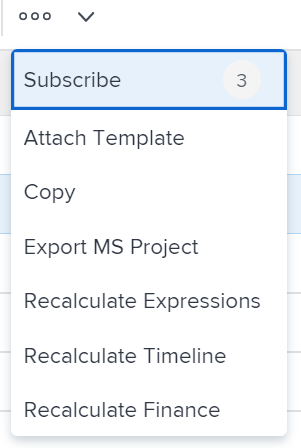

# Exporter un projet vers Microsoft Project

Vous pouvez exporter des projets Adobe Workfront vers Microsoft Project.

>[!IMPORTANT]
>
>* Tous les champs Workfront ne sont pas transférés dans le fichier Microsoft Project.\
>  Pour plus d’informations sur la compatibilité des champs entre Workfront et Microsoft Project, voir l’article [Mapper des champs Microsoft Project avec des projets Adobe Workfront](../../../manage-work/projects/manage-projects/map-ms-project-fields-to-workfront.md).
>* Nous vous recommandons de limiter le nombre de fois où vous transférez des projets d’une application à une autre.
>

## Conditions d’accès

+++ Développez pour afficher les exigences d’accès aux fonctionnalités de cet article.

<table style="table-layout:auto"> 
 <col> 
 <col> 
 <tbody> 
  <tr> 
   <td role="rowheader">Package Adobe Workfront</td> 
   <td> 
Tous
 </td> 
  </tr> 
  <tr> 
   <td role="rowheader">Licence Adobe Workfront</td> 
   <td> 
Léger ou supérieur

   
Révision ou supérieur

</td> 
  </tr> 
  <tr> 
   <td role="rowheader">Configurations des niveaux d’accès</td> 
   <td> 
Accès en affichage ou supérieur aux projets
 </td> 
  </tr> 
  <tr> 
   <td role="rowheader">Autorisations d’objet</td> 
   <td> 
 Autorisations Afficher ou supérieures au projet
</td> 
  </tr> 
 </tbody> 
</table>

* Pour plus d’informations sur ce tableau, consultez [Conditions d’accès requises dans la documentation Workfront](/help/quicksilver/administration-and-setup/add-users/access-levels-and-object-permissions/access-level-requirements-in-documentation.md).

+++

<!--Old:

<table style="table-layout:auto"> 
 <col> 
 <col> 
 <tbody> 
  <tr> 
   <td role="rowheader">Adobe Workfront plan*</td> 
   <td> 
Any
 </td> 
  </tr> 
  <tr> 
   <td role="rowheader">Adobe Workfront license*</td> 
   <td> 
Review or higher
 </td> 
  </tr> 
  <tr> 
   <td role="rowheader">Access level configurations*</td> 
   <td> 
View or higher access to Projects
 
<b>NOTE</b>
   
   If you still don't have access, ask your Workfront administrator if they set additional restrictions in your access level. For information about access to projects, see <a href="../../../administration-and-setup/add-users/configure-and-grant-access/grant-access-projects.md" class="MCXref xref">Grant access to projects</a>. For information on how a Workfront administrator can change your access level, see <a href="../../../administration-and-setup/add-users/configure-and-grant-access/create-modify-access-levels.md" class="MCXref xref">Create or modify custom access levels</a>. 
 </td> 
  </tr> 
  <tr> 
   <td role="rowheader">Object permissions</td> 
   <td> 
 View or higher permissions to the project
 
For information about project permissions, see <a href="../../../workfront-basics/grant-and-request-access-to-objects/share-a-project.md" class="MCXref xref">Share a project in Adobe Workfront</a>.
 
For information on requesting additional access, see <a href="../../../workfront-basics/grant-and-request-access-to-objects/request-access.md" class="MCXref xref">Request access to objects </a>.
 </td> 
  </tr> 
 </tbody> 
</table>-->

## Exporter un projet de Workfront vers Microsoft Project

Vous pouvez exporter un projet de Workfront à partir de la page du projet, d’une liste de projets ou d’un rapport.

1. Accédez au projet à exporter et cliquez sur l’icône **Plus**  à droite du nom du projet

   

   Ou

   Accédez à une liste ou à un rapport de projet et sélectionnez un projet, puis cliquez sur l’icône Plus  en haut de la liste.

   

1. Cliquez sur **Exporter MS Project**.

   Le projet est téléchargé en tant que fichier XML sur votre ordinateur et il est prêt à être importé dans Microsoft Project.
