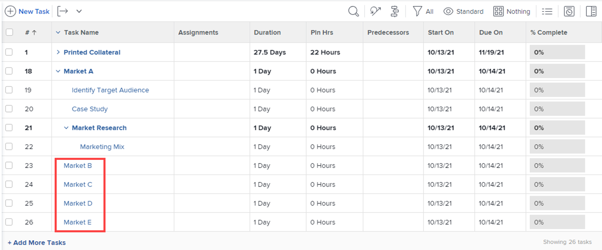
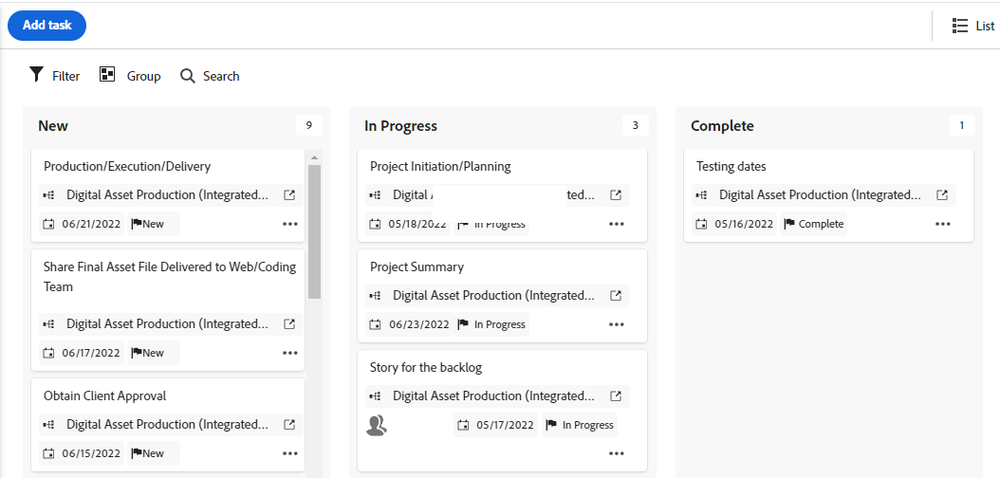

# Gestion d’un projet en mode Agile

Vous pouvez tirer parti de fonctionnalités agiles pour votre projet sans les défis administratifs qui accompagnent généralement les pratiques agiles (comme la gestion du retard d’équipe ou la création d’itérations).

Si vous souhaitez travailler dans un environnement agile qui utilise un journal d’équipe et vous permet de créer des itérations à partir des tâches du journal, suivez les instructions de la section [Travailler dans un environnement agile](../../../agile/work-in-an-agile-environment/work-in-an-agile-environment.md).

## Exigences d’accès

Vous devez disposer des accès suivants pour effectuer les étapes de cet article :

<table style="table-layout:auto"> 
 <col> 
 <col> 
 <tbody> 
  <tr> 
   <td role="rowheader">Formule Adobe Workfront</td> 
   <td> 
Quelconque
 </td> 
  </tr> 
  <tr> 
   <td role="rowheader">Licence Adobe Workfront*</td> 
   <td> 
Actuel : révision ou version ultérieure
 
   
Nouveau : contributeur ou version ultérieure
 </td> 
  </tr> 
  <tr> 
   <td role="rowheader">Configuration du niveau d’accès</td> 
   <td> 
Modifiez l’accès aux zones suivantes :
 
    <ul> 
     <li> 
Projets
 </li> 
     <li> 
Rapports, tableaux de bord, calendriers
 </li> 
     <li> 
Filtres, Vues, Regroupements
 </li> 
    </ul> </td> 
  </tr> 
  <tr> 
   <td role="rowheader">Autorisations d’objet</td> 
   <td> 
Affichage des autorisations pour le projet
  </td> 
  </tr> 
 </tbody> 
</table>

&#42;Pour connaître le plan, le type de licence ou l’accès dont vous disposez, contactez votre administrateur Workfront. Pour plus d’informations sur les exigences d’accès, voir [Conditions d’accès requises dans la documentation Workfront](/help/quicksilver/administration-and-setup/add-users/access-levels-and-object-permissions/access-level-requirements-in-documentation.md).

## Présentation des projets agiles

>[!NOTE]
>
>Cette section s’applique uniquement à la vue Agile héritée, et non à la vue Panorama d’un projet.

* [Fonctionnalité agile dans un projet](#agile-functionality-in-a-project)
* [Différences entre l’utilisation de la vue Agile sur un projet et sur une itération](#differences-when-using-the-agile-view-on-a-project-versus-on-an-iteration)

### Fonctionnalité agile dans un projet {#agile-functionality-in-a-project}

La fonctionnalité agile suivante est disponible lors de la gestion d’un projet dans une vue agile :

* Statut d&#39;achèvement\
  Pour plus d’informations sur l’état d’achèvement, voir [Aperçu de l’état d’achèvement de l’itération](../../../agile/use-scrum-in-an-agile-team/burndown/iteration-completion-status-overview.md).

* Story board\
  Pour plus d’informations sur le panorama des histoires, voir [Tableau de bord](../../../agile/use-scrum-in-an-agile-team/scrum-board/scrum-board.md) .

Il existe des différences lors de l’utilisation de vues agiles sur un projet par rapport à un environnement agile pur (avec des logs et des itérations). Pour plus d’informations, voir [Différences entre l’utilisation de la vue Agile sur un projet et sur une itération](#differences-when-using-the-agile-view-on-a-project-versus-on-an-iteration) dans cet article.

### Différences entre l’utilisation de la vue Agile sur un projet et sur une itération {#differences-when-using-the-agile-view-on-a-project-versus-on-an-iteration}

* [Les tâches et les sous-tâches suivent différentes règles d’affichage dans une vue Agile de projet et sur le panorama d’une itération.](#tasks-and-subtasks-follow-different-display-rules-on-the-story-board)
* [Les logs de sauvegarde et les itérations ne sont pas utilisés dans la vue agile](#backlogs-and-iterations-are-not-used)
* [L’ordre des tâches est conservé dans la vue Agile et ne peut pas être réorganisé.](#task-order-is-maintained-in-the-agile-view-and-cannot-be-reordered)
* [Les tâches sont mesurées uniquement en heures planifiées sur une liste de projets](#tasks-are-measured-only-in-planned-hours)
* [L’équipe agile n’est pas utilisée dans une vue agile](#the-agile-team-is-not-used)
* [Chaque utilisateur du projet peut afficher le projet dans une vue Agile différente.](#each-user-on-the-project-can-view-the-project-in-a-different-agile-view)

#### Les tâches et les sous-tâches suivent différentes règles d’affichage dans une vue Agile de projet et sur le panorama d’une itération. {#tasks-and-subtasks-follow-different-display-rules-on-the-story-board}

* Les tâches qui n’ont pas de tâche parent ni de sous-tâche sont toujours affichées sous la forme d’une seule carte d’article sur le panorama d’articles de la vue Agile.\
  Par exemple, ces tâches apparaissent comme suit dans la vue de liste des projets :

  

  Ces tâches apparaissent comme suit dans la vue agile du projet :

  

* Les tâches parentes qui comportent des sous-tâches sont toujours affichées dans le **Histoires** du tableau d’articles de la vue Agile. Les sous-tâches sont affichées dans le couloir de la tâche parent.\
  Par exemple, ces tâches apparaissent comme suit dans la vue de liste des projets :

  \
  Ces tâches apparaissent comme suit dans la vue agile du projet :

  

* Les sous-tâches de deuxième niveau (sous-tâches des sous-tâches) s’affichent sous la forme d’une carte grise suspendue de la tâche parent immédiate.
* Les sous-tâches de troisième niveau (sous-tâches de sous-tâches) ne s’affichent jamais dans la vue Agile.

#### Les logs de sauvegarde et les itérations ne sont pas utilisés dans la vue agile {#backlogs-and-iterations-are-not-used}

Lors de l’affichage d’un projet dans une vue agile, les composants agiles suivants ne sont pas utilisés :

* **Backlog :** Aucun journal en souffrance n’est utilisé, car toutes les tâches du projet sont automatiquement affichées sous forme d’articles.
* **Itérations :** Plutôt que de créer des itérations pour définir les dates auxquelles le travail sera effectué, les jours actuellement désignés dans la chronologie du projet deviennent les jours ouvrés.

#### L’ordre des tâches est conservé dans la vue Agile et ne peut pas être réorganisé. {#task-order-is-maintained-in-the-agile-view-and-cannot-be-reordered}

L’ordre dans lequel les tâches apparaissent dans un projet est conservé lorsque vous affichez le projet dans un tableau de bord agile.

Vous ne pouvez pas réorganiser les tâches du projet lorsque vous le visualisez dans une vue agile. La modification de l’ordre des tâches pouvant affecter d’autres tâches pouvant avoir des dépendances, vous devez afficher le projet dans une vue standard afin de modifier l’ordre des tâches.

#### Les tâches sont mesurées uniquement en heures planifiées sur une liste de projets {#tasks-are-measured-only-in-planned-hours}

Les tâches d’un projet sont toujours mesurées en heures planifiées.

Dans une itération, les tâches (histoires) peuvent être mesurées en heures ou en points.

#### L’équipe agile n’est pas utilisée dans une vue agile {#the-agile-team-is-not-used}

Comme les équipes agiles terminent le travail sur les itérations qui leur sont affectées, les équipes agiles ne sont pas utilisées lors de l’affichage d’un projet dans une vue agile.

Au lieu de cela, tous les utilisateurs du projet deviennent l’équipe agile pour ce projet.

#### Chaque utilisateur du projet peut afficher le projet dans une vue Agile différente. {#each-user-on-the-project-can-view-the-project-in-a-different-agile-view}

Contrairement à une itération agile, les utilisateurs d’un projet peuvent personnaliser la vue agile pour eux-mêmes, tandis que d’autres utilisateurs utilisent une vue agile différente.

Dans une itération agile, les informations disponibles sur le tableau de bord agile (telles que les colonnes d’état disponibles) sont déterminées au niveau de l’équipe.

Pour plus d’informations sur la personnalisation d’une vue agile, voir [Création ou personnalisation d’une vue agile](/help/quicksilver/reports-and-dashboards/reports/reporting-elements/create-edit-views.md#create-or-customize-an-agile-view) in [Créer ou modifier des vues dans Adobe Workfront](/help/quicksilver/reports-and-dashboards/reports/reporting-elements/create-edit-views.md).

## Affichage d’un projet en mode Agile

1. Accédez au projet que vous souhaitez afficher dans une vue agile, soit dans la liste des tâches, soit dans la liste des problèmes.
1. Cliquez sur le bouton **Vue du panorama** icon .

   Le panorama du projet s’affiche par défaut.

   

   <!--(Legacy agile view only) If you previously viewed the project in a custom agile view, the project is displayed in that view rather than in the default agile view.-->

1. (Facultatif) Cliquez sur **Configurer** pour définir les options des colonnes et des cartes.

   Pour plus d’informations, voir [Gestion des colonnes de panorama](/help/quicksilver/agile/get-started-with-boards/manage-board-columns.md) et [Personnalisation des champs affichés sur une carte](/help/quicksilver/agile/get-started-with-boards/customize-fields-on-card.md). Notez que vous ne pouvez pas définir de stratégies de colonne dans le mode Panorama d’un projet.

1. (Facultatif) Cliquez sur **Utiliser la version agile héritée** pour utiliser la vue agile héritée au lieu de la vue panoramique.

1. (Facultatif - vue agile héritée uniquement) Si vous avez créé une vue agile personnalisée, ou si un autre utilisateur a créé une vue agile personnalisée et l’a partagée avec vous, vous pouvez l’afficher à la place de la vue agile par défaut.

   Cliquez sur le bouton **Affichage** menu déroulant, puis cliquez sur la vue agile personnalisée que vous souhaitez afficher.

   La vue agile personnalisée est utilisée la prochaine fois que vous cliquez sur le bouton **Agile** Icône

   Pour plus d’informations sur la création d’une vue agile, voir [Créer et personnaliser des vues Agile](#create-and-customize-agile-views).

   Le projet s’affiche dans la vue agile personnalisée.

1. (Conditionnel - vue agile héritée uniquement) Si les tâches de votre projet utilisent des états autres que &quot;Nouveau&quot;, &quot;En cours&quot; ou &quot;Terminé&quot; (états par défaut de la vue agile), vous devez ajouter les états supplémentaires à la vue agile pour que toutes les tâches de ces états s’affichent.

   Si les tâches sont dans un état qui ne s’affiche pas sur le tableau de bord agile, la tâche elle-même ne s’affiche pas sur le tableau de bord agile (cependant, le pourcentage d’achèvement de ces tâches contribue toujours au pourcentage d’achèvement de toutes les tâches parentes et le pourcentage d’achèvement du projet global).

   Pour ajouter des états à la vue agile, créez une vue agile ou personnalisez une vue agile existante, comme décrit dans la section &quot;Créer ou personnaliser une vue agile&quot; de l’article. [Présentation des vues dans Adobe Workfront](../../../reports-and-dashboards/reports/reporting-elements/views-overview.md).

1. (Facultatif) Pour revenir au mode Liste, cliquez sur le bouton **Liste** Icône

## Créer et personnaliser des vues Agile {#create-and-customize-agile-views}

>[!NOTE]
>
>Cette section s’applique uniquement à la vue Agile héritée, et non à la vue Panorama d’un projet.

Comme pour les vues standard dans Workfront, vous pouvez personnaliser les vues agiles existantes ou créer de nouvelles vues agiles à partir de zéro. Contrairement aux vues standard, vous ne pouvez pas créer de vues agiles basées sur des vues agiles existantes.

Pour plus d’informations sur la création et la personnalisation des vues AEM, voir [Création ou personnalisation d’une vue agile](/help/quicksilver/reports-and-dashboards/reports/reporting-elements/create-edit-views.md#create-or-customize-an-agile-view) dans l’article [Créer ou modifier des vues dans Adobe Workfront](/help/quicksilver/reports-and-dashboards/reports/reporting-elements/create-edit-views.md).

## Partage d’une vue Agile existante

>[!NOTE]
>
>Cette section s’applique uniquement à la vue Agile héritée, et non à la vue Panorama d’un projet.

Vous pouvez partager une vue agile que vous avez créée ou dont vous disposez des autorisations de la même manière que vous partagez n’importe quelle autre vue, ou filtrer ou regrouper.

Pour plus d’informations, voir [Partager un filtre, une vue ou un regroupement](../../../reports-and-dashboards/reports/reporting-elements/share-filter-view-grouping.md).

## Suppression d’une vue agile existante

>[!NOTE]
>
>Cette section s’applique uniquement à la vue Agile héritée, et non à la vue Panorama d’un projet.

Vous pouvez supprimer une vue agile de la même manière que vous supprimez une autre vue, ou filtrer ou regrouper.

Pour plus d’informations, voir [Suppression des filtres, des vues et des regroupements](/help/quicksilver/reports-and-dashboards/reports/reporting-elements/remove-filters-views-groupings.md).
