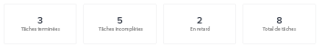
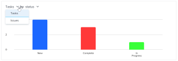
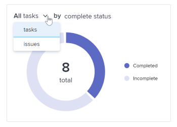
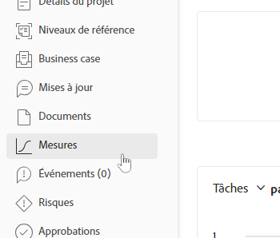

# Comprendre les mesures du projet

Les mesures de projet vous offrent une vue d’ensemble, sous forme de graphique, du déroulement d’un projet.

## Conditions d’accès

+++ Développez pour afficher les exigences d’accès aux fonctionnalités de cet article. 

<table style="table-layout:auto"> 
 <col> 
 <col> 
 <tbody> 
  <tr> 
   <td role="rowheader">Package Adobe Workfront</td> 
   <td> 
Tous
 </td> 
  </tr> 
  <tr> 
   <td role="rowheader">Licence Adobe Workfront</td> 
   <td> 
Léger ou supérieur

   
Révision ou supérieur
 </td> 
  </tr> 
  <tr> 
   <td role="rowheader">Configurations des niveaux d’accès</td> 
   <td> 
Afficher l’accès aux projets
  </td> 
  </tr> 
  <tr> 
   <td role="rowheader">Autorisations d’objet</td> 
   <td> 
Afficher les autorisations d’un projet
 </td> 
  </tr> 
 </tbody> 
</table>

*Pour plus d’informations, voir [Conditions d’accès dans la documentation de Workfront](/help/quicksilver/administration-and-setup/add-users/access-levels-and-object-permissions/access-level-requirements-in-documentation.md).

+++

<!--Old:

<table style="table-layout:auto"> 
 <col> 
 <col> 
 <tbody> 
  <tr> 
   <td role="rowheader">Workfront plan</td> 
   <td> 
Any
 </td> 
  </tr> 
  <tr> 
   <td role="rowheader">Workfront license*</td> 
   <td> 
New: Light or higher 

   
Current: Review or higher 
 </td> 
  </tr> 
  <tr> 
   <td role="rowheader">Access level configuration</td> 
   <td> 
View access to Projects
  </td> 
  </tr> 
  <tr> 
   <td role="rowheader">Object permissions</td> 
   <td> 
View permissions to a project
 </td> 
  </tr> 
 </tbody> 
</table>-->

## Conditions préalables

Pour accéder à la zone Mesures via le panneau de gauche d’un projet, vous devez procéder comme suit :

* Activer l’option Mesures du panneau de gauche dans la zone Projets de votre modèle de mise en page.

  Pour savoir comment l’administration de Workfront ou de groupes peut personnaliser le panneau de gauche à l’aide d’un modèle de mise en page, voir [Personnaliser le panneau de gauche à l’aide d’un modèle de mise en page](../../../administration-and-setup/customize-workfront/use-layout-templates/customize-left-panel.md).

## Vue d’ensemble de la zone Mesures de projet

Les mesures de projet vous permettent de visualiser le déroulement d’un projet et ainsi d’évaluer rapidement ses besoins et son statut d’avancement.

Dans la zone Mesures, vous pouvez consulter l’intégrité globale d’un projet, ainsi que les éléments suivants :

* Les endroits où le travail est actif ou interrompu.
* Les personnes auxquelles des éléments de travail ouverts ont été affectés.
* Les détails sur les tâches ou problèmes en retard ou proches de la date d’achèvement prévue.

Vous pouvez également approfondir chaque graphique pour examiner de plus près les tâches ou problèmes d’une catégorie spécifique.

Pour en savoir plus sur l’examen de ces tâches ou problèmes, voir [Afficher les détails des mesures](#view-metrics-details).

<!--this was deprecated: 
>[!TIP]
>
>To see metrics at a higher level for a group of projects within a program, portfolio, etc., navigate to the Enhanced analytics area.  
>To learn more about Enhanced analytics, see [Enhanced analytics overview](../../../enhanced-analytics/enhanced-analytics-overview.md).-->

## KPI de projet

Les indicateurs clés de performance (KPI) s’affichent en haut de la zone Mesures.

Ces KPI sont répartis dans les catégories suivantes :

| Tâches terminées | **Tâches terminées** indique le nombre de tâches dont le statut est Terminé. Ce nombre inclut également les tâches dont le statut personnalisé correspond à « Terminé ». |
|---|---|
| Tâches incomplètes | **Tâches incomplètes** indique le nombre de tâches dont le statut n’est pas Terminé ou Clos, ni un statut équivalent à Terminé. |
| Tâches en retard | **Tâches en retard** indique le nombre de tâches dont la date d’achèvement prévue est dépassée et dont le statut n’est pas Terminé ou Clos, ou équivalent. |
| Total de tâches | **Total de tâches** indique le nombre total de tâches dans le projet. |

>[!TIP]
>
>Pour afficher la liste des éléments de travail d’un KPI spécifique, cliquez sur ce dernier. Dans cette liste, vous pouvez cliquer sur un élément de travail spécifique pour afficher plus de détails dans un nouvel onglet.\
>\
>Pour plus d’informations, consultez la section [Afficher les détails des mesures](#view-metrics-details).

## Graphe à barres des tâches ou des problèmes

Dans le graphe à barres qui apparaît sous les KPI du projet, vous pouvez consulter le statut ou la priorité des éléments de travail du projet. La vue des tâches est sélectionnée par défaut.

Lorsque le statut est sélectionné dans ce graphe, vous pouvez visualiser tous les statuts des tâches ou des problèmes d’un projet. Chaque statut est représenté par une barre dans le graphe. Tous les statuts du système par défaut et personnalisés s’affichent dans ce graphe.

Lorsque la priorité est sélectionnée dans ce graphe, vous pouvez visualiser toutes les priorités des tâches ou des problèmes d’un projet.

>[!TIP]
>
>Pour afficher une liste des éléments de travail ayant un statut ou une priorité spécifique, cliquez sur une barre du graphique. Dans cette liste, vous pouvez cliquer sur un élément de travail spécifique pour afficher plus de détails dans un nouvel onglet.\
>\
>Pour plus d’informations, consultez la section [Afficher les détails des mesures](#view-metrics-details).

## Graphe en anneau

Le graphe en anneau situé sous les KPI du projet vous permet d’évaluer le rapport entre les éléments de travail terminés et les éléments de travail incomplets dans un projet.

Dans le menu déroulant au-dessus du graphe, vous pouvez sélectionner ce qui suit :

| Toutes les tâches | La sélection de **tâches** vous indique le nombre total de tâches dans le projet, ainsi que le rapport entre les tâches terminées et les tâches incomplètes. |
|---|---|
| Tous les problèmes | La sélection de **problèmes** vous indique le nombre total de problèmes dans le projet, ainsi que le rapport entre les problèmes terminés et incomplets. |

>[!TIP]
>
>Pour afficher une liste des éléments de travail terminés ou incomplets, cliquez sur la section appropriée dans le graphe en anneau. Dans cette liste, vous pouvez cliquer sur un élément de travail spécifique pour afficher plus de détails dans un nouvel onglet.\
>\
>Pour plus d’informations, consultez la section [Afficher les détails des mesures](#view-metrics-details).

## Graphe à barres des personnes cessionnaires

Le graphe à barres des personnes cessionnaires indique le nombre de tâches affectées à chaque personne dans le projet. Ce nombre varie en fonction de la catégorie sélectionnée dans le menu déroulant.

Vous pouvez choisir de consulter les affectations de tâches d’un projet dans les catégories suivantes :

| Terminé | L’élément **Terminé** indique le nombre de tâches affectées à chaque personne qui ont été menées à terme. |
|---|---|
| Incomplet | L’élément **Incomplet** indique le nombre de tâches affectées à chaque personne qui n’ont pas encore été menées à terme. |
| À venir | L’élément **À venir** indique le nombre de tâches affectées à chaque personne qui n’ont pas encore atteint la date de début prévue. |
| Échu | L’élément **En retard** indique le nombre de tâches affectées à chaque personne qui ont dépassé la date d’achèvement prévue et qui n’ont pas encore été achevées. |

>[!TIP]
>
>Pour afficher la liste des éléments de travail de la catégorie sélectionnée qui sont affectés à une personne spécifique, cliquez sur la barre située en regard du nom de la personne dans le tableau. Dans cette liste, vous pouvez cliquer sur un élément de travail spécifique pour afficher plus de détails dans un nouvel onglet.\
>\
>Pour plus d’informations, consultez la section [Afficher les détails des mesures](#view-metrics-details).

## Afficher les détails des mesures {#view-metrics-details}

Vous pouvez interagir avec les graphes de la zone Mesures pour visualiser le contenu ou examiner les tâches et les problèmes qu’ils contiennent.

1. Accédez au projet pour lequel vous souhaitez consulter les mesures.
1. Dans le panneau de gauche, cliquez sur **Mesures**.\
   Les graphes de la zone Mesures affichent par défaut des informations sur les tâches.\
   

1. (Conditionnel) Si une flèche déroulante s’affiche sur un graphique, cliquez sur l’icône **Flèche déroulante**  du graphique et sélectionnez l’option de votre choix dans le menu.\
   Pour plus d’informations sur les options disponibles dans les menus de chaque graphe, consultez la section correspondante ci-dessus.

1. (Facultatif) Pour examiner de plus près les tâches ou les problèmes relatifs à n’importe quelle mesure de la page, procédez comme suit :

   1. Cliquez sur l’élément (par exemple, les tâches affectées à un utilisateur ou une utilisatrice spécifique, les problèmes ayant une priorité élevée ou toutes les tâches en retard) dont vous souhaitez voir les détails.

      Une liste de tâches ou de problèmes s’affiche.

      

   1. Utilisez les flèches en bas de la liste pour localiser la tâche ou le problème que vous souhaitez examiner.

      Ou

      Sélectionnez un numéro de page spécifique pour afficher les tâches ou les problèmes sur la page correspondante.

      

   1. Sélectionnez une tâche ou un problème pour afficher plus de détails.

      La tâche ou le problème s’ouvre dans un nouvel onglet.

1. (Facultatif) Pour exporter le tableau de bord des mesures du projet vers un fichier .png, cliquez sur l’icône **Exporter** , puis sélectionnez **Exporter au format PNG** dans le menu déroulant.

   >[!TIP]
   >
   >Lorsque vous exportez le tableau de bord, le fichier exporté ne contient que ce qui est affiché actuellement dans votre viewport. Pour inclure certains éléments dans le fichier exporté, il se peut que vous deviez faire défiler la page vers le haut ou vers le bas ou ajuster les paramètres de zoom de votre navigateur.
