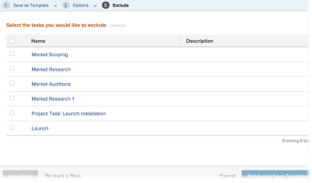

# Enregistrer un projet en tant que modèle

<!--Audited: 6/2025-->

<!--

(NOTE: Keep this the way it is in the Managing Projects area because the functionality in the UI is "Save as template" at the project level, so users see that in the UI; there is another article that this links to which is more in depth (step-by-step). This functionality needs to stay in both projects AND templates areas.)

-->

<!--

The highlighted information on this page refers to functionality not yet generally available. It is available only in the Preview environment for all customers. The same features will also be available in the Production environment for all customers after a week from the Preview release.     

For more information, see [Interface modernization](/help/quicksilver/product-announcements/product-releases/interface-modernization/interface-modernization.md). 

-->

Si vous décidez qu’un projet va être reproduit à l’avenir, vous pouvez créer un modèle à partir de ce projet existant. Vous pouvez ensuite réutiliser le modèle pour créer des projets futurs qui contiennent des informations similaires ou qui partagent la même chronologie ou les mêmes affectations que le projet existant.

## Conditions d’accès

+++ Développez pour afficher les exigences d’accès aux fonctionnalités de cet article. 

<table style="table-layout:auto"> 
 <col> 
 <col> 
 <tbody> 
  <tr> 
   <td role="rowheader">Package Adobe Workfront</td> 
   <td> 
Tous
 </td> 
  </tr> 
  <tr> 
   <td role="rowheader">Licence Adobe Workfront</td> 
   <td> 
Standard

   
Plan
 
   </td> 
  </tr> 
  <tr> 
   <td role="rowheader">Configurations des niveaux d’accès</td> 
   <td> 
Modifier l’accès aux modèles
 /td&gt; 
  </tr> 
  <tr> 
   <td role="rowheader">Autorisations d’objet</td> 
   <td> 
Autorisations d’affichage ou de niveau supérieur sur un projet 
 
Vous obtenez les autorisations de gestion sur le modèle après avoir enregistré le projet en tant que modèle.
 </td> 
  </tr> 
 </tbody> 
</table>

Pour plus d’informations, voir [Conditions d’accès requises dans la documentation Workfront](/help/quicksilver/administration-and-setup/add-users/access-levels-and-object-permissions/access-level-requirements-in-documentation.md).

+++

<!--Old:

<table style="table-layout:auto"> 
 <col> 
 <col> 
 <tbody> 
  <tr> 
   <td role="rowheader">Adobe Workfront plan</td> 
   <td> 
Any 
 </td> 
  </tr> 
  <tr> 
   <td role="rowheader">Adobe Workfront license*</td> 
   <td> 
New: Standard 

   Or 
   
Current: Plan 
 
   </td> 
  </tr> 
  <tr> 
   <td role="rowheader">Access level configurations</td> 
   <td> 
Edit access to Templates
 /td> 
  </tr> 
  <tr> 
   <td role="rowheader">Object permissions</td> 
   <td> 
View or higher permissions to a project 
 
You obtain Manage permissions to the template after you save the project as a template
 </td> 
  </tr> 
 </tbody> 
</table>-->

## Enregistrer un projet en tant que modèle

<!--
Saving a project as a template differs in the Production and the Preview environments. 

### Save a project as a template in the Production environment

1. Go to the project that you want to save as a template. 
1. Click the **More** menu , then **Save as Template**. 
1. Specify the following information for the template:

   <table style="table-layout:auto"> 
    <col> 
    <col> 
    <tbody> 
     <tr> 
      <td role="rowheader">Name</td> 
      <td>Specify a name for the template.</td> 
     </tr> 
     <tr> 
      <td role="rowheader">Description</td> 
      <td>Provide a description for the template.</td> 
     </tr> 
     <tr> 
      <td role="rowheader">Is Active</td> 
      <td> 
Select from the following options:
 
       <ul> 
        <li> 
<strong>Yes</strong>: Other users can find the template and attach it to projects.
 </li> 
        <li><strong>No</strong>: Other users cannot find the template and cannot attach it to projects.</li> 
       </ul> </td> 
     </tr> 
     <tr> 
      <td role="rowheader">Custom Forms</td> 
      <td>Use the drop-down list to select any custom forms to attach to the template. If any custom forms have already been associated with the project, all of the data fields from those custom forms are displayed. You can include up to 10 custom forms on a single template.</td> 
     </tr> 
    </tbody> 
   </table>

1. Click **Manage Forms** to remove or reorder the forms. For information about how to remove and reorder custom forms on the template, see [Custom forms](../../../administration-and-setup/customize-workfront/create-manage-custom-forms/create-and-manage-custom-forms.md).

   

1. Click **Next Step.**
1. In the **Options** section, select the checkbox beside any information you want to clear from the template.

   

1. Click **Next Step.**
1. In the **Exclude** section, select any tasks that you want to exclude from the project.

   

1. Click **Finish and Save Template.**

   Your template now appears in the list of available templates and can either be attached to an existing project or used to create a new one.

### Save a project as a template in the Preview environment

-->

1. Accédez au projet que vous souhaitez enregistrer en tant que modèle.
1. Cliquez sur le menu **Plus**  à droite du nom du projet dans l’en-tête, puis sur **Enregistrer comme modèle**.
1. Dans la section **Enregistrer en tant que modèle**, spécifiez les informations suivantes pour le modèle :

   <table style="table-layout:auto"> 
    <col> 
    <col> 
    <tbody> 
     <tr> 
      <td role="rowheader">Nom de modèle</td> 
      <td>Attribuez un nom au modèle.</td> 
     </tr> 
     <tr> 
      <td role="rowheader">Description</td> 
      <td>Fournissez une description du modèle.</td> 
     </tr> 
     <tr> 
      <td role="rowheader">Est active</td> 
      <td> 
Sélectionnez l’une des options suivantes :
 
       <ul> 
        <li> 
<strong>Oui</strong> : d’autres utilisateurs et utilisatrices peuvent trouver le modèle et le joindre à des projets.
 </li> 
        <li><strong>Non</strong> : les autres utilisateurs et utilisatrices ne peuvent pas trouver le modèle et ne peuvent pas le joindre aux projets.</li> 
       </ul> </td> 
     </tr> 
     <tr> 
      <td role="rowheader">Formulaires personnalisés</td> 
      <td>Utilisez la liste déroulante pour sélectionner les formulaires personnalisés à joindre au modèle. Si des formulaires personnalisés ont déjà été associés au projet, tous les champs de données de ces formulaires personnalisés s’affichent. Vous pouvez inclure jusqu’à 10 formulaires personnalisés sur un seul modèle.</td> 
     </tr> 
    </tbody> 
   </table>

1. Cliquez sur **Forms personnalisé** dans le panneau de gauche pour supprimer ou réorganiser les formulaires.

   Pour réorganiser les formulaires, faites-les glisser et déposez-les dans l’ordre approprié.
Pour supprimer un formulaire, sélectionnez-le, puis cliquez sur **Supprimer**. Cliquez sur **Annuler** pour supprimer les formulaires sélectionnés.

   

1. Mettez à jour les informations dans les formulaires personnalisés joints, si nécessaire. Les informations sont transférées vers le modèle.

1. Cliquez sur **Options** dans le panneau de gauche, puis cochez la case en regard des informations à transférer au modèle. Les éléments désélectionnés ne sont pas transférés vers le modèle. Par défaut, toutes les options sont désélectionnées.

   

1. Cliquez sur **Exclure** dans le panneau de gauche, puis sélectionnez les tâches à exclure du projet. Par défaut, toutes les tâches sont désélectionnées.

   

1. Cliquez sur **Terminer et enregistrer le modèle** dans le coin supérieur droit de l’écran.

   Votre modèle apparaît désormais dans la liste des modèles disponibles et peut être joint à un projet existant ou utilisé pour en créer un nouveau.

