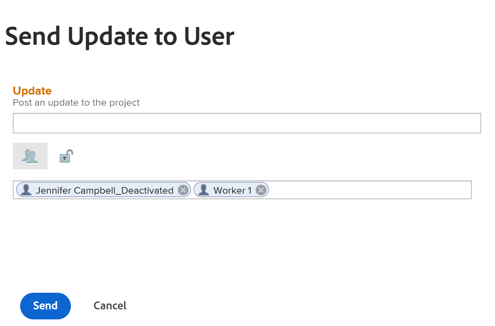

# Gérer l’équipe de projet

<!--take preview and production references out at production - August 7-->

<!--
 

The highlighted information on this page refers to functionality not yet generally available. It is available only in the Preview environment for all customers. The same features will also be available in the Production environment for all customers after a week from the Preview release.      

For more information, see [Interface modernization](/help/quicksilver/product-announcements/product-releases/interface-modernization/interface-modernization.md).  

-->

L’équipe de projet est composée des utilisateurs et utilisatrices associés au projet. Pour plus d’informations, voir [Vue d’ensemble de l’équipe de projet](/help/quicksilver/manage-work/projects/planning-a-project/project-team-overview.md).

Les membres de l’équipe de projet s’affichent dans la section Personnes du projet.

Les utilisateurs affichés dans la section Personnes d&#39;un modèle de projet deviendront l&#39;équipe du projet une fois le projet créé à partir du modèle.

Les utilisateurs suivants sont automatiquement ajoutés à l’équipe du projet, pour les projets comme pour les modèles :

* Propriétaire
* Sponsor
* Utilisateurs affectés à des tâches
* Utilisateurs affectés à des événements (uniquement pour un projet)

Les utilisateurs et utilisatrices de l’équipe du projet reçoivent des notifications sur le projet. Pour plus d’informations, voir [Types de notification d’événement](/help/quicksilver/administration-and-setup/manage-workfront/emails/event-notifications-available-in-wf.md).

Vous pouvez gérer les utilisateurs dans les équipes du projet et du modèle en les ajoutant (uniquement pour le projet), en les supprimant ou en leur envoyant une mise à jour.

## Conditions d’accès

+++ Développez pour afficher les exigences d’accès.

<table style="table-layout:auto"> 
 <col> 
 <col> 
 <tbody> 
  <tr> 
   <td role="rowheader">Formule Adobe Workfront*</td> 
   <td> 
Tous
 </td> 
  </tr> 
  <tr> 
   <td role="rowheader">Licence Adobe Workfront*</td> 
   <td> 
Standard 

    
Plan 

    </td> 
  </tr> 
  <tr> 
   <td role="rowheader">Niveau d’accès</td> 
   <td> 
Accès Modifier aux projets et aux modèles
 
Accès en affichage de niveau supérieur aux utilisateurs et utilisatrices
 </td> 
  </tr> 
  <tr> 
   <td role="rowheader">Autorisations d’objet</td> 
   <td> 
Autorisations d’affichage ou supérieures pour un projet ou un modèle
 </td> 
  </tr> 
 </tbody> 
</table>

*Pour plus d’informations, voir [Conditions d’accès dans la documentation de Workfront](/help/quicksilver/administration-and-setup/add-users/access-levels-and-object-permissions/access-level-requirements-in-documentation.md).

+++

<!--Old access: 

You must have the following access to perform the steps in this article:

<table style="table-layout:auto"> 
 <col> 
 <col> 
 <tbody> 
  <tr> 
   <td role="rowheader">Adobe Workfront plan*</td> 
   <td> 
Any
 </td> 
  </tr> 
  <tr> 
   <td role="rowheader">Adobe Workfront license*</td> 
   <td> 
Plan 
 </td> 
  </tr> 
  <tr> 
   <td role="rowheader">Access level configurations*</td> 
   <td> 
Edit access to Projects
 
View or higher access to Users
 
<b>NOTE</b> 
   
   If you still don't have access, ask your Workfront administrator if they set additional restrictions in your access level. For information on how a Workfront administrator can modify your access level, see <a href="../../../administration-and-setup/add-users/configure-and-grant-access/create-modify-access-levels.md" class="MCXref xref">Create or modify custom access levels</a>.
 </td> 
  </tr> 
  <tr> 
   <td role="rowheader">Object permissions</td> 
   <td> 
View or higher permissions to the project
 
For information on requesting additional access, see <a href="../../../workfront-basics/grant-and-request-access-to-objects/request-access.md" class="MCXref xref">Request access to objects </a>.
 </td> 
  </tr> 
 </tbody> 
</table>

*To find out what plan, license type, or access you have, contact your Workfront administrator.

## Add users to a Project Team

When you add users to the project team, they gain View permissions on the project and the tasks, issues, and documents of the project. For more information, see the article [Project Team overview](../../../manage-work/projects/planning-a-project/project-team-overview.md).

>[!TIP]
>
>Users on the Project Team are not automatically added to the resource management tools for the project.

You can add users to the project team in the following ways:

* [Automatically add users to a Project Team](#automatically-add-users-to-a-project-team) 
* [Manually add users to a Project Team](#manually-add-users-to-a-project-team)

### Automatically add users to a Project Team {#automatically-add-users-to-a-project-team}

The users that fulfill the following roles on the project are automatically added to the project team and appear  in the People section when the project is created:

* The creator of the project
* The project owner
* The project sponsor

Users are also automatically added to the project team when they are assigned to the following:

* Tasks
* Issues

### Manually add users to a Project Team {#manually-add-users-to-a-project-team}

If users that don't fulfill any role on the project want to be notified about certain updates or changes during the life of the project, you can manually add them to the project team. 

 For more information about what notifications can be enabled for users on the project team, see [Event notification types](../../../administration-and-setup/manage-workfront/emails/event-notifications-available-in-wf.md). 

 <!--drafted - this used to be the case, in the note below but this limitation was removed on Jan 5, 2023 - as a patch, not a release feature:

>[!IMPORTANT]
>
>You can add to the Project Team only users that belong to the Group associated with the project. You cannot add users that belong to the Subgroups of the project's group. 

-->

## Gérer les personnes d’un projet

1. Accédez au projet pour lequel vous souhaitez gérer l’équipe de projet.

   >[!TIP]
   >
   >Des utilisateurs doivent être affectés à des tâches, des événements ou en tant que parties prenantes du projet pour qu&#39;ils s&#39;affichent dans la section Personnes .

1. Cliquez sur **Personnes** dans le panneau de gauche.

1. Cliquez sur **Ajouter des utilisateurs et utilisatrices**.

   La zone **Ajouter des utilisateurs à l’équipe de projet** s’affiche.

   

1. Dans la zone **Ajouter des utilisateurs**, commencez à saisir le nom d’un utilisateur Workfront actif que vous souhaitez ajouter à l’équipe du projet, puis cliquez sur le nom lorsqu’il apparaît dans la liste.

   Répétez cette étape pour ajouter plusieurs utilisateurs et utilisatrices à l’équipe de projet. Les utilisateurs et utilisatrices doivent appartenir au groupe associé au projet.

   >[!TIP]
   >
   >* Vous ne pouvez pas ajouter des utilisateurs et utilisatrices en ajoutant leurs équipes, groupes, entreprises ou fonctions.
   >* Au fur et à mesure que vous ajoutez des personnes, observez l’avatar, le rôle principal de la personne et son adresse e-mail afin de distinguer les personnes au nom identique. Les utilisateurs et utilisatrices doivent être associés à au moins une fonction pour l’afficher à mesure que vous les ajoutez.
   >
   >  Pour que les utilisateurs et utilisatrices puissent afficher les e-mails de leurs utilisateurs et utilisatrices, le paramètre Afficher les coordonnées doit être activé dans votre niveau d’accès. Pour plus d’informations, consultez la section [Accorder l’accès aux utilisateurs et utilisatrices](../../../administration-and-setup/add-users/configure-and-grant-access/grant-access-other-users.md).

1. Cliquez sur **Ajouter**.

   Les personnes obtiennent des autorisations de visualisation du projet et reçoivent des notifications sur le projet en tant que membres de l’équipe de projet.

1. (Facultatif) Si vous souhaitez qu’un utilisateur reçoive une notification lorsque sa fonction est ajoutée à l’approbation d’une tâche, d’un événement ou d’un projet, cliquez dans la colonne **Fonction** pour l’utilisateur et sélectionnez une fonction qui sera associée à l’approbation.

   Les utilisateurs recevront des notifications relatives aux approbations affectées à la fonction sélectionnée.

   Pour plus d’informations, consultez la section « Approbations basées sur les rôles » de l’article [Présentation de l’équipe de projet](/help/quicksilver/manage-work/projects/planning-a-project/project-team-overview.md).

1. Sélectionnez un ou plusieurs utilisateurs dans la liste, puis cliquez sur l’icône **Supprimer**  pour les supprimer de l’équipe.

1. Cliquez sur **Oui, supprimer les utilisateurs sélectionnés** pour confirmer et supprimer les utilisateurs.

   L’affectation des utilisateurs est supprimée des éléments de travail incomplets.

   Pour plus d’informations, reportez-vous à la section [Considérations relatives à la suppression d’utilisateurs d’une équipe de projet](#considerations-for-removing-users-from-a-project-team) de cet article.
1. (Facultatif) Pour envoyer une mise à jour de ce projet aux utilisateurs, cliquez sur Mettre à jour tout pour envoyer la mise à jour à tous les membres de l&#39;équipe

   Ou

   Sélectionnez un ou plusieurs utilisateurs dans la liste, puis cliquez sur **Envoyer la mise à jour à l’utilisateur**.

   <!--update screen shot when they fix the bug - the text above the box needs to match the OLD box, below-->

   

   <!--Old UI for projects but the text above the comment box is right and matches the functionality):
   -->

   La boîte de dialogue **Envoyer la mise à jour à l’utilisateur** s’ouvre.

1. Utilisez l’une des méthodes suivantes :

   * Ajoutez une mise à jour pour les utilisateurs sélectionnés.
   * Cliquez sur l’icône de verrou pour rendre la mise à jour privée pour les utilisateurs de votre entreprise.
   * Balisez d’autres utilisateurs et utilisatrices pour recevoir la même mise à jour.
   * Cliquez sur **Envoyer**.

   La mise à jour est ajoutée à la section **Mises à jour** du projet et tous les utilisateurs sélectionnés s’affichent sous la forme d’utilisateurs identifiés.

   Les utilisateurs peuvent recevoir une notification par e-mail, s’ils sont activés pour eux, ainsi qu’une notification in-app de la nouvelle mise à jour.

1. (Facultatif) Cliquez sur l’icône **Exporter**  pour exporter la liste des utilisateurs vers un fichier

   Ou

   Sélectionnez des utilisateurs, puis cliquez sur l’icône **Exporter** pour n’exporter que des utilisateurs spécifiques.

## Gérer les personnes sur un modèle

1. Accédez au modèle dont vous souhaitez gérer l’équipe de projet.

   >[!TIP]
   >
   >Des utilisateurs doivent être affectés à des tâches ou en tant que parties prenantes dans le modèle pour qu’ils s’affichent dans la section Personnes .

1. Cliquez sur **Personnes** dans le panneau de gauche.

1. Sélectionnez un ou plusieurs utilisateurs dans la liste, puis cliquez sur **Supprimer** pour les supprimer de l’équipe.

1. Cliquez sur **Oui, supprimer les utilisateurs sélectionnés** pour confirmer et supprimer les utilisateurs.

   L’affectation des utilisateurs est supprimée des tâches de modèle.

   Pour plus d’informations, reportez-vous à la section [Considérations relatives à la suppression d’utilisateurs d’une équipe de projet](#considerations-for-removing-users-from-a-project-team) de cet article.

1. (Facultatif) Pour envoyer une mise à jour aux utilisateurs, cliquez sur Tout mettre à jour pour envoyer la mise à jour à tous les utilisateurs de la liste

   Ou

   Sélectionnez un ou plusieurs utilisateurs dans la liste, puis cliquez sur **Mettre à jour**.

   <!--update screen shot for unshim production, notice the text above the box - it needs to say "Post an update to each person's profile"-->

   

   La boîte de dialogue **Envoyer la mise à jour à l’utilisateur** s’ouvre.

1. Procédez comme suit :

   * Ajoutez une mise à jour pour les utilisateurs sélectionnés.
   * Cliquez sur **Taguer des personnes** pour taguer d’autres utilisateurs et utilisatrices afin de recevoir la même mise à jour.
   * Sélectionnez l’option **Privé à ma société** pour rendre la mise à jour privée pour les utilisateurs de votre société.
   * Cliquez sur **Envoyer**.

   La mise à jour est ajoutée à la section **Mises à jour** du profil de chaque utilisateur balisé.

   Les utilisateurs peuvent recevoir une notification par e-mail, s’ils sont activés pour eux, ainsi qu’une notification in-app de la nouvelle mise à jour.

1. (Facultatif) Cliquez sur **Exporter** pour exporter la liste des utilisateurs vers un fichier

   Ou

   Sélectionnez des utilisateurs, puis cliquez sur **Exporter** pour n’exporter que des utilisateurs spécifiques.

## Considérations relatives à la suppression d&#39;utilisateurs d&#39;une équipe de projet

Lorsque vous supprimez le rôle d’une personne dans le projet, celle-ci continue à faire partie de l’équipe du projet.

Vous devez les supprimer de l’équipe du projet, de la section Personnes du projet, pour qu’ils ne reçoivent plus de notifications envoyées à l’équipe du projet.

Si vous supprimez une personne de l’équipe de projet et que cette dernière est affectée à des tâches ou à des problèmes dans le projet, la personne sera désaffectée des tâches et des problèmes qui ne sont pas terminés. Dans ce cas, les tâches et les problèmes retournent dans la zone Travail non affecté de l’équilibreur de charge de travail.

Les utilisateurs affectés aux tâches et événements terminés restent affectés aux tâches et événements, même après leur suppression de l&#39;équipe du projet.

Les utilisateurs suivants sont supprimés de leurs rôles dans le projet lorsque vous les supprimez de la section Personnes d’un projet ou d’un modèle :

* Utilisateurs affectés à des tâches incomplètes
* Utilisateurs affectés à des événements incomplets

Les utilisateurs suivants ne sont pas supprimés de leurs rôles dans le projet lorsque vous les supprimez de la section Personnes d’un projet ou d’un modèle :

* Propriétaire
* Sponsor

Pour plus d’informations sur la suppression d’utilisateurs et d’utilisatrices de l’équipe de projet, consultez la section [Supprimer des utilisateurs et utilisatrices des projets](../../../manage-work/projects/manage-projects/remove-users-from-projects.md).

